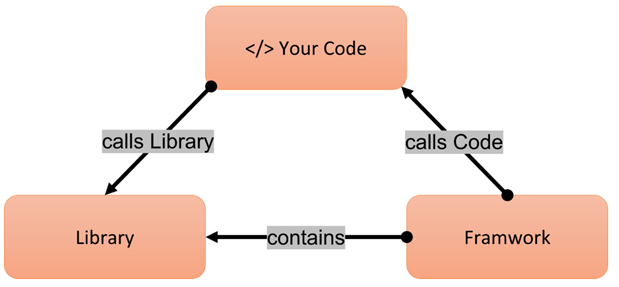
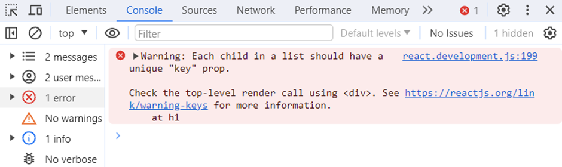
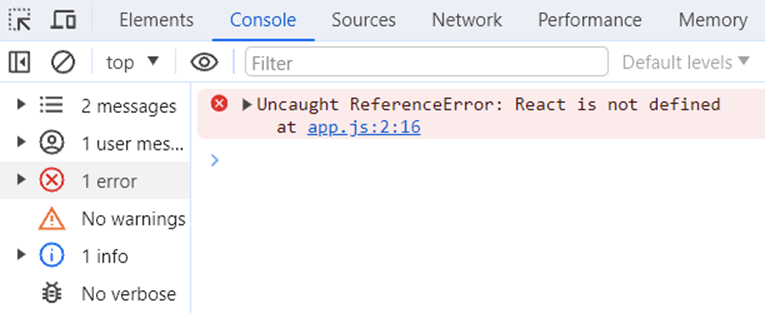

# What is React?

-> React is a JavaScript library used to build user interfaces (UI).
-> It is mainly used for single-page applications (SPA).
-> React lets you build reusable components (small pieces of UI like buttons, cards, forms).
-> Instead of reloading the whole page, React updates only the part that changes → making apps faster and smoother.

✅ Example: If you update your profile picture in Facebook → Only the picture section reloads, not the entire page.


# Why is React called "React"?

-> The name React comes from its ability to react quickly to data changes.
-> When something changes in your app (✅ user typing, ✅ API response, ✅ button click) → React updates only the changed parts of the UI.
-> This makes the app fast, smooth, and responsive (no full page reload needed).
-> Think of it like this: Your app is a whiteboard. Instead of erasing the whole board when one word changes, React just erases and rewrites that word — quick and efficient.


📚 What is a Library?

-> A library is a collection of prewritten code that you can use to do specific tasks quickly.
-> Instead of writing everything from scratch, you reuse ready-made functions from the library.
-> In JavaScript, you add/import a library into your code → this makes development faster and less error-prone.

✅ Examples of JavaScript libraries:
-> React → build user interfaces
-> JQuery → simplify DOM manipulation
-> Underscore / Lodash → work with arrays & objects easily


**React (Library) Example:**

👉 Key Idea: You are in control.

-> With a library (like React), you call it whenever you need it.
-> You decide what happens and when.
-> React only provides the tools (components, hooks, rendering).
-> As a developer, you choose which tools to use based on your use case.

⚡One-liner  React = You control the flow, React supports you with tools.

```js

import React from 'react';

function App() {
  const handleClick = () => {
    alert('Button clicked!');
  };

  return (
    <div>
      <button onClick={handleClick}>Click Me</button>
    </div>
  );
}

export default App;

```

-> React just gives you tools (like useState, onClick, JSX, etc.)1
-> You manage the structure, routing, state management, etc.
-> You are in charge — React helps, but doesn't force rules.


# What is a Framework?

-> A framework provides a structured foundation and set of rules for building apps.
-> It controls the overall flow of the application.
-> Your code fits inside the framework’s structure.
-> Unlike libraries, where you call the code, in a framework the framework calls your code.
-> Example: Angular is a popular JavaScript framework.It enforces structure (modules, services, dependency injection).

⚡ One-liner: Framework = House 🏠 → You build inside its structure, following its rule

**Angular (Framework) Example:**

```js

// app.component.ts

import { Component } from '@angular/core';

// @Component → Angular decorator
// It tells Angular: "This class is a component"
// Also defines how Angular should use it (selector, template, styles, etc.)

@Component({
  selector: 'app-root',  // Acts like a custom HTML tag <app-root></app-root>
  template: `<button (click)="handleClick()">Click Me</button>`  // Template (HTML) shown in the browser
})

export class AppComponent {
  // 👇 Your component logic (methods, data, events) goes here
  handleClick() {
    alert('Button clicked!');
  }
}
```

-> Angular gives you the structure → you must create components, use decorators, follow its rules.
-> You don’t decide how the app starts → Angular bootstraps it for you.
-> Your code fits into Angular’s system → you just “fill in the blanks” with your logic.
-> It comes with built-in features like:
  ✅ Routing
  ✅ Services
  ✅ Dependency Injection
  ✅ Form handling & more

⚡ One-liner: Angular = Structured system → you follow its rules, it runs the show.

# Similarities between a Library & a Framework

✅ Both provide pre-written, reusable code to speed up development.
✅ Both solve common problems developers face during application building.
✅ Both can help optimize performance with tested, efficient solutions.
✅ Both reduce the need to write everything from scratch, boosting productivity.
✅ Both can be added to a project to extend functionality.


# Differences between Library and Framework

1. Control
Library → You control when and how to call the code.
Framework → The framework controls the flow and calls your code at the right time.

2. Flexibility
Library → More flexible, you pick and use only what you need.
Framework → Less flexible, you must follow its rules and structure.

3. Usage
Library → A set of specific functions/tools to help with tasks.
Framework → A complete structure for building entire applications.

4. Inversion of Control (IoC)
Library → No inversion — you’re the boss.
Framework → Inversion of control — framework is the boss.

⚡ One-liner: With a library, you call the code. With a framework, the code calls you.




# What is Emmet?

Emmet is a plugin/tool used in many popular text editors and IDEs (like VS Code, Sublime Text, Atom, etc.) that helps you write HTML, CSS, and JSX faster using abbreviations or shortcuts.

**How does it work?**

You write a short expression, and Emmet auto-expands it into full code.


**Basic HTML Boilerplate**

Shortcut: !

Structure:

<!DOCTYPE html>
<html lang="en">
<head>
  <meta charset="UTF-8">
  <meta name="viewport" content="width=device-width, initial-scale=1.0">
  <title>Document</title>
</head>
<body>
  
</body>
</html>


✅ Basic Tag

Shortcut: div

Structure:

<div></div>

✅ ID Shortcut

Shortcut: div#header

Structure:

<div id="header"></div>

✅ Class Shortcut

Shortcut: div.container

Structure:

<div class="container"></div>


✅ Nested Elements

Shortcut: div>ul>li

Structure:

<div>
  <ul>
    <li></li>
  </ul>
</div>


✅ Sibling Elements

Shortcut: div+p+bq

Structure:

<div></div>
<p></p>
<blockquote></blockquote>


✅ Multiplication

Shortcut: ul>li*3

Structure:

<ul>
  <li></li>
  <li></li>
  <li></li>
</ul>


✅ Numbered Items

Shortcut: h$[title=item$]{Header $}*3 // [] is where you set properties , {} is where you show Text in UI.

Structure:

<h1 title="item1">Header 1</h1>
<h2 title="item2">Header 2</h2>
<h3 title="item3">Header 3</h3>

🔄 How it works: h$[title=item$]{Header $}*3 ? 

h$ → Dynamic Heading Tag
$ is a counter that increases with repetition.
So it generates → h1, h2, h3.

[title=item$] → Attribute with Numbering
Adds a title attribute.
$ is replaced with the counter.
Becomes → title="item1", title="item2", title="item3".

{Header $} → Text Content with Numbering
Defines the inner text of each tag.
$ is replaced with the same counter.
Becomes → Header 1, Header 2, Header 3.

*3 → Repeat 3 Times
The whole pattern is repeated 3 times.
Counter $ increments each time.


✅ Grouping

Shortcut: (header>ul>li*2)+footer>p

Structure:

<header>
  <ul>
    <li></li>
    <li></li>
  </ul>
</header>
<footer>
  <p></p>
</footer>

✅ Text Content

Shortcut: p{Hello World}

Structure:

<p>Hello World</p>


✅ Attributes

Shortcut: a[href="https://example.com"]

Structure:

<a href="https://example.com"></a>


✅ Implicit Tag from Class

Shortcut: .box

Structure:

<div class="box"></div>


✅ Climb-up Operator

Shortcut: div>ul>li^^section

Structure:

<div>
  <ul>
    <li></li>
  </ul>
</div>
<section></section>

The climb-up operator (^) in Emmet lets you move one level up in the HTML hierarchy while writing abbreviations.
> = go down into a child element.
^ = go up one level (climb up).

**Explanation:**

div>ul>li → creates <div><ul><li></li></ul></div>
^^ → climbs two levels up (from li → ul → div)
section → added after <div>, as a sibling.

✅ Lorem Ipsum Generator

Shortcut: p>lorem5

**Explanation** 

p → create a <p> (paragraph) tag.
> → put the next element/text inside the <p>.
lorem5 → generate 5 words of lorem ipsum text.

Structure:
<p>Lorem ipsum dolor sit amet.</p>


✅ Reverse Numbering

Shortcut: ul>li.item$@-*3

Structure:

<ul>
  <li class="item3"></li>
  <li class="item2"></li>
  <li class="item1"></li>
</ul>

🔄 How it works:

ul> → create a <ul> (unordered list).
li.item$ → create <li> elements with a class name item followed by a number ($).
*3 → repeat 3 times.
@- → reverse the numbering (count down instead of up).


✅ Self-closing Tag

Shortcut: input/

Structure:

<input />


# Before learning React, let’s start by creating a basic 'Hello World' program using HTML.

<!DOCTYPE html>
<html lang="en">

<head>
    <meta charset="UTF-8">
    <meta name="viewport" content="width=device-width, initial-scale=1.0">
    <title>Namaste React</title>
</head>

<body>
    <div id="root"> <!-- Container for static content -->
        <h1>Hello World</h1> <!-- Static heading content -->
    </div>
</body>

</html>


# Now let’s create a basic hello world program using JavaScript.

<!DOCTYPE html>
<html lang="en">

<head>
    <meta charset="UTF-8">
    <meta name="viewport" content="width=device-width, initial-scale=1.0">
    <title>Namaste React</title>
</head>

<body>
    <div id="root"></div> <!-- Empty container for dynamic content -->
    <script>
        const heading = document.createElement("h1");        // Creates a new h1 element.
        heading.innerHTML = "Hello world from JavaScript!";  // Sets inner HTML of the h1.
        const root = document.getElementById("root");        // Gets the root div by its ID.
        root.appendChild(heading);                           // Appends the new h1 to the root div.                        
    </script>

</body>

</html>


# Now let’s create a basic Hello World program using React.

Our browser doesn’t know what React is by default, so we need to add it to our project to start using its features.

There are two main ways to add React to a project:

    -> Using a CDN (Content Delivery Network)
    -> Installing React using NPM (Node Package Manager) and then importing it into your project

In this chapter, we will discuss adding React to a project using a CDN.


# What is a CDN?  

A CDN = group of servers placed in different geographic locations (data centers around the world).

Example:

-> Some servers in India 🇮🇳
-> Some in USA 🇺🇸
-> Some in Europe 🇪🇺
-> Some in Japan 🇯🇵

All these servers work together to store cached copies of your website’s content.

👉 So when a user opens your site:

An Indian user → gets data from the India server.
A US user → gets data from the US server.
A European user → gets data from the Europe server.
This way, everyone gets content from the nearest location → much faster and lighter on the main/origin server.

🗂️ Cached Copies in CDN -  Instead of always fetching data from your main/origin server, CDN servers keep ready-made copies.

✅ Example

-> You upload an image logo.png to your website.
-> Without CDN → Every user fetches it directly from your main server.
-> With CDN →
    First time: CDN gets logo.png from the origin server.
    Next time: Any user nearby gets the cached copy from the CDN (faster, no need to hit the main server again).

# Why do we use a CDN ? 

-> Faster loading times – Content is served from a server closest to the user
-> High availability and uptime – CDNs are built to be reliable and aim for 100% uptime
-> Scalability – Can handle large amounts of traffic without performance issues
-> Reduced server load – Offloads the burden from your main server


Now, let’s import the React CDN into our project to make React available for use.


<!DOCTYPE html>
<html lang="en">

<head>
    <meta charset="UTF-8">
    <meta name="viewport" content="width=device-width, initial-scale=1.0">
    <title>Namaste React</title>
    <link rel="stylesheet" href="./index.css" />
</head>

<body>
    <div id="root">Not Rendered</div>
    <script crossorigin src="https://unpkg.com/react@18/umd/react.development.js"></script>
    <script crossorigin src="https://unpkg.com/react-dom@18/umd/react-dom.development.js"></script>
    <script src="./app.js"></script>
</body>

</html>


By including these two CDN links, we've made React available in the browser. This is the simplest React setup. Why? Because if we check in the browser's console, we can see that React and ReactDOM are now available as global objects.


These objects come from the CDNs we just added.

-> The first CDN link, https://unpkg.com/react@18/umd/react.development.js, is the main React library.

-> The second CDN link, https://unpkg.com/react-dom@18/umd/react-dom.development.js, is needed to work with the DOM using React.


# What is the difference between react and react-dom/client packages?

react:

This package provides core React functionalities like:

    React.createElement()

    React.Component

    React.Children

-> These are used to create & manage React elements & components.


react-dom/client:

This package provides methods to interact with the DOM, mainly:

    ReactDOM.createRoot() (for React 18+)

    ReactDOM.render() (for older versions)

-> It is responsible for rendering your React elements into the actual DOM node.


# What is CORS?

CORS stands for Cross-Origin Resource Sharing. It's a browser security feature that controls whether a web page can make requests to a different domain.

**Understanding CORS with a Playground Analogy:**

🏡 Your Playground = Your Web Page

🏞️ Neighbour’s Playground = External Server

Step 1: Asking to Play
You ask your neighbour if you can use their swings.
→ This is like your website making a cross-origin request to an external server.

Step 2: Neighbour’s Rules (CORS)
Your neighbour has rules about who can play.
→ This represents CORS policies on the server deciding who can access its resources.

Step 3: Getting Permission
If your neighbour says yes, you can play.
If not, you're denied access.
→ The server either allows or blocks the request based on CORS.

**Key Points**

-> Cross-Origin Request: Trying to fetch data from another domain (asking to use neighbour’s swings).
-> CORS: Server-defined rules (neighbour’s rules) that decide whether to allow that access.

**Definitions:**

-> Cross-Origin Request: A request made by one origin (website) to another (API/server) that has a different domain, protocol, or port.
-> CORS (Cross-Origin Resource Sharing): A security mechanism that tells the browser whether it's safe to allow the request or not.


# What is crossorigin in script tag?


-> In these <script> tags, the crossorigin attribute indicates that the JavaScript files (React & ReactDOM) are being loaded from an external CDN — unpkg.com, which is a different domain from your website. This makes it a cross-origin request.

-> The crossorigin attribute helps the browser handle this request securely. It allows the browser to verify whether the CDN permits such access based on CORS (Cross-Origin Resource Sharing) rules.

-> If you navigate to these CDN links in your browser, you'll see the source code of React, which is written in JavaScript by Facebook developers. So, at the end of the day, React is just JavaScript.

Now let’s continue by writing a Hello World program using React.


```js

// app.js

// Create an <h1> React element with some attributes and text content.

const heading = React.createElement(
    "h1",
    {
        id: "heading",
        xyz: "abc" // Custom attribute 
    },
    "Hello world from React"
);


const root = ReactDOM.createRoot(document.getElementById("root")); // Creates a React root where our app will be rendered.

root.render(heading); // Renders the heading element into the root

console.log(heading); // Logs the React element object to the console (it returns a plain JS object)

```

We can see that these attributes have been added to the <h1> element in the DOM.


In the JavaScript code snippet above, heading is a plain JavaScript object that represents a React element


# What is React.createElement ?

React.createElement is a core function in React that is used to manually create a React element. 

Syntax: React.createElement(type, props, children)

✅ Parameters:

type – The tag name of the HTML element (e.g., 'div', 'h1') or a React component.

props – An object containing attributes/props you want to assign to the element (like id, className, onClick, etc.). If no props are needed, you can pass null.

children – The content inside the element. This can be a string, number, a single React element, or an array of elements.

✅ Example:

```js

const element = React.createElement(
  'h1',
  { className: 'heading', id: 'main-heading' },
  'Hello, React!'
);

```

React.createElement returns a React element, which is a plain JavaScript object that describes what should appear in the UI.

Now, let’s create a React element using React.createElement.

```js

// creating h1 react element

const heading = React.createElement("h1", {
    id: "heading",
    xyz: "abc"
}, "Hello world from React")

const root = ReactDOM.createRoot(document.getElementById('root'))   // creating a root

root.render(heading)   // appending the h1 react element inside the root using render()

console.log(heading)   // heading is a react element

```

In the JavaScript code snippet above, heading is a plain JavaScript object that represents a React element.


We can see that these attributes are applied to the <h1> element in the DOM.


# What is ReactDOM.createRoot ?

createRoot is a method from the ReactDOM API that initializes a root container where the React application will be rendered.

It returns a root object with two main methods: .render() and .unmount().

Syntax: const root = ReactDOM.createRoot(document.getElementById("<rootID>"));


# Explain render() 

The .render() method takes a React element or JSX and mounts it into the root DOM container.

This method returns undefined.

Syntax: root.render(<ReactElementOrJSX />);

# .unmount() in React

The .unmount() method removes the React component tree from the root DOM node.

It helps clean up a React app by unmounting it from the DOM, freeing up memory and stopping re-renders.

It returns true if a component was unmounted, otherwise false.

Syntax: root.unmount();

```js

const root = ReactDOM.createRoot(document.getElementById("root"));

root.render(<App />);

// Later in your code

root.unmount();  // Removes <App /> from the DOM

```


# How do you represent two levels of nested elements in HTML?


<div id="parent">
    <div id="child">
        <h1>I am an h1 tag</h1>
    </div>
</div>


# How do you represent two levels of nested elements using React?

```js

const parent = React.createElement(
  "div",
  { id: "parent" },
  [
    React.createElement(
      "div",
      { id: "child" },
      [
        React.createElement("h1", {}, "I am an h1 tag")
      ]
    )
  ]
);

const root = ReactDOM.createRoot(document.getElementById("root"));

root.render(parent);

```


-> Creates a <div> with id="parent" as the outermost element.

-> Inside it, creates a nested <div> with id="child".

-> Inside the child, creates an <h1> element with the text "I am an h1 tag".

-> Stores the entire structure in the parent variable.

-> Initializes a React root using the DOM element with id "root".

-> Renders the parent element into the root DOM node.


# How to Represent Sibling Elements in HTML ? 

<div id="parent">
    <div id="child">
        <h1>I am an h1 tag</h1>
        <h2>I am an h2 tag</h2>
    </div>
</div>


-> The outer <div id="parent"> wraps everything.

-> Inside it, <div id="child"> acts as the immediate container.

-> <h1> and <h2> are sibling elements inside the same parent (<div id="child">).

-> Elements are considered siblings when they share the same parent element.


# How to Represent Sibling Elements in React ?

```js

const parent = React.createElement(
  "div",
  { id: "parent" },
  [
    React.createElement("h1", {}, "I am an h1 tag"),
    React.createElement("h2", {}, "I am an h2 tag")
  ]
);

const root = ReactDOM.createRoot(document.getElementById("root"));
root.render(parent);


```

-> The outer div acts as the parent container.

-> h1 and h2 are React elements passed as an array (i.e., siblings).

-> React uses an array to group multiple children under one parent.

-> React requires a single parent element to wrap sibling elements.


# How to Represent Nested Sibling Elements in HTML ?

<div id="parent">
    <div id="child1">
        <h1>I am an h1 tag</h1>
        <h2>I am an h2 tag</h2>
    </div>
    <div id="child2">
        <h1>I am an h1 tag</h1>
        <h2>I am an h2 tag</h2>
    </div>
</div>


-> The outer <div id="parent"> is the main container.

-> <div id="child1"> and <div id="child2"> are sibling elements under #parent.

-> Each child div has its own nested <h1> and <h2> tags.

-> The <h1> and <h2> tags inside each child are sibling elements to each other.

# How to Represent Nested Sibling Elements in React

```js

const parent = React.createElement(
  "div",
  { id: "parent" },
  [
    React.createElement(
      "div",
      { id: "child1" },
      [
        React.createElement("h1", {}, "I am an h1 tag"),
        React.createElement("h2", {}, "I am an h2 tag")
      ]
    ),
    React.createElement(
      "div",
      { id: "child2" },
      [
        React.createElement("h1", {}, "I am an h1 tag"),
        React.createElement("h2", {}, "I am an h2 tag")
      ]
    )
  ]
);

const root = ReactDOM.createRoot(document.getElementById("root"));

root.render(parent);

```
-> The top-level div with id="parent" is the root container.

-> child1 and child2 are created as sibling <div> elements, both inside the parent.

-> Each child div contains sibling <h1> and <h2> elements.

-> Children of the same parent are passed as arrays to React.createElement.

-> Nested structure is created by nesting React.createElement calls inside arrays.


The code works fine, but when multiple children are introduced, React shows a warning in the console.This warning appears because we haven’t provided a key for each child element.React uses these keys to efficiently track and manage individual elements.

We will discuss keys in more detail in later chapters.




When working with deeply nested elements, writing code in this way can become hard to read, maintain, and test.

To solve this problem, JSX was introduced as a more readable and intuitive alternative.
We’ll explore JSX in more detail in the upcoming chapters.


# Important Observations

1. The order of the <script> tags matters.

If we move our custom script above the React CDN scripts, the browser tries to run our code before React is loaded, resulting in an error like React is not defined.
This happens because we're referencing the React object before the browser has had a chance to fetch and load it from the CDN.

```js

    <script src="./app.js"></script>
    <script crossorigin src="https://unpkg.com/react@18/umd/react.development.js"></script>
    <script crossorigin src="https://unpkg.com/react-dom@18/umd/react-dom.development.js"></script>

```



2. When rendering a React element into the DOM, React overwrites any existing child elements inside the root element. This means any HTML content already present inside the root container will be replaced by the React-rendered content.


The text 'Not rendered' will be replaced by the React element that is rendered into the root.
As a result, when the page initially loads, 'Not rendered' may briefly appear on the screen — this happens before the React source code is fully fetched from the CDNs and made available to the browser.
Once React is loaded, it replaces that initial content with the React element, which consists of two child <div> elements nested inside a parent <div>.


3. We can use React in specific parts of our application.
For example, we might use React only for the main content area, while keeping the header and footer as plain HTML.
This is one of the reasons React is considered a library (not a full framework) — it gives developers the flexibility to integrate it gradually, without needing to rewrite the whole app.
You can introduce React step by step into your app, without the need to rebuild everything from scratch.

<!DOCTYPE html>
<html>
  <head>
    <title>Partial React Usage</title>
    <script src="https://unpkg.com/react@18/umd/react.development.js" crossorigin></script>
    <script src="https://unpkg.com/react-dom@18/umd/react-dom.development.js" crossorigin></script>
    <script src="https://unpkg.com/@babel/standalone/babel.min.js"></script>
  </head>
  <body>
    <!-- Non-React Header -->
    <header>
      <h1>This is the header (HTML)</h1>
    </header>
    <!-- React Root -->
    <div id="root"></div>
    <!-- Non-React Footer -->
    <footer>
      <p>This is the footer (HTML)</p>
    </footer>
    <script type="text/babel">
      const App = () => {
        return (
          <div>
            <h2>This part is rendered using React</h2>
            <p>React is controlling only this section.</p>
          </div>
        );
      };
      const root = ReactDOM.createRoot(document.getElementById("root"));
      root.render(<App />);
    </script>
  </body>
</html>


# What is the difference between the Development and Production stages of an application?

🔧 Development Stage:

-> The application is not yet public and is mainly used for internal development and testing.

-> Frequent code changes are made to enable fast iteration and experimentation.

-> The development build includes debugging tools and detailed error messages, which can make it slower than a production build.

🚀 Production Stage:

-> This is the public-facing version of the application, intended for end users.

-> The code is optimized for performance and security.

-> The production build is faster and more efficient, as it excludes debugging tools and non-essential features.It is typically minified and bundled to reduce file size, decrease load times, and enhance the overall user experience.