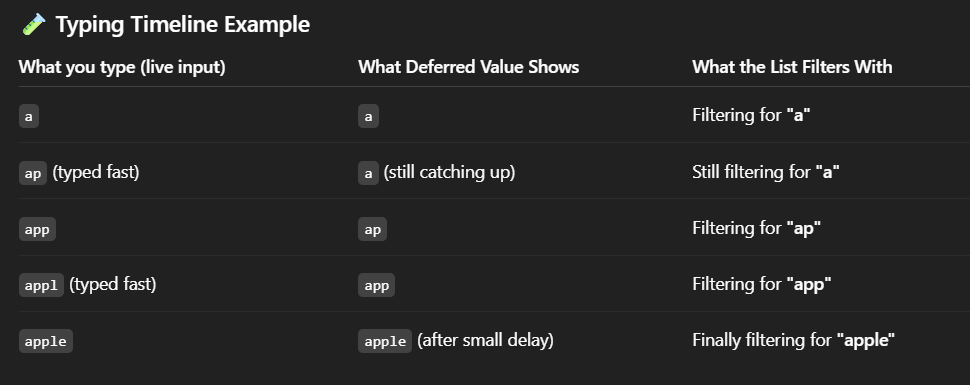
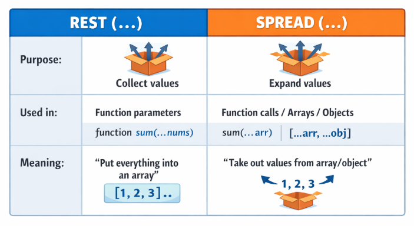
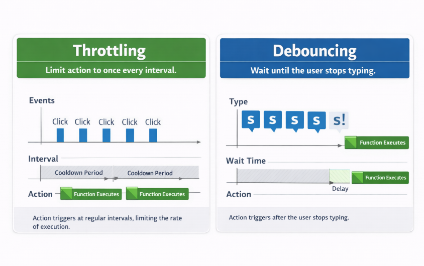

**Default props**

Default props allow you to set default values for props when no value is passed by the parent component.

Example with Function Component -

```js

function Button({ label, color }) {
  return <button style={{ background: color }}>{label}</button>;
}

Button.defaultProps = {
  label: "Click Me",
  color: "blue",
};

export default Button;

```
If the parent does:

```js

<Button />

```

Output button will have:

label = "Click Me"

color = "blue"

🟦 Same Example Using Default Value in Parameter (Modern Way)

This is now the preferred syntax:

function Button({ label = "Click Me", color = "blue" }) {
  return <button style={{ background: color }}>{label}</button>;
}

export default Button;

👇 Example when parent passes props
<Button label="Submit" />


Default props provide fallback values for props in a React component when the parent does not pass them.

=================================================================================================================================

**Passing functions as props**

Passing functions as props allows a parent component to communicate with and control a child componen

This is often used for-

Updating parent state from a child
Handling events (click, change)
Sending data from child → parent

✅ Basic Example
Parent Component
function Parent() {
  function handleMessage() {
    alert("Message from parent!");
  }

  return <Child onClick={handleMessage} />;
}

Child Component
function Child({ onClick }) {
  return <button onClick={onClick}>Click Me</button>;
}


👉 When the button is clicked, it calls the function defined in the parent.

🎯 Passing Data from Child → Parent
Parent
function Parent() {
  const handleData = (value) => {
    console.log("Received from child:", value);
  };

  return <Child sendData={handleData} />;
}

Child
function Child({ sendData }) {
  return (
    <button onClick={() => sendData("Hello Parent!")}>
      Send Data
    </button>
  );
}


➡ Output in console: Received from child: Hello Parent!

💡 Using with useState
Parent
function Parent() {
  const [count, setCount] = useState(0);

  const increment = () => setCount(prev => prev + 1);

  return <Counter handleIncrement={increment} count={count} />;
}

Child
function Counter({ handleIncrement, count }) {
  return (
    <>
      <p>Count: {count}</p>
      <button onClick={handleIncrement}>+</button>
    </>
  );
}

🧩 Arrow Functions Inline
<Child onClick={() => console.log("Inline function")} />


✔ Works fine
❌ But avoid overusing inline functions when heavy re-rendering happens (performance concern).

🔁 Two-Way Communication Summary
Direction	How it works
Parent ➝ Child	Props value (name, color, isOpen, etc.)
Child ➝ Parent	Passing function props and invoking them
🧪 Interview One-Liner

In React, functions can be passed as props so that a child component can communicate or trigger actions in the parent component, especially useful for event handling and updating parent state.


=======================================================================================================================

Note -
A setter function can take a value or a function — React supports both forms.


❌ Snippet 1: Using setCount(count + 1) (WRONG for multiple updates)
function App() {
  const [count, setCount] = useState(0);

  const handleClick = () => {
    setCount(count + 1);
    setCount(count + 1);   // ❌ still uses the old value
  };

  return (
    <div>
      <p>Count: {count}</p>
      <button onClick={handleClick}>Increment</button>
    </div>
  );
}

👉 Output after clicking once:

Count becomes: 1
(Not 2, because both updates used the old value: 0)

✅ Snippet 2: Using setCount(prev => prev + 1) (CORRECT)
function App() {
  const [count, setCount] = useState(0);

  const handleClick = () => {
    setCount(prev => prev + 1);
    setCount(prev => prev + 1);   // ✅ uses updated value each time
  };

  return (
    <div>
      <p>Count: {count}</p>
      <button onClick={handleClick}>Increment</button>
    </div>
  );
}

👉 Output after clicking once:

Count becomes: 2
(0 → 1 → 2 correctly)

⭐ One-line difference

count + 1 → uses OLD value → updates only once

prev + 1 → uses LATEST value → updates correctly twice


✅ Both versions behave EXACTLY the same
Version 1
function handleChange(e) {
  setValue(val);
}

Version 2
function handleChange(e) {
  return setValue(val);
}

⭐ Why both are same?

setValue() returns undefined


So returning or not returning makes no difference


===================================================================================================================

🧠 Simple Definition

Passing components as props means sending a JSX element or another component to a child component, and letting that child decide where and how to render it.

✅ Example 1 — Passing JSX as a Prop
Parent
function Parent() {
  return <Card content={<h2>Hello World</h2>} />;
}

Child
function Card({ content }) {
  return <div className="card">{content}</div>;
}


👉 Result: <h2>Hello World</h2> will appear inside the card.

🧩 Example 2 — Passing a Component (Not JSX)
Parent
function Parent() {
  return <Card Component={Header} />;
}

function Header() {
  return <h1>I am a Header</h1>;
}

Child
function Card({ Component }) {
  return (
    <div className="card">
      <Component />
    </div>
  );
}


🟢 Useful when the component needs props later.

🎯 Example 3 — Passing Component With Props

Parent:

function Parent() {
  return <Card Component={Message} message="Hello React!" />;
}

function Message({ message }) {
  return <p>{message}</p>;
}


Child:

function Card({ Component, message }) {
  return (
    <div className="card">
      <Component message={message} />
    </div>
  );
}

⭐ Best & Most Common Pattern: children

React already has a built-in elegant way:

Parent
<Card>
  <h2>Hello from children</h2>
  <button>Click</button>
</Card>

Child
function Card({ children }) {
  return <div className="card">{children}</div>;
}


🎉 This is how most UI libraries (Material UI, ShadCN, Chakra) work.

🔥 Real-World Use Case: Modal Layout
function Modal({ title, actions, children }) {
  return (
    <div className="modal">
      <h2>{title}</h2>
      <div>{children}</div>
      <div className="actions">{actions}</div>
    </div>
  );
}


Parent:

<Modal
  title="Delete Item"
  actions={<button>Confirm Delete</button>}
>
  <p>Are you sure you want to delete this?</p>
</Modal>

🧪 When Should You Use This?
Use Case	Best Method
Passing text, UI content	children
Passing a specific component to render	Component prop (Component={Header})
Rendering dynamic replacements like icons/buttons/layouts	JSX prop (icon={<Star />})
Reusable higher-order layouts like forms, cards, modals	Component or children
🧩 Interview One-Liner

Passing components as props allows a parent to decide what UI a child should render, increasing flexibility and reuse. It’s commonly done using JSX props or React’s children prop.


==========================================================================================================

🚀 Lazy Loading Images in React

Lazy loading means:
👉 The image loads only when it comes into view, not before.
This makes your app faster.

✅ Easiest Method: Use loading="lazy"

Just add one attribute to your  tag.


That’s it.
No library, no extra code.

====================================================
Here are the different ways to import and use images in a React application, explained short and easy 👇

🔹 1. Import image in a component (most common way)

File structure:

src/
  images/
    hero.png
  App.jsx


Use like this:

import hero from "./images/hero.png";

function App() {
  return ;
}

export default App;


📌 React converts the image into an optimized file during build.

🔹 2. Use image from the public folder

File structure:

public/
  logo.png
src/
  App.jsx


Use like this:

function App() {
  return ;
}


📌 No import needed — browser loads directly.

🔹 3. Use a URL image (CDN / external)
function App() {
  return (
    
  );
}


📌 Useful for APIs or remote images.

🔹 4. Images from JSON/API
const data = {
  img: "/car.png" // in public folder
};

function App() {
  return ;
}

=========================================================================================
👇 How to use onClick in React

React uses functions as event handlers.
So when you attach onClick, you give React a function reference — not a function call.

✅ 1. Pass the function reference
<button onClick={handleClick}>Click</button>


React will execute handleClick only when the button is clicked.

❌ 2. Don’t call the function directly
<button onClick={handleClick()}>Click</button>


This runs the function immediately during rendering — not on click.
So avoid this unless intentional.

🏹 3. Use an arrow function (when passing arguments)
<button onClick={() => handleClick("Likan")}>Click</button>


Arrow functions are used when you need:

parameters

custom logic before calling the handler

🧠 Event Object

React automatically passes a Synthetic Event:

function handleClick(e) {
  console.log(e);
}


No need to manually send the event object.


**synthetic event**

A Synthetic Event in React is React’s wrapper around the browser event that makes event handling consistent across all browsers.

Example:

<button onClick={(e) => console.log(e)}>Click</button>


Here e is a SyntheticEvent, not the raw browser event.

Browser events behave differently in Chrome, Firefox or Safari, but React uses Synthetic Events, so the same event works consistently across all browsers.

===================================================================================================================

🎯 Conditional Rendering in React

Sometimes you want to show different UI based on a condition.
There are multiple ways to do it.

✅ 1. if / else
if (role === "admin") {
  return <AdminPanel />;
} else {
  return <UserPanel />;
}


✔ Best when logic is longer.

✅ 2. Ternary Operator (? :)
return role === "admin" ? <AdminPanel /> : <UserPanel />;


✔ Good for simple one-line conditions.

✅ 3. && Operator
return loggedIn && <Dashboard />;


✔ Used when you want to show something only if condition is true.

✅ 4. switch Case (when many options)
switch (role) {
  case "admin":
    return <AdminPanel />;
  case "user":
    return <UserPanel />;
  case "guest":
    return <GuestPage />;
  default:
    return <NotFound />;
}


One-Line Summary

👉 Use ternary for simple checks, switch for multiple conditions, and && when showing something only if true.


✔ Best when there are multiple conditions.

🧠 Rule of Thumb
Use Type	Best When
if/else	Heavy logic
? : ternary	Simple condition
&&	Show only if true
switch	Many cases

=====================================================================

Yes — you can pass keys inside React fragments, but only when using the long syntax, not the short one.

❌ Short Fragment Syntax — Keys NOT allowed
<>
  <li>Item 1</li>
  <li>Item 2</li>
</>


You cannot write:

< key={id} ></>   // ❌ invalid


Because the short fragment (<>...</>) does not support props.

✅ Long Fragment Syntax — Keys allowed
<React.Fragment key={id}>
  <li>{item}</li>
</React.Fragment>


This works because the long syntax accepts props, including key.

📌 Why would you add a key to a Fragment?

Mainly when rendering a list and you don’t want an extra DOM element like a <div>.

Example:

const items = ["A", "B", "C"];

return items.map((item, index) => (
  <React.Fragment key={index}>
    <p>{item}</p>
    <hr />
  </React.Fragment>
));


No extra wrapper shows up in the DOM — cleaner markup.

🔥 Easy One-Line Interview Answer

Yes, you can add keys to React Fragments, but only using <React.Fragment> syntax. The short <> fragment cannot accept keys.


============================================================================================================

1. What is useRef in React?

Simple definition:

useRef lets you store a value that:

survives re-renders ✅

does NOT cause re-renders when it changes ❌

can also point to a DOM element (like <input>, <div>, etc.) ✅


2. Basic Syntax & Return Shape
const ref = useRef(initialValue);


What you get back:

// ref is an object
{
  current: initialValue
}


You always read/update via: ref.current


3. useRef vs useState vs Normal Variable

🔹 Normal variable (inside component)

function App() {
  let x = 0;
  x++;
  console.log(x);
  return <div>{x}</div>;
}

x is reset on every render.

Does not persist.

🔹 useState
const [count, setCount] = useState(0);

Persists across renders ✅
Updating it causes re-render ✅

🔹 useRef
const countRef = useRef(0);
countRef.current++;

Persists across renders ✅
Updating does NOT cause re-render ❌


4. Main Use Cases of useRef
4.1 Access DOM Elements (Most Common)

import { useRef } from "react";

function FocusInput() {
  const inputRef = useRef(null);

  function handleFocus() {
    // inputRef.current is the actual DOM element
    inputRef.current.focus();
  }

  return (
    <>
      <input ref={inputRef} placeholder="Click button to focus" />
      <button onClick={handleFocus}>Focus Input</button>
    </>
  );
}


ref={inputRef} tells React: "when you render this <input>, store its DOM node in inputRef.current".
You can then call DOM methods like .focus(), .scrollIntoView(), .play(), etc.

4.2 Store Mutable Values Without Re-rendering

import { useRef } from "react";

function Counter() {
  const countRef = useRef(0);

  const handleClick = () => {
    countRef.current++;
    console.log("Current value:", countRef.current);
  };

  return <button onClick={handleClick}>Increase (check console)</button>;
}
🧠 Important:

The button text will never change because we are not using useState.

Only the console log changes.

Good for internal logic, not for UI display.


4.3 Persist Values Between Renders (Render Count Example)

import { useRef } from "react";

function RenderTracker({ value }) {
  const renderCount = useRef(0);

  // This runs every time the component renders.
  // We update the count, but this does NOT trigger a re-render because it's a ref.
  renderCount.current++;

  return (
    <p>Rendered: {renderCount.current} times — Current value: {value}</p>
  );
}
🧠 Easy explanation:
useRef(0) starts with 0.

Every time the component renders, we do renderCount.current++.

The number keeps increasing because useRef remembers the value.

But changing it does NOT re-render the component.

💡 One-line Summary:
useRef stores a value across renders without causing re-renders.


4.4 Store Previous State/Prop (Prev Value Pattern)

🧠 Component Code (with mental notes)
import { useEffect, useRef, useState } from "react";

function InputWithPrevValue() {

  // Step 1: Create a state value that triggers re-renders when updated
  const [value, setValue] = useState("");

  // Step 2: Create a ref to store the previous value (ref persists across renders)
  const prevValueRef = useRef("");

  // Step 3: useEffect runs AFTER each render, when `value` changes
  useEffect(() => {
    // update ref AFTER UI updates
    prevValueRef.current = value;
  }, [value]);

  return (
    <>
      <input
        value={value}
        onChange={(e) => setValue(e.target.value)} // Updating state triggers re-render
        placeholder="Type something"
      />
      <p>Current: {value}</p>
      <p>Previous: {prevValueRef.current}</p>
    </>
  );
}

🔁 Render Flow Explained
🟦 Initial Render (Nothing typed yet)
Variable	Value
value	"" (from useState(""))
prevValueRef.current	"" (from useRef(""))

UI shows:
Current: ""
Previous: ""

After UI paint → useEffect runs
→ prevValueRef.current = value → still ""

🟦 User types: "H"
1️⃣ User types → onChange fires → setValue("H")

👉 Calling setValue triggers a re-render.

2️⃣ During re-render:
Variable	Value
value	"H"
prevValueRef.current	still " " (OLD value, unchanged yet)

💡 Because .current only updates after render inside useEffect.

UI now shows:
Current: "H"
Previous: ""

3️⃣ After UI paint → useEffect runs:
prevValueRef.current = "H"


Now ref stores "H".

🟦 User types again: "He"
1️⃣ setValue("He") triggers re-render
Variable	Value
value	"He"
prevValueRef.current	"H" (previous stored value)

UI shows:
Current: "He"
Previous: "H"

2️⃣ useEffect runs → update ref
prevValueRef.current = "He"

🟦 Continue typing:
Input Action	Current State (value)	Stored Previous (ref.current)
Type H	"H"	""
Type e	"He"	"H"
Type l	"Hel"	"He"
Type l	"Hell"	"Hel"
Type o	"Hello"	"Hell"
🚀 Why do we need useRef here?

Because:

If we stored the previous value using useState, updating it would cause another re-render → not needed.

useRef allows us to store the value without triggering re-renders.


4.5 Store Timer IDs (setTimeout / setInterval)

import { useRef } from "react";

function Timer() {

  // useRef stores the timer ID created by setInterval.
  // We set initial value as null because there is no timer running initially.
  // This value will persist across re-renders (does not reset).
  const timerIdRef = useRef(null);

  const startTimer = () => {

    // If timerIdRef already has a value, it means a timer is already running.
    // We return early to avoid starting duplicate intervals.
    if (timerIdRef.current !== null) return;

    // setInterval returns a unique ID for the timer.
    // We store that ID inside .current.
    timerIdRef.current = setInterval(() => {
      console.log("Tick...");
    }, 1000);
  };

  const stopTimer = () => {
    // clearInterval needs the timer ID to stop the running interval.
    // We pass the stored interval ID from the ref.
    clearInterval(timerIdRef.current);

    // After stopping, reset the ref value back to null.
    // This allows startTimer to run again.
    timerIdRef.current = null;
  };

  return (
    <>
      {/* Clicking "Start" sets a timer only once */}
      <button onClick={startTimer}>Start</button>

      {/* Clicking "Stop" clears the running timer */}
      <button onClick={stopTimer}>Stop</button>
    </>
  );
}

export default Timer;
🔁 Full Flow (Step-by-Step)
🔹 Initial State (Before Clicking Anything)
Value	Meaning
timerIdRef.current → null	No timer running yet

🎯 When user clicks Start
startTimer() is called.

Condition check:

js
Copy code
if (timerIdRef.current !== null) return;
👉 Since .current is null, code continues.

A new interval starts:

js
Copy code
timerIdRef.current = setInterval(...);
Value	Meaning
timerIdRef.current = 4 (example ID)	Timer is now running

💡 Now "Tick..." prints every 1 second.

⚠️ User clicks Start again
Condition detects timer already running:

js
Copy code
if (timerIdRef.current !== null) return;
So nothing happens → avoids duplicate intervals.

🛑 User clicks Stop
clearInterval(timerIdRef.current) stops the running timer.

Reset the ref:

js
Copy code
timerIdRef.current = null;
Value	Meaning
timerIdRef.current = null	Timer stopped, can start again

======================================================================================================================================

What is "Lifting the State Up"?

When two (or more) child components need the SAME data,
👉 you move that data (state) UP to their common parent
👉 and pass it down using props.

⚡ Lifting the state up means keeping shared state in the nearest common parent so multiple child components can access and update it through props.

🎨 VISUAL Explanation (Very Simple)

❌ Wrong way – state in each component

Parent
 ├── Child A → has its own count
 └── Child B → has its own count

Child components maintain separate state.
State is not shared.
So values become inconsistent.


✔ Right way – state lifted to the parent

Parent → stores count
 ├── Child A → reads count from parent
 └── Child B → reads count from parent

Both see the same value.
 
Why Do We Need to Lift State Up?

Both components need the same data.
They should always show the same updated value.
Don't keep the same state in two places.
Put the logic in one place so everything stays in sync.


🧩 Scenario 1: 🧩 Scenario 1: One Input + One Display Need the Same Value

❌ Without lifting

Child A has its own value.
Child B has its own value.
→ They never sync.

✔ With lifting

Parent holds the input value.
Both children get it through props.

Code:

```js

function Parent() {
  const [text, setText] = useState("");

  return (
    <>
      <ChildA value={text} onChange={setText} />
      <ChildB value={text} onChange={setText} />
    </>
  );
}

function ChildA({ value, onChange }) {
  return <input value={value} onChange={(e) => onChange(e.target.value)} />;
}

function ChildB({ value, onChange }) {
  return <h3>You typed: {value}</h3>;
}

```

✔ Input in ChildA updates output in ChildB
✔ They share the same state (in parent)


# Rending Process - 

🟡 Phase 1: Initial Render (when component appears first time)

1️⃣ React calls Parent()

useState("") runs
text is initialized as ""
setText function is created

2️⃣ Parent returns JSX

React sees:

<ChildA value={text} onChange={setText} />
<ChildB value={text} onChange={setText} />


Right now: value={text} → value=""

So React schedules:

Render ChildA with props { value: "", onChange: setText }
Render ChildB with props { value: "", onChange: setText }

3️⃣ React renders ChildA

React calls: ChildA({ value: "", onChange: setText });
ChildA returns: <input value="" onChange={(e) => onChange(e.target.value)} />
React creates an <input> element in the DOM with: value="" (empty)
onChange handler attached

4️⃣ React renders ChildB

React calls: ChildB({ value: "", onChange: setText });
ChildB returns: <h3>You typed: </h3>
React creates an <h3> in the DOM with that text.

✅ Now the screen shows:

An empty input box
A text: You typed:

🟡 Phase 2: User types in ChildA (e.g., types "H")

Now you click in the input and type H.

5️⃣ Browser fires input / change event

React's synthetic event system catches it and calls: (e) => onChange(e.target.value)

Here: e.target.value is "H"

onChange is actually setText (passed from Parent)

So it calls: setText("H");

🟡 Phase 3: State update → Re-render

6️⃣ setText("H") schedules a re-render of Parent

React marks Parent as "needs to render again".

7️⃣ React calls Parent() again

Now, inside Parent: const [text, setText] = useState("");

Because of React’s state system, text is no longer "".

Now text = "H" (the updated value).

8️⃣ Parent returns JSX again (with new value)

Now React sees:

<ChildA value="H" onChange={setText} />
<ChildB value="H" onChange={setText} />


So it re-renders both children with new props.

🟡 Phase 4: Children re-render with updated props

9️⃣ React re-renders ChildA

React calls: ChildA({ value: "H", onChange: setText });

ChildA returns: <input value="H" onChange={(e) => onChange(e.target.value)} />

React updates the existing <input> DOM node.

Its value becomes "H".

(React does NOT create a new input, it updates the old one.)

🔟 React re-renders ChildB

React calls: ChildB({ value: "H", onChange: setText });

ChildB returns:  <h3>You typed: H</h3>

React updates the existing <h3> DOM node.

Text now becomes: You typed: H

🔁 Phase 5: More typing (each character = repeat same steps)

If you now type "He":

Event fires in <input>

setText("He") is called

Parent re-renders with text = "He"

ChildA gets value="He" → input updates

ChildB gets value="He" → text updates

…and so on for every character.

🧠 What renders when?

Initial mount:

Parent renders → returns ChildA + ChildB

ChildA renders → input created
ChildB renders → heading created

On every input change:

ChildA's onChange runs → calls setText(newValue)
Parent re-renders with updated text
ChildA re-renders with new value
ChildB re-renders with new value
So the order is always:
Parent re-renders → then children re-render with new props.

⚛️ Render Phase vs Commit Phase (Short + Easy)

🟡 Render Phase (Thinking Phase)

React is ONLY calculating what the UI should look like.
What happens in this example:
React calls Parent()
React calls ChildA()
React calls ChildB()
React builds a new virtual DOM for:

<input value="..." />
<h3>You typed: ...</h3>

❗ No DOM updates
❗ Nothing appears on the screen yet
❗ Only function calls + virtual DOM building

🟢 Commit Phase (Doing Phase)

React now applies the changes from the virtual DOM to the real DOM.
What happens in this example:
React updates the actual <input> box in the browser
React updates the <h3> text in the browser
Browser paints the new UI once

🔁 On every input change:

Render Phase:

Parent() runs again
ChildA() runs
ChildB() runs
New virtual DOM is prepared
(input → "H", "He", "Hel", etc.)

Commit Phase:

React updates the real input value
React updates the real <h3> text
Browser shows the new UI

Super Short Version -

Render Phase: React calls your components and creates virtual DOM.
(But does NOT update the UI.)

Commit Phase: React updates the real DOM and browser paints the screen.
(UI actually changes here.)


**Which phase is triggered when ?**

🟩 1. Initial Mount (FIRST TIME COMPONENT SHOWS ON SCREEN)
A. React calls Parent → Render Phase

Triggered when:

Component is first loaded.

What happens:

Parent() runs

ChildA() runs

ChildB() runs
👉 Render Phase

Nothing appears on screen yet.

B. React updates DOM → Commit Phase

Triggered immediately after the render phase.

What happens:

<input> is created in DOM

<h3> is created in DOM

Browser paints UI
👉 Commit Phase

🟦 2. User types in ChildA input

This starts a new cycle.

A. onChange fires → setText("H") is called

This DOES NOT cause render/commit directly.

It only requests a new render.

B. React re-renders Parent → Render Phase

Triggered because state changed.

What happens:

React calls Parent() again

Then ChildA() runs

Then ChildB() runs
👉 Render Phase

React prepares the new virtual DOM:

<input value="H" … />

<h3>You typed: H</h3>

Still no UI change yet.

C. React updates the real DOM → Commit Phase

Triggered after render finishes.

What happens:

Input value updated from "" → "H"

<h3> text updated to "You typed: H"

Browser paints

👉 Commit Phase

🔁 3. Every keystroke repeats the same:
When you type 'e' → 'He'
Render Phase is triggered when:

setText("He") is called

React calls:

Parent()
ChildA()
ChildB()
Commit Phase is triggered when:
React applies DOM changes:
input value becomes "He"
heading becomes "You typed: He"

Final Clear Answer -

Render Phase is triggered:

When the component mounts initially
Every time setText() is called

React re-runs:

Parent()
ChildA()
ChildB()

Commit Phase is triggered:

Right after the render phase finishes
When React updates the real DOM:
updates input value
updates heading
And the browser paints the UI

Note - Reconciliation happens ONLY in the Render Phase, never in the Commit Phase.


🧩 Scenario 2: Sibling Components Need Shared Data - Another use case of lifting the state up.

Example:

Child A updates a number

Child B displays it

You CANNOT keep the number inside Child A
Because Child B won’t get the latest value.

Solution → Move the state to parent.

Example 2 - 

Problem Story

ChildA → chooses a color

ChildB → shows a preview box with that color

If you keep the color inside ChildA, then:

ChildB has no idea what color was selected

👉 So we move the state to Parent . Parent becomes the single source of truth.

With Lifting the state up - 

```js
import { useState } from "react";

function Parent() {
  const [color, setColor] = useState("lightblue"); // shared state

  return (
    <>
      <ChildA selectedColor={color} onChangeColor={setColor} />
      <ChildB selectedColor={color} />
    </>
  );
}

// ChildA: chooses/updates the color
function ChildA({ selectedColor, onChangeColor }) {
  const handleColorChange = (newColor) => {
    onChangeColor(newColor); // update parent's state
  };

  return (
    <div>
      <h3>Pick a color:</h3>
      <button onClick={() => handleColorChange("lightblue")}>
        Light Blue
      </button>
      <button onClick={() => handleColorChange("lightgreen")}>
        Light Green
      </button>
      <button onClick={() => handleColorChange("salmon")}>Salmon</button>

      <p>Current selected color: {selectedColor}</p>
    </div>
  );
}

// ChildB: only displays the selected color
function ChildB({ selectedColor }) {
  return (
    <div>
      <h3>Preview:</h3>
      <div
        style={{
          width: "150px",
          height: "80px",
          border: "1px solid black",
          backgroundColor: selectedColor,
        }}
      />
      <p>Box color: {selectedColor}</p>
    </div>
  );
}


```

🔄 How data flows here (easy)

Parent holds: color + setColor

ChildA gets:

selectedColor (to display current)
onChangeColor (to update)

ChildB gets:

selectedColor (to show preview)
Whenever ChildA clicks a button:
onChangeColor("salmon") → actually setColor("salmon")
Parent’s state updates
Parent re-renders

Both:

ChildA shows updated text
ChildB shows updated preview box

👉 Both siblings stay in sync because they share the same parent state.


🧩 Scenario 3: Filtering a List (Lifting State Up)

Parent holds the full product list
Child A = Search box
Child B = Filtered list display

If the search text is stored inside Child A, then:

❌ Child B won’t know the search text
❌ You can't filter the list in sync
❌ You duplicate logic or pass data in a messy way

👉 Correct solution: Move search state to Parent.

✔ Correct Example — Lifting State Up for Filtering
import { useState } from "react";

```js

function Parent() {
  const products = ["Apple", "Banana", "Mango", "Orange", "Pineapple"]; // static list
  const [search, setSearch] = useState(""); // shared state

  // Filter logic stays in Parent 👇
  const filtered = products.filter((item) =>
    item.toLowerCase().includes(search.toLowerCase())
  );

  return (
    <>
      <ChildA search={search} onSearchChange={setSearch} />
      <ChildB items={filtered} />
    </>
  );
}

// ChildA = Search Box
function ChildA({ search, onSearchChange }) {
  return (
    <input
      type="text"
      value={search}
      placeholder="Search product..."
      onChange={(e) => onSearchChange(e.target.value)}
    />
  );
}

// ChildB = Filtered item list
function ChildB({ items }) {
  return (
    <ul>
      {items.map((item) => (
        <li key={item}>{item}</li>
      ))}
    </ul>
  );
}

```

🔄 How it works (Easy)
1. User types in ChildA
→ ChildA calls onSearchChange
→ Which is setSearch

2. Parent state updates
→ search becomes "ap"

3. Parent filters the product list
→ Only items containing "ap" remain

4. ChildB receives the filtered list
→ Displays only matching items

# Why Lift State Up Here?

Both components depend on the same value (search text).
Filtering logic belongs to the Parent.
UI is in sync.
This avoids duplicated states.
Child components stay clean and reusable.


Lifting State Up in Modals: Basic Parent-Controlled Example - 


❌ Wrong-ish way (state inside Modal – hard to control from outside)

```js

function Modal() {
  const [open, setOpen] = useState(false);

  return (
    <>
      <button onClick={() => setOpen(true)}>Open Modal</button>

      {open && (
        <div className="backdrop">
          <div className="modal">
            <p>Hi, I'm a modal</p>
            <button onClick={() => setOpen(false)}>Close</button>
          </div>
        </div>
      )}
    </>
  );
}

```

Problem:

Only the modal component itself can open/close it.
Other components (like a navbar button, list item, etc.) cannot control it.


✅ Correct (lifting state up to parent) -

```js

import { useState } from "react";

function App() {
  const [isOpen, setIsOpen] = useState(false);

  const openModal = () => setIsOpen(true);
  const closeModal = () => setIsOpen(false);

  return (
    <>
      {/* These 3 components can all open the SAME modal */}
      <Navbar onOpen={openModal} />
      <ProductList onOpen={openModal} />
      <Footer onOpen={openModal} />

      {/* One shared modal */}
      <Modal isOpen={isOpen} onClose={closeModal}>
        <h2>Shared Modal</h2>
        <p>This modal can be opened from Navbar, ProductList, or Footer.</p>
      </Modal>
    </>
  );
}

/* ---- Child Components ---- */

function Navbar({ onOpen }) {
  return (
    <nav>
      <button onClick={onOpen}>Open Modal from Navbar</button>
    </nav>
  );
}

function ProductList({ onOpen }) {
  return (
    <section>
      <h3>Product List</h3>
      <button onClick={onOpen}>Open Modal from Product List</button>
    </section>
  );
}

function Footer({ onOpen }) {
  return (
    <footer>
      <button onClick={onOpen}>Open Modal from Footer</button>
    </footer>
  );
}

/* ---- Modal Component ---- */

function Modal({ isOpen, onClose, children }) {
  if (!isOpen) return null; // Don't render if closed

  return (
    <div className="backdrop">
      <div className="modal">
        {children}

        <button onClick={onClose}>Close</button>
      </div>
    </div>
  );
}

export default App;

```


🧠 What’s Happening Here?

App owns: const [isOpen, setIsOpen] = useState(false);

openModal and closeModal are created in App.

Navbar, ProductList, and Footer all receive onOpen as a prop.

When any of them call onOpen() → isOpen becomes true → <Modal /> shows.

Modal gets: <Modal isOpen={isOpen} onClose={closeModal} />

so it knows when to show and how to close.


✅ Benefits of Lifting State Up

Keeps shared data in one place, avoiding mismatched or duplicate state.
Allows multiple components to access or update the same state easily.
Makes child components simpler and cleaner by removing local state.
Improves data flow control since the parent decides how UI behaves.
Makes components reusable, because they don't manage their own state.
Enforces predictable one-way data flow (React's core principle).


MOST IMPORTANT: When NOT to Lift State Up

❌ Don't lift if only one component uses that state.
❌ Don't lift 'just because' — avoid unnecessary complexity.
❌ If the state is global (needed everywhere), use Context instead.

=========================================================================================================================


Error Boundaries -

Error Boundaries are React components that catch errors in the UI, so the entire app does not crash.

They catch errors in rendering, lifecycle, and React tree.

Rendering phase - 

Error Boundaries ONLY catch errors When React is trying to calculate what to show on the screen.

Lifecycle methods - 

If an error happens in any of the life cycle methods like componentDidMount,componentDidUpdate and componentWillUnmount, the Error Boundary catches it.

Inside the React component tree - 

Any error thrown by a child component during render, the boundary above it catches.


👉 Error Boundaries act like a safety net around the UI.


❌ "They cannot catch errors in event handlers or async code." — Meaning

There are some places Error Boundaries do not work:

❌ Event Handlers -

Example:

<button onClick={() => { throw new Error("Clicked error"); }}>
  Click
</button>


This does NOT go through React's render pipeline.
It happens after rendering → so Error Boundary cannot catch it.
Even if the button is wrapped inside an ErrorBoundary, it will NOT catch errors thrown inside onClick.

➡ You must use try/catch manually:

```js

<button
  onClick={() => {
    try {
      throw new Error("Clicked error");
    } catch (e) {
      console.error(e);
    }
  }}
>
  Click
</button>

```
❌ Async Code

Examples that Error Boundaries CANNOT catch:

❌ Promises
useEffect(() => {
  fetch("/api").then(() => {
    throw new Error("Async error");
  });
}, []);

❌ setTimeout
setTimeout(() => {
  throw new Error("Async error");
}, 1000);

❌ async/await
async function load() {
  throw new Error("Async crash");
}


➡ These happen outside React’s render flow.
React never sees the error → Error Boundary can’t catch it.

You again need try/catch.


✅ 1. Try/Catch for Event Handlers (Button Clicks, Inputs)

❌ Error Boundaries CANNOT catch this:

<button onClick={() => { throw new Error("Crash"); }}>
  Click
</button>

✔ Correct try/catch version:

```js

<button
  onClick={() => {
    try {
      riskyAction(); // function that may throw error
    } catch (err) {
      console.error("Event Handler Error:", err);
      alert("Something went wrong!");
    }
  }}
>
  Click
</button>

```


✅ 2. Try/Catch for Async + Await Functions

❌ Error Boundaries cannot catch async errors:

```js

async function loadData() {
  const res = await fetch("/api");
  throw new Error("Async failed");
}

// ✔ Correct try/catch version:

async function loadData() {
  try {
    const res = await fetch("/api");
    if (!res.ok) throw new Error("API Error");
    const data = await res.json();
    return data;
  } catch (err) {
    console.error("Async Error:", err);
    alert("Something went wrong!");
  }
}

```

🔥 Interview Tip:

"Async errors happen outside render → Error Boundaries can’t see them → use try/catch."

✅ 3. Try/Catch for fetch() + Promises

Fetch with explicit try/catch:

```js

const handleFetch = async () => {
  try {
    const resp = await fetch("/api/users");
    if (!resp.ok) throw new Error("Server Error");
    const data = await resp.json();
    console.log(data);
  } catch (err) {
    console.error("Fetch failed:", err);
  }
};

Promise .catch() version:

fetch("/api")
  .then(res => res.json())
  .catch(err => {
    console.error("Promise Error:", err);
  });

  ```

✅ 4. Try/Catch for setTimeout / setInterval.

❌ Error inside timer is invisible to React.

✔ Solution:

```js

setTimeout(() => {
  try {
    riskyFunction();
  } catch (err) {
    console.error("Timer Error:", err);
  }
}, 1000);

```

✅ 5. Try/Catch inside useEffect -

✔ Best practice:

```js

useEffect(() => {
  const run = async () => {
    try {
      const data = await loadData();
    } catch (err) {
      console.error("useEffect async error:", err);
    }
  };

  run();
}, []);

```

✅ 6. Global Catch Handler (Last resort)

If ALL else fails, capture uncaught async errors in global level.

You should place below code once, at the top level of your application, NOT inside components.

```js

window.addEventListener("unhandledrejection", (event) => {
  console.error("Unhandled Promise Error:", event.reason);
});

```


✔ Best place:
src/index.js (or main.jsx in Vite)


✅ Correct placement example (React + CRA)

📁 src/index.js

```js
import React from "react";
import ReactDOM from "react-dom/client";
import App from "./App";

// ⭐ Global async error handler
window.addEventListener("unhandledrejection", (event) => {
  console.error("Unhandled Promise Error:", event.reason);
  // Optional: send to logging service
  // sendToServer(event.reason);
});

const root = ReactDOM.createRoot(document.getElementById("root"));
root.render(<App />);
```

✅ Correct placement example (Vite + main.jsx)

📁 src/main.jsx

```js

// ⭐ Global unhandled promise rejection handler
window.addEventListener("unhandledrejection", (event) => {
  console.error("Unhandled Promise Error:", event.reason);
});

import React from "react";
import ReactDOM from "react-dom/client";
import App from "./App";

ReactDOM.createRoot(document.getElementById("root")).render(<App />);
```


# Why Do We Need Error Boundaries?

Prevent entire app from breaking ❌
Show user-friendly fallback UI instead of white screen ❌

Capture error logs (Sentry / Firebase / Datadog) ✔


# Where Error Boundaries Work

They catch errors from:

Rendering phase
Child components
Lifecycle methods
Hooks during render
Lazy-loaded components
Suspense boundaries
Anything inside the render tree


# Where They Do NOT Work

❌ Event handlers
❌ setTimeout, Promise.then, await
❌ Errors thrown inside the error boundary itself


✅ Where Error Boundaries Work

1️⃣ Rendering Phase Errors
Use Case: A component crashes while rendering UI.

Example: accessing undefined data during render.

function User({ profile }) {
  return <h1>{profile.name}</h1>; // ❌ profile is undefined → crash
}


✔ Wrapped:

<ErrorBoundary>
  <User profile={undefined} />
</ErrorBoundary>


2️⃣ Errors in Child Components - 
If Level1 renders Level2, and Level2 renders Level3, then Level2 and Level3 are considered inside Level1.

Use Case: Nested components fail deep inside the tree.
function Level3() {
  throw new Error("Level 3 crashed!");
}


✔ Wrap parent:

<ErrorBoundary>
  <Level1 />   // protects Level2 → Level3
</ErrorBoundary>


3️⃣ Errors in Lifecycle Methods (Class Components)
Use Case: Crash in componentDidMount, componentDidUpdate, etc.
class Profile extends React.Component {
  componentDidMount() {
    throw new Error("API parse failed!");
  }
}


✔ Wrap:

<ErrorBoundary>
  <Profile />
</ErrorBoundary>


4️⃣ Errors in custome hooks - 

✅ Case 1: Errors in custom hooks during render (Error Boundary CAN catch)

If the hook throws synchronously while rendering → Error Boundary can catch it.

// 🔹 Custom hook
function useBadJson() {
  // runs during render
  return JSON.parse("{bad json}"); // ❌ error here
}

// 🔹 Component
function Product() {
  const data = useBadJson();       // ❌ this line throws during render
  return <p>{data.name}</p>;
}

// 🔹 Wrapped with Error Boundary
<ErrorBoundary FallbackComponent={Fallback}>
  <Product />
</ErrorBoundary>;


Reason: Hook runs during render phase → same as error in component body → Error Boundary sees it.

❌ Case 2: Errors in custom hooks in async/effects (Error Boundary CANNOT catch)

If the hook does async work (fetch, setTimeout, etc.) inside useEffect,
errors happen after render, so Error Boundaries won’t catch them.

function useUser() {
  const [user, setUser] = useState(null);

  useEffect(() => {
    async function load() {
      try {
        const res = await fetch("/api/user");
        if (!res.ok) throw new Error("API failed");
        const data = await res.json();
        setUser(data);
      } catch (err) {
        console.error("Error in custom hook:", err); // ✅ handle here
      }
    }

    load();
  }, []);

  return user;
}


👉 Here, any error is handled with try/catch inside the hook,not by Error Boundary.


5️⃣ Errors in Lazy-Loaded Components (React.lazy)
Use Case: Dynamic import fails (network error).
const Settings = React.lazy(() => import("./Settings"));


✔ Wrap with Error Boundary + Suspense:

<ErrorBoundary fallback={<p>Failed to load Settings.</p>}>
  <Suspense fallback={<p>Loading…</p>}>
    <Settings />
  </Suspense>
</ErrorBoundary>

fallback -> jsx or component.

6️⃣ Errors in Suspense Boundaries
Use Case: Suspense throws due to rejected promise (data fetching).
function User() {
  throw new Promise((_, reject) => reject("Data failed")); // ❌
}


✔ Wrap:

<ErrorBoundary fallback={<p>User failed.</p>}>
  <Suspense fallback={<p>Loading…</p>}>
    <User />
  </Suspense>
</ErrorBoundary>


7️⃣ Anything Inside the Render Tree
Use Case: Any component under the boundary throws → caught.
<ErrorBoundary>
  <Dashboard>
    <Sidebar />
    <Feed />      // ❌ Feed throws
    <Footer />
  </Dashboard>
</ErrorBoundary>


✔ Only Feed fails → rest stays intact.
Only the failing component’s UI (and its subtree) gets replaced by the fallback.
Everything else inside the ErrorBoundary still works normally.


8️⃣ Multiple Error Boundaries for Specific Components (Component-Scoped Boundaries)
Use Case: Wrap different components with different boundaries so each section fails independently.

This is how real enterprise apps work.

Example layout:

function Dashboard() {
  return (
    <>
      <ErrorBoundary fallback={<p>Chart failed.</p>}>
        <StatsChart />      {/* risky component */}
      </ErrorBoundary>

      <ErrorBoundary fallback={<p>Feed failed.</p>}>
        <NewsFeed />        {/* another risky component */}
      </ErrorBoundary>

      <ErrorBoundary fallback={<p>Map failed.</p>}>
        <GoogleMap />       {/* third-party map widget */}
      </ErrorBoundary>

      <Notifications />     {/* no boundary needed */}
    </>
  );
}

⭐ Benefits:

Chart can crash → Feed + Map still work

Feed can crash → Chart still works

Map can crash → rest of UI works

No full-page white screen ever

Each part has its own fallback UI


Error Boundary Code implementation - 

```js

import React from "react";

export default class ErrorBoundary extends React.Component {
  constructor(props) {
    super(props);
    this.state = { hasError: false, error: null };
  }

  static getDerivedStateFromError(error) {
    return { hasError: true, error };
  }

  componentDidCatch(error, info) {
    console.error("ErrorBoundary caught:", error);
    console.error("Component stack:", info.componentStack);
  }

  render() {
    if (this.state.hasError) {
      return (
        <div style={{ padding: 20, background: "#fee", color: "#900" }}>
          <h2>Something went wrong.</h2>
          <p>{this.state.error?.message}</p>
        </div>
      );
    }

    return this.props.children;
  }
}

```


Code Explanation -


1. class ErrorBoundary extends React.Component - This creates a class component

React requires boundaries to be class-based not functional based.Because only class components have the error-handling lifecycle methods (componentDidCatch, getDerivedStateFromError) needed to catch render and lifecycle errors. 

2. constructor(props)

When React sees <ErrorBoundary /> for the first time / when the <ErrorBoundary /> mounts:
→ React creates an instance of ErrorBoundary.
→ calls constructor().
→ sets up state.


```js

constructor(props) {
  super(props);
  this.state = { hasError: false, error: null };
}

```

✔ 1. constructor(props)

Runs once when the ErrorBoundary component is created/mounted.

✔ 2. super(props) 

super(props) calls the parent React.Component constructor so we can use this.props, this.state, and this.setState inside the ErrorBoundary component.

Before calling super(props), this does NOT exist in the constructor.
So if we don't call super(props), we cannot access: this.state, this.props, this.setState or any this.something in ErrorBoundary component.Because JavaScript requires calling the parent class constructor before using this in a subclass.


3. this.state = { hasError: false, error: null };

This line creates the initial state for the ErrorBoundary.
It contains two fields.

🔹 3.1. hasError: false

Meaning: No error has happened yet.
Purpose: Decides whether to show normal children or the fallback UI.
Later becomes true when an error is caught.

🔹 3.2. error: null

Meaning: There is no error object stored yet.
Purpose: Stores the actual error when something crashes
(useful for logging, debugging, showing error message if needed).

const [hasError] = useState(false) is the same as this.state = { hasError: false } in a class component.
const [error] = useState(null) is the same as this.state = { error: null } in a class component.


4. getDerivedStateFromError -  

```js

static getDerivedStateFromError(error) {
    return { hasError: true, error };
  }

```

✔ What is it ?

getDerivedStateFromError is the core method that makes Error Boundaries work.

✔ When does it run ?

React automatically calls getDerivedStateFromError method whenever any component inside the <ErrorBoundary> wrapper throws an error during rendering.

✔ What it does ?

It returns new state: { hasError: true, error }

This tells the Error Boundary: "An error occurred - stop rendering children and show the fallback UI."

✔ Why it's static

React calls it without an instance.

one liner - getDerivedStateFromError is called when any child inside the ErrorBoundary throws, and it updates state so the fallback UI can display.

5.  componentDidCatch

```js

componentDidCatch(error, info) {
    console.error("ErrorBoundary caught:", error);
    console.error("Component stack:", info.componentStack);
  }

```

This runs after React catches the error.

You can:

console.log it.
send to a server (Sentry, LogRocket).
store it somewhere.

This does NOT affect UI.

6. render() method - 

```js

 render() {
    if (this.state.hasError) {
      return (
        <div style={{ padding: 20, background: "#fee", color: "#900" }}>
          <h2>Something went wrong.</h2>
          <p>{this.state.error?.message}</p>
        </div>
      );
    }

    return this.props.children;
  }


```

render() checks whether an error has happened (using the state set by getDerivedStateFromError).

If hasError is true → show fallback UI

If hasError is false → show normal children

This is the method that actually controls the UI.


```js

<ErrorBoundary fallback={<p>Failed to load Settings.</p>}>
  <Suspense fallback={<p>Loading…</p>}>
    <Settings />
  </Suspense>
</ErrorBoundary>

```


✔ If fallback is passed → shows the custom fallback. (jsx /component)
✔ If fallback is not passed → shows the default fallback in render().

========================================================================================================================

🎯 1. What is a Controlled Component?

A Controlled Component is an input whose value is fully controlled by React state.
The UI input does NOT store its own value — React stores it.

👉 Meaning:

Whatever you type → React state updates.

React state → controls what the input displays.

Single source of truth = React state.

```js

function ControlledInput() {
  const [name, setName] = useState("");

  return (
    <input
      value={name}
      onChange={(e) => setName(e.target.value)}
    />
  );
}

```
📌 How it works:

React stores name.

When user types → React updates name.

Input value = UI always stays in sync with React.


🎯 2. What is an Uncontrolled Component?

An uncontrolled input stores its own value inside the DOM,
NOT in React state.

👉 React does NOT track what user types.
If you want the value → you read it using useRef.

✅ Example: Uncontrolled Input

```js

function UncontrolledInput() {
  const nameRef = useRef();

  return (
    <>
      <input ref={nameRef} />
      <button onClick={() => console.log(nameRef.current.value)}>
        Show Value
      </button>
    </>
  );
}

```
📌 How it works:

User types → DOM stores value.

React does not know what the value is unless accessed through the ref.


========================================================================================================================

Pure Component -
A Pure Component is a React component that re-renders only when its props or state change.
If the data is the same, it skips re-rendering to improve performance.

🔥 Normal Component vs Pure Component — Easiest Example
👨‍👩‍👧 Parent Component
function Parent() {
  const [count, setCount] = useState(0);

  return (
    <>
      <button onClick={() => setCount(count + 1)}>Add</button>

      <NormalChild label="Hi" />
      <PureChild label="Hi" />
    </>
  );
}

🔵 Normal Child (Always re-renders)
🔵 Normal Component

Re-renders every time parent re-renders

Even if props are the same

No optimizations

function NormalChild({ label }) {
  console.log("Normal Child Rendered");
  return <p>Normal: {label}</p>;
}

🟢 Pure Child (Re-renders ONLY if props change)

Re-renders only when props change

Skips re-renders for same props

Improves performance


const PureChild = React.memo(function PureChild({ label }) {
  console.log("Pure Child Rendered");
  return <p>Pure: {label}</p>;
});
============================================================================================

🔵 Container Component vs Presentation Component (Super Easy Notes)
✅ 1. Presentation/dumb Component

What it is:
A component that ONLY displays UI.

✔ Characteristics:

Shows data

No business logic

No API calls

No state (mostly)

Uses props to render UI

Pure UI component

⭐ Example (Presentation)
function UserCard({ name, age }) {
  return (
    <div>
      <h3>{name}</h3>
      <p>Age: {age}</p>
    </div>
  );
}


👉 Only shows UI.
👉 No logic inside.

✅ 2. Container/smart Component

What it is:
A component that handles logic, state, API calls, and passes data to Presentation components.

✔ Characteristics:

Fetches data

Manages state

Handles events

Contains business logic

Passes data via props

⭐ Example (Container)
function UserContainer() {
  const [user, setUser] = useState({ name: "Likan", age: 30 });

  return <UserCard name={user.name} age={user.age} />;
}


👉 It has state
👉 It controls logic
👉 It passes data to presentation (UserCard)

🎯 Why This Pattern?

✔ Clean separation of logic and UI
✔ Easier to test
✔ Easier to reuse UI components
✔ Reduces complexity

⭐ One-Line Interview Definition

👉 Container components manage logic; Presentation components manage UI.

===============================================================================================================================

What is forwardRef in React?

forwardRef is a React helper that lets a parent component pass a ref to a child component  "even if the child is a custom component."


Normally, refs only work on DOM elements, not on custom components. 'forwardRef' solves this limitation.

✅ CASE 1: Ref WORKS on DOM elements

Because React knows the actual DOM node (<input>, <button>, <div>)

✔️ Example — ref works on <input>

```js

import { useRef } from "react";

export default function App() {
  const inputRef = useRef(null);

  const focusInput = () => {
    inputRef.current.focus();   // ✔️ works
  };

  return (
    <>
      <input ref={inputRef} placeholder="DOM input" />
      <button onClick={focusInput}>Focus</button>
    </>
  );
}

```

🧠 What happens?

👉 <input> is a real DOM element.
👉 React attaches the actual DOM node to inputRef.current.
👉 So: inputRef.current → HTMLInputElement
👉 This is why .focus() works ✔️


✅ CASE 2: Ref DOES NOT WORK on custom components

Because React does not know which inner DOM element to attach to.

✔️ Example — ref FAILS on 'custom component' / 'normal function component'

```js

function MyInput() {
  return <input />;
}

export default function App() {
  const ref = useRef(null);

  return (
    <>
      <MyInput ref={ref} />   {/* ❌ Does NOT work */}
      <button onClick={() => console.log(ref.current)}>
        Check Ref
      </button>
    </>
  );
}

```
🧠 What happens?

👉 MyInput is a JavaScript function.
👉 React will NOT attach the ref to the <input> inside.
👉 Instead, React ignores it.
👉 So: ref.current → null ❌

You cannot do .focus() here.


✅ CASE 3 – Trying to receive ref as prop in function component.

```js

function MyInput({ ref }) {     // ❌ ref is undefined
  return <input ref={ref} />;
}

function App() {
  const someRef = useRef(null);
  return <MyInput ref={someRef} />;
}

```

Why this fails ?

👉 ref is a special prop.
👉 React intercepts it.React treats ref differently from normal props.React catches / intercepts the ref before sending props to your component.
👉 Even if you write <MyInput ref={someRef}>, React will NOT pass ref as a normal prop — it removes it and never sends it to your function component.
👉 Even if you try to receive ref inside a function component, React removes it from the props object — so ref will always be undefined.
👉 So props.ref is undefined.
👉 It means the ref never reaches the <input>, so React cannot connect your ref to any DOM element — the ref stays null and does absolutely nothing.


✅ CASE 4  – forwardRef on function component.

```js

const MyInput = React.forwardRef(function MyInput(props, ref) {
  return <input ref={ref} />;
});

function App() {
  const ref = useRef(null);

  return (
    <>
      <MyInput ref={ref} />  {/* ✅ works */}
      <button onClick={() => ref.current.focus()}>
        Focus
      </button>
    </>
  );
}

```

Function components cannot receive ref.forwardRef creates a wrapper component around your function so React can pass the ref to it.


🧩 What forwardRef actually does

1️⃣ when React sees <MyInput ref={ref}> , React ignores the ref


2️⃣ But when you wrap the componnet/function within forwardRef like "const MyInput = forwardRef( <component or function>)"

forwardRef tells React: "Hey React, this component is allowed to receive a ref."


3️⃣ "React does: 'MyInput supports ref now, pass it through!'"

Internally React flags this component as 'ref-forwarding capable'.


4️⃣ "So React calls your component like: MyInput(props, ref)".This is exactly what React does under the hood.

Real internal call: MyInput(props, ref);

First arg → props

Second arg → ref

This is why the function receives two arguments.

This is the core rule of forwardRef.


🧩 Meaning of each argument -

1️⃣ 1st argument → props

All normal props like:

<MyInput type="text" placeholder="Hello" />

→ These go to props.

2️⃣ 2nd argument → ref

This is the special ref React delivers:

<MyInput ref={someRef} />


→ This goes to the second argument of your function.

This is the ONLY place where you get the real ref.


3️⃣ Why the second argument?

Because React's internal rule is -

"When using forwardRef, the component function always receives:
(props, ref) — in this exact order."

Ref is NEVER inside props.


So now your MyInput component has access to the real DOM ref:

```js

function MyInput(props, ref) {
  return <input ref={ref} />;  // attaching DOM ref
}

```

Now React knows:

Parent passed ref into MyInput

MyInput passed that ref to the <input>

So ref.current now points to the <input>


👉 forwardRef allows a function component to receive a ref.

👉 The function receives (props, ref).

👉 You attach the ref to a DOM element inside.

👉 Then ref.current points to that DOM input.


⚡forwardRef  tell React: "If someone gives me a ref, I will pass it to my child DOM element."

⚡forwardRef is a React feature that lets a parent pass a ref to a child function component.

⚡forwardRef allows a function component to receive a ref and give it to a DOM element inside.


✅ CASE 5 – Passing ref as a normal prop (inputRef).

```js

function MyInput({ inputRef }) {
  return <input ref={inputRef} />;
}

function App() {
  const ref = useRef(null);

  return (
    <>
      <MyInput inputRef={ref} />   {/* ✅ Works */}
      <button onClick={() => console.log(ref.current)}>
        Check Ref
      </button>
    </>
  );
}

```

Why this works:

👉 'inputRef' is not the special 'ref' prop.

👉 React doesn't intercept it.

👉 It passes props like: MyInput({ inputRef: ref }).

👉 Inside child <MyInput>, inputRef is a valid ref object.

👉 <input ref={inputRef} /> → React attaches DOM node. ref.current → <input>


===============================================================================================================================


🚀 FULL EXAMPLE — Route-Based Code Splitting + Lazy Loading
📁 Folder Structure
src/
 ├── pages/
 │     ├── Home.jsx
 │     ├── Dashboard.jsx
 │     └── Settings.jsx
 ├── App.jsx
 └── index.js


📄 pages/Home.jsx

```js

export default function Home() {
  return <h1>Home Page</h1>;
}

```


📄 pages/Dashboard.jsx

```js

export default function Dashboard() {
  return <h1>Dashboard Page (Heavy Component)</h1>;
}

```


📄 pages/Settings.jsx

```js

export default function Settings() {
  return <h1>Settings Page</h1>;
}

```

📄 App.jsx — (Full Route-Based + Lazy Loading)

```js

import { Suspense, lazy } from "react";
import { BrowserRouter, Routes, Route, Link } from "react-router-dom";

// 🔥 Lazy loaded route components:

const Home = lazy(() => import("./pages/Home"));
const Dashboard = lazy(() => import("./pages/Dashboard"));
const Settings = lazy(() => import("./pages/Settings"));

export default function App() {
  return (
    <BrowserRouter>

      {/* Navigation */}
      <nav style={{ marginBottom: "20px" }}>
        <Link to="/">Home</Link> |{" "}
        <Link to="/dashboard">Dashboard</Link> |{" "}
        <Link to="/settings">Settings</Link>
      </nav>

      {/* 🔥 Suspense handles loading state */}
      <Suspense fallback={<h2>Loading Page...</h2>}>

        <Routes>
          <Route path="/" element={<Home />} />
          <Route path="/dashboard" element={<Dashboard />} />
          <Route path="/settings" element={<Settings />} />
        </Routes>

      </Suspense>
    </BrowserRouter>
  );
}


// What each part means:
// | → just a visual separator (text)
// {" "} → a manual space so the links don't stick///

```


📄 index.js

```js

import React from "react";
import ReactDOM from "react-dom/client";
import App from "./App";

ReactDOM.createRoot(document.getElementById("root")).render(<App />);

```

💥 How this works ?

1️⃣ Bundler splits these routes into 3 separate chunks: Home.chunk.js, Dashboard.chunk.js, Settings.chunk.js.


2️⃣ When the app loads, only the main bundle is downloaded — the Home, Dashboard, and Settings chunks are not downloaded yet.

3️⃣ When the user clicks the Dashboard link, React tries to render <Dashboard />, sees it’s a lazy component, and the browser downloads Dashboard.chunk.js.

4️⃣ While downloading <Suspense fallback="Loading Page..." /> kicks in.User sees the loader instead of a blank screen.

5️⃣ AWhen the Dashboard chunk finishes downloading, React replaces the fallback and renders <Dashboard />.


=====================================================================================================================

Immutability - React

🧩 Concept in 1 line (for your notes)

In React, never change the old object/array directly.
Always create a new one and pass it to setState.
This gives a new reference, and React can detect the change.

1️⃣ How MUTATION breaks React (object example)
❌ Wrong way – mutating the same object
import { useState } from "react";

function UserProfileBad() {
  // ✅ State is an object
  const [user, setUser] = useState({
    name: "Likan",
    age: 29,
  });

  const incrementAge = () => {
    // ❌ 1. We are directly changing the existing object
    user.age = user.age + 1;

    // ❌ 2. We pass the SAME object to setUser
    // React compares oldState === newState (same reference)
    // → It thinks: "No change" → MAY SKIP re-render
    setUser(user);
  };

  console.log("UserProfileBad render:", user);

  return (
    <div>
      <h2>Bad Profile (Mutation)</h2>
      <p>
        Name: {user.name}, Age: {user.age}
      </p>
      <button onClick={incrementAge}>Increase Age</button>
    </div>
  );
}

export default UserProfileBad;

🧠 What’s wrong here?

user points to some memory → say #101

We change user.age inside the same object

We call setUser(user) but user is still pointing to #101

React checks:

oldUser === newUser // true → same reference


So React can decide:

“State didn’t change. I don’t need to re-render.”

👉 Result: You click the button, but UI may not update (or behaves weirdly with StrictMode / batching).

✅ Correct way – IMMUTABLE update (object)
import { useState } from "react";

function UserProfileGood() {
  const [user, setUser] = useState({
    name: "Likan",
    age: 29,
  });

  const incrementAge = () => {
    // ✅ We create a NEW object using spread
    // { ...user } → copies all old fields into a new object in heap
    // age: user.age + 1 → override age in the NEW object
    const updatedUser = {
      ...user,         // copy old fields (name, age)
      age: user.age + 1,
    };

    // ✅ Now React sees a NEW object (new reference)
    // oldUser === updatedUser → false
    setUser(updatedUser);
  };

  console.log("UserProfileGood render:", user);

  return (
    <div>
      <h2>Good Profile (Immutable)</h2>
      <p>
        Name: {user.name}, Age: {user.age}
      </p>
      <button onClick={incrementAge}>Increase Age</button>
    </div>
  );
}

export default UserProfileGood;

✅ What happens here?

user initially → memory #101

{ ...user, age: user.age + 1 } creates a new object → memory #202

setUser(updatedUser) passes reference #202

React compares:

oldUser === newUser // false → different reference


So React says:

“State changed. I will re-render the component.”

🔁 UI updates properly.

2️⃣ Array example – mutation vs immutability
❌ WRONG: Mutating array with push
import { useState } from "react";

function TodoListBad() {
  const [todos, setTodos] = useState(["Learn React", "Learn Immutability"]);

  const addTodo = () => {
    // ❌ Directly modifying the existing array
    todos.push("New Todo"); // changes the same array in memory

    // ❌ React receives the same array reference
    setTodos(todos); // oldTodos === newTodos → true
  };

  console.log("TodoListBad render:", todos);

  return (
    <div>
      <h2>Bad Todo List (Mutation)</h2>
      <button onClick={addTodo}>Add Todo</button>
      <ul>
        {todos.map((todo, index) => (
          <li key={index}>{todo}</li> // (ignore index key issue for now)
        ))}
      </ul>
    </div>
  );
}

✅ CORRECT: New array with spread
import { useState } from "react";

function TodoListGood() {
  const [todos, setTodos] = useState(["Learn React", "Learn Immutability"]);

  const addTodo = () => {
    // ✅ Create a NEW array using spread
    // [...todos] → copy old items
    // "New Todo" → append new item
    const updatedTodos = [...todos, "New Todo"];

    // ✅ React now receives a NEW reference
    // oldTodos === updatedTodos → false
    setTodos(updatedTodos);
  };

  console.log("TodoListGood render:", todos);

  return (
    <div>
      <h2>Good Todo List (Immutable)</h2>
      <button onClick={addTodo}>Add Todo</button>
      <ul>
        {todos.map((todo, index) => (
          <li key={index}>{todo}</li>
        ))}
      </ul>
    </div>
  );
}

3️⃣ Preventing unnecessary renders (React.memo + immutability)

Here we'll see how immutability helps React skip re-renders when nothing changed.

🧩 Child component - 

```js

import React from "react";

function ItemsList({ items }) {
  console.log("ItemsList render");  // Logs whenever this component re-renders

  return (
    <ul>
      {items.map((item) => (
        <li key={item}>{item}</li>
      ))}
    </ul>
  );
}

export default React.memo(ItemsList);


```
If we wrap a component (<ItemsList>) in React.memo, React.memo does shallow prop comparison:

👉 It remembers the previous props.
👉 On next render, it compares new props vs old props by reference.
👉 If all props are "the same reference", it skips re-render.

👉 For arrays/objects:
oldItems === newItems → React thinks: "Same array, no changes → SKIP rerender"
oldItems !== newItems → React thinks: “New array → RERENDER”

👉 So immutability is how you make that reference change when something changes.


❌ BAD parent – mutation breaks everything -

```js

import { useState } from "react";
import ItemsList from "./ItemsList";

function ParentBad() {
  const [items, setItems] = useState(["A", "B"]);
  const [count, setCount] = useState(0);

  const addItem = () => {

    items.push("C"); // Mutating the existing array in place.

    setItems(items); // Passing the same reference back to React.

  };

  const increment = () => {
    setCount((c) => c + 1); // ✅ count changes → parent will re-render
  };

  return (
    <div>
      <h2>ParentBad</h2>

      <button onClick={addItem}>Add Item</button>
      <button onClick={increment}>Increment: {count}</button>
      <ItemsList items={items} />  {/* ItemsList is wrapped in React.memo */}
    </div>
  );
}

export default ParentBad;

```

Step by Step Explanation -

**1. Initial render** 

items = ["A", "B"]
count = 0
<ParentBad /> renders
<ItemsList items={["A", "B"]} /> renders
Console: ItemsList render (once)


**2. Click Add Item**

👉 items.push("C")
You changed the same array in memory. (❌ mutation)
Now the array becomes ["A", "B", "C"] but the reference is still the same.

👉 setItems(items)
oldState → same array reference
newState → same array reference

👉 React compares: oldState === newState → true
 React skips re-render completely for this state update

Result:
<ParentBad> does not re-render.
<ItemsList> does not re-render.

DOM still shows only ["A", "B"] in list Becasue React doesn't magically know the array content changed in memory.

👉 Bug: State changed in memory, UI didn't update. And your console.log("ItemsList render") will NOT run again.

**3. Click Increment**

👉 Click Increment

setCount((c) => c + 1) runs → count becomes 0 → 1
React re-renders <ParentBad />
Parent again passes the SAME items reference to <ItemsList />

👉 What does React.memo see?

Previous items prop → reference to ["A", "B", "C"] (mutated array)
New items prop → same reference ["A", "B", "C"]
So: oldItems === newItems → true
React.memo says: “Same props → skip render”

👉 Result in UI

count on screen: 0 → 1 ✅
<ItemsList /> does NOT re-render ❌
List still shows: ["A", "B"] ❌
console.log("ItemsList render") doesn’t run again.

🔥 Because you mutated the array, React.memo + React's equality check both get fooled → stale UI & useless memo.


✅ Good parent – immutability + React.memo working together

Now let’s write the correct parent using immutability:

```js

import { useState } from "react";
import ItemsList from "./ItemsList";

function ParentGood() {
  const [items, setItems] = useState(["A", "B"]);
  const [count, setCount] = useState(0);

  const addItem = () => {
    // ✅ Do NOT mutate 'items'. Create a New array (with old elements + "C") with new reference 
    setItems((prevItems) => [...prevItems, "C"]);
    //         ^ previous array       ^ new array created in heap
  };

  const increment = () => {
    setCount((c) => c + 1);
  };

  return (
    <div>
      <h2>ParentGood</h2>

      <button onClick={addItem}>Add Item</button>
      <button onClick={increment}>Increment: {count}</button>
      <ItemsList items={items} />  {/* React.memo(ItemsList) now works correctly */}
    </div>
  );
}

export default ParentGood;
```

Step by Step Explanation -

1️⃣ Initial Render (Nothing special here)

items = ["A", "B"]

count = 0

👉 <ParentGood /> renders
👉 It passes ["A", "B"] to <ItemsList />
👉 Since it's the first time, React.memo cannot skip → <ItemsList /> renders normally

Console shows:

ItemsList render


✔ UI shows list: A, B

2️⃣ User Clicks “Add Item”

This is the important part.

❌ What BAD version did:

items.push("C") → mutated
same reference → React fooled.

✅ What GOOD version does:
setItems((prev) => [...prev, "C"]);

Let’s break this line down super simply:

prev = the old array → ["A", "B"]

[...prev, "C"] = creates a NEW array → ["A", "B", "C"]

NEW array = NEW memory location

NEW memory = NEW reference

👉 So oldItems !== newItems → React clearly sees change happened.

What React does now?

React re-renders <ParentGood />

It sends the new array reference to <ItemsList />

React.memo compares references:

["A", "B"] !== ["A", "B", "C"]  


👉 FALSE (references differ)
👉 Means props changed
👉 React.memo re-renders <ItemsList /> correctly.

✔ UI becomes:

A, B, C

Console:
ItemsList render


runs again.

📌 Perfect behavior. No bugs. No stale UI.

3️⃣ User Clicks “Increment”
setCount(c => c + 1);


count becomes 0 → 1

Parent re-renders (ONLY parent)

But IMPORTANT:

👉 items did NOT change
👉 No mutation
👉 No new array created on increment
👉 SAME reference is passed to <ItemsList />

React.memo compares again:

oldItems === newItems


👉 TRUE (same reference)
👉 Means items didn't change
👉 React.memo SKIPS rendering ItemsList (GOOD!!)

✔ UI:

Items: still A, B, C

Count: updated to 1

Console:

ItemsList render DOES NOT show
(because memo skipped it)

📌 This is EXACT behavior we want.

✅ 1. What is immutability in React?

Immutability = never change state directly; always create a new object/array so React gets a new reference.

✅ 2. Why is immutability important for React.memo?

React.memo only checks prop references, so immutability ensures changed data produces a new reference → correct re-render.

✅ 3. How does React decide to re-render a memoized child with array props?

If the array reference changed (old !== new), React.memo re-renders; if it’s the same reference, it skips.

✅ 4. What goes wrong if I do items.push() on state?

items.push() mutates the same array reference, so React skips updates and memoized children don’t re-render → stale UI.

✅ 5. Correct pattern to update array state?

Always return a new array: setItems(prev => [...prev, newItem]) (immutable update).


==================================================================================


🏷️ How to Update an Object in React (Immutably)

👉 When you update an object in React state, never mutate the original object.Always create a new object using the spread operator.

✅ Correct Way (Create New Object) - Example: Update age inside a user object

```js

setUser((prevUser) => ({
  ...prevUser,    // copy old object
  age: 30         // update only this field
}));

```

Why this works?

...prevUser → copies old properties
A new object is created in memory
React sees new reference → re-renders correctly

🧩 Changing Nested Object Fields -
Example: update city inside user.address.city

```js

setUser((prev) => ({
  ...prev,
  address: {
    ...prev.address,  // copy old nested object
    city: "Delhi"     // update nested field
  }
}));

```

Why this is important?

You created a brand new 'address' object
And a brand new 'user' object
No mutation anywhere

=====================================================================================================================


**Event Bubbling**

What is bubbling?
When you click a child element, the event first fires on the child, then bubbles up to its parents (child → parent → document).
React's onClick, onChange, etc. work on the bubbling phase by default.

🔹 Example

```js

function BubblingExample() {
  const handleParentClick = () => {
    console.log("Parent clicked");
  };

  const handleChildClick = () => {
    console.log("Child clicked");
  };

  return (
    <div
      onClick={handleParentClick} // 👈 will run after child handler
      style={{ padding: 20, border: "1px solid black" }}
    >
      Parent
      <button onClick={handleChildClick} style={{ marginLeft: 10 }}>
        Child Button
      </button>
    </div>
  );
}

```

🧠 Click order when you click the button:

handleChildClick → "Child clicked"
handleParentClick → "Parent clicked"
Because the event bubbled from child → parent.

**Event Capturing**

What is capturing?
Capturing is the opposite direction: event is caught while going top → down (document → parent → child) before bubbling.
In React, capturing handlers use the onSomethingCapture form.

🔹 Example with capturing

```js

function CaptureExample() {
  const handleParentCapture = () => {
    console.log("Parent CAPTURE");
  };

  const handleParentBubble = () => {
    console.log("Parent BUBBLE");
  };

  const handleChildClick = () => {
    console.log("Child CLICK");
  };

  return (
    <div
      onClickCapture={handleParentCapture} // 🔼 capture phase
      onClick={handleParentBubble}         // 🔽 bubble phase
      style={{ padding: 20, border: "1px solid blue" }}
    >
      Parent
      <button onClick={handleChildClick} style={{ marginLeft: 10 }}>
        Child Button
      </button>
    </div>
  );
}

```

🧠 Click order when you click the button:

Parent CAPTURE (capturing, top → down)
Child CLICK (target)
Parent BUBBLE (bubbling, bottom → up)

📝 Interview one-liner:

"React events are attached in the bubbling phase by default, but you can use onClickCapture to handle events in the capturing phase."

**Event Delegation**

💡 What is event delegation?

Instead of attaching handlers to every child element, you attach one handler to the parent and use bubbling to catch events.
React internally uses a form of event delegation (attaching listeners high up, like on the root).You can also use this pattern yourself.

Put ONE event handler on the parent instead of adding handlers to every child.
Let the event bubble up from child → parent, and catch it at the parent.

Without event delegation:

❌ Every button gets its own onClick
❌ If 100 items → 100 handlers
❌ Waste of performance
❌ More memory used
❌ Hard to maintain

With event delegation:

✔️ Only ONE onClick on the parent
✔️ All children clicks come to the same handler
✔️ Fast
✔️ Clean
✔️ Works even if new items appear later


🔹 Example: Delegating clicks for a list

```js

const items = [
  { id: 1, label: "Apple" },
  { id: 2, label: "Banana" },
  { id: 3, label: "Cherry" },
];

function DelegationExample() {
  
  const handleClick = (event) => {
    /**
     * event.target  = the exact element you clicked
     * event.currentTarget = the element WHERE the handler is attached (the <ul>)
     */

    // We check: did you click a button?
    const itemId = event.target.getAttribute("data-id");

    // If user clicked empty space or <ul>, ignore
    if (!itemId) return;

    console.log("Clicked item id:", itemId);
  };

  return (
    // 🔥 ONE SINGLE HANDLER for whole <ul>
    <ul onClick={handleClick}>
      
      {/* We loop children, but do NOT attach any events here */}
      {items.map((item) => (
        <li key={item.id}>
          
          {/* Child just stores data — NO onClick */}
          <button data-id={item.id}>
            {item.label}
          </button>

        </li>
      ))}
    </ul>
  );
}


```
✨ WHAT IS ACTUALLY HAPPENING?
Step-by-step:

1️⃣ User clicks the Banana button
2️⃣ Browser triggers click on the button
3️⃣ Event travels up → li → ul (bubbling)
4️⃣ handleClick on <ul> runs
5️⃣ Inside handler → we check event.target
6️⃣ event.target gives us:

<button data-id="2">Banana</button>


7️⃣ We read data-id="2"
8️⃣ We know the user clicked item ID 2

🔥 VISUAL DIAGRAM (TEXT VERSION)

When clicking "Banana":

<button data-id="2">Banana</button>
   ↑ bubble
<li>
   ↑ bubble
<ul onClick={handleClick}>   ← handler runs HERE


✔️ Because bubbling → event goes from child → parent
✔️ So parent receives all clicks


Event Delegation means putting a single event handler on a parent element and using bubbling to detect which child was clicked.
It reduces the number of listeners, improves performance, and works for dynamically added elements.


✅ Do YOU need to implement event delegation?
👉 NO — React already does event delegation internally.

React attaches one event listener at the root:

<div id="root">  ← React listens here
   your entire app...
</div>


All events bubble up to this root, and React handles them.


**HOW REACT EVENT DELEGATION WORKS INTERNALLY?**

(Real mechanism inside React)

React does NOT attach event listeners to every element.

Instead, React uses something called the Event Plugin System + Synthetic Event System.

Let’s see how it works internally 👇

1️⃣ React attaches ONE event listener at the ROOT

When your app loads, React automatically does something like:

document.getElementById("root").addEventListener("click", listener);
document.getElementById("root").addEventListener("change", listener);
document.getElementById("root").addEventListener("input", listener);
// ...for many other events


So only ONE listener per event type is added.

🔹 NOT on your button
🔹 NOT on your input
🔹 NOT on your div

Only on the ROOT.

This is called top-level event delegation.

2️⃣ When you click a button, the event bubbles UP to root

Browser flow:

button → div → parent → root


When event reaches the root, React catches it.

========================================================================================================

🔥 THE BEST EXAMPLE TO UNDERSTAND CONTEXT RENDERING

We will create:

A Provider with global state: count

3 components:

A: uses useContext → should re-render

B: uses useContext → should re-render

C: does NOT use context → should NOT re-render

Then you will SEE what re-renders in console.

🧩 1. Create Context + Provider
// CounterContext.js
import { createContext, useState } from "react";

export const CounterContext = createContext();

export function CounterProvider({ children }) {
  const [count, setCount] = useState(0);

  console.log("Provider Rendered"); // 👈 watch this

  return (
    <CounterContext.Provider value={{ count, setCount }}>
      {children}
    </CounterContext.Provider>
  );
}

🧩 2. Component A – uses useContext → SHOULD re-render
// A.jsx
import { useContext } from "react";
import { CounterContext } from "./CounterContext";

export default function A() {
  const { count } = useContext(CounterContext);

  console.log("A Rendered"); // 👈 see re-render

  return <h3>A Component Count: {count}</h3>;
}

🧩 3. Component B – uses useContext → SHOULD re-render
// B.jsx
import { useContext } from "react";
import { CounterContext } from "./CounterContext";

export default function B() {
  const { count } = useContext(CounterContext);

  console.log("B Rendered"); // 👈 see re-render

  return <h3>B Component Count: {count}</h3>;
}

🧩 4. Component C – does NOT use useContext → DOES NOT re-render
// C.jsx
export default function C() {
  console.log("C Rendered"); // 👈 should NOT re-render after count change

  return <h3>C Component (No Context)</h3>;
}

🧩 5. App.jsx – use all 3
// App.jsx
import A from "./A";
import B from "./B";
import C from "./C";
import { CounterProvider, CounterContext } from "./CounterContext";
import { useContext } from "react";

function IncreaseButton() {
  const { setCount } = useContext(CounterContext);

  return (
    <button onClick={() => setCount((c) => c + 1)}>
      Increase Count
    </button>
  );
}

export default function App() {
  return (
    <CounterProvider>
      <A />
      <B />
      <C />
      <IncreaseButton />
    </CounterProvider>
  );
}

💥 NOW THE MAGIC — Click the button and watch logs
Initial render logs:
Provider Rendered
A Rendered
B Rendered
C Rendered

After clicking “Increase Count”:
Provider Rendered         ✔️ Provider updated
A Rendered                ✔️ uses useContext → re-renders
B Rendered                ✔️ uses useContext → re-renders
C Rendered                ❌ DOES NOT appear → NO re-render

🎯 FINAL UNDERSTANDING FROM THIS EXAMPLE
❗ A and B re-render because:

They use:

useContext(CounterContext)


They depend on the global state → so they re-render.

❗ C does NOT re-render because:

It does NOT use context.

React skips it completely.

❗ Provider ALWAYS re-renders when state changes:

Because:

setCount


is inside the Provider.

🧠 ONE-LINE RULE:

Only components that call useContext(Context) re-render when the Provider’s value changes.

=====================================================================================================

✅ What is Virtual DOM?

Virtual DOM is a "lightweight JavaScript object version of the UI" that React keeps in memory.
React uses it to figure out what changed before touching the real DOM.

Real DOM → slow to update
Virtual DOM (JS objects) → fast to calculate and compare.

This is why React is fast.


🧩 How Virtual DOM Works

1️⃣ Your component returns JSX

return <h1>Hello</h1>;

This describes what the UI should look like.

2️⃣ React converts JSX into react element which is a JavaScript object.
This object describes the UI structure.

Example:

```js

{
  type: "h1",
  props: { children: "Hello" }
}

```

This object is the building block of the Virtual DOM.

3️⃣ React builds a Virtual DOM tree (inside memory)

React arranges those JS objects into a tree that represents the UI.

👉 This is the Virtual DOM tree.

4️⃣ When state changes → React creates a NEW Virtual DOM tree

Example: setCount(count + 1); changes the count state

React re-runs your component and produces another fresh JS object tree.

5️⃣ React compares OLD vs NEW Virtual DOM

This comparison is called diffing.

React checks:

👉 What changed?

👉 Which part is new?

👉 Which part stayed the same?

All of this happens inside JavaScript, not the real DOM.

6️⃣ React updates ONLY the changed parts in the real DOM

React does surgical updates, not full redraws.

✔️ Changes only the required DOM nodes
❌ Does NOT rebuild the entire UI

This is where performance comes from.

This is the reason React is super fast. React uses virtual DOM under te hood.

=====================================================================================================================

Diffing - 

Comparing old Virtual DOM tree with new Virtual DOM tree to find what changed.

DIffing Rules -

1️⃣ If the element type is same → update in-place

<div> → <div>    ✔ same type
<button> → <button> ✔ same type

 SAME TYPE → React reuses the DOM node


✅ Example 

Before:

<div className="red">Hello</div>

After:

<div className="blue">Hello World</div>

What React does: React Keeps the same <div>

React Only updates: 
className: red → blu
text: Hello → Hello World

DOM node is NOT recreated.


2️⃣ If type is different → delete old + mount new

<div> → <span>   ❌ new type → recreate

DIFFERENT TYPE → React removes old & creates new

❌ Example:

Before:

<div>Hello</div>

After:

<span>Hello</span>

What React does: React Removes <div> entirely

Creates a new <span>
Inserts <span> into DOM

React cannot convert one tag into another.


=====================================================================================================================

⭐ How React Compares Children (Index vs Keys)
✔ 1. Easy Case (React can handle this)

Before:
[ A , B , C ]

After update:
[ A , X , C ]


Only the middle item changed.

How React compares:

Position 0: A → A (same)

Position 1: B → X (changed)

Position 2: C → C (same)

👉 React only updates position 1.
✔ No confusion
✔ Correct behavior

❌ 2. Hard Case (Items Move — React gets confused)
Before:
[ A , B , C ]

After:
[ B , C , A ]


Items moved, but React does not know this.

React compares by position, not by item.

Position	Old	  New	  React Thinks
0        	A	    B	    B is updated A" ❌
1	        B	    C	    "C is updated B" ❌
2	        C	    A	    "A is updated C" ❌

This is WRONG because:

➡ A didn’t become B
➡ B didn’t become C
➡ C didn’t become A

They simply changed places, but React can’t detect movement.React rerenders the entire list items once again.

💡 3. Why does this happen?

React assumes:

👉 "Index = identity"

Meaning:

index 0 = same item always

index 1 = same item always

index 2 = same item always

But when items move, this logic completely breaks.


🔑 4. How to fix it? — Use keys (real identity)

Give each item a unique key, like giving each person a name.

key="A"
key="B"
key="C"


Then React sees:

A moved to index 2

C moved to index 1

B moved to index 0

👉 React now matches items by identity, not position.

✔ Correct updates
✔ No broken UI
✔ No wrong re-renders
✔ Smooth item movement

===========================================================================================================================

Reconciliation is React’s process of comparing the old Virtual DOM with the new Virtual DOM and updating only the parts of the real DOM that actually changed.

Key must be stable + unique + tied to the data, not the position.

Good keys:
✔ id
✔ uuid
✔ database id
✔ unique names
✔ timestamp

Bad keys:
❌ index
❌ array position

================================================================================================================================

🔴 SECTION 6: Re-renders & Performance

Avoid unnecessary re-renders in React -

Why do we need to avoid unnecessary re-renders in React? (One-liner)

✔ Unnecessary renders waste CPU, so avoiding them keeps the UI fast.
✔ Fewer renders → fewer Virtual DOM diffs → better performance.
✔ Avoiding re-renders prevents lag and useless DOM updates.
✔ React should re-render only when data actually changes.
✔ Less rendering = smoother UI + fewer bugs.

Below are the techniques to Avoid Unnecessary Re-renders in React. 

1️⃣ React.memo

2️⃣ useCallback

3️⃣ useMemo

4️⃣ Lift State Up (Correctly)

5️⃣ Avoid Inline Functions in JSX

6️⃣ Correct Dependency Arrays

7️⃣ Split Components (Component Decomposition)

8️⃣ Proper Keys in Lists


1️⃣ React.memo - 

🟥 Version 1 – Without React.memo (Child re-renders every time)

```js

import React, { useState } from "react";

function Child({ name }) {
  console.log("Child Render"); // 👈 Track how many times Child renders
  return <h2>{name}</h2>;
}

function Parent() {
  const [count, setCount] = useState(0);

  console.log("Parent Render"); // 👈 Track Parent renders

  return (
    <>
      <button onClick={() => setCount((c) => c + 1)}>+</button>
      <p>Count: {count}</p>
      <Child name="Imran" /> {/* name is ALWAYS the same */}
    </>
  );
}

export default Parent;

```
What happens here?

Initial load:
Parent Render
Child Render
Every time you click +:
setCount → Parent re-renders
JSX runs again → <Child name="Imran" /> is called again
Child also re-renders, even though name didn’t change

👉 Problem: Child is re-rendering just because the parent re-rendered, not because its props changed.

🟩 Version 2 – With React.memo (Child stops re-rendering)

React.memo prevents a component from re-rendering if its props did NOT change.

```js

import React, { useState } from "react";

const Child = React.memo(function Child({ name }) {
  console.log("Child Render"); // 👈 Track Child renders
  return <h2>{name}</h2>;
});

function Parent() {
  const [count, setCount] = useState(0);

  console.log("Parent Render"); // 👈 Track Parent renders

  return (
    <>
      <button onClick={() => setCount((c) => c + 1)}>+</button>
      <p>Count: {count}</p>
      <Child name="Imran" /> {/* name is STILL the same */}
    </>
  );
}

export default Parent;

```

What changes with React.memo?

Initial load:
Parent Render
Child Render
Every time you click +:
Parent Render (because count changes)
Child Render ❌ does NOT run again

Because:
React.memo does a shallow comparison of props
Old props: { name: "Imran" }
New props: { name: "Imran" }
oldProps.name === newProps.name → true

✅ React: "Props are same → skip Child render"


⚡ Without React.memo, child re-renders whenever parent re-renders; with React.memo, child only re-renders when its props actually change.


2️⃣ usecallback -

useCallback returns the SAME function reference across renders


🟥 CASE 1 — No useCallback, No React.memo

Parent passes inline function → 'Child re-renders every time Parent re-renders.'(React's Default behavior)

```js

import { useState } from "react";

function Child({ addItem }) {
  return (
    <div>
      <p>Child Component</p>
      <button onClick={() => addItem("Item " + Date.now())}>
        Add Dynamic Item
      </button>
    </div>
  );
}

function Parent() {
  const [items, setItems] = useState([]);
  const [count, setCount] = useState(0);

  return (
    <div>
      <p>Parent Count: {count}</p>
      <p>Total Items: {items.length}</p>

      <button onClick={() => setCount(count + 1)}>
        Increase Parent
      </button>

      {/* ❌ Inline function → new function every render */}

      <Child addItem={(value) => setItems([...items, value])} />
    </div>
  );
}

export default Parent;

```

What happens step by step?

🔹 First render
Parent renders with: items = [], count = 0
Child is rendered with: addItem = (value) => setItems([...items, value])
addItem is a new 'function object' created during this render.

🔹 Click: Increase Parent
setCount updates count
Parent re-renders
During this new render: <Child addItem={(value) => setItems([...items, value])} /> creates a brand new function again.
React sees:
old addItem (function A)
new addItem (function B)
They are different references, so React considers props "changed".
Result: Child re-renders every time Parent re-renders, even though: Child's JSX didn't change
A child component naturally re-renders when its own state changes, because components must update to reflect their internal state

🔹 Click: Add Dynamic Item
Child calls addItem("Item 170...")
Parent updates items
Parent re-renders
Inline function is recreated (function C)
Child re-renders again, because new function reference.

📌 Key problem in Case 1: Every parent render → new function → props changed → child re-renders.

🟨 CASE 2 — With useCallback, but NO React.memo

Function reference is stable, but React still re-renders the Child.

```js

import { useState, useCallback } from "react";

function Child({ addItem }) {
  return (
    <div>
      <p>Child Component</p>
      <button onClick={() => addItem("Item " + Date.now())}>
        Add Dynamic Item
      </button>
    </div>
  );
}

function Parent() {
  const [items, setItems] = useState([]);
  const [count, setCount] = useState(0);

  // ✅ useCallback: keeps same function reference across renders
  const addItem = useCallback((value) => {
    setItems((prev) => [...prev, value]);
  }, []);

  return (
    <div>
      <p>Parent Count: {count}</p>
      <p>Total Items: {items.length}</p>

      <button onClick={() => setCount(count + 1)}>
        Increase Parent
      </button>

      <Child addItem={addItem} />
    </div>
  );
}

export default Parent;

```

What happens step by step?

🔹 First render
Parent renders
useCallback runs, creates function reference F1 for addItem = (value) => { setItems(prev => [...prev, value]); }
Child renders with addItem = F1.

🔹 Click: Increase Parent
setCount updates count
Parent re-renders
useCallback runs again, but because dependancies = [], it returns the same function reference F1. (useEffect Dependancy - TBD)
So props passed to Child are the same function reference.

BUT: React’s default behavior:'Parent rendered → also render the child.
There is no React.memo, so React does NOT compare old props vs new props.
It always re-renders Child.

Result:
addItem reference is stable ✅
But Child still re-renders ❌, because React doesn’t know it’s 'safe to skip'.

📌 Conclusion for Case 2:
useCallback fixes the function identity problem.
But by itself it does NOT prevent re-renders.
We only prepared the ground for React.memo to work.

🟩 CASE 3 — useCallback + React.memo (Full optimization)

Function reference is stable & React.memo can now safely skip re-renders.

```js

import { useState, useCallback } from "react";

const Child = React.memo(function Child({ addItem }) {
  return (
    <div>
      <p>Child Component</p>
      <button onClick={() => addItem("Item " + Date.now())}>
        Add Dynamic Item
      </button>
    </div>
  );
});

function Parent() {
  const [items, setItems] = useState([]);
  const [count, setCount] = useState(0);

  const addItem = useCallback((value) => {
    setItems((prev) => [...prev, value]);
  }, []);

  return (
    <div>
      <p>Parent Count: {count}</p>
      <p>Total Items: {items.length}</p>

      <button onClick={() => setCount(count + 1)}>
        Increase Parent
      </button>

      <Child addItem={addItem} />
    </div>
  );
}

export default Parent;

```

What happens now?

🔹 First render

Parent renders
addItem (F1) created by useCallback
Child renders with addItem = F1
React.memo stores: previousProps = { addItem: F1 }

🔹 Click: Increase Parent

setCount updates count
Parent re-renders
useCallback returns same function F1
Now React reaches Child (wrapped in React.memo):
React.memo logic:"Compare old props vs new props"
oldProps.addItem === newProps.addItem → F1 === F1 → true
React.memo decides: ✅ "Props are same → SKIP Child re-render."
Child does NOT re-render.
Only Parent's count updates.

🔹 Click: Add Dynamic Item

Button in Child runs: addItem("Item " + Date.now());
Parent's items state updates → Parent re-renders
addItem is still F1
React.memo compares props again: still same (F1 === F1)
Child doesn’t re-render unless its own props change, or we add its own local state changes.

📌 Conclusion for Case 3:

useCallback → makes function prop stable
React.memo → uses that stability to SKIP re-renders
Together → Child is protected from unnecessary re-renders.


🟦 CASE 4 — Passing a FUNCTION REFERENCE 

```js

function Parent() {
  function addItem(value) {
    setItems(prev => [...prev, value]);
  }

  return <Child addItem={addItem} />;
}

```

❗ Does this re-render the child when Parent re-renders?
✔ YES — it still re-renders

Because React default behavior: "Parent rendered → child also renders."
React does not care whether your function is inline or referenced from outside.


⚡ useCallback — Developer Notes (Easy + Complete)

⭐ What useCallback does

useCallback memoizes a function and returns the same function reference unless dependencies change.
Prevents the function from being recreated on every render.
Helps React.memo skip unnecessary re-renders.
Used mainly when passing functions to child components.

⭐ Why useCallback exists

React re-creates functions on every render.
So this: <Child onClick={() => doSomething()} /> creates a new function every time → props change → child re-renders.

useCallback fixes this:
const handleClick = useCallback(() => doSomething(), []);
Now the function reference stays the same.

🔥 useCallback Syntax -

```js
const fn = useCallback(() => {
  // logic
}, [dependencies]);

```

⭐ Dependency Array Explained

✔ Dependency array tells React:

"Rebuild this function ONLY if these values change."

Examples:

Dependency [] means	Never recreate the function/component on every render. Keep same reference forever.
Dependency [count] means recreate the function/component only when count changes.
Dependency [items, user] recreate the function/component only when items OR user changes.


🟩 When to use empty dependency array []

Use [] when your function does NOT use any state or props.

Example:

const saveData = useCallback(() => {
  console.log("Saving...");
}, []); // perfect

🟦 When to include dependencies ? 

Include a dependency if the function uses it.

Bad:

useCallback(() => {
  console.log(count);
}, []); // ❌ incorrect


Correct:

useCallback(() => {
  console.log(count);
}, [count]);  // ✔ correct


⭐ Relationship between useCallback and React.memo -

🔹 useCallback
Keeps the function reference stable.

🔹 React.memo
Uses that stable reference to skip re-render.
✔ Together → best optimization:

```js

const Child = React.memo(function Child({ addItem }) {
  return <button onClick={addItem}>Add</button>;
});

const addItem = useCallback(() => {
  setItems(prev => [...prev, "A"]);
}, []);

```

Child will NOT re-render unless props actually change.


🟦 Full Example: Parent + Child + useCallback with [count]

✅ Code - 

parent - useCallback
Child - React.memo

```js

import { useState, useCallback } from "react";

const Child = React.memo(function Child({ logCount }) {
  console.log("Child Rendered");
  return (
    <div>
      <button onClick={logCount}>Log Count</button>
    </div>
  );
});

export default function Parent() {
  const [count, setCount] = useState(0);

  // useCallback depends on "count"

  const logCount = useCallback(() => {
    console.log("Current count:", count);
  }, [count]);

  return (
    <div>
      <h2>Parent Count: {count}</h2>

      <button onClick={() => setCount(c => c + 1)}>
        Increase Parent Count
      </button>

      <Child logCount={logCount} />
    </div>
  );
}

```


# Step by step explanation -


⭐ 1. First Render - 

count = 0

useCallback creates a function: logCount = F1

Parent renders

Child receives prop: logCount = F1

React.memo sees first render → Child renders

Inside child:

<button onClick={logCount}>

→ Event handler F1 is attached.

So clicking the button prints: 'Current count: 0' in the console.


⭐ 2. User clicks :Increase Parent Count"

setCount(c => c + 1) makes:

count becomes 1

Parent re-renders

Now useCallback runs again:

```js

logCount = useCallback(() => {
  console.log("Current count:", count);
}, [count]);

```

Since count changed (0 → 1)
→ dependency changed
→ React creates a NEW function F2

So now:

old function = F1

new function = F2

'logCount' prop to Child changed.


⭐ 3. React.memo compares old/new props

React.memo checks:

old logCount === new logCount ?
F1 === F2 ?  → ❌ No


Because:

old reference = F1

new reference = F2

references are different

So:

✔ React.memo decides → Re-render Child


⭐ 4. Now Child re-renders with new logCount (F2)

And now clicking the child button prints:

Current count: 1


⭐ 5. If you increase count again.

count becomes 2

dependency count changes

useCallback rebuilds function → new reference F3

React.memo sees prop changed → Child re-renders again

logCount prints: Current count: 2


Example 2 -

```js

import { useState, useCallback } from "react";

const Child = React.memo(function Child({ logCount }) {
  console.log("Child Rendered");
  return (
    <div>
      <h3>Child Component</h3> 

      {/* Clicking this shows the current count in UI instead of console */}

      <button onClick={logCount}>Show Count</button>
    </div>
  );
}
);

export default function Parent() {
  const [count, setCount] = useState(0);
  const [childMessage, setChildMessage] = useState("");

  // useCallback depends on "count"

  const logCount = useCallback(() => {
    setChildMessage("Current count (from Child): " + count);
  }, [count]);

  return (
    <div>
      <h2>Parent Count: {count}</h2>

      <button onClick={() => setCount(c => c + 1)}>
        Increase Parent Count
      </button>

      <Child logCount={logCount} />

      {/* Show child's message here */}
      
      <p>{childMessage}</p>
    </div>
  );
}

```

Code Explanation -

🟦 First render - Initial phase

count = 0

childMessage = ""

useCallback runs:

```js

const logCount = useCallback(() => {
  setChildMessage("Current count (from Child): " + count);
}, [count]);

```

This is the first render → React creates function F1

So logCount = F1

Child gets logCount = F1

React.memo has no previous props → Child renders


UI after first render shows -

→ Parent Count: 0

→ Increase Parent Count button

→ Child Component

→ Show Count


🟨 Click "Show Count From Child".

You click the button in Child:

logCount(); // F1

F1 runs:

```js

setChildMessage("Current count (from Child): " + count);

// count is still 0

```

So: childMessage = "Current count (from Child): 0".


✅ Parent state 'childMessage' changed to 'Current count (from Child): 0'  → Parent re-renders

During this re-render:

count = 0

childMessage = "Current count (from Child): 0"

useCallback runs again, checks [count]:

Old count = 0, new count = 0 → deps unchanged

So React reuses F1

Child gets:

old logCount = F1

new logCount = F1

React.memo:

Props are the same → Child does NOT re-render


🧊 UI now shows:


→ Parent Count: 0

→ Button: Increase Parent Count

→ Child Component

→ Child button: Show Count From Child

→ Current count (from Child): 0

Important - 

Only the message changed.

Child itself did not re-render.


🟦 Click "Increase Parent Count"

You click the Parent button:

setCount(c => c + 1);

Now: 

count = 1

childMessage still = "Current count (from Child): 0"

Parent re-renders because count state is changed.

useCallback runs again:

```js

const logCount = useCallback(() => {
  setChildMessage("Current count (from Child): " + count);
}, [count]);

```

Old count = 0

New count = 1

Dependency [count] changed → React creates new function F2

Child gets:

old logCount = F1

new logCount = F2

React.memo compares:

F1 !== F2 → props changed → Child re-renders


UI after this - 


→ Parent Count: 1

→ Button: Increase Parent Count

→ Child Component

→ Child button: Show Count From Child

→ Current count (from Child): 0

(we haven't clicked the child button again yet)


🟨 Click "Show Count From Child" again

Now child's button uses logCount = F2.

When you click F2 (logCount()) is executed

 
So F2 runs:

```js

setChildMessage("Current count (from Child): " + count);  // now count = 1

```

So: childMessage = "Current count (from Child): 1"

Parent re-renders.

During this re-render:

→ count = 1

→ childMessage = "Current count (from Child): 1"

→ useCallback runs again:

Old count = 1

New count = 1

Deps same → React reuses F2

→ Child gets:

old logCount = F2

new logCount = F2 → same

React.memo:

props unchanged → Child does NOT re-render


UI now shows -


→ Parent Count: 1

→ Button: Increase Parent Count

→ Child Component

→ Child button: Show Count From Child

→ Current count (from Child): 1


🟦 Increase again

Click Increase Parent Count again:

setCount(c => c + 1);

Now:

count = 2

childMessage still = "Current count (from Child): 1"

Parent re-renders.

useCallback runs:

Old count = 1

New count = 2

Deps changed → React creates F3

Child gets:

old logCount = F2

new logCount = F3

React.memo:

F2 !== F3 → props changed → Child re-renders


If you now press Show Count From Child - 

F3 runs

childMessage = "Current count (from Child): 2"

Parent re-renders, deps unchanged → F3 reused, Child skipped.


UI after that -


→ Parent Count: 2

→ Button: Increase Parent Count

→ Child Component

→ Child button: Show Count From Child

→ Current count (from Child): 2

(We haven't clicked the child button again yet.)


✅ What this shows you ?

→ Initial phase: Both buttons visible from the start (Parent + Child).


→ 'Show Count' From Child button  Updates only Parent’s message.

→ Parent re-renders, Child is skipped (same function F1/F2/F3).


→ Increase Parent Count: Updates count

→  useCallback dependency [count] changes

→ New function (F1 → F2 → F3)

→ React.memo sees new prop → Child re-renders.


⭐ Rules - 


✔ Rule 1 - If a function doesn't use props or state, use useCallback(fn, []) to keep the same function reference.

✔ Rule 2 - If a function uses a variable, that variable must be listed in useCallback dependencies.

✔ Rule 3 - useCallback alone does not stop re-renders; React.memo is required.

✔ Rule 4 - useCallback stabilizes function references, while React.memo prevents component re-renders.

✔ Rule 5 - Dependencies ensure the function always uses the latest values and avoids stale state bugs.


⭐ Can we use useCallback without React.memo?

✔ YES — it compiles, works, no error

❌ BUT it does NOT stop the child from re-rendering

Because:

useCallback only stabilizes the function reference.

React.memo is the thing that actually blocks re-rendering.

Without React.memo, React always re-renders children when the parent re-renders - even if the function reference does not change.


useMemo -

What useMemo does ?

👉 useMemo remembers a value so React doesn't recalculate it on every render.
👉 It memoizes any value → number string, object, array, JSX.
👉 Only recalculates when dependencies change.

syntax -

```js

const value = useMemo(() => heavyWork(), [deps]);

```

Why do we use useMemo ?

1️⃣ Avoid expensive calculations

useMemo remembers the result of a calculation.

👉 If you have filter / sort / loops / big lists, React won't recalculate them on every render.

Without useMemo -

```js

const filtered = items.filter(item => item.active); // runs every render 😵

```

With useMemo -

```js

const filtered = useMemo(() => {
  return items.filter(item => item.active);
}, [items]); // runs ONLY when items change ✅

```

✔ Faster.
✔ Less CPU usage.


2️⃣ React.memo skips child re-render if props are the same.

```js
const Child = React.memo(({ data }) => {
  console.log("Child rendered");
  return <div>{data.name}</div>;
});

```

But React.memo checks reference, not values.


3️⃣ useMemo + React.memo = 🔥 Perfect combo .


```js

const data = useMemo(() => {
  return { name: "John" };
}, []);

<Child data={data} />

```

✔ useMemo → same reference
✔ React.memo → skips re-render


```js

const Child = React.memo(function Child(props) { ... });

```

👉 If props are unchanged → child does not re-render.

Relationship between useMemo and React.memo - 

👉 useMemo → memoizes values.
👉 Remembers a value until dependencies change.
👉 Example: arrays, objects, filters, configs, expensive calculations.

React.memo → memoizes components.

👉 Skips re-rendering a child component if its props (by reference) didn't change.


🟥 CASE 1 — ❌ No useMemo, ❌ No React.memo - 


Normal React behavior. Every parent re-render → child re-render.

```js

function Parent() {
  const [count, setCount] = useState(0);

  const [minPrice, setMinPrice] = useState(0);

  const filters = { minPrice }; // new object every render.

  return (
    <>
      <p>Parent Count: {count}</p>

      <button onClick={() => setCount(c => c + 1)}>Increase Parent Count</button>

      <button onClick={() => setMinPrice(p => p + 10)}>Increase Min Price</button>

      <Child filters={filters} /> {/* not memoized */}
    </>
  );
}

function Child({ filters }) {
  console.log("Child render");
  return <p>Min price: {filters.minPrice}</p>;
}


```

🟦 First render (Initial Phase)

count = 0
minPrice = 0
filters = { minPrice: 0 } → object O1 created

React:
Calls Parent() → returns JSX + <Child filters={filters} />
Calls Child({ filters: O1 })
Child componnet logs: Child renders and returns <p>Min price: 0</p>

UI -
Parent Count: 0
Button: Increase Parent Count
Button: Increase Min Price
Min price: 0

🟨 Click "Increase Parent Count"

You click Increase Parent Count.
setCount(c => c + 1) is invoked.
Now: count = 1 , minPrice = 0
Parent re-renders:
filters = { minPrice: 0 } → new object O2 (different from O1)

React:
Calls Parent() again → gets new JSX.
Calls Child({ filters: O2 }) (because Child is not memoized).
logs Child render again
Child componnet logs: Child renders and returns <p>Min price: 0</p>

UI now:
Parent Count: 1 ✅ updated
Buttons same
Min price: 0 (same text, but Child re-rendered)

🟦 Click "Increase Min Price"

You click Increase Min Price:
setMinPrice(p => p + 10);
Now:
count = 1
minPrice = 10

Parent re-renders:
filters = { minPrice: 10 } → new object O3

React:
Calls Parent() → JSX with updated Min price: 10
Calls Child({ filters: O3 })
logs Child render again
Child componnet logs: Child renders and returns <p>Min price: 10</p>

🧊 UI -
Parent Count: 1
Min price: 10

✅ Conclusion Case 1:

Every time any state changes in Parent:
Parent re-renders
Child re-renders
No optimization, normal React.


🟦 CASE 2 — React.memo ONLY, ❌ NO useMemo

Child is memoized, but Parent still sends a NEW object every render → React.memo FAILS.

```js

  const Child = React.memo(function Child({ filters }) {
  console.log("Child render");
  return <p>Min price: {filters.minPrice}</p>;
});

function Parent() {
  const [count, setCount] = useState(0);
  const [minPrice, setMinPrice] = useState(0);

  const filters = { minPrice }; // 👈 new object every render

  return (
    <>
      <p>Parent Count: {count}</p>

      <button onClick={() => setCount(c => c + 1)}>Increase Parent Count</button>
      <button onClick={() => setMinPrice(p => p + 10)}>Increase Min Price</button>

      <Child filters={filters} />
    </>
  );
}

```
🟦 First render (Initial phase)

count = 0
minPrice = 0
filters = { minPrice: 0 } → object O1 created

React:

Calls Parent() → returns JSX + <Child filters={filters} />
Child is wrapped in React.memo, but this is first render:
No previous props to compare
So React must render Child
Calls Child({ filters: O1 })
Child component logs: Child render and returns <p>Min price: 0</p>

UI -

Parent Count: 0
Button: Increase Parent Count
Button: Increase Min Price
Min price: 0


🟨 Click "Increase Parent Count"

You click Increase Parent Count:
setCount(c => c + 1);
Now:
count = 1
minPrice = 0

Parent re-renders:
filters = { minPrice: 0 } → new object O2 (different from O1)
React:
Calls Parent() again → gets new JSX

React.memo checks props:

old filters = O1

new filters = O2

O1 === O2 → false (different object reference)

Because props changed → Child re-renders

Calls Child({ filters: O2 })
Child component logs: Child render and returns <p>Min price: 0</p>


UI now:

Parent Count: 1 ✅ updated

Buttons same

Min price: 0 (same text, but Child re-rendered again)


🟦 Click "Increase Min Price"

You click Increase Min Price:

setMinPrice(p => p + 10);


Now:
count = 1
minPrice = 10

Parent re-renders:

filters = { minPrice: 10 } → new object O3

React:

Calls Parent() → JSX with Min price: 10

React.memo compares props:

old filters = O2

new filters = O3

O2 === O3 → false

Props changed → Child re-renders again

Calls Child({ filters: O3 })
Child component logs: Child render and returns <p>Min price: 10</p>

🧊 UI -

Parent Count: 1

Min price: 10

✅ Conclusion Case 2:

React.memo tries to optimize, but:

filters = { minPrice } creates a new object on every render

So props are always different by reference

Every time Parent state changes:

Parent re-renders

Child also re-renders

React.memo is useless if you pass fresh inline objects/arrays.


🟩 CASE 3 — React.memo ✅ + useMemo ✅ 

(Best performance optimization — stable reference + memoized child)

```js

const Child = React.memo(function Child({ filters }) {
  console.log("Child render");
  return <p>Min price: {filters.minPrice}</p>;
});

function Parent() {
  const [count, setCount] = useState(0);
  const [minPrice, setMinPrice] = useState(0);

  const filters = useMemo(() => {
    return { minPrice };    // value depends on minPrice
  }, [minPrice]);           // only re-create when minPrice changes

  return (
    <>
      <p>Parent Count: {count}</p>
      <button onClick={() => setCount(c => c + 1)}>Increase Parent Count</button>
      <button onClick={() => setMinPrice(p => p + 10)}>Increase Min Price</button>
      <Child filters={filters} />
    </>
  );
}


```


🟦 First render (Initial phase)

count = 0
minPrice = 0

useMemo runs:
filters = { minPrice: 0 } → object O1 created and cached

React:
Calls Parent() → returns JSX + <Child filters={filters} />
Child is wrapped in React.memo, but this is first render:
No previous props to compare
So React must render Child
Calls Child({ filters: O1 })
Child component logs: Child render and returns <p>Min price: 0</p>

UI after first render:
Parent Count: 0
Button: Increase Parent Count
Button: Increase Min Price
Min price: 0

🟨 Click "Increase Parent Count"

You click Increase Parent Count:
setCount(c => c + 1);
Now:
count = 1
minPrice = 0

Parent re-renders:
useMemo checks [minPrice]:
old minPrice = 0
new minPrice = 0
deps unchanged → reuse cached object O1
So:
filters = O1 (SAME object, same reference)

React:
Calls Parent() again → gets new JSX (with updated count)

React.memo checks props:
old filters = O1
new filters = O1
O1 === O1 → true (same object reference)
Because props are the same → Child does NOT re-render
(Child render log does NOT appear)

UI now:

Parent Count: 1 ✅ updated
Buttons same
Min price: 0
(Child was NOT re-rendered)


🟦 Click "Increase Min Price"

You click Increase Min Price:
setMinPrice(p => p + 10);
Now:
count = 1
minPrice = 10

Parent re-renders:
useMemo:
old minPrice = 0
new minPrice = 10
dependency changed
So it creates a new object:
filters = { minPrice: 10 } → object O2 created

React:
Calls Parent() → JSX updated (Min price: 10)
React.memo compares props:
old filters = O1
new filters = O2
O1 === O2 → false
Props changed → Child re-renders
Calls:
Child({ filters: O2 })
Child component logs: Child render and returns <p>Min price: 10</p>

UI:

Parent Count: 1
Min price: 10


Conclusion Case 3:

When Parent count changes:
useMemo returns SAME object (O1 or O2)
React.memo sees same reference → Child does NOT re-render

When minPrice changes:
useMemo creates a NEW object (O1 → O2 → O3)
React.memo detects new reference → Child re-renders

✔ This is the correct, optimized behavior:

useMemo → prevents creating a new object every render
React.memo → skips Child render when props are unchanged
Together: Child only re-renders when it actually needs to.


🟨 CASE 4 — useMemo ✅ but ❌ NO React.memo

Child is not memoized → it will always re-render when Parent re-renders, even though useMemo stabilizes filters reference.

```js

function Parent() {
  const [count, setCount] = useState(0);
  const [minPrice, setMinPrice] = useState(0);

  const filters = useMemo(() => {
    return { minPrice };
  }, [minPrice]); // memoize object based on minPrice

  return (
    <>
      <p>Parent Count: {count}</p>
      <button onClick={() => setCount(c => c + 1)}>Increase Parent Count</button>
      <button onClick={() => setMinPrice(p => p + 10)}>Increase Min Price</button>
      <Child filters={filters} /> {/* ❌ NOT wrapped in React.memo */}
    </>
  );
}

function Child({ filters }) {
  console.log("Child render");
  return <p>Min price: {filters.minPrice}</p>;
}


```

🟦 First render (Initial phase)

count = 0
minPrice = 0
useMemo runs: filters = { minPrice: 0 } → object O1 created and cached

React:
Calls Parent() → returns JSX + <Child filters={filters} />
Child is a normal component (not wrapped in React.memo):
No memo check

React simply renders Child
Calls Child({ filters: O1 })
Child component logs: Child render and returns <p>Min price: 0</p>

UI after first render:
Parent Count: 0
Button: Increase Parent Count
Button: Increase Min Price
Min price: 0

🟨 Click "Increase Parent Count"

You click Increase Parent Count:
setCount(c => c + 1);
Now:
count = 1
minPrice = 0

Parent re-renders:
useMemo checks dependency [minPrice]:
old minPrice = 0
new minPrice = 0
deps unchanged → reuse cached object O1
So:filters = O1   // same object as before
when parent rerenders , React:
Calls Parent() again → gets new JSX (with updated Parent Count)
Child is not memoized:
React does NOT compare old vs new props.
It always calls Child on Parent re-render.
Calls Child({ filters: O1 }) again
Child component logs: Child render and returns <p>Min price: 0</p>

UI now:
Parent Count: 1 ✅ updated
Buttons same
Min price: 0 (same text, but Child re-rendered again)

🟦 Click "Increase Min Price"

You click Increase Min Price:
setMinPrice(p => p + 10);
Now:
count = 1
minPrice = 10

Parent re-renders:
useMemo runs:
old minPrice = 0
new minPrice = 10
deps changed → callback inside usememo hook runs again:
filters = { minPrice: 10 } → new object O2 created and cached
When parent rerenders React:
Calls Parent() → JSX with Min price: 10
Child is not memoized:
React calls Child every time Parent renders
Calls Child({ filters: O2 })
Child component logs: Child render and returns <p>Min price: 10</p>

UI:

Parent Count: 1
Min price: 10

Conclusion Case 4:

useMemo correctly memoizes the filters object:
Same minPrice → same object (O1 reused)
Changed minPrice → new object (O2, O3, …)
BUT Child is not wrapped in React.memo, so:
Child re-renders on every Parent re-render, no matter if filters ref is same or not.

So in Case 4:
useMemo → saves recomputation / object creation

❌ It does NOT stop Child from re-rendering

For render-skipping, you still need: React.memo(Child)


usememo taking dependancies -


```js

import { useState, useMemo } from "react";

function App() {
  const [minPrice, setMinPrice] = useState(0);
  const [search, setSearch] = useState("");

  const products = [
    { name: "Phone", price: 500 },
    { name: "Laptop", price: 1200 },
    { name: "Watch", price: 200 },
    { name: "Headphones", price: 150 }
  ];

  // ⭐ useMemo using two state values: minPrice AND search

  const filteredProducts = useMemo(() => {
    console.log("Filtering...");
    return products.filter(
      item =>
        item.price >= minPrice &&
        item.name.toLowerCase().includes(search.toLowerCase())
    );
  }, [minPrice, search]); // 👈 depends on TWO states

  return (
    <>
      <h3>Product Filter</h3>

      <input
        type="number"
        value={minPrice}
        onChange={(e) => setMinPrice(Number(e.target.value))}
        placeholder="Min Price"
      />

      <input
        value={search}
        onChange={(e) => setSearch(e.target.value)}
        placeholder="Search product"
      />

      <p><strong>Filtered Results:</strong></p>
      <ul>
        {filteredProducts.map((p) => (
          <li key={p.name}>{p.name} - ${p.price}</li>
        ))}
      </ul>
    </>
  );
}

export default App;

```
useMemo ensures the filtering runs only when minPrice or search changes.

Filtering a list can be expensive.useMemo prevents unnecessary filtering and speeds up the UI.

If you pass filteredProducts to a memoized child component in the future:
<Child products={filteredProducts} /> useMemo gives a stable reference, helping React.memo skip re-renders.


🟦 useMemo with ZERO dependencies ([])

```js

const config = useMemo(() => {
  console.log("Computed once");
  return {
    currency: "USD",
    theme: "dark",
  };
}, []);  // 👈 no dependencies

```

What it means 

✔ Runs ONLY on the first render - React runs the callback once → caches the value forever.

✔ Never recomputes again - Even if the component re-renders 1000 times, the memoized value stays the same.

✔ Good for static values - Useful when you want to create an object/array only once and reuse it.

✔ Helps keep stable references -  If you pass this config to React.memo children, they won't re-render unnecessarily.

Real time example -

```js

function App() {
  const config = useMemo(() => {
    console.log("Created once");
    return { url: "/api/v1", retries: 3 };
  }, []);  // 👈 runs only once

  const [count, setCount] = useState(0);

  return (
    <>
      <p>{config.url}</p>
      <button onClick={() => setCount(c => c + 1)}>Increase</button>
    </>
  );
}

```

✔ "Created once" logs only the first time.
✔ Clicking button re-renders App, but useMemo does NOT rerun.
✔ config object stays the same forever.

useMemo(fn, []) = run once, cache forever.

Q: Can useMemo return JSX in React?
A: Yes — useMemo can return JSX, and React will only reconstruct that JSX when its dependency array changes.

Q: Is React.memo only used on child components?
A: Yes — in real-world React, React.memo is mainly used on child components to prevent them from re-rendering when parent re-renders unnecessarily.


✅ 1. useMemo for Heavy Calculation (CPU-intensive work)

Use case: avoid repeating expensive math on every re-render.

🧪 Example: Heavy loop calculation

```js

import { useState, useMemo } from "react";

function HeavyCalcDemo() {
  const [count, setCount] = useState(0);

  const heavyResult = useMemo(() => {
    console.log("Running HEAVY calculation...");
    let total = 0;
    for (let i = 0; i < 10_00_000; i++) {
      total += i;
    }
    return total;
  }, []); // 👈 runs only ONCE

  return (
    <>
      <h2>1️⃣ Heavy Calculation Demo</h2>

      <button onClick={() => setCount(c => c + 1)}>
        Re-render Parent (count: {count})
      </button>

      <p>Heavy Result: {heavyResult}</p>
    </>
  );
}

export default HeavyCalcDemo;

```

🟦 What this shows

Heavy loop runs only on first render

Clicking the button re-renders parent, but heavy work does NOT run again

Massive performance win


⏳ What actually happens on initial load

Because your heavy calculation runs during render, this is the sequence:

Page loads
↓
React calls component
↓
useMemo runs heavy loop (BLOCKING)
↓
JSX is returned
↓
Browser paints UI


🛑 Until the loop finishes, NOTHING is painted on screen.

So yes 👉 the screen will stay blank for a moment.


Until the data is available, nothing related to that data is shown in the UI.
When the data becomes available, the JSX that uses that data is rendered and displayed.

Note -

we CANNOT display a fallback JSX during memoisation phase because its a synchronous operation and this blocks the render.


✅ 2. useMemo for Filtering (dependent on user input)

Use case: avoid filtering again when irrelevant state changes.

🧪 Example: Filtering based on min price

```js

import { useState, useMemo } from "react";

function FilterDemo() {
  const [minPrice, setMinPrice] = useState(0);
  const [count, setCount] = useState(0);

  const products = [
    { name: "Phone", price: 500 },
    { name: "Laptop", price: 1200 },
    { name: "Watch", price: 200 },
    { name: "Camera", price: 900 }
  ];

  const filtered = useMemo(() => {
    console.log("Filtering products...");
    return products.filter(p => p.price >= minPrice);
  }, [minPrice]); // 👈 runs only when minPrice changes

  return (
    <>
      <h2>2️⃣ Filtering Demo</h2>

      <button onClick={() => setCount(c => c + 1)}>
        Re-render Parent (count: {count})
      </button>

      <br />

      <input
        type="number"
        value={minPrice}
        onChange={(e) => setMinPrice(Number(e.target.value))}
        placeholder="Min Price"
      />

      <h4>Filtered Products:</h4>
      <ul>
        {filtered.map((p) => (
          <li key={p.name}>{p.name} — ₹{p.price}</li>
        ))}
      </ul>
    </>
  );
}

export default FilterDemo;

```

🟦 What this shows

filteredProducts recalculates only when minPrice changes.

Re-rendering the parent via count does not trigger filter again.

This is the ideal use case for useMemo.
 

Q: Is type="number" mandatory?

A: No - but converting the input to a number is mandatory for numeric comparisons.


Q: Why do we convert e.target.value to Number?

A: Because all input values come as strings, and filtering needs a number.


Q: What happens if I don't convert?

A: Filtering breaks because "500" is a string, not a number.


✅ 3. useMemo for Sorting (dependent on sorting order)

Use case: avoid sorting again unless the sort order changes.

🧪 Example: Sorting products by price

```js

import { useState, useMemo } from "react";

function SortDemo() {
  const [order, setOrder] = useState("asc");
  const [count, setCount] = useState(0);

  const products = [
    { name: "Phone", price: 500 },
    { name: "Laptop", price: 1200 },
    { name: "Watch", price: 200 },
    { name: "Camera", price: 900 }
  ];

  const sorted = useMemo(() => {
    console.log("Sorting products...");
    const copy = [...products];
    copy.sort((a, b) =>
      order === "asc" ? a.price - b.price : b.price - a.price
    );
    return copy;
  }, [order]); // 👈 runs only when order changes

  return (
    <>
      <h2>3️⃣ Sorting Demo</h2>
      <button onClick={() => setCount(c => c + 1)}>
        Re-render Parent (count: {count})
      </button>
      <br />

      <select value={order} onChange={(e) => setOrder(e.target.value)}>     //select - ov  (onchange , dynamic value)
        <option value="asc">Low → High</option> // option - v (static value 'asc' -> e.target.value) 
        <option value="desc">High → Low</option> // option - v (static value 'desc' -> e.target.value) 
      </select>

      <h4>Sorted Products:</h4>
      <ul>
        {sorted.map((p) => (
          <li key={p.name}>{p.name} — ₹{p.price}</li>
        ))}
      </ul>
    </>
  );
}

export default SortDemo;

```
🟦 What this shows

Sorting runs only when sort order changes
Changing other state (count) DOES NOT re-run sorting


Note - We never sort the original array because sort() mutates it — even if items stay same, order changes, which breaks React's immutability rules and memoization.


Q: Why don’t we use a state variable for products?
A: Because we are not changing products inside this component — state is only for values that update.


Q: Does a heavy calculation inside useMemo block the first UI render?

A: Yes.
useMemo still runs its callback during the first render, so any heavy calculation inside it will block React from showing the JSX until that work is finished.

Q: Do filtering and sorting inside useMemo also run on the first render?

A: Yes.
Just like heavy calculations, filtering and sorting inside useMemo also run during the first render, because React must run the callback once to create the initial memoized value.

Q: Do heavy calculation, filtering, and sorting inside useMemo run sequentially?

A: Yes.
During the first render, React executes all your useMemo callbacks one by one, synchronously, on the main thread.


1️⃣ Splitting Components – Real-Time Example

🧩 Scenario: Dashboard with a counter + heavy product list

You have a dashboard that shows:
A simple counter (how many times user clicked)
A big product list (heavy component, lots of JSX)

❌ Version 1 – Everything in ONE component

```js

function Dashboard() {
  const [count, setCount] = useState(0);

  const products = [
    { id: 1, name: "Phone" },
    { id: 2, name: "Laptop" },
    { id: 3, name: "Watch" },
    // imagine 100+ products…
  ];

  console.log("Dashboard render");

  return (
    <>
      <h2>Dashboard</h2>
      <button onClick={() => setCount(c => c + 1)}>
        Clicks: {count}
      </button>

      <h3>Products</h3>
      <ul>
        {products.map(p => (
          <li key={p.id}>{p.name}</li>
        ))}
      </ul>
    </>
  );
}

```
What happens?

When you click Clicks: X button:
setCount updates state
Dashboard re-renders
Product list also re-renders every time (even though products never change)
For a big list, this is wasted work.

✅ Version 2 – Split the product list into a child


```js

function Dashboard() {
  const [count, setCount] = useState(0);

  const products = [
    { id: 1, name: "Phone" },
    { id: 2, name: "Laptop" },
    { id: 3, name: "Watch" },
  ];

  console.log("Dashboard render");

  return (
    <>
      <h2>Dashboard</h2>
      <button onClick={() => setCount(c => c + 1)}>
        Clicks: {count}
      </button>

      <h3>Products</h3>
      <ProductList products={products} />
    </>
  );
}

const ProductList = React.memo(function ProductList({ products }) {
  console.log("ProductList render");
  return (
    <ul>
      {products.map(p => (
        <li key={p.id}>{p.name}</li>
      ))}
    </ul>
  );
});
```

🔁 Real-time behavior:

First render:
Dashboard render
ProductList render
UI shows: counter + list
Click button “Clicks: X”:
Dashboard re-renders (count changed)
products array is the same on every render
React.memo(ProductList) sees same props → skips ProductList render
Console:
Dashboard render
(no new ProductList render log)

🎯 What did splitting achieve?

Only the small part (counter) re-renders
The big list stays untouched
This is the real use case of "Splitting components to avoid unnecessary re-renders".

One-liner: Split heavy UI into separate memoized child components so they don’t re-render when only parent state changes.


2️⃣ Key Usage Patterns – Real-Time Example


🔴 Index as key (BAD)
A: Index keys confuse React when list order changes → UI breaks

🟢 Unique key (GOOD)
A: Unique keys let React track each item correctly → only real changes re-render.


===============================================================================================================================

forwardRef - 

forwardRef allows the parent to pass a ref into a child and get access to the child’s DOM node.

🟦 CASE 1: Only forwardRef → Parent gets direct DOM node

Child Component (forwards the ref to an <input> DOM element)

```js

// Child.js

import { forwardRef } from "react";

const SimpleInput = forwardRef((props, ref) => {
  return <input ref={ref} placeholder="Type something..." />;
});

export default SimpleInput;

```

Parent Component (uses DOM methods like .focus())

```js

// Parent.js

import { useRef } from "react";
import SimpleInput from "./Child";

function Parent() {
  const inputRef = useRef(null);
  const handleFocus = () => {
    inputRef.current.focus();   // direct DOM access
  };

  return (
    <>
      <h2>forwardRef Example</h2>
      <button onClick={handleFocus}>Focus Input</button>
      <SimpleInput ref={inputRef} />
    </>
  );
}

export default Parent;

```

🧊 Explanation (Case 1)

Parent creates inputRef
Parent passes it to child via <SimpleInput ref={inputRef} />
forwardRef forwards that ref to the actual <input>
Parent gets raw DOM node → ref.current = <input>

So parent can call DOM APIs:
inputRef.current.focus();
inputRef.current.value = "";
inputRef.current.style.border = "2px solid red";

➡ No custom methods
➡ Only DOM access

==================================================================================================================================


useImperativeHandle - 

useImperativeHandle allows the parent to access child-exposed custom methods instead of giving the parent direct access to the child’s DOM node.

useImperativeHandle lets the child expose custom methods to the parent, instead of exposing the raw DOM node.

forwardRef is mandatory when using useImperativeHandle.Because useImperativeHandle works only when the child receives a ref from the parent.

Without forwardRef, the parent’s ref will never reach the child →
useImperativeHandle has nothing to customize → it won't work.


Child Component: Exposing custom methods

```js

// Child.js

import { forwardRef, useRef, useImperativeHandle } from "react";

const SmartInput = forwardRef((props, ref) => {

  const inputRef = useRef(null);

  // expose custom methods to parent

  useImperativeHandle(ref, () => ({
    focusInput() {
      inputRef.current.focus();
    },
    clearInput() {
      inputRef.current.value = "";
    }
  }));

  return <input ref={inputRef} placeholder="Smart Input..." />;
});

export default SmartInput;

```


Here, the parent does NOT access the DOM directly.
The child exposes clean custom methods like:
focusInput()
clearInput()
Parent Component: Calls custom methods

Q: why 2 refs ?

1️⃣ inputRef — for the DOM element

This ref points to the actual <input> DOM node so that the child component can run DOM operations like:

.focus()
.value = ""
.scrollIntoView()

This ref is internal to the child.


2️⃣ ref (from parent) — for exposing an API

The parent passes a ref into the child.Inside the child, we use this ref with useImperativeHandle to expose custom methods (API) to the parent.

Example exposed API:
focusInput()
clearInput()

When the parent calls ref.current.focusInput(), The function internally uses inputRef to operate on the DOM.So the parent never touches the DOM directly.


Note- We use two refs because inputRef controls the DOM, while the parent’s ref exposes custom methods. useImperativeHandle connects them by letting parent APIs indirectly call DOM actions.

```js

// Parent.js
import { useRef } from "react";
import SmartInput from "./Child";

function Parent() {
  const smartRef = useRef(null);

  return (
    <>
      <h2>useImperativeHandle Example</h2>

      <button onClick={() => smartRef.current.focusInput()}>
        Focus Input
      </button>

      <button onClick={() => smartRef.current.clearInput()}>
        Clear Input
      </button>

      <SmartInput ref={smartRef} />
    </>
  );
}

export default Parent;


```

Q: Why can’t the parent call ref.current.focus() in a forwardRef + useImperativeHandle setup?

✅ A: No. You cannot call ref.current.focus() because ref.current is no longer the DOM node.

useImperativeHandle replaces ref.current with your custom object:

ref.current = {
  focusInput: () => {},
  clearInput: () => {}
};

So the DOM node is not available at ref.current.

To focus the input, you must use the custom method you exposed:

ref.current.focusInput();  // ✅ correct


Note - React does not track refs for rendering.


# useImperativeHandle Hook -

It takes the parent's ref, a function that returns custom methods, & an optional dependency array.

syntax - 

```js

useImperativeHandle(
  ref,                    // 1️⃣ parent ref you are customizing
  () => ({                // 2️⃣ object you want parent to access
    method1() {},
    method2() {}
  }),
  [deps]                  // 3️⃣ optional: recreate when deps change
);

```


🟦 Case: NO dependency array
useImperativeHandle(ref, () => (c));
The object { ... } is recreated on every render of the CHILD component.
If the parent re-renders, the child also re-renders → object recreated again.
If child state changes → child re-renders → object recreated again.
No [] → object recreated on EVERY child render.


🟩 Case: With empty dependency array []. This gives performace because the object is created only once.
useImperativeHandle(ref, () => ({ ... }), []);
The object is created only once (on the first render).
After that, no matter how many times parent or child re-renders, the object is NOT recreated.
Parent re-renders → child re-renders → object stays the same.
[] → create object once, reuse forever.


🟩 Case: With Dependency Array [deps]
Example: useImperativeHandle(ref, () => ({ ... }), [count]);
The object is created on first render.
After that, the object is recreated ONLY when one of the dependencies changes.
If the dependency does not change → React reuses the previous object.
Parent re-render alone does not recreate the object unless the dependency changed.
[deps] → recreate object only when those dependencies change.


✅ 🟦 Child: exposes a method that depends on state

Child has a message that changes.
Parent wants to read the latest message by calling a method or API exposed from the child.

🔹 Child.js

```js

import { forwardRef, useState, useImperativeHandle } from "react";

const MessageBox = forwardRef((props, ref) => {
  const [msg, setMsg] = useState("Hello");

  // Expose method that depends on msg
  useImperativeHandle(ref, () => ({
    getMessage() {
      return msg;   // 👈 depends on state
    }
  }), [msg]);        // 👈 update API when msg changes

  return (
    <>
      <h3>Child Message: {msg}</h3>
      <button onClick={() => setMsg("Updated!")}>Change Message</button>
    </>
  );
});

export default MessageBox;

```

🟩 Parent.js — calls method from the child

```js

import { useRef } from "react";
import MessageBox from "./Child";

function Parent() {
  const childRef = useRef();

  const showMessage = () => {
    alert(childRef.current.getMessage());
  };

  return (
    <>
      <button onClick={showMessage}>Show Child Message</button>
      <MessageBox ref={childRef} />
    </>
  );
}

export default Parent;

```


✔ When msg changes in child:
Child re-renders
[msg] makes useImperativeHandle recreate the API
Parent gets the new message when calling getMessage()
❌ Without [msg]:
Parent would always receive old message = "Hello"


==================================================================================================================

✅ What does "Scrolling" mean in React (with refs)?

It means: Using a ref to access a DOM element and call browser scrolling functions like .scrollIntoView() or .scrollTop.

React can't scroll elements by itself — but refs let you manipulate DOM nodes directly.

🌟 Example  — Scroll to a section when button is clicked


```js

function App() {
  const sectionRef = useRef();

  const scrollToSection = () => {
    sectionRef.current.scrollIntoView({
      behavior: "smooth"
    });
  };

  return (
    <>
      <button onClick={scrollToSection}>Scroll to Section</button>

      <div style={{ height: "1000px" }} />

      <h2 ref={sectionRef}>Target Section</h2>
    </>
  );
}

```
✔ When button clicked

→ page automatically scrolls to <h2>
→ because sectionRef.current.scrollIntoView() runs.


========================================================================


🚀 Concurrent Rendering (React 18 features) — Easy Version


🧠 Concurrent Mode Basics

➡️ React can pause, restart, or abandon work before finishing it.
➡️ React is no longer strictly "blocking" — it can multitask smoothly.
➡️ UI stays responsive even when heavy rendering is happening.
➡️ Enables features like startTransition, useDeferredValue, and automatic batching.


💡 Why React Added This?

Because sometimes the UI becomes slow or laggy when:

1. Filtering large lists
2. Rendering big components
3. Doing heavy calculations while typing

React 18 fixes this by letting React handle updates with priority.

Key Idea -

👉 Fast updates should happen immediately (typing).
👉 Slow updates can wait (filtering 5000 items).

This keeps the UI smooth.

⚡ Automatic Batching

React now combines multiple state updates into one render, even in async code.

```js

const handleClick = () => {
  setCount(c => c + 1);
  setTheme("dark");
  };

// 👉 One render, not two

```

Good for performance.
You don't have to do anything - it's automatic.


🏷️ Transitions (New Feature)

Transitions help React know: "This update is not urgent — do it later if needed."


🧪 startTransition()

startTransition() tells React: "This update is not urgent — do it when you have time. The UI should stay responsive while this happens."

So React doesn't block typing, clicks, or fast updates while doing heavy work.

⚡ Without startTransition

If filtering a huge list (5,000–50,000 items):

```js
setSearchText(value);
setFilteredList(filterBigData(value)); // heavy update
```

Typing becomes laggy, because React tries to update everything immediately.

🚀 With startTransition

```js
setSearchText(value); // urgent → high priority

startTransition(() => {
  setFilteredList(filterBigData(value)); // slow → low priority
});

```

Now React prioritizes:

 Priority	     Example	                            Behavior
🔥 High	       Typing, clicking buttons	            Should feel instant
🐢 Low	       Filtering, sorting, large lists	    Update later when free


Urgent updates: UI must update immediately (typing in input, toggles, typing search).
Non-urgent updates: Expensive work that can wait (filtering, sorting, heavy renders).
startTransition() tells React to treat the latter as non-urgent.

syntax - 

```js
startTransition(() => {
  // non-urgent (low priority) state updates go here
});

```


🧩 Example with Search -

```js

import { useState, startTransition } from "react";

export default function App() {
  const [search, setSearch] = useState("");
  const [results, setResults] = useState([]);

  const handleSearch = (e) => {
    const value = e.target.value;
    setSearch(value); // update UI immediately

    // React, do this filtering and updating later — it's not urgent. Let the UI stay smooth meanwhile.

    startTransition(() => {
      const filtered = bigList.filter(item =>
        item.toLowerCase().includes(value.toLowerCase())
      );
      setResults(filtered);
    });
    

  };

  return (
    <>
      <input value={search} onChange={handleSearch} />
      <p>Results: {results.length}</p>
    </>
  );
}

// Sample bigList - 
// const bigList = [
//   "Apple", "Banana", "Mango", "Grapes", "Orange",
//   "Pineapple", "Strawberry", "Watermelon",
//   "Blueberry", "Kiwi", "Papaya", "Peach", .......
// ];


```


Without startTransition()	
Typing lags ❌	
UI feels blocked ❌
Heavy work done immediately ❌	

With startTransition()
Typing stays smooth ✔
UI stays responsive ✔
React schedules heavy work intelligently ✔
The filtered result updates after a small delay.✔


✔ One-liner explanation

Use startTransition() when a state update is not urgent (like filtering, sorting, pagination), so the UI stays smooth during heavy operations.

🧪 Why wrap it in startTransition()?

Because filtering and re-rendering a huge list can be slow.

Without startTransition, React must:

Run the filter function

Update state

Re-render the list immediately

⛔ This can block typing → input lags.


⏳ useTransition() (with loading) - 

useTransition() works like startTransition(), but with one extra benefit:
✔️ It gives you an isPending value — so you can show a loading UI while the slow update is happening.


🧩 Syntax
const [isPending, startTransition] = useTransition();


startTransition() → wrap non-urgent updates

isPending → becomes true while React is doing that slow work


```js

import { useState, useTransition } from "react";

export default function App() {
  const [data, setData] = useState([]);
  const [isPending, startTransition] = useTransition();

  const handleClick = () => {
    startTransition(() => {
      setData(heavyProcess()); // slow update
    });
  };

  return (
    <>
      <button onClick={handleClick}>Generate Data</button>

      {isPending && <p>⏳ Updating...</p>}

      <p>Items: {data.length}</p>
    </>
  );
}


```

What’s happening?

1️⃣ User clicks the button. Button responds instantly (UI stays fast)

2️⃣ Heavy update starts inside startTransition() . isPending becomes true

3️⃣ UI shows "⏳ Updating..." . Because React is still processing the slow update in the background

4️⃣ When the work finishes.isPending becomes false

5️⃣ React updates the UI with the new data.Loading message disappears


The UI never freezes — you get instant reactions + a loading indicator while slow work happens in the background.


🧵 useDeferredValue()

useDeferredValue() allows your UI to use a “delayed copy” of a fast-changing value.

Meaning: The input updates instantly, but the rest of the UI (which may be heavy) updates a little later — preventing lag.

Why is it useful?

When user types fast:
The input box must update immediately ✔
But the expensive UI (search results, table, chart, filtering) can wait a moment 🐢

🧩 Syntax -

const deferredValue = useDeferredValue(value);


value → the real, immediate value
deferredValue → a slowed-down version React updates when it has time

🚀 Example (search input)

```js

import { useState, useDeferredValue } from "react";

export default function App() {
  const [search, setSearch] = useState(""); //  search → real typing (fast)
  const deferredSearch = useDeferredValue(search); // deferredSearch → slow version used to filter big data


  const filtered = bigList.filter(item =>
    item.toLowerCase().includes(deferredSearch.toLowerCase())
  );

  return (
    <>
      <input
        value={search}
        onChange={(e) => setSearch(e.target.value)} //  search → real typing (fast)
        placeholder="Type fast..."
      />

      <p>Search Query: {search}</p>
      <p>Deferred Query: {deferredSearch}</p>

      <ul>
        {filtered.map(item => <li key={item}>{item}</li>)}
      </ul>
    </>
  );
}

```

🔍 Step-by-Step Explanation 

1️⃣ User starts typing in the input box
setSearch(e.target.value);
The search state updates immediately
The text box feels instant and responsive

2️⃣ React also keeps a delayed version of that value
const deferredSearch = useDeferredValue(search);
deferredSearch does NOT update instantly
It updates only when React has free time
That means if typing is fast, deferredSearch will lag behind a little

3️⃣ Filtering uses the delayed value, NOT the real one

const filtered = bigList.filter(item =>
  item.toLowerCase().includes(deferredSearch.toLowerCase())
);
Since filtering a bigList (10,000+ items) is heavy,
React delays it so it doesn’t block typing
Result:
Input (search) → fast and responsive
Filtering (filtered) → happens slower, in background


💡 useDeferredValue() — What the UI shows

Input box → updates instantly when you type.
Search Query → shows your typing immediately.
Deferred Query → shows a delayed version of what you typed.
Filtered List → updates based on the delayed value, not the live typing.

💡 How it feels when using it

You type fast → input updates immediately ✔
Deferred value updates later 🕓
List updates only after deferred value updates 🐢




📌 What you will literally SEE on screen
Input: apple
Search Query: apple     ← live typing (updates every keypress)
Deferred Query: app     ← delayed (still catching up)
(List shows items matching "app"...)


Then shortly after:
Search Query: apple
Deferred Query: apple    ← now matched
(List updates to items matching "apple")


💡 One-liner summary - useDeferredValue() keeps typing fast by giving the UI a delayed version of a fast-changing value — perfect for expensive rendering cases.


📌 When to use startTransition
➡️ Use when you already know a state update is heavy and you want to make it low-priority so the UI doesn’t lag.

📌 When to use useTransition
➡️ Use when you want the same behavior as startTransition, but also need a pending/loading state to show the user something is happening.

📌 When to use useDeferredValue
➡️ Use when a value changes very quickly (like typing), and the UI that depends on it can update later to avoid lag.


startTransition → mark slow update as "not urgent."
useTransition → slow update + loading indicator.
useDeferredValue → fast input, slow UI response.


🔥 Normal Updates

➡️ Run immediately
➡️ High priority
➡️ Can block the UI if the work is heavy
➡️ Best for things that MUST update instantly (typing, toggles, form fields, buttons)

🧵 Transition Updates

➡️ Marked as low priority.
➡️ Can run later when React is free.
➡️ Do NOT block the UI.
➡️ Best for heavy updates (filtering large lists, sorting, pagination, big re-renders)


Normal updates = urgent.
Transition updates = can wait.


=========================================================================================================================


What Is Render Props?

Render Props is a pattern where a component receives a function as a prop (or as children) and uses that function to decide what UI to render.

Instead of passing JSX, we pass a function that returns JSX. This function decides what UI the component should show.


🔹 Case 1 — Passing Function as Children (Sharing a Value)

❌ Without Render Props

If we want to show the number differently in different places, we must repeat logic:

```js

import React from "react";

function ShowNumber1() {
  const number = 10;
  return <h2>Number: {number}</h2>;
}

function ShowNumber2() {
  const number = 10;
  return <button>{number}</button>;
}

function ShowNumber3() {
  const number = 10;
  return <p>Value: {number * 2}</p>;
}

export default function App() {
  return (
    <div style={{ padding: "20px" }}>
      <ShowNumber1 />
      <ShowNumber2 />
      <ShowNumber3 />
    </div>
  );
}


```
🧠 What's happening?

Each component (ShowNumber1, ShowNumber2, ShowNumber3) is used separately.

But they all repeat the same logic i.e. const number = 10;

So if you wanted to change that number, you'd have to update it in three places. That's bad — duplicated logic.

😩 So Same logic repeated 3 times.

✅ With Render Props -

```js

import React from "react";

function ShowNumber({ children }) {
  const number = 10;
  return children(number);
}

export default function App() {
  return (
    <div style={{ padding: "20px" }}>
      <ShowNumber>{(n) => <h2>Number: {n}</h2>}</ShowNumber>
      <ShowNumber>{(n) => <button>{n}</button>}</ShowNumber>
      <ShowNumber>{(n) => <p>Value: {n * 2}</p>}</ShowNumber>
    </div>
  );
}


```

🧠 What’s happening now?
The logic (number = 10) lives in ONE component (ShowNumber). No duplicated code.Logic exists once
You can show it three different ways using the same component.
📌 One logic → unlimited UI.


Code Explanation - 

💡 What's Happening?
🔹 Step 1 — The component returns a function, not normal JSX.
<ShowNumber>{(n) => <h2>Number: {n}</h2>}</ShowNumber>


Normally, children look like:

<ShowNumber>Hello</ShowNumber>


But here:

❗ The child is a function
👉 Not a normal text or JSX.

This is the first sign: Render Props = passing a function as children.

🔹 Step 2 — Inside the component, we CALL that function
return children(number);


So React runs:

(n) => <h2>Number: {n}</h2>


with:

number = 10


Meaning:

👉 The component gives the data
👉 The parent function decides the UI

🔹 Step 3 — The UI is completely controlled by the caller

Each usage shows the same data differently:

Usage	UI
<h2>Number: {n}</h2>	Heading
<button>{n}</button>	Button
<p>Value: {n * 2}</p>	Paragraph

The behaviour (number = 10) stays same
but the UI changes based on the function.

🎯 Why is this Render Props Pattern?

Render Props means:

✔ We pass a function
✔ The component calls it
✔ That function returns UI

This exact pattern is happening here:

function as children → children(number) → returns UI


🔹 Case 2 — Toggle Logic Example

❌ Without Render Props

We must write toggle logic in every component:

```js

import React, { useState } from "react";

export default function App() {
  return (
    <div style={{ padding: "20px" }}>

      <h2>❌ Without Render Props</h2>

      <ButtonToggle />
      <TextToggle />

    </div>
  );
}

// ---- Component 1 ----
function ButtonToggle() {
  const [on, setOn] = useState(false);

  return (
    <button onClick={() => setOn(!on)} style={{ marginBottom: "10px" }}>
      {on ? "ON" : "OFF"}
    </button>
  );
}

// ---- Component 2 ----
function TextToggle() {
  const [on, setOn] = useState(false);

  return (
    <p onClick={() => setOn(!on)} style={{ cursor: "pointer" }}>
      {on ? "Visible 👀" : "Hidden 🙈"}
    </p>
  );
}

```

😩 Two components = two copies of toggle logic.

ButtonToggle - Has its own useState, toggle function  - UI shows ON/OFF button
TextToggle - Has another separate useState, toggle function - UI shows text "Visible/Hidden"

Both components repeat the same logic:
const [on, setOn] = useState(false);
setOn(!on)

❌ Why is this a problem?

Because if tomorrow you want to:

✨ Add animation
📝 Add console logs
⚙️ Change how toggle works

👉 You must update both components separately.

That means:
More work
More chances for mistakes
Harder to maintain


✅ With Render Props

```js

import React, { useState } from "react";

export default function App() {
  return (
    <div style={{ padding: "20px" }}>

      <h2>✅ With Render Props</h2>

      <Toggle>
        {(on, toggle) => (
          <button onClick={toggle} style={{ marginBottom: "10px" }}>
            {on ? "ON" : "OFF"}
          </button>
        )}
      </Toggle>

      <Toggle>
        {(on, toggle) => (
          <p onClick={toggle} style={{ cursor: "pointer" }}>
            {on ? "Visible 👀" : "Hidden 🙈"}
          </p>
        )}
      </Toggle>

    </div>
  );
}

// ---- Render Props Component ----

function Toggle({ children }) {
  const [on, setOn] = useState(false);

  const toggle = () => setOn(!on);

  return children(on, toggle);
}

```

🧠 What’s happening now?

Toggle component holds the logic	(useState, toggle function)
children receives a function	(on, toggle) => ...
Parent decides UI	using render prop

🎯 WHY this is better?

✔ Toggle logic exists only once
✔ UI is customized through the function
📌 One toggle function → many UI styles.


How We're Reusing Logic + Showing Different UI ? 

🧠 Logic inside the reusable component:

```js

const [on, setOn] = useState(false)
const toggle = () => setOn(!on)

```

UI supplied from outside:

```js

// functions passed as children 

<Toggle>
  {(on, toggle) => <button onClick={toggle}>{on ? "ON" : "OFF"}</button>}
</Toggle>

<Toggle>
  {(on, toggle) => <p onClick={toggle}>{on ? "Visible 👀" : "Hidden 🙈"}</p>}
</Toggle>

```

So:

Logic	In one place (Toggle component)
UI	Provided by function passed as children


🐭 Case 3 — Mouse Tracker Example

❌ 1. Without Render Props

```js

import React, { useState } from "react";

export default function App() {
  return (
    <div style={{ padding: "20px" }}>
      <h2>❌ Without Render Props</h2>

      <MouseText />
      <MouseButton />
    </div>
  );
}

// ---- Component 1 ----
function MouseText() {
  const [pos, setPos] = useState({ x: 0, y: 0 });

  return (
    <div
      onMouseMove={(e) => setPos({ x: e.clientX, y: e.clientY })}
      style={{ border: "1px solid gray", padding: "20px", marginBottom: "10px" }}
    >
      <p>Mouse X: {pos.x} | Y: {pos.y}</p>
    </div>
  );
}

// ---- Component 2 ----
function MouseButton() {
  const [pos, setPos] = useState({ x: 0, y: 0 });

  return (
    <div
      onMouseMove={(e) => setPos({ x: e.clientX, y: e.clientY })}
      style={{ border: "1px solid gray", padding: "20px" }}
    >
      <button>
        Coordinates: {pos.x}, {pos.y}
      </button>
    </div>
  );
}

```

🧠 What’s happening here?

MouseText Component	tracks mouse position which	Shows <p> text in UI 
MouseButton	Component tracks mouse position which	Shows <button> in UI
Both components repeat the same logic:

useState({x:0,y:0})
onMouseMove(...)
setPos(...)


😩 If you needed to update logic (logging, throttling, storing state globally), you'd need to update multiple components.

✅ 2. With Render Props

```js

import React, { useState } from "react";

export default function App() {
  return (
    <div style={{ padding: "20px" }}>
      <h2>✅ With Render Props</h2>

      <MouseTracker>
        {(pos) => <p>Mouse → X:{pos.x}, Y:{pos.y}</p>}
      </MouseTracker>

      <MouseTracker>
        {(pos) => <button>Coords: {pos.x} | {pos.y}</button>}
      </MouseTracker>
    </div>
  );
}

// ---- Reusable Logic Component ----

function MouseTracker({ children }) {
  const [pos, setPos] = useState({ x: 0, y: 0 });

  return (
    <div
      onMouseMove={(e) => setPos({ x: e.clientX, y: e.clientY })}
      style={{ border: "1px solid gray", padding: "20px", marginBottom: "10px" }}
    >
      {children(pos)} {/* calling the UI function */}
    </div>
  );
}


```

🧠 What's happening now?

Tracking mouse logic (useState, move event) is handled by	MouseTracker component
How the UI looks depends on	passed function from parent

So the same logic is reused everywhere, but UI changes based on the function.

3. How We’re Reusing Logic + Changing UI

Toggle between different UI easily:

<MouseTracker>
  {(pos) => <p>Mouse → {pos.x}, {pos.y}</p>}
</MouseTracker>

<MouseTracker>
  {(pos) => <button>{pos.x}, {pos.y}</button>}
</MouseTracker>


🚀 One behavior → many UI styles without rewriting the logic.


✅ Render Props Using a Prop - 


Example 1: Show Number — Using render Prop

```js

import React from "react";

function ShowNumber({ render }) {
  const number = 10;
  return render(number); // calling the function passed as a prop
}

export default function App() {
  return (
    <div style={{ padding: "20px" }}>
      
      {/* Using the function as a prop */}
      <ShowNumber render={(num) => <h2>Number: {num}</h2>} />
      
      <ShowNumber render={(num) => <button>{num}</button>} />
      
      <ShowNumber render={(num) => <p>Double: {num * 2}</p>} />

    </div>
  );
}

```

Example 2: Toggle Logic — Using render Prop


```js

import React, { useState } from "react";

function Toggle({ render }) {
  const [on, setOn] = useState(false);

  const toggle = () => setOn(!on);

  return render(on, toggle); // calling the function passed as prop
}

export default function App() {
  return (
    <div style={{ padding: "20px" }}>

      {/* First UI version */}
      <Toggle
        render={(on, toggle) => (
          <button onClick={toggle} style={{ marginBottom: "10px" }}>
            {on ? "ON" : "OFF"}
          </button>
        )}
      />

      {/* Second UI version */}
      <Toggle
        render={(on, toggle) => (
          <p onClick={toggle} style={{ cursor: "pointer" }}>
            {on ? "Visible 👀" : "Hidden 🙈"}
          </p>
        )}
      />

    </div>
  );
}

```
Example 3 — Mouse Tracker (Using render Prop)

```js

import React, { useState } from "react";

function MouseTracker({ render }) {
  const [pos, setPos] = useState({ x: 0, y: 0 });

  return (
    <div
      style={{ border: "1px solid gray", padding: "20px", marginTop: "10px" }}
      onMouseMove={(e) => setPos({ x: e.clientX, y: e.clientY })}
    >
      {render(pos)} {/* calling the UI function */}
    </div>
  );
}

export default function App() {
  return (
    <div style={{ padding: "20px" }}>

      {/* UI version 1 */}
      <MouseTracker
        render={(pos) => <p>Mouse → X:{pos.x} | Y:{pos.y}</p>}
      />

      {/* UI version 2 */}
      <MouseTracker
        render={(pos) => (
          <button>
            Coords: {pos.x} , {pos.y}
          </button>
        )}
      />

    </div>
  );
}

```

✅ Custom hooks Version – useNumber

```js
import React from "react";

function useNumber() {
  const number = 10;
  return number;
}

function HeadingNumber() {
  const number = useNumber();
  return <h2>Number: {number}</h2>;
}

function ButtonNumber() {
  const number = useNumber();
  return <button>{number}</button>;
}

function DoubleNumber() {
  const number = useNumber();
  return <p>Value: {number * 2}</p>;
}

export default function App() {
  return (
    <div style={{ padding: "20px" }}>
      <HeadingNumber />
      <ButtonNumber />
      <DoubleNumber />
    </div>
  );
}


```

🧠 What changed?

Logic const number = 10 lives in useNumber() hook
Each component (HeadingNumber, ButtonNumber, DoubleNumber) uses the same hook
UI is just normal JSX in each component — no render functions


===============================================================================================================================

✅ 3. Controlled vs Uncontrolled Component Patterns

What does controlled vs uncontrolled mean ?

It's about who controls the input value.

Type - Controlled component , Who owns the value - React state
Type - UnControlled component , Who owns the value - Browser DOM

3.1 Controlled Components

👉 React fully controls the form input.
You always have:
value → comes from React state
onChange → updates the state

Example - 

```js
function Form() {
  const [name, setName] = useState("");

  return (
    <input
      value={name}                 // controlled value
      onChange={(e) => setName(e.target.value)}
      placeholder="Enter name"
    />
  );
}


```

📌 Pros

Easy validation
Live updates (disable button, show errors)
Sync UI instantly with state

❌ Cons

Because the input value is controlled by React state, every time the user types, React re-renders the component — and in a big form, that can make the UI feel slower.


3.2 Uncontrolled Components

👉 Browser manages the value, and React reads it when needed.

Use:

👉 defaultValue instead of value
👉 useRef() to read the value later

✔ Example

```js

function Form() {
  const nameRef = useRef();

  function handleSubmit(e) {
    e.preventDefault();
    console.log(nameRef.current.value);
  }

  return (
    <form onSubmit={handleSubmit}>
      <input ref={nameRef} defaultValue="John" />
      <button>Submit</button>
    </form>
  );
}

```

📌 Pros

👉 No re-renders because the input value is being controlled by Browser.Not React.

👉 The browser does not allow React to control the value of a file input (security reasons).
File inputs are always uncontrolled, so using uncontrolled forms is natural here.
Good for file uploads, large forms.

❌ Cons

Harder validation
Cannot easily reflect value changes in UI


3.4 When to Use useRef() (Uncontrolled)

Use useRef() if:

You don't need instant UI updates

You only need the value at submit time

Example:

```js

import { useRef } from "react";

function SignupForm() {
  const emailRef = useRef(null);

  function handleSubmit(e) {
    e.preventDefault();

    // Accessing user input here
    const emailValue = emailRef.current.value;

    console.log("Submitted Email:", emailValue);
    alert(`You entered: ${emailValue}`);
  }

  return (
    <form onSubmit={handleSubmit}>
      <input
        ref={emailRef}
        type="email"
        placeholder="Enter your email"
        defaultValue=""
      />

      <button type="submit">Submit</button>
    </form>
  );
}

export default SignupForm;

```

3.5 When to Use Which Pattern?

Live validation (password strength, error messages) - 	Controlled
Dynamic UI based on input (disable button, show preview)	- Controlled
File uploads (<input type="file" />)	- Uncontrolled
Simple form → read only on submit -	Uncontrolled

=================================================================================================================================


✅ 3. useNavigate (React Router)

useNavigate() is a hook used for programmatic navigation — meaning you navigate using JavaScript instead of <Link>.

Common cases:

Redirect after login/signup
Navigation on button click

🧱 Step 1 - Setup React Router

You must wrap your <App /> inside <BrowserRouter>.

```js

// index.jsx
import React from "react";
import { createRoot } from "react-dom/client";
import { BrowserRouter } from "react-router-dom";
import App from "./App";

createRoot(document.getElementById("root")).render(
  <BrowserRouter>
    <App />
  </BrowserRouter>
);

```
🧭 Step 2 — Define Routes

```js

// App.jsx
import { Routes, Route, Link } from "react-router-dom";
import Home from "./Home";
import Login from "./Login";
import Dashboard from "./Dashboard";
import ProductDetails from "./ProductDetails";

export default function App() {
  return (
    <div style={{ padding: 20 }}>
      <h1>React Router Demo</h1>

      {/* Navigation links (optional) */}
      <nav style={{ marginBottom: 10 }}>
        <Link to="/" style={{ marginRight: 10 }}>Home</Link>
        <Link to="/login" style={{ marginRight: 10 }}>Login</Link>
        <Link to="/product/101">Product</Link>
      </nav>

      {/* Route definitions */}
      <Routes>
        <Route path="/" element={<Home />} />
        <Route path="/login" element={<Login />} />
        <Route path="/dashboard" element={<Dashboard />} />
        <Route path="/product/:id" element={<ProductDetails />} />
      </Routes>
    </div>
  );
}

```


🔹 Programmatic Navigation (Basic Usage)

```js

// Home.jsx
import { useNavigate } from "react-router-dom";

export default function Home() {
  const navigate = useNavigate();

  return (
    <>
      <h2>Home Page</h2>
      <button onClick={() => navigate("/login")}>Go to Login</button>
    </>
  );
}

```

✔ Works like <Link to="/login" /> but triggered from JS. Means you are not clicking a <Link> element to move to another route.
Instead, you're using JavaScript logic (functions, conditions, events, API responses) to trigger navigation.


Replace vs Push Mode - 

push(default) - Adds a new entry to browser history. Back button on the browser works
Replace - Replaces the current entry (does NOT add a new one).Back button on the browser works


Code Examples:

```js

navigate("/dashboard"); 
// Push → adds "/dashboard" to history
// User can still press Back to go to "/login"

navigate("/dashboard", { replace: true }); 
// Replace → replaces current history entry
// No previous route exists → Back button won't work

```

When to use replace?

👉 Use replace: true after actions like:

Login
Signup
Logout
Reset password

Because in these cases, the user should NOT be able to go back to the previous page (like /login), since that page is no longer relevant.


📌 Case 1 — PUSH (Default)

👉 User CAN go back using the browser's back button.
🧪 Example Flow:
/login  →  (user logs in)  →  /dashboard
Back button: ✔ goes back to /login

🧩 Code Example (PUSH)

```js

// Login.jsx

import { useNavigate } from "react-router-dom";

export default function Login() {
  const navigate = useNavigate();

  function handleLogin() {
    // Default behavior → PUSH
    navigate("/dashboard");
  }

  return (
    <div>
      <h2>Login Page</h2>
      <button onClick={handleLogin}>Login (PUSH)</button>
    </div>
  );
}

```
```js

// Dashboard.jsx

export default function Dashboard() {
  return <h2>Dashboard (Press Back to return to Login)</h2>;
}

```
🧠 Result:
Browser history saves both pages:
[ /login ] → [ /dashboard ]
So clicking Back returns to /login.


📌 Case 2 — REPLACE
👉 User CANNOT go back using browser back button.
🧪 Example Flow:
/login  →  (user logs in)  →  /dashboard
Back button: ❌ nothing happens (no /login in history)

🧩 Code Example (REPLACE)

```js

// Login.jsx
import { useNavigate } from "react-router-dom";

export default function Login() {
  const navigate = useNavigate();

  function handleLogin() {
    // replace: true → overwrites login page in history
    navigate("/dashboard", { replace: true });
  }

  return (
    <div>
      <h2>Login Page</h2>
      <button onClick={handleLogin}>Login (REPLACE)</button>
    </div>
  );
}

```
```js

// Dashboard.jsx

export default function Dashboard() {
  return <h2>Dashboard (Back button won't return to Login)</h2>;
}

```


🧠 Result:
History becomes:
[ /dashboard ]
So pressing Back does nothing.


# Passing State Through navigate()

1. What is it?

navigate(path, { state }) lets you send extra data to the next route without:

putting it in the URL

using query params

using global state / context

👉 It’s temporary in-memory data attached to that navigation.


2. When to use?

Use state when you want to pass short-lived info

Not good for:
Permanent data
Anything you need after page refresh


3. Full Setup 🚀

Assume this structure:

src/
  main.jsx
  App.jsx
  pages/
    Home.jsx        // sender -> uses navigate with state
    Product.jsx     // receiver -> reads useLocation().state


📌 main.jsx – Wrap App with BrowserRouter

```js

// main.jsx

import React from "react";
import ReactDOM from "react-dom/client";
import { BrowserRouter } from "react-router-dom";
import App from "./App";

ReactDOM.createRoot(document.getElementById("root")).render(
  <BrowserRouter>
    <App />
  </BrowserRouter>
);

```

📌 App.jsx – Define Routes

```js

// App.jsx

import { Routes, Route, Link } from "react-router-dom";
import Home from "./pages/Home";
import Product from "./pages/Product";

export default function App() {
  return (
    <div style={{ padding: "20px" }}>
      <h1>Passing State with navigate()</h1>

      {/* Simple navigation */}
      <nav style={{ marginBottom: "20px" }}>
        <Link to="/" style={{ marginRight: "10px" }}>Home</Link>
        <Link to="/product/101">Product 101 (no state)</Link>
      </nav>

      <Routes>
        <Route path="/" element={<Home />} />
        <Route path="/product/:id" element={<Product />} />
      </Routes>
    </div>
  );
}

```

4. Sender: Pass State with navigate()

📌 pages/Home.jsx

```js

// pages/Home.jsx
import { useNavigate } from "react-router-dom";

export default function Home() {
  const navigate = useNavigate();

  function handleGoToProduct() {
    navigate("/product/101", {
      state: {
        from: "home",
        discount: "20%",
        userType: "premium",
      },
    });
  }

  return (
    <div>
      <h2>Home Page</h2>

      <button onClick={handleGoToProduct}>
        Go to Product with State
      </button>

      <p style={{ marginTop: "10px" }}>
        This will navigate to <code>/product/101</code> and send extra
        data using <code>state</code> (not visible in URL).
      </p>
    </div>
  );
}

```

🧠 Here:

Path: /product/101
State sent:
{
  from: "home",
  discount: "20%",
  userType: "premium"
}


5. Receiver: Read State with useLocation()

📌 pages/Product.jsx

```js

// pages/Product.jsx
import { useParams, useLocation } from "react-router-dom";

export default function Product() {
  const { id } = useParams();
  const location = useLocation();
  const state = location.state; // same object that was sent

  return (
    <div>
      <h2>Product Page — ID: {id}</h2>

      <h3>Received State:</h3>
      <pre style={{ background: "#f4f4f4", padding: "10px" }}>
        {JSON.stringify(state, null, 2)}
      </pre>

      <p style={{ marginTop: "10px" }}>
        Try: go from Home → Product with button (state exists).<br />
        Then refresh Product page → state becomes <code>undefined</code>.
      </p>
    </div>
  );
}

```

{JSON.stringify(state, null, 2)}. This line is just formatting the object so it’s readable on the screen.

React cannot directly render objects .e convert it to readable text first before rendering

JSON.stringify() - Converts the object into a text string

null	(Optional argument) → we are not adding any custom replacer

2	Number of spaces for pretty formatting


6. Important Behaviors ⚠️

❌ State is NOT persistent

If you refresh on /product/101:
location.state becomes undefined
Reason: React Router keeps state in memory, not in storage.
After a refresh, the state is gone, so nothing meaningful will be displayed.

✔ State is only for navigation chain
Works when you go: Home → Product

If you need it across refresh / long-term, use:
localStorage
Context / Redux
URL params or query


Navigating After Submit (Typical Login Flow) -

```js

// Login.jsx
import { useRef } from "react";
import { useNavigate } from "react-router-dom";

export default function Login() {
  const navigate = useNavigate();
  const emailRef = useRef();

  function handleSubmit(e) {
    e.preventDefault();
    const email = emailRef.current.value;

    // simulate success login
    navigate("/dashboard", {
      replace: true,
      state: { userEmail: email }
    });
  }

  return (
    <form onSubmit={handleSubmit}>
      <input ref={emailRef} placeholder="Email" />
      <button>Login</button>
    </form>
  );
}

```

✔ After form submission → redirect
✔ replace: true prevents going back to login

Using Passed State on Next Page -

```js

// Dashboard.jsx
import { useLocation } from "react-router-dom";

export default function Dashboard() {
  const { state } = useLocation();
  return <h2>Welcome, {state?.userEmail ?? "Guest"}</h2>;
}

```

=========================================================================================================================


✅ 4. Lazy Loaded Routes (React Router + React.lazy)

Lazy loading means loading a component only when it is needed (not during initial app load).
This helps with:

✔ Faster initial load
✔ Smaller bundle size
✔ Better performance

React provides:
React.lazy() → for loading components on demand
Suspense → shows fallback UI while loading


Instead of importing components normally:
import Dashboard from "./Dashboard";

We load it only when needed:
import { lazy } from "react";
const Dashboard = lazy(() => import("./Dashboard"));

4.2 Wrap Lazy Routes with Suspense

React needs Suspense to show something while loading (spinner, text, skeleton).

```js

import { Routes, Route } from "react-router-dom";
import { Suspense, lazy } from "react";

const Home = lazy(() => import("./Home"));
const Dashboard = lazy(() => import("./Dashboard"));

export default function App() {
  return (
    <Suspense fallback={<h2>Loading...</h2>}>
      <Routes>
        <Route path="/" element={<Home />} />
        <Route path="/dashboard" element={<Dashboard />} />
      </Routes>
    </Suspense>
  );
}

// These components are not loaded when the app first loads.
// Instead, they are downloaded only when needed — meaning:

// Home.jsx loads when user goes to /

// Dashboard.jsx loads when user goes to /dashboard

// This technique is called:

// ➡️ Code Splitting / Lazy Loading
// ➡️ Helps reduce initial bundle size → faster page load

```


📌 This is route-level lazy loading.

React.lazy() loads a component only when it's needed (on route access), not upfront. This reduces initial bundle size and improves performance.


🔹 4.3 Component-Level Code Splitting

Lazy loading isn’t only for pages/routes — you can also lazy-load individual heavy components inside a page.

👉 This helps when a component is:

Large in size

Used conditionally

Not needed immediately

Shown only after a user action (ex: open modal, show graph, map, chart)


📁 Folder Structure
src/
 ├─ main.jsx
 ├─ App.jsx
 ├─ pages/
 │   └─ Reports.jsx
 └─ components/
     └─ Chart.jsx


1️⃣ main.jsx

```js
import React from "react";
import ReactDOM from "react-dom/client";
import { BrowserRouter } from "react-router-dom";
import App from "./App";

ReactDOM.createRoot(document.getElementById("root")).render(
  <BrowserRouter>
    <App />
  </BrowserRouter>
);
```

2️⃣ App.jsx — Route Setup

```js

import { Routes, Route, Link } from "react-router-dom";
import Reports from "./pages/Reports";

export default function App() {
  return (
    <div style={{ padding: 20 }}>
      <h1>Component-Level Lazy Loading</h1>

      <nav style={{ marginBottom: 20 }}>
        <Link to="/" style={{ marginRight: 15 }}>Home</Link>
        <Link to="/reports">Reports</Link>
      </nav>

      <Routes>
        <Route path="/" element={<h2>Home Page</h2>} />
        <Route path="/reports" element={<Reports />} />
      </Routes>
    </div>
  );
}

```


3️⃣ pages/Reports.jsx — Lazy Loaded Chart Component

```js

// pages/Reports.jsx
import { lazy, Suspense, useState } from "react";

const HeavyChart = lazy(() => import("../components/Chart"));

export default function Reports() {
  const [showChart, setShowChart] = useState(false);

  return (
    <div>
      <h2>Reports Page</h2>

      <button onClick={() => setShowChart(true)}>
        Load Chart
      </button>

      {showChart && (
        <Suspense fallback={<p>⏳ Loading chart...</p>}>
          <HeavyChart />
        </Suspense>
      )}
    </div>
  );
}

```


4️⃣ components/Chart.jsx — Simulated Heavy Component

```js

// components/Chart.jsx

export default function Chart() {
  return (
    <div style={{ marginTop: 20, padding: 15, background: "#f4f4f4" }}>
      📊 <strong>Chart Loaded!</strong>
      <p>(Pretend this is a big chart library)</p>
    </div>
  );
}

```

🔥 Flow of Component-Level Lazy Loading 


🧩 Step 1 — App Loads

React application starts.
Reports.jsx route exists.
HeavyChart is NOT loaded yet.
The browser bundle contains only what is needed initially (Home, Reports UI, button etc.)
📌 Chart.jsx is NOT downloaded.

🧩 Step 2 — User Navigates to /reports

React loads the Reports Page.
The page shows:
Reports Page
[ Load Chart button ]
Still, the <HeavyChart /> component is not rendered, so React does NOT request Chart.jsx.
📌 Chart.jsx is still NOT downloaded.

🧩 Step 3 — User Clicks "Load Chart" Button

Clicking the button sets:
showChart = true;
Because showChart is now true, React tries to render:
<HeavyChart />
At this moment, React realizes:
"I need this component, but it hasn't been downloaded yet."
So React:
Starts fetching Chart.jsx from the server (dynamic import).
Shows Suspense fallback:
⏳ Loading chart...
📥 Chart.jsx GET request now happens.

🧩 Step 4 — Download Completes

Once the bundle for Chart.jsx finishes loading,
React swaps the fallback with the actual component UI:
📊 Chart Loaded!
(Pretend this is a big chart library)
📌 Chart is now visible in the UI.

🧩 Step 5 — Future Renders (Optimization)

If user hides and shows the chart again,
React does NOT download it again — it's cached in memory.
So next time it appears instantly. ⚡


🧠 useLocation() -

URL: /product/55?category=laptop&sort=price

Code:

```js

import { useLocation } from "react-router-dom";

export default function Details() {
  const location = useLocation();
  return <pre>{JSON.stringify(location, null, 2)}</pre>;
}

```

Output:
{
  "pathname": "/product/55",
  "search": "?category=laptop&sort=price",
  "state": {
    "from": "home",
    "discount": "20%"
  }
}

Quick Meaning

pathname → route → /product/55
search → query params → ?category=laptop&sort=price
state → data passed via navigate()

Read Query Params:

```js

const params = new URLSearchParams(location.search);
params.get("category"); // "laptop"
params.get("sort"); // "price"

```
=================================================================================================================


# ✅ What does htmlFor actually do?

htmlFor="name" links the label to an input whose id="name".

```js

<label htmlFor="name">Name</label> 
<input id="name" />

```

🔥 Effect in the browser:
When the label is clicked, the cursor automatically focuses the input.

```js

<label htmlFor="name">Name</label> 
<input id="name" />
<input id="name" />

```

🔥 Effect in the browser: 

Label links only to the first input
When you click on Name, the cursor will jump to the first input only, because the label only works with one matching id.


🎯 What is useId()?

useId() is a React hook that generates a unique, stable ID to use for form fields and accessibility attributes.


🟥 1. WITHOUT useId (Duplicate IDs, Bugs, Indirect Performance Issues)

Imagine this small reusable field component:


```js

// FieldWithoutUseId.jsx

import React from "react";

function FieldWithoutUseId() {
  return (
    <div style={{ marginBottom: "10px" }}>
      <label htmlFor="name">Name</label>
      <input id="name" placeholder="Type your name" />
    </div>
  );
}

export default function App() {
  return (
    <div style={{ padding: "20px" }}>
      <h2>❌ Without useId (Duplicate IDs)</h2>

      {/* Same component used 3 times */}
      <FieldWithoutUseId />
      <FieldWithoutUseId />
      <FieldWithoutUseId />
    </div>
  );
}

```

# What happens in the browser?

Rendered HTML (simplified):

```js

<label for="name">Name</label>
<input id="name" />

<label for="name">Name</label>
<input id="name" />

<label for="name">Name</label>
<input id="name" />

```

All three inputs have id="name" ❌
All three labels have for="name", which links to the first matching input only

Browser effect -
Clicking any Name label → focuses only the first input
Screen readers get confused: multiple elements with the same ID
DevTools warnings in some cases.


🟧 2. A Common "Fix" 

Some devs try to "fix" this by generating random IDs:


```js

import React, { useState } from "react";

function FieldWithRandomId() {
  const [id] = useState(() => Math.random().toString(36).slice(2));

  return (
    <div style={{ marginBottom: "10px" }}>
      <label htmlFor={id}>Name</label>
      <input id={id} placeholder="Type your name" />
    </div>
  );
}

export default function App() {
  return (
    <>
      <FieldWithRandomId />
      <FieldWithRandomId />
      <FieldWithRandomId />
    </>
  );
}


```
In this code, what happens if the third component generates the same random ID as the first one?

If the random generator produces the same value twice, then two inputs will have the exact same ID, causing several problems:

🔴 Problems:

→ Duplicate IDs in the DOM
Two elements like:

<input id="abc123" />
<input id="abc123" />


→ Invalid HTML + Confuses browser

Labels stop working correctly
<label htmlFor="abc123"> may point to the wrong input.

→ Accessibility issues
Screen readers depend on unique IDs → broken experience.


🟩 3. WITH useId() – Clean, Safe, and More Efficient - Correct way 

Now let’s fix it the React 18 way 👇


```js

// FieldWithUseId.jsx

import React, { useId } from "react";

function FieldWithUseId({ label, placeholder }) {
  const id = useId(); // ✅ unique/stable ID

  return (
    <div style={{ marginBottom: "10px" }}>
      <label htmlFor={id}>{label}</label>
      <input id={id} placeholder={placeholder} />
    </div>
  );
}

export default function App() {
  return (
    <div style={{ padding: "20px" }}>
      <h2>✅ With useId (Unique per instance)</h2>

      <FieldWithUseId label="First Name" placeholder="Enter first name" />
      <FieldWithUseId label="Last Name" placeholder="Enter last name" />
      <FieldWithUseId label="Nickname" placeholder="Enter nickname" />
    </div>
  );
}

```

What gets rendered (conceptually)

React will generate IDs like:

<label for=":r0:-0">First Name</label>
<input id=":r0:-0" />

<label for=":r0:-1">Last Name</label>
<input id=":r0:-1" />

<label for=":r0:-2">Nickname</label>
<input id=":r0:-2" />

Actual IDs look weird like :r0:-0, but that’s fine and intended.

✅ Browser effect now:

Clicking First Name → focuses first input
Clicking Last Name → focuses second input
Clicking Nickname → focuses third input
All IDs are unique + valid + accessible
Screen readers work correctly


✅ What happens when you click ANY of the labels?

✔ Browser rule:
A <label htmlFor="id"> focuses the FIRST element in the DOM that has the matching id.

```js

<label htmlFor="name">Name</label>
<input id="name" />
<input id="name" />

<label htmlFor="name">Name</label>
<input id="name" />
<input id="name" />

<label htmlFor="name">Name</label>
<input id="name" />
<input id="name" />


```

So here:

The first input with id="name" appears at the very top.
All other labels also have htmlFor="name".
So ALL LABELS will point to the first input only.


🎯 Final result
🔥 Clicking Label 1 → focuses Input 1
🔥 Clicking Label 2 → focuses Input 1
🔥 Clicking Label 3 → focuses Input 1


✅ Complete Example — useId() with Error Message


📁 EmailField.jsx

```js

import { useId } from "react";

export default function EmailField({ error }) {
  const errorId = useId(); // unique ID for this field's error message

  return (
    <div style={{ marginBottom: "15px" }}>
      <input
        type="email"
        placeholder="Enter email"
        aria-describedby={error ? errorId : undefined} // connects input → error
      />

      {/* Error message appears only if error exists */}
      {error && (
        <p id={errorId} style={{ color: "red", fontSize: "14px" }}>
          {error}
        </p>
      )}
    </div>
  );
}
```

📁 App.jsx (where it is called)


```js

import EmailField from "./EmailField";

export default function App() {
  return (
    <div style={{ padding: "20px" }}>
      <h2>useId() – Error Message Example</h2>

      {/* 1st field → has error */}
      <EmailField error="Invalid email address" />

      {/* 2nd field → has different error */}
      <EmailField error="Email cannot be empty" />

      {/* 3rd field → no error */}
      <EmailField />
    </div>
  );
}

```
What happens in the browser?

Each EmailField creates its own unique ID like:

:r1:
:r2:
:r3:


So your HTML becomes:

Field 1:
<input aria-describedby=":r1:" />
<p id=":r1:">Invalid email address</p>

Field 2:
<input aria-describedby=":r2:" />
<p id=":r2:">Email cannot be empty</p>

Field 3:
<input />  <!-- No aria-describedby because no error -->


aria-describedby -

aria-describedby tells screen readers to read extra text related to an input.

Example:

```js

<input aria-describedby="err" />
<p id="err">Email is invalid</p>

```

Screen reader says:
“Edit text. Email is invalid.”

One-liner:

Links an input to descriptive text (error/help) for accessibility.

=======================================================================


✅ 6. Advanced Form Concepts (React Forms Deep Dive)

This chapter covers real-world form patterns used in every professional React application.

🔹 6.1 Controlled vs Uncontrolled Forms

⭐ Controlled Form

React controls the input value using state.

Example – Controlled

```js

function ControlledForm() {
  const [name, setName] = useState("");

  return (
    <form>
      <input
        value={name}                 // React owns the value
        onChange={(e) => setName(e.target.value)}
        placeholder="Name (controlled)"
      />
    </form>
  );
}

```

When to use:

✔ Live validation
✔ Dynamic UI updates
✔ Disable button while typing
✔ Input always reflects state


⭐ Uncontrolled Form

Browser controls the value. React reads it only when needed via ref.

Example – Uncontrolled

```js

function UncontrolledForm() {
  const nameRef = useRef();

  function handleSubmit(e) {
    e.preventDefault();
    alert(nameRef.current.value);
  }

  return (
    <form onSubmit={handleSubmit}>
      <input ref={nameRef} defaultValue="John" />
      <button>Submit</button>
    </form>
  );
}

```

When to use:

✔ Large forms
✔ Performance-sensitive forms
✔ No real-time validation needed


🔹 6.2 File Input (Always Uncontrolled)

Browsers do not allow React to control file values, so file inputs must use refs.

Example – File Input

```js

function FileUpload() {
  const fileRef = useRef();

  function handleSubmit(e) {
    e.preventDefault();
    console.log(fileRef.current.files[0]); // read selected file
  }

  return (
    <form onSubmit={handleSubmit}>
      <input type="file" ref={fileRef} />
      <button>Upload</button>
    </form>
  );
}

```

Why uncontrolled:

✔ Security
✔ React cannot set file value
✔ Always accessed through .files

✅ STEP 1 — You select a file

When you choose a file:
<input type="file" />
The browser stores the selected file inside:
fileRef.current.files
This is a FileList object.

Example - 

```js

// when a single file is selected.

fileRef.current.files = [
   File { name: "photo.jpg", size: 120394, type: "image/jpeg" }
]

// when multiple files are selected.

fileRef.current.files = [
  File { name: "a.jpg", size: 12345 },
  File { name: "b.png", size: 54321 }
]

```


✅ STEP 2 — You click "Upload"
This triggers: onSubmit={handleSubmit}
So the function handleSubmit() runs.

✅ STEP 3 — e.preventDefault()
This stops the page from refreshing (default form behavior).

✅ STEP 4 — You read the selected file
Inside the submit function:

```js

fileRef.current.files[0]

```
fileRef.current -> the <input type="file"> element
.files -> All selected files
files[0] -> the first selected file

So this line: console.log(fileRef.current.files[0]); prints the file object.

Example output:

```js

File {
  name: "resume.pdf",
  size: 24000,
  type: "application/pdf",
  lastModified: 1712290000000
}

```

6.3 Refs in Forms (Read values only on submit)

Use useRef() when you:
Don't need UI updates while typing
Only need value at the moment of submit

Example – Login with Refs

```js
function LoginForm() {
  const emailRef = useRef();
  const passRef = useRef();

  function submit(e) {
    e.preventDefault();
    alert(emailRef.current.value + " – " + passRef.current.value);
  }

  return (
    <form onSubmit={submit}>
      <input ref={emailRef} placeholder="Email" />
      <input ref={passRef} placeholder="Password" type="password" />
      <button>Login</button>
    </form>
  );
}


```

Use cases:

✔ Submit-only forms
✔ Accessing DOM values


✅ 6.4 Handling Complex Forms with Nested Fields

Real-world forms often contain nested objects, such as:

{
  name: "",
  address: {
    city: "",
    pin: ""
  }
}

Below is the standard React pattern for updating nested form fields like city and pin.

Nested Form

```js

import { useState } from "react";

function NestedForm() {
  const [form, setForm] = useState({
    name: "",
    address: { city: "", pin: "" }  // nested object inside form
  });

    //  Update Name 
  function updateName(e) {
    const value = e.target.value; // user typed value
    setForm(prev => ({
      ...prev,       // keep address object safe
      name: value    // update only the name
    }));
  }


  function updateAddress(e) {
    const { name, value } = e.target;
    
    // name = "city" or "pin" (comes from input's name attribute)
    // value = what user typed

    setForm(prev => ({
      ...prev,  // keep all other values as they are (outside address)
      address: {
        ...prev.address, // keep other address values
        [name]: value   // update only this field inside address
      }
    }));
  }

  return (
    <>
      <input
        value={form.name}
        onChange={updateName}
        placeholder="Name"
      />

      <input
        name="city"
        value={form.address.city}
        onChange={updateAddress}
        placeholder="City"
      />

      <input
        name="pin"
        value={form.address.pin}
        onChange={updateAddress}
        placeholder="PIN"
      />
    </>
  );
}

export default NestedForm;


```

Use cases

✔ Registration forms
✔ Address forms
✔ Profile forms with nested data
✔ Checkout forms (billing/shipping)


====================================================================================================================

DEBOUNCING IN JAVASCRIPT — MASTER NOTES

1️⃣ THE CORE PROBLEM 


<!DOCTYPE html>
<html>
  <head>
    <title>Normal Search (No Debounce)</title>
  </head>
  <body>
   <input id="searchBox" type="text" placeholder="Type to search..." />   <!-- Tip - type , id , placeholder -->
    <script src="app.js"></script>
  </body>
</html>


app.js

```js

// Get the input element from DOM.

const input = document.getElementById("searchBox");

// ❌ Normal behavior (NO control)

function search() {
  console.log("API CALL");
}

// Every key press triggers search()

input.addEventListener("keyup", search);

```

What happens when user types spider ?

```js

user types s -> keyup event is triggered → search()
user types p -> keyup event is triggered → search()
user types i -> keyup event is triggered → search()
user types d -> keyup event is triggered → search()
user types e -> keyup event is triggered → search()
user types r -> keyup event is triggered → search()

```

❌ Function runs 6 times
❌ Too many API calls
❌ Bad performance


2️⃣ What debouncing means ? 

 Debouncing = don’t run the function while the user is busy; run it once after they stop.


3️⃣ STEP 1 — ADD DELAY (STILL WRONG)

```js

function search() {
  setTimeout(() => {
    console.log("API CALL");
  }, 2000);
}

input.addEventListener("keyup", search);

```

What happens when user types spider

User types 's'
→ keyup event fires
→ search() runs
→ setTimeout scheduled (API CALL after 2000ms)

User types 'p'
→ keyup event fires
→ search() runs
→ NEW setTimeout scheduled (API CALL after 2000ms)

User types 'i'
→ keyup event fires
→ search() runs
→ NEW setTimeout scheduled (API CALL after 2000ms)

User types 'd'
→ keyup event fires
→ search() runs
→ NEW setTimeout scheduled (API CALL after 2000ms)

User types 'e'
→ keyup event fires
→ search() runs
→ NEW setTimeout scheduled (API CALL after 2000ms)

User types 'r'
→ keyup event fires
→ search() runs
→ NEW setTimeout scheduled (API CALL after 2000ms)


❌ Delay exists - We are using setTimeout(2000).So the function does not run immediately , it runs after 2 seconds.

Delay is added.
Control is missing.


This is not debouncing - Even though you added a delay, the function still runs many times.

1. Just adding a delay is not debouncing. The function still runs multiple times.

2. Debouncing means the function runs only after the user stops typing.

3. If it runs on every keypress, it's not debouncing.

Key points - 

1. Debouncing waits for silence (user inactivity), cancels previous work, and runs the function only once.

2. Debouncing is not about delay — it's about delay + cancellation = control.

Current implementation:

does not wait for user inactivity ❌
does not cancel previous execution ❌
runs the function multiple times ❌


❌ All timers still execute. Meaning Every key press creates its own timer.

User types s → Timer 1 created
User types p → Timer 2 created
User types i → Timer 3 created
User types d → Timer 4 created
User types e → Timer 5 created
User types r → Timer 6 created

👉 They execute after their own 2 seconds elapse — NOT when the user stops typing.
👉 Because there is no cancellation, all timers that were created will eventually fire, in order.

Timer 1 → API CALL
Timer 2 → API CALL
Timer 3 → API CALL
Timer 4 → API CALL
Timer 5 → API CALL
Timer 6 → API CALL

👉 No timer was cancelled.
👉 All timers run.
👉 We delayed every call, but we did not stop any call.


# Timeline example (typing fast) -

Assume user types spider quickly:

t = 0ms   → 's' → Timer 1 (run at ~2000ms)
t = 100ms → 'p' → Timer 2 (run at ~2100ms)
t = 200ms → 'i' → Timer 3 (run at ~2200ms)
t = 300ms → 'd' → Timer 4 (run at ~2300ms)
t = 400ms → 'e' → Timer 5 (run at ~2400ms)
t = 500ms → 'r' → Timer 6 (run at ~2500ms)

Note - t = 200ms (example) is always measured from the same reference point — the base time t = 0ms, not from the previous keypress.


What happens after ~2 seconds ?

Timer 1 → API CALL
Timer 2 → API CALL
Timer 3 → API CALL
Timer 4 → API CALL
Timer 5 → API CALL
Timer 6 → API CALL

👉 They fire very close to each other, so it feels like all API calls happen at once.In reality, they run one after another, but the time gap is too small to notice — they don't actually fire at the same time.


4️⃣ STEP 2 — Store the Timer.

```js

let timer; // Added a timer.

function search() {
  timer = setTimeout(() => {
    console.log("API CALL");
  }, 2000);
}

input.addEventListener("keyup", search);

```

What you might think ❌. "I stored the timer, so old timers should be replaced".This is the misunderstanding.

What ACTUALLY happens?

1️. timer is just a variable
It stores a "timer ID".
It does not control the timer by itself.

2️. On every key press -

User types 's'
→ setTimeout created (Timer 1)
→ timer = Timer 1

User types 'p'
→ setTimeout created (Timer 2)
→ timer = Timer 2  (Timer 1 is NOT cancelled)

User types 'i'
→ setTimeout created (Timer 3)
→ timer = Timer 3  (Timer 1 & 2 still alive)


👉 The variable timer gets a new value on every key press.

👉 But the old setTimeout timers are already scheduled.

👉 JavaScript does not cancel timers automatically.

👉 Overwriting the variable 'timer' does NOT stop the timer


"Old timers are still alive" - What does it mean ?

Timer 1 → still scheduled.
Timer 2 → still scheduled.
Timer 3 → still scheduled.

After 2 seconds:

Timer 1 → API CALL
Timer 2 → API CALL
Timer 3 → API CALL


"Multiple executions still happen" - WHY ?

Because:

You never cancelled the old timers You only replaced the reference (timer). 
'timer' now points to the latest timer.
The previous timer still exists, you just don't have its ID anymore.

👉 Losing the ID does NOT stop the timer.JavaScript still runs all scheduled timeouts.

👉 Timers don't auto-cancel - you must cancel them yourself.


❌ Why this is still not debouncing

Debouncing needs TWO things:

Delay
Cancel previous timers

But you only did:

Delay ✅
Cancel ❌ (missing)

So it is NOT debouncing.


Note - Storing a timer is useless unless you cancel the previous one.


5️⃣ STEP 3 — CANCEL PREVIOUS TIMER (DEBOUNCING IS BORN 🔥)

```js
let timer;

function search() {
  clearTimeout(timer);   // cancel previous timer
  timer = setTimeout(() => {
    console.log("API CALL");
  }, 2000);
}

input.addEventListener("keyup", search);

```

On every keyup, we clear the previous timer and start a new 2-second timer. If the user keeps typing, the timer keeps getting cancelled. When the user stops typing for 2 seconds, the callback runs and the API is called. So many keypresses result in only one API call.


So What changes compared to STEP 2? (KEY POINT)

👉 This one line is new and important:

```js

clearTimeout(timer);

```

clearTimeout(timer) cancels the previously scheduled callback so it never runs.


What happens when the user types spider fast without pause ?

```js

User types 's'
→ keyup event fires
→ clearTimeout(undefined) → nothing to cancel
→ new timer set (API CALL scheduled after 2s)

User types 'p'
→ keyup event fires
→ clearTimeout(previous timer) → cancelled
→ new timer set (API CALL scheduled after 2s)

User types 'i'
→ keyup event fires
→ clearTimeout(previous timer) → cancelled
→ new timer set

User types 'd'
→ keyup event fires
→ clearTimeout(previous timer) → cancelled
→ new timer set

User types 'e'
→ keyup event fires
→ clearTimeout(previous timer) → cancelled
→ new timer set

User types 'r'
→ keyup event fires
→ clearTimeout(previous timer) → cancelled
→ new timer set

```


When the user STOPS typing

```js

→ no more keyup events.
→ no clearTimeout call.
→ last timer survives.
→ after 2 seconds → API CALL executes ONCE.

```


Why only ONE API call happens

Because:

Every new key press kills the previous timer.
Only the last timer is allowed to live.
That last timer runs after silence.


🔑 One liner - Debouncing works by cancelling previously scheduled executions and allowing only the final one to run after a delay.


6️⃣  WHY timer IS INITIALLY undefined

let timer;

Variable declared
No value assigned
JavaScript sets it to undefined

First call:
clearTimeout(undefined); // safe, does nothing
✔ No error
✔ Clean logic
✔ No if condition needed


7️⃣ STEP 4 — MAKE DEBOUNCING REUSABLE (IMPORTANT)

We don't want debounce logic inside every function.


8️⃣ REUSABLE DEBOUNCE FUNCTION (STANDARD)

```js

function debounce(fn, delay) { 

  // fn → function to debounce
  // delay → wait time in milliseconds

  let timer; // stores the timeout ID

  return function () {    // returned function is called on every event (e.g. keyup)

    clearTimeout(timer);  // cancel the previous timer so it never executes. 

    timer = setTimeout(() => {
      fn();               // Execute the function only after user inactivity
    }, delay);
  };
}


```

Code Explanation


function debounce(fn, delay)
➡ debounce accepts a real function and delay

let timer;
➡ Stores timer ID (closure memory)

return function () {...}
➡ Returns debounced version


clearTimeout(timer);
➡ Cancels previous execution

setTimeout(...)
➡ Schedules fresh execution

fn();
➡ Runs original function


🔁 EXECUTION FLOW (STEP-BY-STEP TIMELINE)

Assume delay = 2000ms

⏱ Timeline explanation

t = 0ms
User types 's'
→ keyup event fires
→ clearTimeout(undefined)
→ timer set
→ fn scheduled to run at t = 2000ms

t = 400ms
User types 'p'
→ keyup event fires
→ clearTimeout(previous timer) → CANCELLED
→ new timer set
→ fn rescheduled to run at t = 2400ms

t = 900ms
User types 'i'.
→ keyup event fires.
→ clearTimeout(previous timer) → CANCELLED.
→ new timer set.
→ fn rescheduled to run at t = 2900ms.

(no typing after this)

t = 2900ms
→ No cancellation happened
→ Last timer survives
🔥 fn() executes ONCE

👉 The function executes 2 seconds AFTER the LAST key press
👉 The 900ms is not added as a delay
👉 It is just the time when the last key was pressed


✔ One execution for last input only


🔐 WHY CLOSURE IS REQUIRED

let timer;
timer Lives inside debounce so returned function remembers it
This is the same timer that has been used across calls
❌ If timer is inside returned function → debouncing breaks


9️⃣ USING DEBOUNCE IN REAL CODE - without args.

<!DOCTYPE html>
<html lang="en">
<head>
  <meta charset="UTF-8" />
  <title>Debounce Without Args</title>
</head>
<body>

  <h3>Debounced Search (No Arguments)</h3>

  <input
    id="searchBox"
    type="text"
    placeholder="Type to search..."
  />

  <script src="app.js"></script>
</body>
</html>


Example: Search box

```js

// 1️⃣ Get input element.

const input = document.getElementById("searchBox");

// 2️⃣ Reusable debounce function (NO arguments)

function debounce(fn, delay) {
  let timer;

  return function () {
    clearTimeout(timer);

    timer = setTimeout(() => {
      fn(); // no arguments passed
    }, delay);
  };
}

// 3️⃣ Actual function

function search() {
  console.log("API CALL");
}

// 4️⃣ Create debounced function

const debouncedSearch = debounce(search, 2000);

// 5️⃣ Attach event listener

input.addEventListener("keyup", debouncedSearch);


```

🔑 When this version is OK

Use this version when:
You don't need the typed value
You only want to trigger an action

Example:
auto-save
analytics


🔟 DEBOUNCING WITH ARGUMENTS (VERY IMPORTANT)

<!DOCTYPE html>
<html lang="en">
<head>
  <meta charset="UTF-8" />
  <title>Debounce With Arguments</title>
</head>
<body>

  <h3>Debounced Search (With Arguments)</h3>

  <input
    id="searchBox"
    type="text"
    placeholder="Type to search..."
  />

  <script src="app.js"></script>
</body>
</html>

Changes required -

👉 use args in two places.
👉 pass a parameter for callback function.

```js

// 1️⃣ Get input element.

const input = document.getElementById("searchBox");

// 2️⃣ Reusable debounce function (with arguments).

function debounce(fn, delay) {
  let timer;

  return function (...args) {
    clearTimeout(timer);

    timer = setTimeout(() => {
      fn(...args);
    }, delay);
  };
}

// 3️⃣ Actual function that needs data.
function search(text) {
  console.log("API CALL for:", text);
}

// 4️⃣ Create debounced version.
const debouncedSearch = debounce(search, 2000);

// 5️⃣ Attach event listener.
input.addEventListener("input", (e) => {
  debouncedSearch(e.target.value);
});

// keyup listens to keys.
// input listens to value changes.

```
Why is ...args used in two places in a debounce function?


```js

function debounce(fn, delay) {
  let timer;

  return function (...args) {
    clearTimeout(timer);

    timer = setTimeout(() => {
      fn(...args);
    }, delay);
  };
}


```

1️⃣ First ...args → COLLECT (REST)

```js

return function (...args) { ... }

```
This means:

"Collect all arguments passed to this function and store them in an array called args."

Example calls:

```js

debouncedSearch("s");
debouncedSearch("sp");
debouncedSearch("spider");

```

Inside debounce, this becomes:

args = ["s"]
args = ["sp"]
args = ["spider"]


📦 Arguments are collected into an array

This is called REST parameters.


2️⃣ Second ...args → SPREAD (UNPACK)

fn(...args);

This means:

"Take the array args and pass its values as individual arguments."

If: args = ["spider"];

Then: fn(...args);   // same as fn("spider")


📤 Arguments are unpacked from the array

This is called SPREAD.




Q : Why NOT just do fn(args) ❌

If you did this: fn(args); Then fn would receive: fn(["spider"]);. But our function receives, a text a single value. 


fn(["spider"]) is incorrect. 
fn("spider"); is correct.

So we must spread the array ["spider"] back to "spider" by doing ...["spider"].


Full picture - 

```js

return function (...args) {   // 1️⃣ COLLECT
  clearTimeout(timer);

  timer = setTimeout(() => {
    fn(...args);             // 2️⃣ SPREAD
  }, delay);
};

```

First ...args catches values.
Second ...args throws them back.

1️⃣1️⃣ WHERE DEBOUNCING SHOULD BE USED

✅ Search inputs.
✅ Auto-save.
✅ Input validation.


1️⃣2️⃣  COMMON MISTAKES ❌

❌ Forget clearTimeout.
❌ Declare timer inside returned function.
❌ Expect debounce to trigger immediately.


INTERVIEW-READY ANSWERS


1️⃣3️⃣ Why clearTimeout?

To cancel previously scheduled executions so only the last one runs.


1️⃣4️⃣   Why does debouncing break if the timer variable is declared inside the returned function instead of the outer debounce function?


```js

function debounce(fn, delay) {


  return function (...args) {
    let timer;
    clearTimeout(timer);
    timer = setTimeout(() => {
      fn(...args);
    }, delay);
  };
}

```
1️⃣ User types 's'
debouncedFn("s") is called


Inside the function:

let timer;          // NEW variable created
clearTimeout(timer); // timer = undefined → nothing cancelled
timer = setTimeout(...); // Timer #1 created


👉 Timer #1 is now scheduled

2️⃣ User types 'p'
debouncedFn("sp") is called AGAIN


Inside the function:
let timer;          // ❌ NEW timer variable again
clearTimeout(timer); // still undefined → cannot cancel Timer #1
timer = setTimeout(...); // Timer #2 created


👉 Timer #1 is still alive
👉 Timer #2 is also alive

3️⃣ User types 'i', 'd', 'e', 'r'

Every time:

A new timer variable is created

clearTimeout(undefined) does nothing

A new timer is scheduled

🔥 After 2 seconds
Timer #1 → fn("s")
Timer #2 → fn("sp")
Timer #3 → fn("spi")
Timer #4 → fn("spid")
Timer #5 → fn("spide")
Timer #6 → fn("spider")


❌ Multiple executions happen
❌ Debouncing is broken.


❌ WHY debouncing breaks (core reason)

Because:

timer is NOT shared.
Each call has its own local timer.
No call can cancel another call's timer.
There is no closure over a shared timer.


🔟 Why doesn't clearTimeout(undefined) throw an error?

Answer: Because clearTimeout safely ignores invalid or undefined timer IDs.


1️⃣1️⃣ Where does the timer variable live?

Answer: Inside the closure created by the debounce function, so it persists across multiple function calls.

1️⃣2️⃣ Why is closure required for debouncing?

Answer: Because closure allows the debounced function to remember the timer value between executions.

1️⃣4️⃣ Can debouncing be implemented without closure?

Answer: No. Closure is required to preserve the timer state across calls.


1️⃣5️⃣ Explain debouncing execution flow step by step.

Answer: 
Each event:
Cancels the previous timer.
Starts a new timer.
Executes the function only if no new event occurs during the delay.


1️⃣6️⃣ When should debouncing be used?

Answer:For user-driven events that naturally stop, like typing, auto-save.

1️⃣7️⃣ When should debouncing NOT be used?

Answer: For continuous events like scrolling or mouse movement.

1️⃣8️⃣ Can debouncing be used for API calls?

Yes. Debouncing is commonly used for API calls to avoid making requests on every user action, especially in search suggestions or live filtering.

1️⃣9️⃣ How do you debounce a function that accepts arguments?

By using rest parameters to capture all arguments and spread syntax to pass them back to the original function after the delay.


=============================================================================================================

Throttling - 


THROTTLING IN JAVASCRIPT - 

1️⃣ THE CORE PROBLEM -

Some events fire continuously, not in short bursts.

Examples:

scroll
resize
mousemove
button spam clicks.

When you scroll once with your mouse / trackpad, JavaScript does NOT get one event.

It gets this 👇

scroll
scroll
scroll
scroll
scroll
scroll
scroll
(scroll fires MANY times per second)

👉 On many browsers

30–60+ scroll events per second
Sometimes even more.


```js

window.addEventListener("scroll", () => {
  console.log("Scrolling...");
});

```

If a function runs on every scroll , what happens ?

Function runs dozens of times per second.
Heavy calculations repeat again and again.
Browser can't keep up.

Result -

❌ High CPU usage.
❌ UI lag.
❌ Bad performance.
❌ Poor user experience.

Scroll is a continuous event
A single scroll action triggers many scroll events.
Events fire constantly while scrolling.
There is no clear "end" moment like typing and stopping.

scroll → scroll → scroll → scroll → scroll.

Why Throttling exists ?

👉 Throttling controls how often a function is allowed to run.

👉 Throttle runs the function, then waits X milliseconds, then allows it to run again, then waits X milliseconds again… as long as the event keeps happening.

👉 Throttle ignores repeated events for a short time and runs the function again only after the delay passes.

👉 Throttling exists to control the rate of execution. 


Real life analogy - 

Security gate example (THROTTLING)

👉 Imagine a security gate that checks ID cards:

👉 People keep coming one after another

👉 The gate checks only one person every 2 seconds

👉 If more people come, they have to wait

👉 After 2 seconds, the next person is checked

People keep coming ❌
Gate works at fixed time gap ✅

🔥 This is throttling


4️⃣ Core Difference - 

Debounce ❌ waits for silence.
Throttle ✅ Controls speed. runs at a fixed rate.


5️⃣ Visual Timeline -

User scrolls continuously.

|||||||||||||||||||||


Throttle (2 seconds):

🔥        🔥        🔥

✔ Runs once, then runs again every 2 seconds while scrolling continues.

✔ Ignores extra events in between.


6️⃣ STEP 1 — Normal function (Problem)

```js

function handleScroll() {
  console.log("Scroll event handled");
}

window.addEventListener("scroll", handleScroll);

```

❌ What happens ?

Function runs hundreds of times.

Performance drops.


7️⃣ STEP 2 — NAIVE DELAY 

```js

function handleScroll() {
  setTimeout(() => {
    console.log("Scroll handled");
  }, 2000);
}

window.addEventListener("scroll", handleScroll);

```

❌ Every scroll creates a timer.
❌ Still too many executions.
❌ NOT throttling.


8️⃣ STEP 3 — Core idea of throttling.

👉 Run the function, then wait some time before running it again.

👉 Don't run again until the wait time is over.

👉 So we need last execution time , current time for comparison.

9️⃣ THROTTLING FROM SCRATCH (BASIC VERSION)

<!DOCTYPE html>
<html lang="en">
<head>
  <meta charset="UTF-8" />
  <title>Throttle Example</title>
  <style>
    body {
      height: 2000px; /* to enable scrolling */
      font-family: Arial, sans-serif;
    }

    .box {
      position: fixed;
      top: 20px;
      left: 20px;
      padding: 10px 16px;
      background: #222;
      color: white;
      border-radius: 6px;
    }
  </style>
</head>
 
<body>
  <div class="box">Scroll the page</div>
  <script src="app.js"></script>
</body>
</html>


```js

// 1️⃣ Throttle Function

function throttle(fn, delay) {

  let lastExecutionTime = 0; // stores Last Execution Time (LET)

  return function () {
    const currentTime = Date.now(); // stores Current Time (CT) , currentTime = 1721815123456 ms 

    // Check if enough time has passed.

    if (currentTime - lastExecutionTime >= delay) {
      fn();                                // run the function
      lastExecutionTime = currentTime;     // update Last Execution Time
    }
  };
}

// 2️⃣ Function to run on scroll
function handleScroll() {
  console.log("Scroll handler executed at:", new Date().toLocaleTimeString());
}

// 3️⃣ Create throttled version
const throttledScroll = throttle(handleScroll, 1000);

// 4️⃣ Attach scroll listener
window.addEventListener("scroll", throttledScroll);


```

What happens when you scroll continuously ?

scroll → function runs ✅
scroll → ignored ❌
scroll → ignored ❌
(after 1 second)
scroll → function runs ✅
scroll → ignored ❌
scroll → ignored ❌
(after 1 second)
scroll → function runs ✅


✔ Executes once every 1 second.
✔ Continuous scroll events controlled.


1️⃣ EXECUTION PROCESS —

STEP 1: Page loads

const throttledScroll = throttle(handleScroll, 1000);
What happens once: throttle() is executed
lastRun is created once (inside closure)
fn = handleScroll
delay = 1000
Inner function is returned.
throttledScroll now holds the inner function
👉 Throttle setup happens only once


STEP 2: User starts scrolling

Every scroll event triggers:
throttledScroll();
This means the returned inner function runs.


STEP 3: First scroll event

Inside the returned function:
const now = Date.now();
Assume: lastRun = 0
now = 5000
Check: now - lastRun >= delay , 5000 - 0 >= 1000  ✅
So: handleScroll();   // runs
lastRun = now;   // lastRun = 5000
✔ Function executes
✔ Execution time stored


STEP 4: Continuous scrolling (fast)

Next scroll at: now = 5200.
Check: 5200 - 5000 = 200 < 1000 ❌
So: fn() is NOT called.
lastRun stays the same.
❌ Execution skipped


STEP 5: Scroll after enough time.

Next scroll at: now = 6100
Check: 6100 - 5000 = 1100 >= 1000 ✅
So: handleScroll();  // runs again
lastRun = 6100;
✔ Execution allowed again


🔁 Summary Timeline -

t = 5000 → scroll → RUN
t = 5200 → scroll → SKIP
t = 5400 → scroll → SKIP
t = 6100 → scroll → RUN


2️⃣ CLOSURE — WHAT IS ACTUALLY HAPPENING -

🔐 What is the closure here?

The returned function closes over:

{
  lastRun,
  fn,
  delay
}

These variables live in closure memory.


Why closure is REQUIRED ?

👉 Key rule: Throttle must remember the last execution time across multiple calls
👉 Without closure: lastRun would reset every scroll.
👉 Throttling would break.


How closure behaves here ?

👉 throttle() runs once.
👉 lastRun is created once.
👉 Every scroll uses the same lastRun.
👉 Only its value changes.


Memory picture:
Closure memory:
lastRun → 0 → 5000 → 6100 → ...


❌ What if lastRun was inside returned function?


```js

return function () {
  let lastRun = 0; // ❌ BAD
}

```
Ans - 

New lastRun created every scroll
Always 0
Condition always passes
Function runs EVERY time
❌ Throttle breaks


🔟 WHY Throttling does not use clearTimeout.

Debouncing: cancels previous plans

Throttling:

ignores extra calls.
relies on time difference.
no cancellation required


1️⃣1️⃣ THROTTLING WITH ARGUMENTS

```js
// 1️⃣ Throttle function (with arguments)
function throttle(fn, delay) {
  let lastRun = 0; // last execution time

  return function (...args) {
    const now = Date.now(); // current time

    // allow execution only if enough time passed
    if (now - lastRun >= delay) {
      fn(...args);      // pass latest arguments
      lastRun = now;    // update last execution time
    }
  };
}

// 2️⃣ Function that needs arguments
function handleScroll(scrollY) {
  console.log("Scroll position:", scrollY); // Logs scroll position once per second (1000ms)
}

// 3️⃣ Create throttled version
const throttledScroll = throttle(handleScroll, 1000);

// 4️⃣ Attach scroll listener
window.addEventListener("scroll", () => {
  throttledScroll(window.scrollY); // passing arguments.
});


```


1️⃣3️⃣ Button Spam Prevention.

<!DOCTYPE html>
<html lang="en">
<head>
  <meta charset="UTF-8" />
  <title>Throttle Button Submit</title>
  <style>
    body {
      font-family: Arial, sans-serif;
      padding: 40px;
    }

    button {
      padding: 10px 20px;
      font-size: 16px;
      cursor: pointer;
    }
  </style>
</head>
<body>

  <h3>Throttle Submit Button</h3>

  <button id="submitBtn">Submit</button>

  <script src="app.js"></script>

</body>
</html>


```js

// 1️⃣ Throttle Function.

function throttle(fn, delay) {

  let lastRun = 0; // Last Execution Time.

  return function (...args) {
    const now = Date.now();

    // Allow execution only if enough time passed.

    if (now - lastRun >= delay) {
      fn(...args);
      lastRun = now;
    }
  };
}

// 2️⃣ Actual submit function

function submitForm() {
  console.log("Submitted at:", new Date().toLocaleTimeString());
}

// 3️⃣ Create throttled submit function.

const throttledSubmit = throttle(submitForm, 3000);

// 4️⃣ Get button

const button = document.getElementById("submitBtn");

// 5️⃣ Attach click listener

button.addEventListener("click", throttledSubmit);


```

🔁 WHAT HAPPENS (STEP BY STEP)

User clicks button → submitForm() runs.
User clicks again within 3s → ignored.
User clicks after 3s → submitForm() runs again.


✔ Prevents multiple submissions. 
✔ Runs once and after every 3 seconds until the event is happening.
✔ Uses closure (lastRun) to remember last execution.


1️⃣4️⃣ Where Throttling should be user ? 

✅ Scroll handling.
✅ Window resize.
✅ Mouse move.
✅ Button spam.
✅ Infinite scrolling.
❌ Search input
❌ Auto-save


Note - 

Throttling controls speed — no matter how often events fire, execution happens at a fixed rate.


===============================================================================================

Throttling VS Debouncing -



🔹 Debouncing asks:

"Has the user STOPPED doing the action?"

🔹 Throttling asks:

"Has enough TIME passed since the last execution?"

This single difference changes everything.


Debouncing internally - 
Uses setTimeout.
Uses clearTimeout.
Cancels previous execution.
Only last call survives.

Throttling internally -
Uses timestamps or flags.
Checks time difference.
Ignores extra calls.
No cancellation.


Real-world use cases -

✅ Use Debouncing for:

Search input
Auto-save


✅ Use Throttling for:

Scroll events
Resize events
Mouse move
Infinite scrolling
Button spam prevention

Debouncing waits for inactivity before executing, while throttling limits execution to a fixed rate regardless of event frequency.


=========================================================================================================================


1️⃣ What is a Custom Hook?

A custom hook is a normal JavaScript function that:

✅ starts with use...
✅ uses React hooks inside (useState, useEffect, useRef, etc.)
✅ extracts reusable logic so you don’t repeat it in many components
❌ does NOT return JSX (only components return JSX)

🧠 Golden Rule

Hooks = logic (return values/functions)
Components = UI (return JSX).


❓ Why Custom Hooks exist? 

👉 To avoid repeating the same logic in many components.


3️⃣ What a Custom Hook returns

✅ Can return:

values

functions

arrays

objects

Examples:

return value;
return [value, setValue];
return { data, loading, error };


❌ Cannot return:

return <div>Hello</div>; // ❌ JSX (wrong)


1️⃣ Problem: WITHOUT custom hook (repeated logic)

❌ Scenario

You want toggle behavior in many places:

Show / Hide password

Open / Close modal

Dark / Light mode

Enable / Disable feature

Each time, you write the same logic again and again.

❌ Example 1: Show / Hide Password (NO custom hook)


```js

import { useState } from "react";

export default function PasswordInput() {
  const [show, setShow] = useState(false);

  function togglePassword() {
    setShow(prev => !prev);
  }

  return (
    <div>
      <input type={show ? "text" : "password"} />
      <button onClick={togglePassword}>
        {show ? "Hide" : "Show"}
      </button>
    </div>
  );
}

```

❌ Example 2: Modal Open / Close (NO custom hook)

```js

import { useState } from "react";

export default function ModalExample() {
  const [open, setOpen] = useState(false);

  return (
    <div>
      <button onClick={() => setOpen(true)}>Open Modal</button>

      {open && (
        <div>
          <p>Modal Content</p>
          <button onClick={() => setOpen(false)}>Close</button>
        </div>
      )}
    </div>
  );
}

```

❌ Example 3: Dark Mode Toggle (NO custom hook)

```js

import { useState } from "react";

export default function ThemeToggle() {
  const [dark, setDark] = useState(false);

  return (
    <div style={{ background: dark ? "black" : "white", color: dark ? "white" : "black" }}>
      <button onClick={() => setDark(prev => !prev)}>
        Toggle Theme
      </button>
    </div>
  );
}

```

🚨 Problem WITHOUT custom hook

❌ Same logic everywhere
❌ Repeated useState(false)
❌ Repeated toggle logic
❌ Hard to maintain
❌ If logic changes → update every component


2️⃣ Solution: CREATE A CUSTOM HOOK (useToggle)

✅ What we do

We extract the repeated logic into one reusable hook.

✅ Custom Hook Code (useToggle.js)

```js

import { useState } from "react";

export function useToggle(initialValue = false) {
  const [value, setValue] = useState(initialValue);

  function toggle() {
    setValue(prev => !prev);
  }

  function on() {
    setValue(true);
  }

  function off() {
    setValue(false);
  }

  return { value, toggle, on, off };
}

```


✅ Example 1: Show / Hide Password (WITH custom hook)

```js

import { useToggle } from "./useToggle";

export default function PasswordInput() {
  const { value: show, toggle } = useToggle(false);

  return (
    <div>
      <input type={show ? "text" : "password"} />
      <button onClick={toggle}>
        {show ? "Hide" : "Show"}
      </button>
    </div>
  );
}
```

✅ Benefit

✔ No useState here
✔ Toggle logic reused
✔ Cleaner component


Step-by-step execution -

1) React starts rendering <PasswordInput />
React literally calls your component function -PasswordInput()
At this moment, React is trying to figure out: "What UI should I show?"

2) React reaches this line (inside PasswordInput)
const { value: show, toggle } = useToggle(false);
React now jumps into useToggle(false) because hooks run during render.

3) useToggle(false) begins running
Now we are inside:
export function useToggle(initialValue = false) {
Here: initialValue becomes false

4) React runs useState(initialValue)
const [value, setValue] = useState(initialValue);
This is the most important part.

✅ What React does internally -

React keeps a hidden storage for each component render, something like:

React memory for PasswordInput:
Hook #1 state = ???

Because this is the first render, React sets it:
Hook #1 state = false

So React returns:
value = false
setValue = a special React function that can update Hook #1 later

5) React creates the functions toggle, on, off
function toggle() { setValue(prev => !prev); }
function on() { setValue(true); }
function off() { setValue(false); }
⚠️ These functions are created, not executed.

So right now:
no state change happens
only function definitions are ready

6) useToggle returns an object
return { value, toggle, on, off };
At this moment it returns:
{ value: false, toggle: f, on: f, off: f }

This object goes back to PasswordInput.

7) Back in PasswordInput, destructuring happens

const { value: show, toggle } = useToggle(false);
This means:
take value and rename it as show
So now:
show = false
toggle = function toggle(){...}

8) React builds JSX using show.

<input type={show ? "text" : "password"} />


Since show is false → condition becomes: show ? "text" : "password"  → "password"

So React decides UI should be:

<input type="password" />

<button>Show</button>

Then React paints this to the screen.

✅ Up to here = initial render done

Now the click part (the real magic)


9) You click the button
<button onClick={toggle}>

Browser triggers a click event.

React handles it and calls:

toggle()

10) toggle() runs
function toggle() {
  setValue(prev => !prev);
}


So now we call setValue with an updater function:

(prev) => !prev

11) What exactly is setValue doing?

This is the key:

❌ React does NOT immediately change value
✅ React queues an update and says:

"After this click handler finishes, I will update state and re-render."
So internally React stores something like:
Pending updates for Hook #1:
  [ updaterFunction(prev => !prev) ]

12) React now needs the previous value (prev)

When React is ready to apply update, it looks into its memory:
Hook #1 state (current stored) = false
So:
prev = false

That’s how React "identifies" prev.
It reads it from its internal hook storage.

13) React runs your updater function

React executes:

next = updater(prev)
next = !false
next = true


So next state becomes:

true

14) React saves the new state

React updates its memory:

Hook #1 state = true

15) React triggers a re-render

React says: "State changed, so I must run PasswordInput again to get fresh UI."

So it calls again: PasswordInput()

Re-render (second run of the same component)

16) React again hits
const { value: show, toggle } = useToggle(false);


So it calls useToggle(false) again.

17) Inside useToggle, React hits useState(initialValue) again
const [value, setValue] = useState(initialValue);


But now it is NOT first render.

So React does NOT use initialValue.

Instead React says:

“I already have Hook #1 state saved = true”

So it returns:

value = true

18) Destructuring happens again
show = value = true

19) React rebuilds JSX again with show = true
<input type={show ? "text" : "password"} />


Now:

show ? "text" : "password"  → "text"


So React updates UI to:

<input type="text" />

<button>Hide</button>

React updates only the changed things on the screen.

✅ Done. Password visible.

🔥 The most important truth (no confusion)

value is stored inside React memory

prev is the previous stored state from React memory

setValue(prev => !prev) means:

"React, take your last saved value and flip it"


✅ Example 2: Modal Open / Close (WITH custom hook)


```js

import { useToggle } from "./useToggle";

export default function ModalExample() {
  const { value: open, on, off } = useToggle(false);

  return (
    <div>
      <button onClick={on}>Open Modal</button>

      {open && (
        <div>
          <p>Modal Content</p>
          <button onClick={off}>Close</button>
        </div>
      )}
    </div>
  );
}

```

✅ Benefit

✔ Explicit on() / off()
✔ Readable intent
✔ No repeated logic


✅ Example 3: Dark Mode Toggle (WITH custom hook)


```js

import { useToggle } from "./useToggle";

export default function ThemeToggle() {
  const { value: dark, toggle } = useToggle(false);

  return (
    <div
      style={{
        background: dark ? "black" : "white",
        color: dark ? "white" : "black",
        padding: 20
      }}
    >
      <button onClick={toggle}>Toggle Theme</button>
    </div>
  );
}


```

4️⃣ What PROBLEM does custom hook solve?

🔴 Without custom hook
Component = UI + State + Logic

🟢 With custom hook
Hook = Logic
Component = UI

✅ Problems solved

✔ Removes duplicated logic
✔ Improves readability
✔ Easier maintenance
✔ Logic reusable across components
✔ Cleaner components
✔ Easier testing


Custom hooks extract reusable stateful logic from components so multiple components can share the same behavior without duplicating code.


6️⃣ Important rule (VERY IMPORTANT)

❌ Custom hook does NOT return JSX
✅ Custom hook returns state & functions

// ❌ WRONG
return <div>...</div>

// ✅ CORRECT
return { value, toggle }


Custom Hook = JavaScript function + React hooks inside

It's just logic reuse, not UI reuse.


1) ✅ useLocalStorage


❌ WITHOUT custom hook → CODE DUPLICATION


Component 1: Theme

```js

const [theme, setTheme] = useState(() => {
  const saved = localStorage.getItem("theme");
  return saved ? saved : "light";
});

useEffect(() => {
  localStorage.setItem("theme", theme);
}, [theme]);

```

Component 2: Language

```js

const [lang, setLang] = useState(() => {
  const saved = localStorage.getItem("lang");
  return saved ? saved : "en";
});

useEffect(() => {
  localStorage.setItem("lang", lang);
}, [lang]);

```

Component 3: Sidebar

```js

const [open, setOpen] = useState(() => {
  const saved = localStorage.getItem("sidebar");
  return saved ? JSON.parse(saved) : false;
});

useEffect(() => {
  localStorage.setItem("sidebar", JSON.stringify(open));
}, [open]);

```

🔴 What problem do you see now?

❌ Same logic repeated
❌ Only key name changes
❌ More components → more duplication


🟢 WITH custom hook → SINGLE SOURCE OF TRUTH

useLocalStorage.js

```js
import { useEffect, useState } from "react";

/**
 * useLocalStorage(key, initialValue)
 * - Gives you state like useState()
 * - But it also saves/reads that state from localStorage automatically
 */


export function useLocalStorage(key, initialValue) {
  // 1) Initial Read (runs only on first mount because of lazy initializer)
  const [value, setValue] = useState(() => {
    try {
      const saved = localStorage.getItem(key); // string | null

      // If something exists in storage → parse and return it
      if (saved !== null) {
        return JSON.parse(saved);
      }

      // If nothing exists → return initialValue
      return initialValue;
    } catch (err) {
      // If JSON.parse fails or localStorage errors → fallback to initialValue
      return initialValue;
    }
  });

  // 2) Write back (runs every time key OR value changes)
  useEffect(() => {
    try {
      localStorage.setItem(key, JSON.stringify(value));
    } catch (err) {
      // Ignore write errors (storage full, privacy mode, etc.)
    }
  }, [key, value]);

  return [value, setValue];
}


// Note - localStorage can store only strings, but React state usually needs real data types (number, boolean, object, array).
// So we stringify when saving and parse when reading.


```

❌ Normal initialization
useState(getValue());
getValue() runs on every render
Even though React uses it only once
❌ Wastes work (bad for localStorage, JSON.parse)

✅ Lazy initialization
useState(() => getValue());
getValue() runs only once (on first render)
Skipped on re-renders
✅ Best for expensive logic


Full Code Example - 


```js

import React from "react";
import { useLocalStorage } from "./useLocalStorage";

export default function App() {
  const [theme, setTheme] = useLocalStorage("theme", "light");
  const [lang, setLang] = useLocalStorage("lang", "en");
  const [open, setOpen] = useLocalStorage("sidebar", false);

  function toggleTheme() {
    setTheme((prev) => (prev === "light" ? "dark" : "light"));
  }

  function toggleSidebar() {
    setOpen((prev) => !prev);
  }

  function changeLang(e) {
    setLang(e.target.value);
  }

  return (
    <div
      style={{
        padding: 16,
        fontFamily: "sans-serif",
        background: theme === "dark" ? "#111" : "#fff",
        color: theme === "dark" ? "#fff" : "#111",
        minHeight: "100vh",
      }}
    >
      <h2>useLocalStorage Demo</h2>

      <p>
        <b>Theme:</b> {theme}
      </p>
      <p>
        <b>Language:</b> {lang}
      </p>
      <p>
        <b>Sidebar Open:</b> {open ? "Yes ✅" : "No ❌"}
      </p>

      <hr />

      <button onClick={toggleTheme}>
        Toggle Theme ({theme === "dark" ? "Switch to Light" : "Switch to Dark"})
      </button>

      <button onClick={toggleSidebar} style={{ marginLeft: 8 }}>
        {open ? "Close Sidebar" : "Open Sidebar"}
      </button>

      <select value={lang} onChange={changeLang} style={{ marginLeft: 8 }}> // value is default selected value
        <option value="en">English</option> // value of the dropdown items
        <option value="hi">Hindi</option>
        <option value="od">Odia</option>
      </select>

      <hr />

      {open && (
        <div
          style={{
            padding: 12,
            border: "1px solid",
            marginTop: 12,
            borderRadius: 8,
          }}
        >
          <b>Sidebar</b>
          <p>This open/close state is persisted in localStorage.</p>
        </div>
      )}
    </div>
  );
}


```

🧠 Why this is a BIG DEAL (real-world thinking)

❌ Without hook

Copy-paste logic
Bug fix everywhere
Hard to maintain


✅ With hook

Logic written once
Bug fixed once
Consistent behavior
Easy testing


Code Explanation - 

✅ A) First time App loads (Mount / Initial render)

React calls your component function: App()

React reaches this line:

const [theme, setTheme] = useLocalStorage("theme", "light");


React enters useLocalStorage("theme","light").

Inside the hook, React executes useState(() => {...}).

React runs that initializer function only on first mount.

Inside initializer, browser runs:

localStorage.getItem("theme")


If localStorage has nothing, it returns null.

Hook returns "light" as the initial state.

So back in App, you now have:

theme = "light"

setTheme = function (React state updater)

Next React reaches:

const [lang, setLang] = useLocalStorage("lang", "en");


Same process happens: localStorage.getItem("lang")

If nothing exists → initial state becomes "en"

Now: lang = "en"

Next React reaches:

const [open, setOpen] = useLocalStorage("sidebar", false);


Same process: localStorage.getItem("sidebar")

If nothing exists → initial state becomes false

Now: open = false

Now React creates your event functions (just created, not run yet):

toggleTheme()

toggleSidebar()

changeLang()

React now calculates JSX using the current values:

theme = "light" → background becomes white

open = false → sidebar block does NOT render

lang = "en" → select shows English

React paints UI on screen.

✅ B) After UI is painted (Effects run)

After the screen is shown, React runs the useEffect inside each useLocalStorage.

For theme hook effect, React runs:

localStorage.setItem("theme", JSON.stringify("light"))


For lang hook effect, React runs:

localStorage.setItem("lang", JSON.stringify("en"))


For sidebar hook effect, React runs:

localStorage.setItem("sidebar", JSON.stringify(false))


Now localStorage permanently stores these values.

✅ C) When you click “Toggle Theme”

You click the button:

<button onClick={toggleTheme}>


React calls toggleTheme()

Inside toggleTheme, this runs:

setTheme(prev => (prev === "light" ? "dark" : "light"));


React reads previous stored theme from memory (hook state) → "light"

React calculates new theme → "dark"

React saves new theme in hook memory.

React re-renders App() again from top.

Now theme becomes "dark" in render.

JSX recalculates: background becomes #111, text becomes white.

UI updates on screen (only changed styles).

After re-render, theme hook useEffect runs again and saves:

localStorage.setItem("theme", "\"dark\"")


Refresh page later → it will open in dark again.

✅ D) When you click “Open Sidebar / Close Sidebar”

You click the sidebar button:

<button onClick={toggleSidebar}>


React calls toggleSidebar()

This runs:

setOpen(prev => !prev);


React reads previous open value from memory → false

React flips it → true

React stores true and re-renders App()

Now open = true during JSX building.

This condition becomes true:

{open && <div>Sidebar...</div>}


Sidebar <div> appears on screen.

After render, useEffect saves:

localStorage.setItem("sidebar", "true")


If you click again, it flips true → false, sidebar disappears, localStorage becomes "false".

✅ E) When you change Language (select dropdown)

You select a new option (say Hindi).

Browser triggers onChange event.

React calls:

changeLang(e)


Inside it:

setLang(e.target.value)


e.target.value becomes "hi"

React stores "hi" in hook memory and re-renders App().

Now lang = "hi" in JSX.

<select value={lang}> shows Hindi selected.

After render, effect saves:

localStorage.setItem("lang", "\"hi\"")


Refresh page → language stays Hindi.


Fetching data -

🔴 CASE 1: WITHOUT custom hook

(each component writes fetch logic itself)

Users.jsx ❌ (fetch logic inside component)

```js
import { useEffect, useState } from "react";

export function Users() {
  const [data, setData] = useState(null);
  const [loading, setLoading] = useState(true);
  const [error, setError] = useState("");

  useEffect(() => {
    async function fetchUsers() {
      try {
        setLoading(true);
        setError("");

        const res = await fetch(
          "https://jsonplaceholder.typicode.com/users"
        );
        const json = await res.json();

        setData(json);
      } catch (e) {
        setError("Something went wrong");
      } finally {
        setLoading(false);
      }
    }

    fetchUsers();
  }, []);

  if (loading) return <p>Loading users...</p>;
  if (error) return <p>{error}</p>;

  return (
    <ul>
      {data.map(u => <li key={u.id}>{u.name}</li>)}
    </ul>
  );
}
```

Posts.jsx ❌ (SAME logic again)

```js

import { useEffect, useState } from "react";

export function Posts() {
  const [data, setData] = useState(null);
  const [loading, setLoading] = useState(true);
  const [error, setError] = useState("");

  useEffect(() => {
    async function fetchPosts() {
      try {
        setLoading(true);
        setError("");

        const res = await fetch(
          "https://jsonplaceholder.typicode.com/posts"
        );
        const json = await res.json();

        setData(json);
      } catch (e) {
        setError("Something went wrong");
      } finally {
        setLoading(false);
      }
    }

    fetchPosts();
  }, []);

  if (loading) return <p>Loading posts...</p>;
  if (error) return <p>{error}</p>;

  return (
    <ul>
      {data.map(p => <li key={p.id}>{p.title}</li>)}
    </ul>
  );
}

```

❌ Problem WITHOUT custom hook (very important)

You repeated the same logic:

useState for data

useState for loading

useState for error

useEffect

try / catch / finally

fetch → json

👉 Only the URL changed.

If tomorrow:

error handling changes

loading logic changes

❌ You must update every component


🟢 CASE 2: WITH custom hook

(fetch logic written ONCE, reused everywhere)

useFetch.js ✅ (logic extracted)

```js

import { useEffect, useState } from "react";

export function useFetch(url) {
  const [data, setData] = useState(null);
  const [loading, setLoading] = useState(true);
  const [error, setError] = useState("");

  useEffect(() => {
    async function fetchData() {
      try {
        setLoading(true);
        setError("");

        const res = await fetch(url);
        const json = await res.json();

        setData(json);
      } catch (e) {
        setError("Something went wrong");
      } finally {
        setLoading(false);
      }
    }

    fetchData();
  }, [url]);

  return { data, loading, error };
}
```

Users.jsx ✅ (clean & simple)

```js

import { useFetch } from "./useFetch";

export function Users() {
  const { data, loading, error } = useFetch(
    "https://jsonplaceholder.typicode.com/users"
  );

  if (loading) return <p>Loading users...</p>;
  if (error) return <p>{error}</p>;

  return (
    <ul>
      {data.map(u => <li key={u.id}>{u.name}</li>)}
    </ul>
  );
}

```

Posts.jsx ✅ (same logic reused)

```js

import { useFetch } from "./useFetch";

export function Posts() {
  const { data, loading, error } = useFetch(
    "https://jsonplaceholder.typicode.com/posts"
  );

  if (loading) return <p>Loading posts...</p>;
  if (error) return <p>{error}</p>;

  return (
    <ul>
      {data.map(p => <li key={p.id}>{p.title}</li>)}
    </ul>
  );
}

```


============================================================================================================================


1) ❌ WITHOUT CONTEXT (2-level prop drilling)

theme, toggleTheme
        ↓
      App
        ↓ (props)
     Parent
        ↓ (props)
      Child


What is happening

→ App owns state + handler
→ Parent does nothing with them
→ Parent just passes them down
→ Child finally uses them

```js

import React, { useState } from "react";


// Grand-parent

function App() {

  // ✅ State lives here (top).

  const [theme, setTheme] = useState("light");

  // ✅ Handler lives here (because state is here).

  function toggleTheme() {
    if (theme === "light") {
      setTheme("dark");
    } else {
      setTheme("light");
    }
  }

  // ✅ Pass state + handler to Parent (even if Parent doesn't need it).

   return (

    // 🔥 Div using Theme (Visible Change here)
    <div
      style={{
        height: "100vh",
        backgroundColor: theme === "light" ? "#ffffff" : "#121212",
        color: theme === "light" ? "#000000" : "#ffffff",
        display: "flex",
        alignItems: "center",
        justifyContent: "center",
      }}
    >
      <Parent theme={theme} toggleTheme={toggleTheme} />
    </div>
  );


}


// parent 

function Parent({ theme, toggleTheme }) {
  // ❗ Parent doesn't use theme, but still receives it.
  // ✅ Pass it again to Child (2nd level drilling)
  return <Child theme={theme} toggleTheme={toggleTheme} />;
}


// child

function Child({ theme, toggleTheme }) {

  // ✅ Child actually uses theme + handler
  return <button onClick={toggleTheme}>Theme: {theme}</button>;
}

export default App;

```

🧠 What’s happening (baby explanation)

→ App has the theme (light/dark).
→ Child needs the theme.
→ Parent is in between . So Parent becomes a courier 📦 . It receives props and forwards them.

This forwarding again and again is called prop drilling.


2) ✅ WITH CONTEXT (no prop drilling)


theme, toggleTheme
        ↓
      App
        ↓ (Context Provider)
   ────────────────
        ↓ (useContext)
      Child


What is happening

→ App (Grand-parent) broadcasts data using Provider.
→ Child directly reads it.
→ Parent is completely skipped.


```js

import React, { useState, createContext, useContext } from "react";

// 1.Creating Context

const ThemeContext = createContext();

function App() {

  // ✅ State still lives here.

  const [theme, setTheme] = useState("light"); 

  // ✅ Handler still lives here.

  function toggleTheme() {
    if (theme === "light") {
      setTheme("dark");
    } else {
      setTheme("light");
    }
  }

  // ✅ 2. Provide state and handlers via Context Provider to all wrapped children.


  // {{ theme: theme, toggleTheme: toggleTheme }} The outter {} is -> JSX inner {} is javascript object. 
  
  return (
   <ThemeContext.Provider value={{ theme, toggleTheme }}>
      <div
        style={{
          height: "100vh",
          backgroundColor: theme === "light" ? "#ffffff" : "#121212",
          color: theme === "light" ? "#000000" : "#ffffff",
          display: "flex",
          alignItems: "center",
          justifyContent: "center",
        }}
      >
        <Parent />
      </div>
    </ThemeContext.Provider>
  );
}


// ✅ Parent - Parent doesn't receive any props now.

function Parent() {
  return <Child />;   
}


// Child 

function Child() {

  // ✅ 3. Child directly reads from Context 

  const { theme, toggleTheme } = useContext(ThemeContext); // Destructuring

  return <button onClick={toggleTheme}>Theme: {theme}</button>;
}

export default App;

```

What's happening ?  

→ Provider = TV tower 📡 (it sends data)
→ value={{ theme, toggleTheme }} = what we are sending
→ Child uses useContext() like TV 📺 to read it
→ Parent is no longer a courier


# Note - 

why does Context exist?

Context is NOT for performance.
Context is for clean data access and architecture.

That’s it.


What Context does NOT do

❌ It does NOT reduce re-renders
❌ It does NOT optimize performance
❌ It does NOT replace Redux


Note - 
In both prop drilling and Context, re-renders happen by default.
Context does not prevent re-renders — it only simplifies how data is accessed.


Toggle Theme Code -


```js

import React, { useState, createContext, useContext } from "react";

const ThemeContext = createContext();

function App() {
  const [theme, setTheme] = useState("light");

  function toggleTheme() {
    if (theme === "light") {
      setTheme("dark");
    } else {
      setTheme("light");
    }
  }

  return (
    <ThemeContext.Provider value={{ theme, toggleTheme }}>
      <Parent />
    </ThemeContext.Provider>
  );
}

function Parent() {
  return <Child />;
}

function Child() {
  const { theme, toggleTheme } = useContext(ThemeContext);

  return (
    <div
      style={{
        height: "100vh",
        background: theme === "dark" ? "#000" : "#fff",
        color: theme === "dark" ? "#fff" : "#000",
        display: "flex",
        justifyContent: "center",
        alignItems: "center",
      }}
    >
      <button onClick={toggleTheme}>
        Theme: {theme}
      </button>
    </div>
  );
}

export default App;


```

Code Explanation - 

→ Context is created to act as a global data channel.

→ Theme state lives in App as the single source of truth.

→ toggleTheme updates the theme state in App.

→ Context Provider shares state and handler with all children.

→ Parent is a structural component and does not consume data.

→ Child consumes theme and handler directly from Context.

→ The div applies theme-based styles for visible UI change.

→ Button click triggers the handler from Context.

→ State update causes App and its children to re-render.


FULL CODE: Default Context Value Example

```js

import React, { useState, createContext, useContext } from "react";

/* 1️⃣ Create Context WITH default value (object). syntax const ThemeContext = createContext(Object) */

const ThemeContext = createContext({
  theme: "light",
  toggleTheme: () => {
    console.log("DEFAULT toggleTheme called");
  },
});

/* -----------------------------------------------------------------------------
   CASE A: WITHOUT PROVIDER - Default value WILL be used - Independant Componnet
-------------------------------------------------------------------------------- */
function WithoutProvider() {

  // Default Context Value

  const { theme, toggleTheme } = useContext(ThemeContext); 

  return (
    <div style={{ padding: 20, border: "1px solid red" }}>
      <h3>Without Provider</h3>
      <button onClick={toggleTheme}>Theme: {theme}</button>
    </div>
  );
}

/* -----------------------------------------------
   CASE B: WITH PROVIDER - Default value IGNORED 
--------------------------------------------------- */

function WithProvider() {

  const [theme, setTheme] = useState("light");

  function toggleTheme() {
    if (theme === "light") {
      setTheme("dark");
    } else {
      setTheme("light");
    }
  }

  return (

    // Overridden Context Value

    <ThemeContext.Provider value={{ theme, toggleTheme }}> 
      <Child />
    </ThemeContext.Provider>
  );
}

function Child() {
  const { theme, toggleTheme } = useContext(ThemeContext);

  return (
    <div
      style={{
        padding: 20,
        border: "1px solid green",
        background: theme === "dark" ? "#000" : "#fff",
        color: theme === "dark" ? "#fff" : "#000",
      }}
    >
      <h3>With Provider</h3>
      <button onClick={toggleTheme}>Theme: {theme}</button>
    </div>
  );
}

/* -------------------------------
   APP
-------------------------------- */
export default function App() {
  return (
    <div>
      <WithoutProvider />
      <WithProvider />
    </div>
  );
}

```


# Context performance trick: split contexts

Single Context -

Problem: Unrelated components re-render

```js
import React, { createContext, useContext, useState } from "react";

const AppContext = createContext(null);

function App() {
  const [theme, setTheme] = useState("light");
  const [user] = useState({ name: "Likan" });

  console.log("App render");

  return (
    <AppContext.Provider value={{ theme, setTheme, user }}>
      <UserHeader />
      <ThemeBox />
    </AppContext.Provider>
  );
}

function UserHeader() {
  const { user } = useContext(AppContext);
  console.log("UserHeader render");

  return <h2>User: {user.name}</h2>;
}

function ThemeBox() {
  const { theme, setTheme } = useContext(AppContext);
  console.log("ThemeBox render");

  return (
    <div
      style={{
        height: "200px",
        background: theme === "dark" ? "#000" : "#fff",
        color: theme === "dark" ? "#fff" : "#000",
        padding: "20px",
      }}
    >
      <p>Theme: {theme}</p>
      <button onClick={() => setTheme(t => (t === "light" ? "dark" : "light"))}>
        Toggle Theme
      </button>
    </div>
  );
}

export default App;


```

What happens here ?

Click Toggle Theme

Console output:
App render
UserHeader render   ❌ (UNNECESSARY)
ThemeBox render

⚠️ UserHeader re-renders even though it does NOT use theme


split contexts - 

Render the required component in response to a state change.

```js

import React, { createContext, useContext, useState } from "react";

const ThemeContext = createContext(null);
const UserContext = createContext(null);

function App() {
  const [theme, setTheme] = useState("light");
  const [user] = useState({ name: "Likan" });

  console.log("App render");

  return (
    <UserContext.Provider value={user}>
      <ThemeContext.Provider value={{ theme, setTheme }}>
        <UserHeader />
        <ThemeBox />
      </ThemeContext.Provider>
    </UserContext.Provider>
  );
}

function UserHeader() {
  const user = useContext(UserContext);
  console.log("UserHeader render");

  return <h2>User: {user.name}</h2>;
}

function ThemeBox() {
  const { theme, setTheme } = useContext(ThemeContext);
  console.log("ThemeBox render");

  return (
    <div
      style={{
        height: "200px",
        background: theme === "dark" ? "#000" : "#fff",
        color: theme === "dark" ? "#fff" : "#000",
        padding: "20px",
      }}
    >
      <p>Theme: {theme}</p>
      <button onClick={() => setTheme(t => (t === "light" ? "dark" : "light"))}>
        Toggle Theme
      </button>
    </div>
  );
}

export default App;


```


✅ What happens now

Click Toggle Theme
Console output:
App render
ThemeBox render

✅ UserHeader does NOT re-render

Interview line: "Splitting contexts prevents unrelated consumers from re-rendering."


Note -

Splitting context isolates state updates.
Only consumers of the changed context re-render.

==================================================================================================================

A React form takes user input, validates it, submits the data, and and shows success or error after submission.

🔑 Controlled Form – 

In a controlled form, React state controls the input value.

```js

import React, { useState } from "react";

function ControlledForm() {
  const [value, setValue] = useState("");

  function handleSubmit(e) {
    e.preventDefault();
    console.log("Submitted:", value);
  }

  return (
    <form onSubmit={handleSubmit}>
      <input
        value={value}                     // React controls value
        onChange={(e) => setValue(e.target.value)}
        placeholder="Enter text"
      />
      <button>Submit</button>
    </form>
  );
}

export default ControlledForm;


```

→ Input value comes from React state.

→ onChange updates state.

→ React always knows the input value.

→ Easy to submit data.

🧩 3. ALL INPUT TYPES -

✅ Text Input - 

```js

import React, { useState } from "react";

function TextInputExample() {
  const [name, setName] = useState("");

  return (
    <div>
      <input
        type="text"
        value={name}                          // value from state
        onChange={(e) => setName(e.target.value)} // update state
        placeholder="Enter name"
      />

      <p>Typed value: {name}</p>
    </div>
  );
}

export default TextInputExample;

// tpov - type , placeholder , onchange , value 

```

→ React controls the input.

→ State updates on every keystroke.

→ UI always shows latest value.

→ This is a controlled text input.


✅ Textarea (Controlled)

```js

import React, { useState } from "react";

function TextareaExample() {
  const [bio, setBio] = useState("");

  return (
    <div>
      <textarea
        value={bio}                              // controlled value
        onChange={(e) => setBio(e.target.value)} // update state
        placeholder="Enter your bio"
      />  

      <p>Bio: {bio}</p>
    </div>
  );
}

export default TextareaExample;

// pov - placeholder, onchange, value

```

→ Textarea value comes from React state.

→ onChange updates state on typing.

→ React always knows the textarea value.

✅ Checkbox (Controlled)

```js

import React, { useState } from "react";

function CheckboxExample() {
  const [agree, setAgree] = useState(false);

  return (
    <div>
      <input
        type="checkbox"
        checked={agree}                         // ✔ uses checked 
        onChange={(e) => setAgree(e.target.checked)}
      />

      <p>Agreed: {agree ? "Yes" : "No"}</p>
    </div>
  );
}

export default CheckboxExample;

// cot - checked, onchange , type

```

→ Checkbox does not use value.
→ It uses checked (true / false).
→ e.target.checked gives boolean.
→ React controls the checked state.

👉 Checkboxes in React are controlled using checked, not value.

✅ Radio Buttons (Controlled)

```js

import React, { useState } from "react";

function RadioExample() {
  const [gender, setGender] = useState("");

  return (
    <div>
      <label>
        <input
          type="radio"
          value="male"
          checked={gender === "male"}              // match state
          onChange={(e) => setGender(e.target.value)}
        />
        Male
      </label>

      <label>
        <input
          type="radio"
          value="female"
          checked={gender === "female"}            // match state
          onChange={(e) => setGender(e.target.value)}
        />
        Female
      </label>

      <p>Selected gender: {gender}</p>
    </div>
  );
}

export default RadioExample;

// label → input + labelText
        // input → vcot - value, checked, onchange, type

```


→ Only one radio can be selected

→ State stores selected value

→ onChange updates the state

→ checked is true when 'value' matches 'state'

✅ Dropdown / Select (Controlled) - 

```js

import React, { useState } from "react";

function SelectExample() {
  const [lang, setLang] = useState("en");

  return (
    <div>
      <select
        value={lang}                              // controlled value
        onChange={(e) => setLang(e.target.value)}
      >
        <option value="en">English</option>
        <option value="hi">Hindi</option>
      </select>

      <p>Selected language: {lang}</p>
    </div>
  );
}

export default SelectExample;

// select -> option 

// select -> vo - value , onchange
// option -> v - value 

```

→ <select> value comes from React state

→ Changing an option triggers onChange and updates state

→ React always knows selected option

✅ Multi-select -

```js

import React, { useState } from "react";

function MultiSelectExample() {
  const [skills, setSkills] = useState([]);

  return (
    <div>
      <select
        multiple
        value={skills} // array of selected values
        onChange={(e) =>
          setSkills(
            [...e.target.selectedOptions].map((o) => o.value)
          )
        }
      >
        <option value="react">React</option>
        <option value="node">Node</option>
      </select>

      <p>Selected skills: {skills.join(", ")}</p>
    </div>
  );
}

export default MultiSelectExample;

```

→ multiple allows selecting more than one option.

→ State stores an array of values.

→ selectedOptions gives all selected options

→ React always knows all selected items

→ Q: What is e.target.selectedOptions in a multi-select, and why do we use spread (...) and map() on it?

Answer - 

e.target.selectedOptions returns an HTMLCollection of selected <option> elements, not an array of values.

e.target.selectedOptions gives based on user selection.In our cases we  have selected two items.

```js

HTMLCollection(2) [
  option,
  option
]

```

Since HTMLCollection does not support array methods like map(), we use the spread operator (...) to convert it into an array, and then use map() to extract only the value of each selected option so it can be stored in React state.


 [...e.target.selectedOptions] gives 
 
 [
  <option value="react">,
  <option value="node">
]

 [...e.target.selectedOptions].map(o => o.value) gives 

["react", "node"]


→ setSkills(["react", "node"]) updates skills


✅ File Input (Uncontrolled)

```js

import React, { useState } from "react";

function FileInputExample() {
  const [file, setFile] = useState(null);

  return (
    <div>
      <input
        type="file"
        onChange={(e) => setFile(e.target.files[0])} 
      />

      <p>Selected file: {file?.name}</p>
    </div>
  );
}

export default FileInputExample;

// to - Type , onchange

```

→ You cannot control file value with React state

→ Browser handles file selection for security

→ React can only read the file, not set it

→ <input type="file" value={file} /> ❌ This is NOT allowed:


✅ Date Input (controlled)

```js

import React, { useState } from "react";

function DateInputExample() {
  const [date, setDate] = useState("");

  return (
    <div>
      <input
        type="date"
        value={date}                             // controlled value
        onChange={(e) => setDate(e.target.value)}
      />

      <p>Selected date: {date}</p>
    </div>
  );
}

export default DateInputExample;


// tvo - type , value , onChange 

```

→ Date value comes from React state

→ Changing date updates state

→ Stored as a string (YYYY-MM-DD)

→ React always knows the selected date

👉 A date input in React is a controlled input managed using state and onChange.


✅ Number Input (Controlled)

```js

import React, { useState } from "react";

function NumberInputExample() {
  const [age, setAge] = useState("");

  return (
    <div>
      <input
        type="number"
        value={age}                              // controlled value
        onChange={(e) => setAge(e.target.value)}
      />

      <p>Age: {age}</p>
    </div>
  );
}

export default NumberInputExample;


```

→ Number input value comes from React state

→ e.target.value is still a string

→ Convert to number if needed: setAge(Number(e.target.value));

👉 A number input is controlled using state, but its value is received as a string.

Basic Form Validation -

```js

import React, { useState } from "react";

function ValidationForm() {
  // store email input
  const [email, setEmail] = useState("");

  // store password input
  const [password, setPassword] = useState("");

  // store confirm password input
  const [confirmPassword, setConfirmPassword] = useState("");

  // store validation error message
  const [error, setError] = useState("");

  // ✅ validate email field
  function validateEmail(value) {
    if (!value) return "Email is required";           // required check
    if (!value.includes("@")) return "Invalid email"; // pattern check
    return "";                                       // no error
  }

  // ✅ validate password field
  function validatePassword(value) {
    if (!value) return "Password is required";        // required check
    if (value.length < 3) return "Minimum 3 characters"; // length check
    if (value.toLowerCase().includes("password"))     // custom rule
      return "Password too weak";
    return "";                                       // no error
  }

  // ✅ validate password match
  function validatePasswordMatch(pass, confirmPass) {
    if (!confirmPass) return "Confirm password required"; // required check
    if (pass !== confirmPass) return "Passwords do not match"; // match check
    return "";                                             // no error
  }

  // 🔄 real-time email validation
  function handleEmailChange(e) {
    const value = e.target.value;
    setEmail(value);
    setError(validateEmail(value));
  }

  // 🔄 real-time password validation
  function handlePasswordChange(e) {
    const value = e.target.value;
    setPassword(value);
    setError(validatePassword(value));
  }

  // 🔄 real-time confirm password validation
  function handleConfirmPasswordChange(e) {
    const value = e.target.value;
    setConfirmPassword(value);
    setError(validatePasswordMatch(password, value));
  }

  // 🚀 runs when form is submitted
  function handleSubmit(e) {
    e.preventDefault(); // stop page reload

    // validate all fields on submit
    const emailError = validateEmail(email);
    const passError = validatePassword(password);
    const matchError = validatePasswordMatch(password, confirmPassword);

    // if any error exists, show it and stop submit
    if (emailError || passError || matchError) {
      setError(emailError || passError || matchError);
      return;
    }

    // success case
    alert("Form submitted successfully ✅");
  }

  return (
    <form onSubmit={handleSubmit}>
      <h3>Form Validation</h3>

      {/* Email input */}
      <input
        type="text"
        placeholder="Email"
        value={email}
        onChange={handleEmailChange}
      />

      <br /><br />

      {/* Password input */}
      <input
        type="password"
        placeholder="Password"
        value={password}
        onChange={handlePasswordChange}
      />

      <br /><br />

      {/* Confirm password input */}
      <input
        type="password"
        placeholder="Confirm Password"
        value={confirmPassword}
        onChange={handleConfirmPasswordChange}
      />

      {/* ❌ Show error only if it exists */}
      {error && <p style={{ color: "red" }}>{error}</p>}

      <button>Submit</button>
    </form>
  );
}

export default ValidationForm;


```

✅ What is being validated in this form?

📧 Email

Required (cannot be empty)

Must contain @ (basic email pattern)

🔐 Password

Required (cannot be empty)

Minimum length (at least 3 characters)

Custom rule: should not contain the word "password"

🔁 Confirm Password

Required (cannot be empty)

Must match the password

⚡ Validation Timing

Real-time validation → runs on every onChange

Submit-time validation → runs again before form submission

❌ Error Handling

Shows error message only when validation fails

Prevents form submission if any rule fails


🔄 Form Submission Lifecycle (SHORT)

1️⃣ e.preventDefault() → stop page reload.
2️⃣ Validate user input → stop if invalid.
3️⃣ Set loading state (disable submit button).
4️⃣ Send data to the API.
5️⃣ Handle success or error response.
6️⃣ Reset loading state (enable submit button).


👉 Form submission follows: prevent refresh → validate → submit → handle response → reset state.


```js

import React, { useState } from "react";

function SubmitExample() {
  const [value, setValue] = useState("");
  const [loading, setLoading] = useState(false);

  function handleSubmit(e) {
    e.preventDefault();        // 1️⃣ stop page reload.

    if (!value) return;        // 2️⃣ validate → stop if invalid

    setLoading(true);          // 3️⃣ disable submit

    fetch("/api")              // 4️⃣ call API (mock)
      .then(() => {
        alert("Success");      // 5️⃣ success
      })
      .catch(() => {
        alert("Error");        // 5️⃣ error
      })
      .finally(() => {
        setLoading(false);     // 6️⃣ enable submit
      });
  }

  return (
    <form onSubmit={handleSubmit}>
      <input
        value={value}
        onChange={(e) => setValue(e.target.value)}
        placeholder="Enter value"
      />

      <button disabled={loading}>
        {loading ? "Submitting..." : "Submit"}
      </button>
    </form>
  );
}

export default SubmitExample;


```

Debouncing in Forms -

👉 Use case: Search / Username availability

```js

import React, { useState, useEffect } from "react";

function DebounceExample() {

  // Stores the current value typed by the user
  const [value, setValue] = useState("");

  // Stores the result shown after debounce
  const [result, setResult] = useState("");

  useEffect(() => {
    // Start a timer that runs AFTER user stops typing for 500ms
    const timer = setTimeout(() => {

      // Only run when input is not empty
      if (value) {
        console.log("API CALL with:", value);

        // Update result after debounce delay
        setResult(`Result for "${value}"`);
      }

    }, 500);

    // Cleanup:
    // If user types again before 500ms,
    // cancel the previous timer
    return () => clearTimeout(timer);

  }, [value]); // Effect runs every time `value` changes

  return (
    <div>
      {/* Input field */}
      <input
        type="text"
        placeholder="Search..."
        value={value}

        // Update value on every keystroke
        onChange={(e) => setValue(e.target.value)}
      />

      {/* Show debounced result */}
      <p>{result}</p>
    </div>
  );
}

export default DebounceExample;


```


What's happening ?

1️⃣ User types in input.
2️⃣ value state updates.
3️⃣ useEffect runs.
4️⃣ setTimeout waits 500ms.
5️⃣ If user types again → previous timer is cleared.
6️⃣ API is called only after typing stops.

Why is debouncing needed ?

✔ Prevents unnecessary API calls
✔ Improves performance
✔ Avoids server overload


Step 0: Component loads (first render)
value = "" (empty)
React renders UI
useEffect runs after render
React starts a 500ms timer
After 500ms, callback checks:
if (value) → value is empty → ❌ API not called.
Cleanup function is saved, but not run now.


Step 1: User types first letter
Example: user types "a".
setValue("a") happens.
Component re-renders.
Before new effect runs, React runs old cleanup:
❌ old timer cleared.
Now React runs new effect: starts a new 500ms timer for "a".


Step 2: User types again quickly (within 500ms)
Example: "ab"
setValue("ab")
Re-render
React runs cleanup first:
❌ cancels timer for "a"
React runs new effect:
starts new 500ms timer for "ab"


Step 3: User keeps typing
Example: "abc" → "abcd" → ...
For every key press:
React cancels previous timer ❌
Starts a new 500ms timer ⏳
API does not run yet
👉 Because user is still typing

Step 4: User stops typing
Example: user stops at "abcd"
No more key presses
No re-render happens
So cleanup does NOT run
Timer finishes after 500ms
if (value) is true now ("abcd")
✅ API is called once:
apiCall("abcd")


Step 5: User types AGAIN 
Situation:
User had stopped typing
500 ms passed
✅ API was already called with "abcd"
Now user types again, e.g. "abcde"

1️⃣ User presses a key 'e'.
2️⃣ value changes from "abcd" → "abcde"
3️⃣ Component re-renders.
4️⃣ Before new effect runs, React runs cleanup: clearTimeout(timer).If any timer is still pending, it is cleared.
5️⃣ New useEffect runs
6️⃣ A new 500 ms timer starts for "abcde"

⏳ React waits again…

If user keeps typing:
Old timer ❌ cancelled
New timer ⏳ started
❌ API not called


If user stops typing again for 500 ms, Timer finishes.
✅ API is called again with "abcde".


🧹 When does the cleanup function run?

The cleanup function runs ONLY in these cases:

1️⃣ Before the effect runs again

👉 When a dependency changes

```js

useEffect(() => {
  // effect

  return () => {
    // cleanup
  };
}, [value]);

```


value changes

React runs cleanup first

Then runs the new effect

📌 This is how old timers are cancelled

2️⃣ When the component unmounts

👉 User leaves the page / component is removed

React runs cleanup one last time

Prevents timers, subscriptions, API calls from running


7. THROTTLING IN FORMS

```js

import React, { useRef } from "react";

function ThrottleExample() {
  const lastTime = useRef(0);

  function sendOtp() {
    console.log("OTP Sent");
  }

  function handleClick() {
    const now = Date.now();

    if (now - lastTime.current > 3000) {
      sendOtp();                 // allow action
      lastTime.current = now;    // update time
    }
  }

  return <button onClick={handleClick}>Resend OTP</button>;
}

export default ThrottleExample;


```

Button can trigger action only once every 3 seconds, even if clicked many times.

Can we use useState instead of useRef for throttling logic in React?

✅ Answer

Yes, useState can be used, but it is not recommended. Throttling requires storing a value (like a timestamp) that should persist across renders without triggering re-renders. Using useState causes unnecessary re-renders when the value updates, whereas useRef stores mutable values without re-rendering, making it the better choice.

Throttling to Prevent Submit Button Spam

```js

import React, { useRef } from "react";

function ThrottleSubmit() {
  const lastTime = useRef(0);

  function handleSubmit(e) {
    e.preventDefault();

    const now = Date.now();

    // ✅ allow submit ONLY if 3 seconds have passed
    if (now - lastTime.current > 3000) {
      console.log("Submitted ✅");
      lastTime.current = now; // update last submit time
    }
  }

  return (
    <form onSubmit={handleSubmit}>
      <button type="submit">Submit</button>
    </form>
  );
}

export default ThrottleSubmit;

→ Start: lastTime is initialized to 0.

→ User clicks: current time (now = Date.now()) is captured.

→ First check: now - lastTime > delay → true, so action is allowed.

→ Update: lastTime is set to the current time (now).

→ Fast re-click: new now is close to lastTime, so condition fails and action is blocked.

→ Wait period: time passes without clicking.

→ Next click: new now is much larger than lastTime, condition passes again.

→ End: action runs again and lastTime updates.

👉 Overall: Throttling compares the current time with the last action time and allows the action only once per time window.

```


Error Handling Patterns -


```js

import React, { useState } from "react";

function ErrorHandlingForm() {
  const [email, setEmail] = useState("");
  const [fieldError, setFieldError] = useState("");
  const [formError, setFormError] = useState("");
  const [loading, setLoading] = useState(false);

  function handleSubmit(e) {
    e.preventDefault();

    // Field-level validation

    if (!email.includes("@")) {
      setFieldError("Invalid email");
      return;
    }

    setFieldError("");
    setFormError("");
    setLoading(true);

    // Simulate API

    setTimeout(() => {
      if (email === "test@gmail.com") {
        setFieldError("Email already exists"); // Field error
      } else {
        setFormError("Something went wrong"); // Form error
      }
      setLoading(false);
    }, 1000);
  }

  return (
    <form onSubmit={handleSubmit}>
      <input
        value={email}
        onChange={(e) => setEmail(e.target.value)}
        placeholder="Email"
      />

      {/* ❌ Field-level error */}
      {fieldError && <p style={{ color: "red" }}>{fieldError}</p>}

      {/* ❌ Form-level error */}
      {formError && <p style={{ color: "red" }}>{formError}</p>}

      {/* 🚫 Disable submit */}
      <button disabled={loading}>
        {loading ? "Submitting..." : "Submit"}
      </button>
    </form>
  );
}

export default ErrorHandlingForm;

```
What's happening ?

Field-level error → error related to a specific input (email, password).

Form-level error → general error from server or submission failure.

Disable submit → prevents double submit while request is in progress.


✅ Case 1: Individual Field State Form (Multiple useState — one per input)

```js
import React, { useEffect, useRef, useState } from "react";

export default function FormWithIndividualStates_Final() {
  // =================
  // 1) FORM FIELDS
  // =================

  const [fullName, setFullName] = useState(""); // text input: full name
  const [username, setUsername] = useState(""); // text input: username (debounced)
  const [bio, setBio] = useState(""); // textarea: bio
  const [email, setEmail] = useState(""); // text input: email

  const [password, setPassword] = useState(""); // password input
  const [confirmPassword, setConfirmPassword] = useState(""); // confirm password

  const [agree, setAgree] = useState(false); // checkbox: agree to terms
  const [gender, setGender] = useState(""); // radio: gender
  const [lang, setLang] = useState("en"); // select: language
  const [skills, setSkills] = useState([]); // multi-select: skills

  const [dob, setDob] = useState(""); // date input
  const [age, setAge] = useState(""); // number input (string from input)
  const [file, setFile] = useState(null); // file input (File object)

  // =================
  // 2) UI STATES
  // =================

  const [errors, setErrors] = useState({}); // validation errors
  const [loading, setLoading] = useState(false); // submit loading state
  const [submitStatus, setSubmitStatus] = useState({ type: "", msg: "" }); // success/error banner

  const [debouncedUsername, setDebouncedUsername] = useState(""); // debounced username value

  // throttle: prevent submit spam
  const lastSubmitTimeRef = useRef(0);

  // =================
  // 3) VALIDATION
  // =================

  function validateAll() {
    const e = {};

    // full name validation
    if (!fullName.trim()) e.fullName = "Full name is required.";
    else if (fullName.trim().length < 3) e.fullName = "Min 3 characters.";

    // username validation
    if (!username.trim()) e.username = "Username is required.";
    else if (!/^[a-zA-Z0-9_]{3,15}$/.test(username.trim()))
      e.username = "3–15 chars, only letters/numbers/_";

    // bio validation
    if (!bio.trim()) e.bio = "Bio is required.";
    else if (bio.trim().length < 10) e.bio = "Bio must be at least 10 characters.";

    // email validation
    if (!email.trim()) e.email = "Email is required.";
    else if (!email.includes("@")) e.email = "Email must contain @.";

    // password validation
    if (!password) e.password = "Password is required.";
    else if (password.length < 6) e.password = "Min 6 characters.";

    // confirm password validation
    if (!confirmPassword) e.confirmPassword = "Confirm password is required.";
    else if (confirmPassword !== password)
      e.confirmPassword = "Passwords do not match.";

    // checkbox validation
    if (!agree) e.agree = "You must agree to continue.";

    // radio validation
    if (!gender) e.gender = "Please select gender.";

    // select validation
    if (!lang) e.lang = "Choose a language.";

    // multi-select validation
    if (!skills.length) e.skills = "Select at least one skill.";

    // date validation
    if (!dob) e.dob = "DOB is required.";

    // age validation
    if (age === "") e.age = "Age is required.";
    else {
      const n = Number(age);
      if (Number.isNaN(n)) e.age = "Age must be a number.";
      else if (n < 1 || n > 120)
        e.age = "Age must be between 1 and 120.";
    }

    // file validation
    if (!file) e.file = "Please upload a file.";

    return e;
  }

  // ==================
  // 4) LIVE VALIDATION
  // ===================

  useEffect(() => {
    // validate on every field change
    setErrors(validateAll());
  }, [
    fullName,
    username,
    bio,
    email,
    password,
    confirmPassword,
    agree,
    gender,
    lang,
    skills,
    dob,
    age,
    file,
  ]);

  // ==================
  // 5) SIMPLE DEBOUNCE
  // ==================

  useEffect(() => {
    if (!username.trim()) {
      setDebouncedUsername(""); // clear if empty
      return;
    }

    // wait 500ms after user stops typing
    const timerId = setTimeout(() => {
      setDebouncedUsername(username.trim());
    }, 500);

    // cancel previous timer if user types again
    return () => clearTimeout(timerId);
  }, [username]);

  // =========================
  // 6) SUBMIT HANDLER
  // =========================

  async function handleSubmit(e) {
    e.preventDefault(); // stop page reload
    setSubmitStatus({ type: "", msg: "" });

    const latestErrors = validateAll();
    setErrors(latestErrors);

    // Block submit if errors exist

    if (Object.keys(latestErrors).length > 0) {
      setSubmitStatus({ type: "error", msg: "Fix errors first." });
      return;
    }

    // Throttle submit (3 seconds)

    const now = Date.now();
    if (now - lastSubmitTimeRef.current < 3000) {
      setSubmitStatus({
        type: "error",
        msg: "Wait 3s before submitting again.",
      });
      return;
    }
    lastSubmitTimeRef.current = now;

    setLoading(true);

    try {
      // simulate API call
      await new Promise((res) => setTimeout(res, 800));
      setSubmitStatus({ type: "success", msg: "Submitted ✅" });
    } catch {
      setSubmitStatus({ type: "error", msg: "Submit failed ❌" });
    } finally {
      setLoading(false);
    }
  }

  // =========================
  // 7) UI
  // =========================

  return (
    <form onSubmit={handleSubmit}>
      <input
        value={fullName} // controlled value
        onChange={(e) => setFullName(e.target.value)} // update state
        placeholder="Full Name"
      />
      {errors.fullName && <p>{errors.fullName}</p>}

      <input
        value={username}
        onChange={(e) => setUsername(e.target.value)}
        placeholder="Username"
      />
      {errors.username && <p>{errors.username}</p>}
      {debouncedUsername && <p>Debounced: {debouncedUsername}</p>}

      <textarea
        value={bio}
        onChange={(e) => setBio(e.target.value)}
        placeholder="Bio"
      />
      {errors.bio && <p>{errors.bio}</p>}

      <input
        value={email}
        onChange={(e) => setEmail(e.target.value)}
        placeholder="Email"
      />
      {errors.email && <p>{errors.email}</p>}

      <input
        type="password"
        value={password}
        onChange={(e) => setPassword(e.target.value)}
        placeholder="Password"
      />
      {errors.password && <p>{errors.password}</p>}

      <input
        type="password"
        value={confirmPassword}
        onChange={(e) => setConfirmPassword(e.target.value)}
        placeholder="Confirm Password"
      />
      {errors.confirmPassword && <p>{errors.confirmPassword}</p>}

      <label>
        <input
          type="checkbox"
          checked={agree} // checkbox uses checked
          onChange={(e) => setAgree(e.target.checked)}
        />
        Agree
      </label>
      {errors.agree && <p>{errors.agree}</p>}

      <button disabled={loading}>
        {loading ? "Submitting..." : "Submit"}
      </button>
    </form>
  );
}

```

❓ Q1. Why do form validation errors appear on the first render when using useEffect?

Answer:
Because useEffect runs after the initial render, validation executes immediately on mount and populates the error state unless explicitly prevented.

❓ Q2. How do you prevent showing validation errors on the initial render in React forms?

Answer:
By using a useRef flag to skip the first useEffect execution, ensuring validation runs only after user interaction and not on the initial mount.

```js
const isFirstRender = useRef(true);

useEffect(() => {
  // ❌ Skip validation on initial render
  if (isFirstRender.current) {
    isFirstRender.current = false;
    return; // Early return -  // 👈 exits the effect early
  }

  // ✅ Run validation only after user changes something
  setErrors(validateAll());

}, [
  fullName,
  username,
  bio,
  email,
  password,
  confirmPassword,
  agree,
  gender,
  lang,
  skills,
  dob,
  age,
  file,
]);


```


✅ Case 2: Form Object State Form (Single useState object — all fields inside one form)


```js

              
import React, { useEffect, useRef, useState } from "react";

export default function FormWithObjectState_Final() {
  // ==========================
  // 1) FORM STATE (ONE OBJECT)
  // ==========================
  const [form, setForm] = useState({
    fullName: "",          // text input
    username: "",          // text input (debounced)
    bio: "",               // textarea
    email: "",             // text input
    password: "",          // password input
    confirmPassword: "",   // confirm password
    agree: false,          // checkbox
    gender: "",            // radio
    lang: "en",            // select
    skills: [],            // multi-select (array)
    dob: "",               // date
    age: "",               // number input (string)
    file: null,            // file (File object)
  });

  // =================
  // 2) UI STATES
  // =================
  const [errors, setErrors] = useState({}); // validation errors
  const [loading, setLoading] = useState(false); // submit loading
  const [submitStatus, setSubmitStatus] = useState({ type: "", msg: "" }); // banner

  const [debouncedUsername, setDebouncedUsername] = useState(""); // debounced value

  // throttle submit
  const lastSubmitTimeRef = useRef(0);

  // =================
  // 3) CHANGE HELPERS
  // =================

  function updateField(name, value) {
    // ✅ update only one key inside the form object
    setForm((prev) => ({
      ...prev,       // keep rest fields
      [name]: value, // update this field
    }));
  }

  // =================
  // 4) VALIDATION
  // =================
  function validateAll() {
    const e = {};

    // full name
    if (!form.fullName.trim()) e.fullName = "Full name is required.";
    else if (form.fullName.trim().length < 3) e.fullName = "Min 3 characters.";

    // username
    if (!form.username.trim()) e.username = "Username is required.";
    else if (!/^[a-zA-Z0-9_]{3,15}$/.test(form.username.trim()))
      e.username = "3–15 chars, only letters/numbers/_";

    // bio
    if (!form.bio.trim()) e.bio = "Bio is required.";
    else if (form.bio.trim().length < 10) e.bio = "Bio must be at least 10 characters.";

    // email
    if (!form.email.trim()) e.email = "Email is required.";
    else if (!form.email.includes("@")) e.email = "Email must contain @.";

    // password
    if (!form.password) e.password = "Password is required.";
    else if (form.password.length < 6) e.password = "Min 6 characters.";

    // confirm password
    if (!form.confirmPassword) e.confirmPassword = "Confirm password is required.";
    else if (form.confirmPassword !== form.password)
      e.confirmPassword = "Passwords do not match.";

    // checkbox
    if (!form.agree) e.agree = "You must agree to continue.";

    // radio
    if (!form.gender) e.gender = "Please select gender.";

    // select
    if (!form.lang) e.lang = "Choose a language.";

    // multi-select
    if (!form.skills.length) e.skills = "Select at least one skill.";

    // date
    if (!form.dob) e.dob = "DOB is required.";

    // age
    if (form.age === "") e.age = "Age is required.";
    else {
      const n = Number(form.age);
      if (Number.isNaN(n)) e.age = "Age must be a number.";
      else if (n < 1 || n > 120) e.age = "Age must be between 1 and 120.";
    }

    // file
    if (!form.file) e.file = "Please upload a file.";

    return e;
  }

  // ==================
  // 5) LIVE VALIDATION
  // ==================
  useEffect(() => {
    setErrors(validateAll());
    // eslint-disable-next-line react-hooks/exhaustive-deps
  }, [form]); // ✅ only ONE dependency now

  // ==================================
  // 6) SIMPLE DEBOUNCE (username only)
  // ==================================
  useEffect(() => {
    if (!form.username.trim()) {
      setDebouncedUsername("");
      return;
    }

    const timerId = setTimeout(() => {
      setDebouncedUsername(form.username.trim());
    }, 500);

    return () => clearTimeout(timerId);
  }, [form.username]);

  // =================
  // 7) SUBMIT HANDLER
  // =================
  async function handleSubmit(e) {
    e.preventDefault();
    setSubmitStatus({ type: "", msg: "" });

    const latestErrors = validateAll();
    setErrors(latestErrors);

    if (Object.keys(latestErrors).length > 0) {
      setSubmitStatus({ type: "error", msg: "Fix errors first." });
      return;
    }

    // throttle
    const now = Date.now();
    if (now - lastSubmitTimeRef.current < 3000) {
      setSubmitStatus({ type: "error", msg: "Wait 3s before submitting again." });
      return;
    }
    lastSubmitTimeRef.current = now;

    setLoading(true);
    try {
      await new Promise((res) => setTimeout(res, 800)); // returns undefined
      setSubmitStatus({ type: "success", msg: "Submitted ✅" });

      // reset the whole object
      setForm({
        fullName: "",
        username: "",
        bio: "",
        email: "",
        password: "",
        confirmPassword: "",
        agree: false,
        gender: "",
        lang: "en",
        skills: [],
        dob: "",
        age: "",
        file: null,
      });

      setDebouncedUsername("");
    } catch {
      setSubmitStatus({ type: "error", msg: "Submit failed ❌" });
    } finally {
      setLoading(false);
    }
  }

  // ================
  // 8) UI (FULL FORM)
  // ================
  return (
    <form onSubmit={handleSubmit}>
      {/* Full Name */}
      <input
        value={form.fullName}
        onChange={(e) => updateField("fullName", e.target.value)}
        placeholder="Full Name"
      />
      {errors.fullName && <p>{errors.fullName}</p>}

      {/* Username */}
      <input
        value={form.username}
        onChange={(e) => updateField("username", e.target.value)}
        placeholder="Username"
      />
      {errors.username && <p>{errors.username}</p>}
      {debouncedUsername && <p>Debounced: {debouncedUsername}</p>}

      {/* Bio */}
      <textarea
        value={form.bio}
        onChange={(e) => updateField("bio", e.target.value)}
        placeholder="Bio"
      />
      {errors.bio && <p>{errors.bio}</p>}

      {/* Email */}
      <input
        value={form.email}
        onChange={(e) => updateField("email", e.target.value)}
        placeholder="Email"
      />
      {errors.email && <p>{errors.email}</p>}

      {/* Password */}
      <input
        type="password"
        value={form.password}
        onChange={(e) => updateField("password", e.target.value)}
        placeholder="Password"
      />
      {errors.password && <p>{errors.password}</p>}

      {/* Confirm Password */}
      <input
        type="password"
        value={form.confirmPassword}
        onChange={(e) => updateField("confirmPassword", e.target.value)}
        placeholder="Confirm Password"
      />
      {errors.confirmPassword && <p>{errors.confirmPassword}</p>}

      {/* Checkbox */}
      <label>
        <input
          type="checkbox"
          checked={form.agree}
          onChange={(e) => updateField("agree", e.target.checked)}
        />
        Agree
      </label>
      {errors.agree && <p>{errors.agree}</p>}

      {/* Gender (Radio) */}
      <div>
        <label>
          <input
            type="radio"
            name="gender"
            value="male"
            checked={form.gender === "male"}
            onChange={(e) => updateField("gender", e.target.value)}
          />
          Male
        </label>

        <label>
          <input
            type="radio"
            name="gender"
            value="female"
            checked={form.gender === "female"}
            onChange={(e) => updateField("gender", e.target.value)}
          />
          Female
        </label>

        <label>
          <input
            type="radio"
            name="gender"
            value="other"
            checked={form.gender === "other"}
            onChange={(e) => updateField("gender", e.target.value)}
          />
          Other
        </label>
      </div>
      {errors.gender && <p>{errors.gender}</p>}

      {/* Language Select */}
      <select value={form.lang} onChange={(e) => updateField("lang", e.target.value)}>
        <option value="en">English</option>
        <option value="hi">Hindi</option>
        <option value="od">Odia</option>
      </select>
      {errors.lang && <p>{errors.lang}</p>}

      {/* Skills Multi-select */}
      <select
        multiple
        value={form.skills}
        onChange={(e) =>
          updateField("skills", [...e.target.selectedOptions].map((o) => o.value))
        }
      >
        <option value="react">React</option>
        <option value="node">Node</option>
        <option value="mongodb">MongoDB</option>
        <option value="typescript">TypeScript</option>
      </select>
      {errors.skills && <p>{errors.skills}</p>}

      {/* DOB */}
      <input
        type="date"
        value={form.dob}
        onChange={(e) => updateField("dob", e.target.value)}
      />
      {errors.dob && <p>{errors.dob}</p>}

      {/* Age */}
      <input
        type="number"
        value={form.age}
        onChange={(e) => updateField("age", e.target.value)}
        placeholder="Age"
      />
      {errors.age && <p>{errors.age}</p>}

      {/* File */}
      <input
        type="file"
        onChange={(e) => updateField("file", e.target.files?.[0] || null)}
      />
      {errors.file && <p>{errors.file}</p>}

      {/* Submit */}
      <button disabled={loading}>{loading ? "Submitting..." : "Submit"}</button>

      {/* Banner */}
      {submitStatus.type && <p>{submitStatus.msg}</p>}
    </form>
  );
}
           

```


Simulating API call -

```js

await new Promise((res) => setTimeout(res, 800));
setSubmitStatus({ type: "success", msg: "Submitted ✅" });

```

With REAL API call 👇


```js

const response = await fetch("https://jsonplaceholder.typicode.com/posts", {
  method: "POST",
  headers: {
    "Content-Type": "application/json",
  },
  body: JSON.stringify(form), // 👈 send form object to backend
});

const data = await response.json(); // 👈 REAL response data

console.log("Server response:", data);

setSubmitStatus({
  type: "success",
  msg: `Submitted ✅ (ID: ${data.id})`,
});

```

# >>>>>>>>>>>>>>>>>>>>>>>>>>>>>>>>>>>>>>>>>>>>>>>>>>>>>>>>>>>>>>>>>>>>>>>>>>>>>>>>>>>>>>>>>>>>>>>>>>>>>>>>>>>>>>>>>>>>>>>>>>

📦 Form library - Formik

What is Formik?

Formik helps you handle forms in React without writing too much code.
Instead of you managing:
form values
errors
loading
reset
Formik manages all of this for you.


Why Formik exists?

Because writing forms like this is painful 😵:
useState for every input
big validation functions
manual loading & reset
lots of repeated code
Formik says: Give me the form rules, I'll handle the rest.
Formik handles (form state + validation + submit handling)


Pros of Formik ✅

Less code than manual forms
Validation is easier
Reset form in one line
Standard way to build forms
Good for medium/complex forms

Cons of Formik ❌

Slower for very big forms.
More re-renders.
Old render-props style.
Still some boilerplate.


📦 REACT HOOK FORM Library - 

Why people switch to React Hook Form?
Because React Hook Form is faster and simpler.
Formik re-renders on every key press ❌
React Hook Form does NOT ✅
✔ Faster
✔ Less code
✔ Cleaner

# >>>>>>>>>>>>>>>>>>>>>>>>>>>>>>>>>>>>>>>>>>>>>>>>>>>>>>>>>>>>>>>>>>>>>>>>>>>>>>>>>>>>>>>>>>>>>>>>>>>>>>>>>>>>>>>>>>>>>>>>>>


📦 11. YUP

Validation schema in one place
Yup.string().email().required();
Used for:
Big forms
Complex validation rules

✅ Common mistakes & debugging.

========================================================================

S3 Rule -  

S - Slice
S - Store
S - Selector  (UI reads the value from the store)
A - App 


Redux -

```js

import React from "react";
import { configureStore, createSlice } from "@reduxjs/toolkit";
import { Provider, useDispatch, useSelector } from "react-redux";

/* 1️⃣ Create slice */

const counterSlice = createSlice({
  name: "counter",
  initialState: { value: 0 },
  reducers: {
    increment: (state) => {
      state.value += 1; // looks like mutation, but Immer handles immutability
    }
  }
});

// Slice Syntax - 

// const counterSlice = createSlice({
//   // nir
//   name : <name>,
//   initialState: <object>
//   reducers: <object Action-Reducer Mapping>
// });

// Action-Reducer Mapping -

//   {
//     increment: (state) => {
//       state.value += 1; 
//     }

//     decrement: (state) => {
//       state.value -= 1;
//     }
//   }


/* 2️⃣ Create store */

const store = configureStore({
  reducer: {
    counter: counterSlice.reducer
  }
});


// Store syntax -

// const store = configureStore({
//   reducer: {
//     SliceName1: SliceReducer1, (counterSlice.reducer) not (counterSlice.reducers)
//     SliceName2: SliceReducer2
//   }
// });


/* 3️⃣ UI component */

function Counter() {
  const value = useSelector(state => state.counter.value);

  // syntax -   const value = useSelector(store => store.sliceName.Targetedvalue);

  const dispatch = useDispatch();

  return (
    <div>
      <h2>Count: {value}</h2>
      <button onClick={() => dispatch(counterSlice.actions.increment())}>
        +
      </button>
    </div>
  );
}

/* 4️⃣ App root */
export default function App() {
  return (
    <Provider store={store}>
      <Counter />
    </Provider>
  );
}

```

