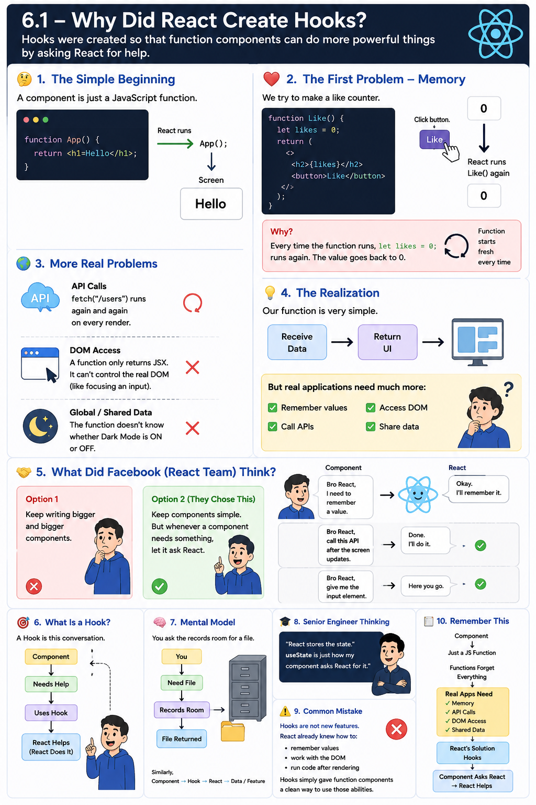

📖 Phase 6 – React Hooks Mastery


#### Chapter 1 – Hook Foundations

# >>

6.1 – Why Did React Create Hooks?
🤔 Let Me Ask You Something

Bro...

Do you remember when we learned this?

function App() {
    return <h1>Hello</h1>;
}

Question.

What is App?

React Component?

Yes.

But before becoming a React component...

What is it?

Just a JavaScript function.

Nothing more.

React Doesn't Do Magic

Many beginners think React has some magical engine.

Actually...

React simply does this.

App();

That's it.

The function runs.

Returns JSX.

React displays it.

Simple.

🌍 Let's Build Something Real

Suppose your manager says,

"Bro, make a Like button."

Initially,

❤️ Likes : 0

Easy.

You write

function Like() {

    let likes = 0;

    return (
        <>
            <h2>{likes}</h2>

            <button>Like</button>
        </>
    );

}

Looks perfect.

Right?

Manager Changes the Requirement

Now he says,

"Whenever I click Like, increase the number."

You think,

"No problem."

likes++

0

↓

1

Done.

Looks solved.

But Something Weird Happens

You click.

Nothing changes.

You click again.

Nothing changes.

Question.

Why?

Is React broken?

No.

Let's think.

What Does React Do After Something Changes?

We already learned this in Phase 5.

React doesn't update one line.

React simply runs the whole component again.

Like this.

Like()

↓

Creates UI

↓

Screen

Click button.

React says,

Okay...

Run Like() again.
Now Look Carefully

When React runs

Like();

again...

this line runs again.

let likes = 0;

So what happens?

1

↓

0

Again.

Your value disappeared.

🤔 Did React Delete It?

No.

React didn't touch it.

JavaScript created a brand new variable.

Imagine this normal function.

function test() {

    let x = 10;

}

Call it.

test();

Now call again.

test();

Does JavaScript remember the previous

x

No.

Because every function call starts fresh.

Exactly the same thing happens in React.

So We Found Our First Problem

Normal variables

↓

Cannot remember anything.

Manager Isn't Finished 😄

He comes again.

"Bro, when this page opens, call this API."

GET /users

You think,

"I'll simply write it."

function Users() {

    fetch("/users");

    return <h1>Users</h1>;

}

Question.

Looks okay?

Think Again

When does React call this function?

Only once?

No.

Many times.

Render

↓

fetch()

↓

Render

↓

fetch()

↓

Render

↓

fetch()

Now you're calling the same API again and again.

Definitely not what we wanted.

Another Requirement

Manager says,

"After opening the page, put the cursor inside the input."

Can a normal function do that?

No.

It only returns JSX.

It doesn't know anything about the real DOM.

Another Requirement

Manager says,

"The whole application has Dark Mode."

Can this function know whether Dark Mode is ON?

Again...

No.

Slowly A Pattern Appears

Our function is actually very simple.

It knows only one thing.

Receive data

↓

Return UI

But real applications need much more.

They need to

✅ remember values

✅ call APIs

✅ access the DOM

✅ share data

✅ improve performance

A normal JavaScript function can't do these things by itself.

🤔 So What Did Facebook Think?

Facebook had two options.

Option 1

Tell everyone,

"Keep writing bigger and bigger components."

Not good.

Option 2

Keep components simple.

But...

Whenever a component needs something,

let it ask React.

Facebook loved this idea.

Imagine React Is Your Friend

Your component says,

"Bro React...

I need to remember a value."

React says,

"Okay.

I'll remember it."

Later...

Component says,

"Bro React...

Call this API after the screen updates."

React says,

"Done."

Later...

Component says,

"Bro React...

Give me the input element."

React says,

"Here."

This conversation between

your component

and

React

is called...

Hooks
💡 Very Important

Most people think

useState

↓

State

I don't want you to think like that.

Think like this.

Component

↓

Needs Help

↓

Uses Hook

↓

React Helps

Every Hook is simply asking React to do something.

Different Hook.

Different request.

🧠 Mental Model

Imagine you're working in an office.

You need a file.

Do you keep every file on your desk?

No.

You ask the records room.

You

↓

Need File

↓

Records Room

↓

File Returned

Similarly,

Component

↓

Needs Something

↓

Hook

↓

React

↓

React Gives It

The component isn't doing everything.

React is helping.

👨‍💻 Senior Engineer Thinking

A beginner says,

"useState stores state."

A senior says,

"No. React stores the state. useState is just how my component asks React for it."

That one sentence shows deep understanding.

⚠️ Common Mistake

Many developers think Hooks are new features.

No.

React already knew how to:

remember values
work with the DOM
run code after rendering

Hooks simply gave function components a clean way to use those abilities.

🎯 Interview Questions
Why did React create Hooks?

Because normal function components were too limited for real applications. They couldn't remember values, control when code should run, access the DOM, or use many other React features. Hooks gave function components a simple way to ask React for those abilities.

What problem do Hooks solve?

They let simple JavaScript function components build real-world applications without needing class components.

📝 Revision Card
WHY HOOKS?

React Component

↓

Just a JavaScript Function

↓

Functions Forget Everything

↓

Real Apps Need

✓ Memory

✓ API Calls

✓ DOM Access

✓ Shared Data

↓

React's Solution

Hooks

↓

Component Asks React

↓

React Helps


# >>


6.2 – What Exactly Is a Hook?
🤔 Let Me Ask You Something

Imagine you're building a counter.

function Counter() {

    return (
        <h1>0</h1>
    );

}

Manager says,

"Bro, remember the count."

Question.

Can the function remember it?

No.

We learned that already.

Then Who Remembers?

Think carefully.

Someone has to remember the value.

Because after clicking,

0

↓

1

↓

2

↓

3

the value doesn't disappear.

So...

Who is remembering it?

Your component?

No.

JavaScript function?

No.

Then who?

Answer

React.

Not your component.

Not JavaScript.

React remembers it.

This is one of the biggest things to understand.

Imagine React Has a Notebook 📒

Think like this.

React has a notebook.

Inside that notebook,

it writes

Counter

↓

count = 5

Later,

your component runs again.

Instead of saying

count = 0

React opens the notebook and says,

"Bro, last time your count was 5."

Then your component continues.

But How Does My Component Ask React?

This is where Hooks come in.

Imagine your component says,

"React...

Can you give me my count?"

React says,

"Sure."

That request is

useState()
Don't Think Like This ❌

Most beginners think

useState

↓

Stores State

Wrong.

Think Like This ✅
Component

↓

useState()

↓

React

↓

Returns State

The Hook doesn't own the data.

React owns it.

The Hook only asks for it.

Another Example

Suppose you need the input box.

You don't know where it is.

Your component says,

"React, I need that input."

React replies,

"Here you go."

That request is

useRef()

Need to run an API after rendering?

Component says,

"React, run this after the screen updates."

React says,

"Done."

That request is

useEffect()

Need the application's theme?

Component says,

"React, what's the current theme?"

React replies,

"Here."

That request is

useContext()
Now See The Pattern

Every Hook is simply asking React for something.

Need Memory?

↓

useState()

-------------------

Need API After Render?

↓

useEffect()

-------------------

Need DOM?

↓

useRef()

-------------------

Need Shared Data?

↓

useContext()

Different problem.

Different Hook.

Real Life Example

Imagine you're working in an office.

Need your salary slip?

You ask HR.

Need a new laptop?

You ask IT.

Need leave approval?

You ask your manager.

You don't do everything yourself.

You ask the correct department.

React works exactly like this.

Need Memory?

↓

Ask React

-------------------

Need DOM?

↓

Ask React

-------------------

Need Shared Data?

↓

Ask React

Hooks are simply the request forms.

So What Is A Hook?

Now the definition becomes easy.

Instead of memorizing,

Hooks are special functions...

Understand it.

A Hook is simply a function that lets your component ask React to do something.

That's it.

Very simple.

Why Do All Hooks Start With "use"?

Have you noticed?

useState

useEffect

useRef

useContext

useMemo

useReducer

Everything starts with

use

Why?

Because React wants you to immediately know

"This function is asking React for something."

It's just a naming convention.

When you see

useSomething()

you should immediately think

"This is talking to React."

Senior Engineer Thinking

A beginner says,

"useEffect runs an API."

A senior says,

"useEffect tells React that after rendering is finished, this code should be executed."

See the difference?

The Hook isn't doing the work.

React is.

The Hook is only giving instructions.

Mental Model
Component

↓

Needs Something

↓

Calls Hook

↓

React Receives Request

↓

React Does The Work

↓

Returns Result

Remember this diagram.

It explains almost every Hook.

Common Mistake

Many developers think Hooks are magic.

They're not.

Hooks don't replace React.

Hooks don't replace JavaScript.

Hooks are simply the way your component communicates with React.

🎯 Interview Questions
What is a Hook?

A Hook is a special function that lets a functional component use React features like state, effects, refs, and context.

Does a Hook store data?

No.

React stores the data.

The Hook asks React for it.

Why do Hooks start with use?

Because they are React functions that are used to access React features. The use prefix also helps React and developers recognize them as Hooks.

📝 Revision Card
WHAT IS A HOOK?

Component

↓

Needs Something

↓

Calls Hook

↓

React Does The Work

↓

Returns Result

--------------------

Hooks Don't Store Data

React Stores Data

--------------------

Remember

Hook = Asking React


# >>


6.3 – Rules of Hooks
🤔 Let Me Ask You Something

Bro...

Suppose you write this.

function Counter() {

    const [count, setCount] = useState(0);

    return <h1>{count}</h1>;

}

Everything works.

Now you think,

"I'll call useState() only when I need it."

So you write this.

function Counter() {

    if (isLoggedIn) {

        const [count, setCount] = useState(0);

    }

    return <h1>Hello</h1>;

}

Question.

Looks correct?

Many beginners say,

"Yes."

But React says,

❌ No.

Why?

First Rule

Hooks must be called at the top level.

Not inside

if
for
while
switch
nested functions

Question is...

Why?

Don't memorize.

Let's understand.

Imagine React Is Taking Attendance

Suppose your component has three Hooks.

function App() {

    useState();

    useEffect();

    useRef();

}

Think of React like a teacher.

Every render it writes:

1️⃣ useState

2️⃣ useEffect

3️⃣ useRef

Very simple.

Next Render

React runs the component again.

Again it sees

1️⃣ useState

2️⃣ useEffect

3️⃣ useRef

Perfect.

Everything matches.

Now Let's Break It

Suppose you write

function App() {

    useState();

    if (isLoggedIn) {
        useEffect();
    }

    useRef();

}
First Render

Imagine

isLoggedIn = true;

React sees

1️⃣ useState

2️⃣ useEffect

3️⃣ useRef

Everything is fine.

Second Render

Now

isLoggedIn = false;

React runs again.

Now what does it see?

1️⃣ useState

2️⃣ useRef

Wait...

Last time,

Hook number 2 was

useEffect

Now Hook number 2 is

useRef

React becomes confused.

It thinks

"Bro...

Last time position 2 was useEffect.

Why is useRef here today?"

Everything after that becomes mixed up.

Imagine Numbered Boxes

Think like this.

React has boxes.

Box 1

↓

useState

---------------

Box 2

↓

useEffect

---------------

Box 3

↓

useRef

Next render React expects

the same order.

Always.

If you remove one Hook,

everything shifts.

Box 1

↓

useState

---------------

Box 2

↓

useRef ❌

---------------

Box 3

Nothing ❌

Now React is reading the wrong box.

That's Why Hook Order Matters

React doesn't identify Hooks by name.

It identifies them by the order in which they are called.

Remember this sentence.

It is extremely important.

Think About Attendance

Imagine your school teacher.

Monday

1 Rahul

2 Aman

3 Ravi

Tuesday

1 Rahul

2 Ravi

3 Aman

Teacher says,

"Wait...

Yesterday Ravi was number 3.

How did he become number 2?"

Exactly the same thing happens inside React.

So React Made A Rule

To avoid confusion,

React said

"Always call Hooks in the same order."

Simple.

Rule 1

✅ Top level only.

function App() {

    useState();

    useEffect();

}
Rule 2

❌ Never inside if

if (loggedIn) {

    useState();

}
Rule 3

❌ Never inside loops

for (...) {

    useState();

}

Because the number of iterations can change.

Rule 4

❌ Never inside nested functions

function helper() {

    useState();

}

React only tracks Hooks while rendering the component.

Not later.

Rule 5

Only call Hooks

Inside

React Components

or

Custom Hooks

Not inside normal JavaScript functions.

Why Can't We Use Hooks Anywhere?

Imagine this.

function calculateTax() {

    useState();

}

Question.

Is React rendering

calculateTax()

No.

It's just a normal function.

React isn't watching it.

So React has no idea

what Hook you're calling.

Mental Model

Think of React as counting.

Render Starts

↓

Hook 1

↓

Hook 2

↓

Hook 3

↓

Render Ends

Every render...

Same counting.

Same order.

No surprises.

Senior Engineer Thinking

A beginner memorizes:

"Don't use Hooks inside if."

A senior understands:

"React matches Hooks by call order. If the order changes, React can no longer match the correct Hook with the correct state."

That one sentence explains almost every Rule of Hooks.

Common Mistake

Many developers think

"React checks the Hook name."

No.

React cares about the order.

Not whether it's useState or useEffect.

The position matters.

🎯 Interview Questions
Why can't Hooks be inside an if statement?

Because the condition may change between renders, changing the order of Hook calls. React depends on the same Hook order every render.

Why can't Hooks be inside loops?

Because the loop may run a different number of times on different renders, changing the Hook order.

Why must Hooks be called at the top level?

To guarantee that React sees them in the same order every time the component renders.

📝 Revision Card
RULES OF HOOKS

✅ Top Level

✅ React Component

✅ Custom Hook

----------------------

❌ if

❌ for

❌ while

❌ switch

❌ nested function

----------------------

Remember

React tracks Hooks

by

CALL ORDER

NOT

Hook Name

# >>>


6.4 – How Hooks Work (Easy Version)

Goal: Understand how React remembers Hook values without learning Fiber yet.

🤔 Let Me Ask You Something

We already learned two things.

Fact 1

A component is just a JavaScript function.

function Counter() {

}

Fact 2

React calls this function every render.

Counter()

↓

UI

↓

Counter()

↓

UI

↓

Counter()

↓

UI

Question...

If the function starts from the beginning every time...

How does React remember this?

Count

0

↓

1

↓

2

↓

3

Where is React storing it?

Think Like This

Imagine you have a notebook.

Every page belongs to one component.

Example:

Notebook

------------------

Counter

------------------

Todo

------------------

Profile

Every component gets its own page.

Now Let's Open Counter's Page

Initially,

Counter

Count = 0

React saves it.

Now the user clicks

+

React changes the notebook.

Counter

Count = 1

Notice something.

Did React change your function?

No.

It changed its notebook.

Now React Renders Again

React calls

Counter();

again.

The function starts from the beginning.

But before returning,

React looks inside its notebook.

Counter

↓

Count = 1

Then React gives your component the value.

That's why the screen shows

1

instead of

0
Wait...

Then Why Do We Write This?

const [count, setCount] = useState(0);

Question.

If React already has

Count = 5

Why are we writing

useState(0)

every render?

Shouldn't it become

0

again?

Good question.

First Render

The notebook is empty.

React sees

useState(0)

React says,

"I don't have anything saved."

So it writes

Count = 0

inside the notebook.

Second Render

Again React sees

useState(0)

But this time,

the notebook already has

Count = 4

React says,

"I already know your value."

So it ignores

0

and returns

4

This is why the initial value is used only once.

We'll study this in detail later.

For now,

just understand the idea.

Another Question

Suppose we have two states.

const [name] = useState("Amarnath");

const [age] = useState(33);

How does React know

which value belongs to which Hook?

Think Back To Previous Lesson

Remember we learned

React depends on

Hook Order

Now it becomes useful.

React simply says

Hook 1

↓

Name

------------------

Hook 2

↓

Age

Next render,

it expects exactly the same order.

Hook 1

↓

Name

------------------

Hook 2

↓

Age

Everything matches.

What If We Change The Order?

Suppose today we write

useState("Amarnath");

useState(33);

Tomorrow

useState(33);

useState("Amarnath");

Now React thinks

Hook 1

↓

Age ❌

------------------

Hook 2

↓

Name ❌

Everything becomes mixed up.

This is why

the Rules of Hooks exist.

Now they make sense.

Everything Connects

Let's connect all four lessons.

Lesson 6.1

Why Hooks?

↓

Functions were too limited.

Lesson 6.2

What is a Hook?

↓

A way to ask React for something.

Lesson 6.3

Rules of Hooks

↓

Keep the Hook order the same.

Today's Lesson

How Hooks Work

↓

React remembers values

based on

Hook order.

Notice how each lesson builds on the previous one.

Real Life Example

Imagine a hotel.

Each room has a number.

101

↓

Amarnath

----------------

102

↓

Rahul

----------------

103

↓

Aman

Tomorrow,

the hotel manager checks

Room

101

He immediately knows

who belongs there.

React works similarly.

Hook 1

↓

Count

----------------

Hook 2

↓

Name

----------------

Hook 3

↓

Theme

As long as the order doesn't change,

everything works.

Mental Model

Think of React like this.

Component Starts

↓

Hook 1

↓

React Looks In Notebook

↓

Returns Value

↓

Hook 2

↓

React Looks Again

↓

Returns Value

↓

Hook 3

↓

Returns Value

↓

Render Finished

React repeats this every render.

Senior Engineer Thinking

A beginner says,

"useState remembers values."

A senior says,

"React remembers the values. During rendering, each Hook call is matched with the previously stored value based on its call order."

That's the real understanding.

Common Mistake

Many developers think

useState(0)

creates

0

on every render.

It doesn't.

The initial value is only used the first time.

After that,

React returns the saved value.

We'll prove this when we study useState.

🎯 Interview Questions
How does React remember Hook values?

React stores the values outside the component. During every render, it matches each Hook call with the previously stored value based on the order in which the Hooks are called.

Why is the initial value in useState(0) used only once?

Because after the first render, React already has a stored value. It ignores the initial value and returns the saved one instead.

Why is Hook order important?

Because React matches Hook calls by their order. If the order changes, React can no longer match the correct stored value to the correct Hook.

📝 Revision Card
HOW HOOKS WORK

Component Renders

↓

Calls Hook

↓

React Checks Notebook

↓

Value Exists?

↓

YES

↓

Return Saved Value

↓

NO

↓

Use Initial Value

↓

Save It

------------------------

Remember

React Remembers

Component Doesn't

[text](<Phase 6.md>)    


#### Chapter 2 – useState

6.5 – Why useState?
🤔 Let Me Ask You Something

Bro...

Remember this example?

function Counter() {

    let count = 0;

    return (
        <>
            <h1>{count}</h1>

            <button>+</button>
        </>
    );

}

Looks correct.

Right?

Now Manager Says

"When I click the button..."

0

↓

1

↓

2

↓

3

Question.

Can this variable do it?

let count = 0;

No.

We already know why.

But Let's Think Deeper

Question.

Why doesn't React simply watch this variable?

Like this.

let count = 0;

Whenever it changes,

React updates the screen.

Sounds simple.

Right?

Why didn't Facebook build React like that?

Good question.

Let's find out.

🌍 Imagine You're Building Instagram

Suppose Instagram has

Home

↓

Profile

↓

Messages

↓

Notifications

↓

Settings

Thousands of components.

Every component has

Variables

↓

Functions

↓

Objects

↓

Arrays

Question.

Should React watch

every variable

inside

every component?

Imagine millions of variables.

That would be extremely expensive.

Another Problem

Look at this.

let name = "Amarnath";

let age = 33;

let city = "Sambalpur";

Question.

Which variable should cause the UI to update?

name ?

age ?

city ?


Maybe

age

changed.

But maybe

city

isn't even shown on the screen.

Why should React re-render?

It shouldn't.

React Needed One Thing

React wanted developers to explicitly say,

"This value is important."

Not every variable.

Only the ones that affect the UI.

Think Like This

Normal variable

let count = 0;

React says,

"I don't care."

State variable

const [count, setCount] = useState(0);

React says,

"Okay.

I'll remember this one.

If it changes,

I'll update the screen."

That's the difference.

💡 Biggest Misunderstanding

Many people think

useState

↓

Stores Value

Not exactly.

Its real job is much bigger.

It tells React

"This value is part of my UI. Please remember it, and if it changes, render my component again."

That is what makes useState special.

Two Jobs Of useState

Think of useState as doing two things.

Job 1

Remember the value.

0

↓

1

↓

2

↓

3

React keeps it safe.

Job 2

When the value changes,

tell React

"Bro...

Run my component again."

Without this,

the screen would never update.

Let's Compare
Normal Variable
let count = 0;

React:

"I don't know this variable.

I won't watch it.

I won't remember it.

I won't update the screen."
useState
const [count, setCount] = useState(0);

React:

"I'll remember it.

If it changes,

I'll render the component again."

Huge difference.

Real Life Example

Imagine a classroom.

There are hundreds of students.

Teacher says,

"If anyone has a question,

raise your hand."

Now the teacher knows

who needs attention.

React works similarly.

Normal variables are like students sitting quietly.

React doesn't keep checking everyone.

State variables are like students raising their hands.

They tell React,

"I'm important.

Watch me."

Why Not Make Every Variable State?

Good question.

Suppose you have this.

const [pi] = useState(3.14);

Will

3.14

ever change?

No.

Then why should React track it?

Waste of memory.

Waste of work.

So remember.

Use state only for values that can change and affect the UI.

Mental Model
Normal Variable

↓

React Ignores It

--------------------

State Variable

↓

React Remembers It

↓

Changes?

↓

Re-render

Very simple.

Senior Engineer Thinking

A beginner says,

"useState stores state."

A senior says,

"useState tells React which values should persist between renders and which changes should trigger a new render."

That is a much deeper understanding.

Common Mistakes

❌ Using normal variables for changing UI.

let count = 0;

❌ Making every variable state.

const [pi] = useState(3.14);

If a value never changes, it usually doesn't belong in state.

🎯 Interview Questions
Why do we need useState?

Because normal JavaScript variables are recreated every render, and React doesn't track them. useState lets React remember a value between renders and re-render the component when that value changes.

Can we build a React app without useState?

Yes, but only if the UI never changes. As soon as the UI needs to respond to user actions or changing data, you need a way for React to remember values and update the screen. That's exactly what useState provides.

When should we use useState?

Use it for values that:

Can change over time.
Affect what the user sees on the screen.
📝 Revision Card
WHY useState?

Normal Variable

↓

React Ignores It

↓

No Memory

↓

No Re-render

----------------------

useState

↓

React Remembers It

↓

Value Changes

↓

React Re-renders

----------------------

Remember

useState has 2 jobs

✓ Remember the value

✓ Trigger a re-render


# >>>


6.6 – Creating State
🤔 Let Me Ask You Something

Bro...

We now know why useState exists.

Question.

How do we create a state?

Most tutorials immediately write this.

const [count, setCount] = useState(0);

And then they move on.

No.

Let's understand every single part.

Look At This Line
const [count, setCount] = useState(0);

Looks scary?

Actually...

It has only 3 parts.

useState(0)

↓

[count, setCount]

↓

const

Let's understand them one by one.

Part 1
What Is
useState(0)

Remember what we learned?

A Hook is simply asking React for something.

Here we're asking,

"React...

Please create a state for me."

The

0

is the initial value.

Think of it like saying,

"React...

Let's start with 0."

🌍 Real Life Example

Imagine you're opening a bank account.

The bank asks,

"How much money do you want to start with?"

You say,

₹0

Tomorrow,

you may have

₹500

₹1000

₹2000

But on the first day,

the balance starts at

₹0

Exactly the same idea.

useState(0)

means

"React, start this state with 0."

Question

Will React always use

0

?

No.

Remember our previous lesson.

First render

Notebook Empty

↓

Save 0

Second render

Notebook Already Has

↓

5

↓

Return 5

The initial value is used only once.

Part 2

Now look here.

[count, setCount]

Question.

Why two values?

Because React gives you two things.

First Thing
count

Current value.

Example

0

↓

1

↓

2

↓

3

Whatever React remembers,

it gives you here.

Second Thing
setCount

Question.

What is this?

A variable?

No.

It is a function.

React creates this function for you.

You never write it.

React does.

Think Like This

You ask React,

"Can I have a state?"

React replies,

"Sure."

And gives you

Current Value

+

Update Function

That's all.

Real Life Example

Imagine your TV remote.

It has

Current Volume

↓

15

And also

Volume +

Volume -

One tells you

the current value.

The other changes it.

Exactly like

count

and

setCount
Why Doesn't React Give Only The Value?

Imagine React gave only

count

Then how would you change it?

You can't.

What if React gave only

setCount

Then how would you read it?

You can't.

So React gives both.

Current Value

+

Way To Update It

Simple.

Part 3

Now the last part.

const

Question.

Why

const

?

Why not

let

?

Think carefully.

Do we ever write

count = 10;

No.

React changes the value.

Not us.

Our job is only to call

setCount()

React updates the state.

Then React gives us the new value.

So

count

should never be reassigned.

That's why

const

is perfect.

One Big Question

Why is this an array?

const [count, setCount] = useState(0);

Why not

const state = useState(0);

or

const {count, setCount}

?

Good question.

We'll answer that in a minute.

First understand JavaScript.

JavaScript Has Array Destructuring

Suppose

a function returns

return [10, 20];

You can write

const [a, b] = getNumbers();

Now

a = 10

b = 20

Easy.

React uses the same JavaScript feature.

Imagine useState Returns
[
   currentValue,
   updateFunction
]

React returns something like

[
   0,
   function
]

We simply unpack it.

const [count, setCount] = useState(0);

Nothing magical.

Just JavaScript.

Mental Model
You

↓

useState(0)

↓

React

↓

Returns

↓

Current Value

+

Update Function

↓

You Store Them

↓

[count, setCount]
Senior Engineer Thinking

A beginner thinks

const [count, setCount]

is React syntax.

A senior knows

it's actually JavaScript array destructuring.

React is only returning an array.

JavaScript is doing the unpacking.

This is an important distinction.

Common Mistakes

❌ Trying to update state directly.

count = 10;

Never do this.

❌ Forgetting that

setCount

is a function.

Correct

setCount(10);

Wrong

setCount = 10;
🎯 Interview Questions
What does useState() return?

It returns an array with two values:

The current state value.
A function to update that state.
Why do we use array destructuring?

Because useState() returns an array. JavaScript array destructuring lets us easily assign the first item to count and the second item to setCount.

Why do we use const instead of let?

Because we never directly change the state variable. React updates it and gives us the latest value after every render.

📝 Revision Card
CREATING STATE

useState(0)

↓

React Creates State

↓

Returns

[Current Value,
 Update Function]

↓

JavaScript

Array Destructuring

↓

const [count, setCount]

----------------------

Remember

count

↓

Read

setCount

↓

Update


why const ?

🤔 Let's Think

We write

const [count, setCount] = useState(0);

Question.

Why not

let [count, setCount] = useState(0);

After all...

React runs the component again.

It creates new variables every render.

So why do we care whether it's const or let?

First, You're Correct

Every render React does something like this.

First Render
const count = 0;
Second Render
const count = 1;
Third Render
const count = 2;

Notice something.

These are not the same variable.

React isn't changing

count

Instead, every render JavaScript creates a brand-new variable.

So you might think...

"Then let should also work."

And technically... it does.

Example

This works perfectly.

let [count, setCount] = useState(0);

React doesn't break.

Nothing crashes.

You'll still get

0

↓

1

↓

2

So...

React is not forcing you to use const.

Then Why Does Everyone Use const?

Because of JavaScript, not React.

Ask yourself...

Do you ever write this?

count = 100;

No.

Do you ever write this?

count++;

No.

Do you ever write

count = count + 1;

No.

Because React has already told us:

Never change state directly.

Instead, we do this.

setCount(100);
So Think About It

If a variable should never be reassigned...

Which keyword describes that best?

const

Exactly.

Think About It Like This

Imagine your office gives you

your Employee ID.

Employee ID

↓

12345

Can you change it?

No.

It's read-only.

You can read it.

You can't modify it.

State variables are exactly the same.

count

You can read it.

You cannot change it directly.

Only React changes it.

So Why Allow let At All?

Because JavaScript doesn't know React's rules.

JavaScript simply says

"If you want a variable that can change...

use let."

React says

"Please don't change this variable yourself."

So developers naturally use

const

to make that intention clear.

The Real Reason

It has nothing to do with re-renders.

It has nothing to do with Hooks.

It has nothing to do with React creating new variables.

It's simply expressing your intent.

I will read this value.

I will NOT assign a new value to it.

That's exactly what const means.

Could You Use let?

Yes.

let [count, setCount] = useState(0);

React will work.

But imagine another developer reads your code.

They'll think,

"Maybe this variable is going to be reassigned."

But it never is.

So let communicates the wrong intention.

Senior Engineer Thinking

A beginner says,

"React requires const."

A senior says,

"React doesn't require const. We use const because the state variable should never be reassigned by our code. React updates the state and gives us a new value on the next render."

That is the correct explanation.


🤔 Let Me Ask You Something

Suppose JavaScript has this function.

function add(a, b) {
    return a + b;
}

You call it.

add(2, 3);

JavaScript creates

a = 2
b = 3

Function finishes.

Variables disappear.

Call it again.

add(10, 20);

Question.

Should JavaScript reuse

a = 2
b = 3

No.

It creates

a = 10
b = 20

Again.

Why?

Because every function call is independent.

Every function call gets its own local variables.

That's how JavaScript works.

Now Replace
add()

with

Counter()

React simply calls

Counter();

again.

Since

Counter()

is just a JavaScript function,

JavaScript creates fresh variables again.

React didn't invent this.

It's normal JavaScript behavior.

So React Isn't Creating New Variables?

Exactly.

This is a common misunderstanding.

Many people say

"React creates new variables."

More accurately,

JavaScript creates new local variables because React called the function again.

React only says:

Counter()

↓

Run again.

JavaScript does the rest.

But Why Does React Call The Whole Function Again?

Excellent.

Now we're asking the real question.

Suppose your UI is

<h1>{count}</h1>

Initially

count = 0

Screen

0

Later

count = 5

Question.

How will React know

every place where

count

was used?

Maybe here

<h1>{count}</h1>

Maybe here

<p>{count}</p>

Maybe here

<button>{count}</button>

Should React search the entire component?

That would be difficult.

React Chose A Simpler Idea

Instead of saying

"Let's update only one line."

React says

"Forget the old UI. Let's run the component again and build the UI from scratch."

Like this.

Old UI

↓

Run Component Again

↓

New UI

↓

Compare Old vs New

↓

Update Only The Difference

This is React's philosophy.

# >>>

6.7 – Reading State
🤔 Let Me Ask You Something

Bro...

Suppose we write

const [count, setCount] = useState(0);

Question.

Where do we actually read the value?

Is it here?

useState(0)

No.

This only creates the state.

Think Carefully

React returns

[
   currentValue,
   updateFunction
]

We store them.

const [count, setCount] = useState(0);

Now

count

is just a normal JavaScript variable.

Nothing magical.

🌍 Real Example

Suppose

const [name] = useState("Amarnath");

Question.

How do we display it?

Very easy.

<h1>{name}</h1>

React simply reads

name

like any other JavaScript variable.

Reading State Is Surprisingly Simple

Many beginners think

useState()

is used for reading.

Actually...

useState()

is only used once.

After that,

you simply use

count

everywhere.

Example
function Counter() {

    const [count, setCount] = useState(0);

    return (

        <>
            <h1>{count}</h1>

            <p>Current Count : {count}</p>

            <button>{count}</button>

        </>

    );

}

Question.

How many states exist?

Only one.

But we're reading it

three times.

Perfectly fine.

Another Example

Suppose

const [price] = useState(100);

Can we use it here?

<h1>{price}</h1>

Yes.

Here?

<p>{price * 2}</p>

Yes.

Here?

price > 50

Yes.

React doesn't care.

Once it gives you

price

it's just a JavaScript variable.

Use it anywhere in that render.

React Doesn't Lock It

React doesn't say

"You can only use state inside JSX."

No.

You can read it anywhere.

function Counter() {

    const [count] = useState(5);

    console.log(count);

    const double = count * 2;

    if (count > 3) {

        console.log("High");

    }

    return <h1>{double}</h1>;

}

Everything is valid.

Then Why Can't We Change It?

Good question.

Reading

count

is allowed.

Changing

count = 10;

is not.

Why?

Because

count

belongs to this render only.

If you change it,

React doesn't know.

The UI won't update.

Instead,

tell React.

setCount(10);

React says,

"Okay.

I'll create another render."

Reading Is Like Reading A Book

Imagine React gives you a book.

You can

✅ Read Page 1

✅ Read Page 10

✅ Read Page 100

No problem.

But if you want to change the book,

you can't use a pen.

You must ask React.

That's exactly what

setCount()

does.

Reading Multiple Times

Question.

Is this okay?

<h1>{count}</h1>

<p>{count}</p>

<button>{count}</button>

Absolutely.

React isn't recalculating state.

It's simply using the same value.

Think of it like this.

Current Render

↓

count = 5

↓

Everywhere

↓

5

5

5

One snapshot.

One value.

Many reads.

Mental Model
React

↓

Gives You

count = 5

↓

You Can Read It

Anywhere

↓

JSX

↓

Functions

↓

Conditions

↓

Calculations

Reading is free.

Updating requires

setCount()
Senior Engineer Thinking

A beginner says,

"I get the state from useState."

A senior says,

"useState gives me the current snapshot of state for this render. From that point on, count behaves like a normal JavaScript variable."

That is the important idea.

Common Mistakes
❌ Changing state directly
count = 20;

Wrong.

❌ Thinking every
count

is a different value.

Wrong.

During one render,

every

count

refers to the same snapshot.

🎯 Interview Questions
How do we read state?

Simply use the state variable returned by useState.

const [count] = useState(0);

console.log(count);
Can we read the same state multiple times?

Yes.

The same state value can be used anywhere within the component during that render.

Is the state variable special?

Not after useState returns it.

It behaves like a normal JavaScript variable, but it represents the current render's snapshot of state.

📝 Revision Card
READING STATE

useState()

↓

Returns

↓

count

↓

Read Anywhere

✔ JSX

✔ console.log()

✔ Conditions

✔ Calculations

----------------------

Remember

Reading

↓

Normal JavaScript

Updating

↓

setCount()

# >>>>>>

6.8 – Updating State
🤔 Let Me Ask You Something

Bro...

Suppose you have

const [count, setCount] = useState(0);

Question.

How do we change

0

↓

1

?

Easy.

setCount(1);

Question.

What do you think happens next?

Most beginners answer

"React changes count to 1."

Actually...

No.

Let's Slow Down

Suppose this is your component.

function Counter() {

    const [count, setCount] = useState(0);

    console.log(count);

    return (

        <button
            onClick={() => {

                setCount(1);

            }}
        >

            Click

        </button>

    );

}

Question.

When

setCount(1);

runs...

Does React immediately do

count = 1;

?

No.

Never.

Then What Does setCount() Actually Do?

Think of it like this.

setCount(1)

↓

Message

↓

React

You're not changing state.

You're sending a request.

Like saying

"React...

Next time you render,

please use

1

instead of

0

."

Think Of A Restaurant

Imagine you're in a restaurant.

You tell the waiter

Pizza

Question.

Do you immediately get pizza?

No.

First

Order

↓

Kitchen

↓

Cooking

↓

Serve

Exactly the same.

setCount(1)

↓

React Receives Request

↓

Schedules Render

↓

New Render Starts

↓

count = 1
Let's See The Timeline

Initial render

count = 0

Screen

0

Click button

setCount(1);

React says

Okay.

I'll remember that.

Still

Current Render

count = 0

Nothing changed yet.

React starts another render.

Now

count = 1

Screen updates.

The Biggest Misunderstanding

Many developers think

setCount(1);

means

count = 1;

No.

Think of it as

Please

Update

On

Next

Render

That's much closer to reality.

Let's Prove It

Look carefully.

const [count, setCount] = useState(0);

console.log(count);

setCount(1);

console.log(count);

Question.

Output?

Many beginners answer

0

1

Wrong.

Actual output

0

0

Why?

Because

Current Render

↓

count = 0

This render never changes.

React schedules

another render.

Second Render

Now React runs

Counter();

again.

This time

count = 1

Console

1

Exactly.

Why Doesn't React Update Immediately?

Excellent question.

Imagine this.

setCount(1);

setCount(2);

setCount(3);

Suppose React rendered immediately.

It would do

Render

↓

Render

↓

Render

Three renders.

Waste of work.

Instead React says

Collect Requests

↓

One Render

↓

Much Faster

We'll learn this properly in Batching.

Real Life Example

Suppose you submit an online form.

You click

Submit

Question.

Does the database update instantly?

No.

Request

↓

Server

↓

Processing

↓

Response

React works similarly.

setCount()

↓

Request

↓

React

↓

Render

↓

Updated Screen
Mental Model

Never think

setCount()

↓

Changes Variable

Think

setCount()

↓

Requests Update

↓

React Starts New Render

↓

New Variable Created

Huge difference.

Senior Engineer Thinking

A beginner says

"setCount changes state."

A senior says

"setCount schedules a state update. React applies that update during the next render."

That's the correct explanation.

Common Mistakes
❌ Expecting immediate updates
setCount(5);

console.log(count);

Expecting

5

Wrong.

Still

0

during that render.

❌ Thinking setCount changes the current variable

It doesn't.

It schedules another render.

The new render gets

count = 5
🎯 Interview Questions
Does setState update immediately?

No.

It schedules an update.

React applies it during the next render.

Why doesn't count change immediately?

Because each render has its own snapshot of state. Calling setCount() doesn't modify the current snapshot. It tells React to create a new render with the updated state.

What does setCount() actually do?

It sends a request to React to update the state and schedule a new render.

📝 Revision Card
UPDATING STATE

Current Render

count = 0

↓

setCount(5)

↓

React Receives Request

↓

Schedules New Render

↓

New Render

count = 5

----------------------

Remember

setCount()

≠

count = 5

----------------------

setCount()

↓

Request

↓

Next Render


# >>>>>

6.9 – Functional Updates
🤔 Before Learning Functional Updates

We already know this.

const [count, setCount] = useState(0);

We also know

setCount(1);

asks React to update the state.

Everything looks easy.

But now comes a question that confuses almost every React developer.

First Question

Suppose your current state is

count = 0

Now you write

setCount(count + 1);

setCount(count + 1);

setCount(count + 1);

Question.

After clicking the button...

What should the output be?

Most beginners answer

0

↓

1

↓

2

↓

3

Seems correct.

Right?

But React Doesn't Agree 😄

The actual output is

0

↓

1

Not

3

Question.

Did React ignore two updates?

No.

Let's see what actually happened.

Step 1 — Current Render

Current render starts.

count = 0

Remember what we learned earlier.

Every render has its own snapshot.

So during this render,

count

↓

0

will never change.

Step 2 — First setCount()

React sees

setCount(count + 1);

JavaScript immediately calculates

count + 1

↓

0 + 1

↓

1

So React actually receives

setCount(1);
Step 3 — Second setCount()

Question.

Has React rendered again?

No.

So

count

↓

Still 0

Again JavaScript calculates

0 + 1

↓

1

React receives

setCount(1);
Step 4 — Third setCount()

Exactly the same.

setCount(count + 1);

becomes

setCount(1);
What React Actually Receives

Many beginners imagine React receives

1

↓

2

↓

3

Actually React receives

setCount(1)

setCount(1)

setCount(1)

Three requests.

All asking for exactly the same thing.

Wait...

Does React Immediately Update The State?

No.

This is very important.

React never updates state immediately.

Instead,

it puts every update into something called the State Update Queue.

Think of it like a waiting line.

setCount()

↓

Queue

↓

React Processes Queue

↓

New State

↓

Re-render
Real Life Example

Imagine a bank.

Customers don't go directly to the manager.

They first stand in a queue.

Customer

↓

Queue

↓

Manager

↓

Processed

React behaves exactly the same.

What Does The Queue Look Like?

Current state

0

Queue

1

↓

1

↓

1

Nothing happens immediately.

React waits until your event finishes.

Now React Processes The Queue

Current state

0

First update

Set to 1

↓

Current State = 1

Second update

Set to 1

↓

Current State = 1

Third update

Set to 1

↓

Current State = 1

Final answer

1

Now React performs

ONE

re-render.

Why Doesn't React Render Three Times?

Imagine React rendered after every update.

setCount()

↓

Render

↓

setCount()

↓

Render

↓

setCount()

↓

Render

Very slow.

Instead React says

Collect All Updates

↓

Process Together

↓

One Render

Much faster.

So What's The Problem?

The problem isn't React.

The problem is

count

Every calculation used

count = 0

because the current render never changed.

React's Solution

Instead of passing

the final value,

React lets us pass

a function.

Instead of

setCount(count + 1);

we write

setCount(prev => prev + 1);

This is called a Functional Update.

What Is prev?

Many beginners think

prev

=

count

Not exactly.

prev means

The latest state available while React is processing the queue.

That's a huge difference.

What Does React Store Now?

Instead of storing values,

React stores functions.

Queue

prev => prev + 1

↓

prev => prev + 1

↓

prev => prev + 1

Notice.

React has not executed them yet.

React Starts Processing

Current state

0
First Function

React calls

prev = 0

Function returns

1

Current working state becomes

1
Second Function

React doesn't go back to

0

It uses

the latest value.

prev = 1

Function returns

2

Working state becomes

2
Third Function

Again

prev = 2

Function returns

3

Working state becomes

3

Final state

3

Now React performs

one re-render.

Screen shows

3
Compare Both Approaches
❌ Normal Update
setCount(count + 1);

setCount(count + 1);

setCount(count + 1);

Queue

1

↓

1

↓

1

Final state

1
✅ Functional Update
setCount(prev => prev + 1);

setCount(prev => prev + 1);

setCount(prev => prev + 1);

Queue

Function

↓

Function

↓

Function

React processes

0

↓

1

↓

2

↓

3

Final state

3
When Should We Use Functional Updates?

Whenever the next state depends on the previous state.

Examples

setCount(prev => prev + 1);

setLikes(prev => prev + 1);

setScore(prev => prev + 100);
When Is A Normal Update Fine?

If the new value does not depend on the previous value.

Examples

setDarkMode(true);

setLoading(false);

setName("Amarnath");

These don't need functional updates.

Mental Model

Think like this.

Normal update says

Set state to 1

Functional update says

Take the latest state

↓

Calculate the next state

↓

Return it

That's why it always works correctly.

Senior Engineer Thinking

A beginner says

"Functional updates increase the value correctly."

A senior says

"Functional updates queue functions instead of values. While React processes the queue, each function receives the latest computed state, making multiple dependent updates predictable."

That's the real explanation.

Common Mistakes

❌ Using

setCount(count + 1);

multiple times when the next state depends on the previous state.

❌ Thinking

prev

=

Old State

No.

It is the latest computed state while React processes the update queue.

🎯 Interview Questions
What is a Functional Update?

A Functional Update passes a function to setState. React calls that function with the latest available state and uses its return value as the next state.

Why do we need Functional Updates?

Because multiple updates may be queued before React re-renders. Functional updates ensure every update uses the latest computed state.

When should we use Functional Updates?

Whenever the next state depends on the previous state.

Why does this print 1 instead of 3?
setCount(count + 1);

setCount(count + 1);

setCount(count + 1);

Because all three updates use the same state snapshot (count = 0), so React receives three requests to set the state to 1.

📝 Revision Card
FUNCTIONAL UPDATES

Current State

0

======================

❌ Normal Update

setCount(count + 1)

↓

Queue

1

1

1

↓

Final State

1

======================

✅ Functional Update

setCount(prev => prev + 1)

↓

Queue

Function

Function

Function

↓

React Processes

0

↓

1

↓

2

↓

3

↓

Final State

3

======================

Remember

Normal Update

↓

Pass Value

Functional Update

↓

Pass Function

↓

Uses Latest State


# >>>>>>


6.10 – Lazy Initialization
🤔 Let Me Ask You Something

Bro...

Look at this.

const [count, setCount] = useState(0);

Easy.

Now suppose instead of

0

you write

const [user, setUser] = useState(getUserFromDatabase());

Question.

When does

getUserFromDatabase()

run?

Only the first render?

Or every render?

Think before reading.

Most Beginners Think

They think

First Render

↓

Runs getUserFromDatabase()

↓

Done Forever

Sounds reasonable.

But that's not what happens.

Let's See
function App() {

    const [user, setUser] = useState(getUser());

    console.log("Render");

    return <h1>{user}</h1>;

}

Imagine

getUser()

contains

console.log("Getting User...");
First Render

React executes

useState(getUser());

JavaScript first executes

getUser()

Output

Getting User...

Render

Everything is fine.

Second Render

Question.

React already has the state.

Will it still execute

getUser()

?

Yes.

Output

Getting User...

Render

Again.

Wait...

Didn't We Learn That React Uses The Initial Value Only Once?

Yes.

And that's still true.

Here's the important difference.

JavaScript Runs First

Look carefully.

useState(getUser());

JavaScript cannot call

useState()

until it first knows

what

getUser()

returns.

So JavaScript executes

getUser()

every render.

Imagine it returns

"Amarnath"

Now JavaScript changes the code to

useState("Amarnath");

Only now does React run

useState()

React sees

"I already have state."

So React ignores

"Amarnath"

But...

the function

getUser()

already ran.

Timeline
First Render
JavaScript

↓

getUser()

↓

"Amarnath"

↓

React

↓

useState("Amarnath")

↓

Store State
Second Render
JavaScript

↓

getUser()

↓

"Amarnath"

↓

React

↓

I already have state.

↓

Ignore Initial Value

Notice something.

React ignored the value.

But JavaScript still spent time calculating it.

Why Is This A Problem?

Imagine

getUser()

takes

2 seconds

Every render

JavaScript waits

2 seconds

even though React throws away the result.

Waste of work.

React's Solution

Instead of passing

the value,

pass a function.

const [user, setUser] = useState(() => getUser());

Notice the difference.

Before

useState(getUser());

Now

useState(() => getUser());
What's Happening?

React receives

a function.

Not the final value.

React says

"I'll call this function only when I need the initial state."

That means

only during the first render.

Timeline
First Render
React

↓

Calls Function

↓

getUser()

↓

Stores Result
Second Render
React

↓

Already Has State

↓

Doesn't Call Function

No unnecessary work.

Real Life Example

Imagine your office asks you to submit your Aadhaar card.

The first time you join,

they need it.

After that,

every morning they don't ask

for your Aadhaar card again.

They already have it.

Lazy Initialization works the same way.

The expensive work happens once.

When Should We Use Lazy Initialization?

Use it when calculating the initial value is expensive.

Examples:

const [items] = useState(() => calculateLargeList());

const [user] = useState(() => readFromLocalStorage());

const [config] = useState(() => loadSettings());
When Is It NOT Needed?

For simple values.

const [count] = useState(0);

const [name] = useState("Amarnath");

const [isOpen] = useState(false);

These are already fast.

Using Lazy Initialization here gives no benefit.

Mental Model
❌ Normal

Every Render

↓

JavaScript Calculates

↓

React Ignores Most Results

=======================

✅ Lazy Initialization

First Render

↓

React Calls Function

↓

Stores Result

↓

Future Renders

↓

No More Calculation
Senior Engineer Thinking

A beginner says

"Lazy Initialization makes useState faster."

A senior says

"Lazy Initialization prevents expensive initial state calculations from running on every render. React calls the initializer function only during the first render."

That's the real purpose.

Common Mistakes

❌ Doing expensive work directly.

useState(loadHugeData());

✅ Pass a function instead.

useState(() => loadHugeData());

❌ Using Lazy Initialization everywhere.

useState(() => 0);

No benefit.

🎯 Interview Questions
What is Lazy Initialization?

Lazy Initialization means passing a function to useState so React calculates the initial state only once, during the first render.

Why do we use Lazy Initialization?

To avoid running expensive calculations on every render.

Which is better?
useState(loadData());

or

useState(() => loadData());

If loadData() is expensive, the second approach is better because React only calls it during the initial render.

📝 Revision Card
LAZY INITIALIZATION

❌ Normal

useState(loadData())

↓

Every Render

↓

loadData()

↓

React Ignores Most Results

=========================

✅ Lazy

useState(() => loadData())

↓

First Render

↓

loadData()

↓

State Stored

↓

Future Renders

↓

No More Calls

=========================

Remember

Use Lazy Initialization

Only For Expensive Initial Values


You're asking:

"Who executes the initializer function? JavaScript or React?"

Let's answer it step by step.

First, Remember This

A React component is just a JavaScript function.

function App() {

    const [user] = useState(() => getUser());

    return <h1>{user}</h1>;

}

Question.

Who executes

App();

?

Answer:

✅ React.

React simply does something like

App();

Now JavaScript starts executing the function body.

Step 1

JavaScript enters

function App() {

    ...

}

Execution starts from the first line.

const [user] = useState(() => getUser());

Question.

Does JavaScript execute

getUser()

here?

No.

Notice carefully.

We passed

() => getUser()

not

getUser()

Those are completely different.

Case 1 (Without Lazy Initialization)
useState(getUser())

JavaScript sees

getUser()

Question.

What should JavaScript do?

It must execute it first.

Because JavaScript needs the return value.

Example

getUser()

↓

returns

↓

"Amarnath"

Now JavaScript changes it into

useState("Amarnath")

Only now can

useState()

be called.

So YES,

your understanding here is correct.

Flow is

JavaScript

↓

getUser()

↓

returns value

↓

useState(value)

↓

React handles state
Case 2 (Lazy Initialization)

Now look carefully.

useState(() => getUser())

Question.

Does JavaScript execute

getUser()

?

No.

Why?

Because JavaScript is not asked to execute it.

It is only creating a function.

Imagine

const fn = () => getUser();

Question.

Did

getUser()

run?

No.

JavaScript simply created a function object.

Think of it like putting a recipe inside an envelope.

Envelope

↓

Recipe

↓

Not Cooked Yet
So What Does JavaScript Pass?

JavaScript creates

a function.

function () {

    return getUser();

}

Then JavaScript calls

useState(function)

Notice.

It passed

the function itself.

Not the result.

Now React Takes Over

Now React receives

useState(function)

React checks

Do I already have state?

YES / NO
First Render

React says

No.

Then React itself executes

the function.

Like this.

const initialValue = initializerFunction();

Which means

const initialValue = getUser();

Now

getUser()

↓

"Amarnath"

React stores

user = "Amarnath"
Second Render

Again

JavaScript reaches

useState(() => getUser())

Question.

Does JavaScript call

getUser()

?

No.

Again,

it only creates

the function object.

React receives

the function.

Now React says

I already have state.

No need to call it.

So

getUser()

never runs.

Complete Flow
Without Lazy Initialization
React

↓

Calls App()

↓

JavaScript Executes

↓

getUser()

↓

returns value

↓

useState(value)

↓

React Stores State

Notice.

JavaScript executed

getUser()

every render.

With Lazy Initialization
React

↓

Calls App()

↓

JavaScript Creates Function

↓

useState(function)

↓

React Receives Function

↓

First Render?

↓

YES

↓

React Executes Function

↓

Store Result

↓

Next Render?

↓

Already Have State

↓

Ignore Function

This is the biggest difference.


❓ Interview Question

Does React display the JSX while a Lazy Initializer function is still executing?
Why does a heavy Lazy Initializer freeze the UI?

✅ One-line Answer

No. React waits for the component (including the Lazy Initializer) to finish executing before it receives the JSX, so the browser cannot display the UI until then.


First Answer

Suppose you write

const [user] = useState(() => {

    // Very expensive

    for (let i = 0; i < 1000000000; i++) {}

    return "Amarnath";

});

Question.

Will React show

<h1>{user}</h1>

while this function is running?

❌ No.

The UI is not shown yet.

Why?

Remember our flow.

React

↓

Calls Component

↓

JavaScript Executes Component

↓

Component Returns JSX

↓

React Creates Virtual DOM

↓

React Updates Real DOM

↓

Browser Paints UI

Notice something.

The browser cannot paint the UI until the component finishes executing.

Let's See The Timeline

Imagine

function App() {

    const [user] = useState(() => {

        Heavy Calculation();

        return "Amarnath";

    });

    return <h1>{user}</h1>;

}

Timeline

React

↓

Calls App()

↓

JavaScript Starts

↓

Heavy Calculation

↓

Heavy Calculation

↓

Heavy Calculation

↓

Finally Returns "Amarnath"

↓

Component Returns JSX

↓

React Creates Virtual DOM

↓

Updates DOM

↓

Browser Paints Screen

Notice

Until

Heavy Calculation

finishes,

there is no JSX.

Because the component hasn't even returned it yet.


✅ Complete Flow
React Starts Rendering
        →
Lazy Initializer Calculates Initial State
        →
Returns Initial Value
        →
Component Continues Executing
        →
JSX is Returned
        →
React Creates Virtual DOM
        →
React Updates Real DOM
        →
Browser Paints UI
        →
UI is Displayed
🚨 If the Lazy Initializer is Heavy
Heavy Calculation
        →
JSX is NOT Returned Yet
        →
React Cannot Create Virtual DOM
        →
Real DOM is NOT Updated
        →
Browser Cannot Paint UI
        →
UI Waits (Looks Frozen)

# >>

6.11 – State is a Snapshot
🤔 Let Me Ask You Something

Bro...

Look at this.

function Counter() {

    const [count, setCount] = useState(0);

    function handleClick() {

        console.log(count);

        setCount(1);

        console.log(count);

    }

    return <button onClick={handleClick}>Click</button>;

}

Question.

What gets printed?

Most beginners answer

0

1

Sounds logical.

Right?

But React Prints
0

0

Question.

Why?

Didn't we just call

setCount(1);
The Biggest Misunderstanding

Many developers think

count

↓

Changes Immediately

No.

It never changes during the current render.

Imagine Taking A Photograph 📸

Suppose you take a photo.

Picture

😊

Question.

Can you change

that photo later?

No.

If you want a new picture,

you must take

another photo.

React Works The Same Way

Every render is like

taking a photograph.

Render 1

↓

Snapshot

count = 0

That snapshot

never changes.

Now Click The Button
setCount(1);

Question.

Does React edit

Snapshot 1?

No.

React says

"I'll take a new photo."

New Render

React starts another render.

Now it creates

Render 2

↓

Snapshot

count = 1

Notice something.

React never changed

Snapshot 1.

It created

Snapshot 2.

Visual Timeline
Render 1
        ↓
count = 0
        ↓
User Clicks
        ↓
setCount(1)
        ↓
React Schedules Render
        ↓
Render 2
        ↓
count = 1

Notice.

There are

two different snapshots.

What Happens Inside handleClick()?

Suppose this render has

count = 0

The function becomes

something like

function handleClick() {

    console.log(0);

    setCount(1);

    console.log(0);

}

Question.

Can this function suddenly become

console.log(1);

No.

Because this function belongs to

Render 1.

It remembers

Render 1's snapshot.

Think Like A Printed Book

Imagine you printed

100 books.

Question.

Can changing the computer file

change the printed books?

No.

You must print

new books.

Exactly the same.

Render 1 is already printed.

React creates

Render 2.

Every Render Has Its Own Variables

Remember this.

Render 1

const count = 0;

Render 2

const count = 1;

Render 3

const count = 2;

Question.

Is React changing

count = 0;

to

count = 1;

Never.

JavaScript creates

a brand-new variable

for every render.

That's Why This Doesn't Work
setCount(5);

console.log(count);

Current snapshot

count = 0

Question.

What does

console.log()

see?

Current snapshot.

Output

0

Not

5
Then When Does count Become 5?

Only after

React starts

another render.

Current Render

count = 0

↓

setCount(5)

↓

React Creates

New Render

↓

count = 5
Real Life Example

Imagine today's newspaper.

Today's headline is

Rain Today

Tomorrow,

news changes.

Question.

Can yesterday's newspaper

change automatically?

No.

Tomorrow,

a new newspaper is printed.

Each render is like

a new newspaper.

Why Is This Important?

Now everything we've learned starts making sense.

Why doesn't
console.log(count);

show the updated value?

Because it reads

the current snapshot.

Why do Functional Updates exist?

Because the current snapshot

never changes.

React needs a way

to calculate

using the latest state.

Why does
setCount(count + 1);

setCount(count + 1);

fail?

Because both use

the same snapshot.

Mental Model
Render
        ↓
Take Snapshot
        ↓
Snapshot Never Changes
        ↓
Need New Value?
        ↓
Create New Render
        ↓
Take New Snapshot
Senior Engineer Thinking

A beginner says,

"setCount() didn't update the variable."

A senior says,

"Each render has its own immutable snapshot of state. setCount() schedules a new render instead of changing the current snapshot."

That's exactly how React works.

Common Mistakes

❌ Expecting

setCount(10);

console.log(count);

to print

10

It prints

Current Snapshot

❌ Thinking

State Variable

↓

Changes

No.

React creates

a new render

with a new snapshot.

🎯 Interview Questions
What does "State is a Snapshot" mean?

State belongs to a specific render. Once a render starts, its state never changes. Updating state creates a new render with a new snapshot.

Why doesn't console.log(count) print the updated value immediately?

Because it reads the current render's snapshot. The updated value will be available only in the next render.

Why does React create a new render instead of changing the existing state?

Because each render is treated as an immutable snapshot. This makes rendering predictable and avoids inconsistent UI.

📝 Revision Card
STATE IS A SNAPSHOT

Render 1
        →
count = 0

        →
setCount(1)

        →
React Creates Render 2

        →
count = 1

=========================

Remember

Current Snapshot
        →
Never Changes

Need New State
        →
Create New Render

        →
New Snapshot


# >>>>


6.12 – Batching State Updates
🤔 What Is Batching?

Suppose you write

setCount(prev => prev + 1);
setCount(prev => prev + 1);
setCount(prev => prev + 1);

Question.

Will React render the component

3 times?

No.

It renders only once.

This optimization is called Batching.

Why Does React Batch Updates?

Imagine React rendered after every update.

setCount()
      ↓
Render

setCount()
      ↓
Render

setCount()
      ↓
Render

Three renders.

Three Virtual DOM creations.

Three comparisons.

Most of that work is unnecessary.

Instead, React does this.

setCount()
      ↓
setCount()
      ↓
setCount()
      ↓
Collect All Updates
      ↓
One Render

This is much faster.

Internal Working

Suppose

setCount(prev => prev + 1);
setCount(prev => prev + 1);
setCount(prev => prev + 1);

React doesn't render immediately.

Instead it creates an update queue.

Update Queue

↓

+1

↓

+1

↓

+1

Once your event handler finishes,

React processes the queue.

Current State

0

↓

+1

↓

1

↓

+1

↓

2

↓

+1

↓

3

After all updates are processed,

React performs one render.

Why Wait Until The Event Ends?

Imagine this.

function handleClick() {

    setCount(prev => prev + 1);

    setName("React");

    setLoading(false);

}

If React rendered after every line,

it would render

3 times

Instead React waits until

handleClick()

↓

Finished

Then performs

One Render
Real Example
function handleClick() {

    setCount(prev => prev + 1);

    setDarkMode(true);

    setLoading(false);

}

React collects all three updates.

Then

Old UI
      ↓
Process Updates
      ↓
New UI

Only one render happens.

React 18 Improvement

Before React 18,

batching mainly happened inside React event handlers.

Example

onClick={handleClick}

React 18 expanded batching.

Now updates from places like promises and timers are also batched in most cases.

You don't need to remember every scenario.

Just remember:

React 18 batches more updates automatically than earlier versions.

Mental Model
Multiple Updates
        ↓
React Creates Queue
        ↓
Process Queue
        ↓
One Render
Senior Engineer Thinking

A beginner says:

"React combines renders."

A senior says:

"React queues multiple state updates during the same work and applies them together before performing a single render."

Common Mistakes

❌ Thinking every setState() causes an immediate render.

❌ Thinking batching ignores updates.

It doesn't ignore them.

It groups them.

🎯 Interview Questions
What is Batching?

Batching is React's optimization where multiple state updates are grouped together and processed before a single render.

Why does React use batching?

To avoid unnecessary renders and improve performance.

Does batching lose any updates?

No.

React processes every queued update before rendering.

📝 Revision Card
BATCHING

Multiple setState()

        ↓

Update Queue

        ↓

Process Queue

        ↓

One Render

======================

Remember

Batching

↓

Groups Updates

↓

Reduces Renders

↓

Improves Performance

# >>>>>>>>>>>>>>>


6.13 – Common Mistakes
Mistake 1 — Updating State Directly

❌ Wrong

count = count + 1;

or

count++;
Why is it wrong?

React doesn't watch the variable.

Changing it directly does not tell React to render again.

✅ Correct

setCount(count + 1);

or

setCount(prev => prev + 1);
Mistake 2 — Expecting Immediate Updates

❌

setCount(5);

console.log(count);

Expected

5

Actual

0
Why?

Because setCount() schedules the next render.

The current render still uses the old snapshot.

Mistake 3 — Forgetting Functional Updates

❌

setCount(count + 1);

setCount(count + 1);

setCount(count + 1);

Final value

1

✅ Correct

setCount(prev => prev + 1);

setCount(prev => prev + 1);

setCount(prev => prev + 1);

Final value

3

Use functional updates whenever the next state depends on the previous state.

Mistake 4 — Mutating Objects

Suppose

const [user, setUser] = useState({

    name: "Amarnath"

});

❌ Wrong

user.name = "John";

setUser(user);

React still receives the same object reference.

It may not detect the change correctly.

✅ Correct

setUser({

    ...user,

    name: "John"

});

Create a new object instead of modifying the old one.

Mistake 5 — Mutating Arrays

❌ Wrong

items.push("React");

setItems(items);

The original array is modified.

React still sees the same array reference.

✅ Correct

setItems([...items, "React"]);

Always create a new array.

Mistake 6 — Storing Derived State

❌

const [fullName, setFullName] = useState(
    firstName + " " + lastName
);

If

firstName

changes,

you must also remember to update

fullName

Instead,

calculate it directly.

✅

const fullName = firstName + " " + lastName;

Don't store something that can be derived from other state.

Mistake 7 — Making Everything State

Not every variable needs state.

❌

const [pi] = useState(3.14);

Better

const pi = 3.14;

Use state only when:

The value changes.
The UI depends on it.
Quick Checklist

Before creating state, ask yourself

Can this value change?

↓

YES

↓

Does the UI depend on it?

↓

YES

↓

Use useState

------------------------

Otherwise

↓

Normal Variable
Senior Engineer Thinking

Before adding state, always ask:

"Does this value really need React to remember it between renders?"

If the answer is No, don't use useState.

🎯 Interview Questions
Why shouldn't we mutate state directly?

Because React relies on new object and array references to detect changes and trigger updates correctly.

When should we use Functional Updates?

Whenever the next state depends on the previous state.

Should every variable be state?

No.

Only values that change over time and affect the UI should be state.

📝 Revision Card
COMMON MISTAKES

❌ Direct State Mutation

❌ Expecting Immediate Updates

❌ Forgetting Functional Updates

❌ Mutating Objects

❌ Mutating Arrays

❌ Storing Derived State

❌ Making Everything State

==========================

Remember

State should be

✔ Changeable

✔ Needed by UI

✔ Updated Immutably


🤔 Let's Think First

Suppose we have

const [user, setUser] = useState({
    name: "Amarnath"
});

Question.

Where is this object stored?

React

↓

State

↓

Object

↓

{ name: "Amarnath" }
Now You Do This
user.name = "John";

Question.

Did you create a new object?

No.

You only changed the contents of the existing object.

Imagine memory.

Before

Object A

↓

{ name: "Amarnath" }

After

Object A

↓

{ name: "John" }

Notice.

It is still Object A.

Only its contents changed.

Then You Do
setUser(user);

Question.

What are you giving React?

The same object.

Object A
React Thinks

React roughly checks

Old Object

===

New Object

Question.

Are they the same object?

Yes.

Because both variables point to

Object A

So React thinks

"Nothing changed."

Why Doesn't React Compare Every Property?

Good question.

Imagine this object.

{
    name,
    age,
    address,
    phone,
    city,
    country,
    ...
    500 more fields
}

Question.

Should React compare

every property

every render?

Imagine thousands of components.

Millions of objects.

Very slow.

React Uses A Faster Trick

Instead of comparing

everything inside,

React compares

the reference.

Think of it like checking an ID card.

Object A

ID = 101

Later

Object A

ID = 101

React says

"Same object."

Very fast.

Now Look At This
setUser({

    ...user,

    name: "John"

});

Question.

What happened?

We created

a brand-new object.

Before

Object A

↓

{ name: "Amarnath" }

Now

Object B

↓

{ name: "John" }

Question.

Same reference?

No.

Object A

≠

Object B

React immediately knows

"Something changed."

Then it renders again.

Same Story With Arrays

Suppose

const [items, setItems] = useState(["A"]);

Wrong

items.push("B");

setItems(items);

Question.

Did push() create a new array?

No.

It modified the existing array.

Still

Array A

React receives

Array A

again.

Correct

setItems([...items, "B"]);

Now JavaScript creates

Array B

React immediately sees

Array A

≠

Array B

Render.

Done.

Mental Model

Think like this.

React Doesn't Check

What's Inside

↓

React Checks

Which Object
Easy Rule
Primitive

↓

Compare Value

5 == 5

--------------------

Object

↓

Compare Reference

Object A == Object B ?

React mainly relies on references for objects and arrays.

🎯 Interview Answer

Why shouldn't we mutate objects or arrays in React?

Because mutating them keeps the same object/array reference. React relies on reference changes to detect updates efficiently. Creating a new object or array gives React a new reference, making the change easy to detect.

⭐ One small correction

Many tutorials say:

"React won't re-render if you mutate an object."

That's not the complete truth.

The real reason is:

React doesn't deeply compare every property.
React prefers checking references because it's much faster.
Mutating an object keeps the same reference.
Creating a new object creates a new reference, making change detection efficient.

This "reference comparison" concept is fundamental to React, and we'll revisit it again when we study useMemo, useCallback, and React.memo, because they all depend on the exact same idea.

# >>>>>>>>>>>>>>>>>>>>>>>>>>>

6.14 – Best Practices
Why Do We Need Best Practices?

React gives us many ways to write code.

Some ways work.

Some ways work better.

Best practices make your code:

Easier to read
Easier to debug
Easier to maintain
Better for team projects
✅ Best Practice 1 — Keep State Minimal

Store only the information that React needs to remember.

❌ Bad

const [firstName, setFirstName] = useState("Amarnath");
const [lastName, setLastName] = useState("Mishra");
const [fullName, setFullName] = useState("Amarnath Mishra");

Now whenever

firstName

changes,

you must also update

fullName

Two places to maintain.

✅ Better

const [firstName, setFirstName] = useState("Amarnath");
const [lastName, setLastName] = useState("Mishra");

const fullName = firstName + " " + lastName;

One source of truth.

✅ Best Practice 2 — Split Independent State

Instead of

const [state, setState] = useState({
    count: 0,
    darkMode: false,
    loading: true
});

Prefer

const [count, setCount] = useState(0);
const [darkMode, setDarkMode] = useState(false);
const [loading, setLoading] = useState(true);
Why?

Each state has a single responsibility.

It's easier to update and understand.

✅ Best Practice 3 — Use Functional Updates When Needed

If the next value depends on the previous one,

use

setCount(prev => prev + 1);

instead of

setCount(count + 1);

This prevents bugs when multiple updates are queued.

✅ Best Practice 4 — Never Mutate State

Objects

setUser({
    ...user,
    age: 34
});

Arrays

setItems([...items, newItem]);

Always create a new object or array.

Never modify the existing one.

✅ Best Practice 5 — Don't Store Constants In State

❌

const [company] = useState("OpenAI");

Better

const company = "OpenAI";

If a value never changes,

it doesn't belong in state.

✅ Best Practice 6 — Use Lazy Initialization Only For Expensive Work

Good

const [users] = useState(() => loadHugeFile());

Not necessary

const [count] = useState(() => 0);

Don't optimize something that isn't expensive.

✅ Best Practice 7 — Give State Meaningful Names

Good

const [isLoggedIn, setIsLoggedIn] = useState(false);

Not

const [a, setA] = useState(false);

Good names reduce confusion.

Senior Engineer Checklist

Before writing useState, ask yourself:

Can this value change?
        ↓
Yes
        ↓
Does the UI depend on it?
        ↓
Yes
        ↓
Should it be state?
        ↓
Yes

If either answer is No,

don't use state.

🎯 Interview Questions
What are some best practices for useState?
Keep state minimal.
Don't duplicate state.
Don't mutate objects or arrays.
Use functional updates when needed.
Use meaningful names.
Use lazy initialization only for expensive calculations.
Why should state be minimal?

Because duplicate or unnecessary state increases complexity and can easily become inconsistent.

📝 Revision Card
BEST PRACTICES

✔ Keep State Minimal

✔ Split Independent State

✔ Use Functional Updates

✔ Never Mutate State

✔ Don't Store Constants

✔ Use Lazy Initialization Only When Needed

✔ Use Meaningful Names

==========================

Question Before useState

Can it change?

↓

Does UI need it?

↓

If YES

↓

Use useState


Does mutating an object or array always prevent re-rendering?

No. Mutating an object or array itself does not trigger a re-render. React expects a new object or array reference. If you pass the same reference back to setState, React usually skips the update. A re-render may still happen if another state or prop change causes the component to render, which is why mutation can lead to unpredictable bugs.


Case 1 — You Only Mutate The Object
const [user, setUser] = useState({
    name: "Amarnath"
});

user.name = "John";

Question.

Will React re-render?

❌ No.

Why?

Because React doesn't even know you changed the object.

You never called

setUser(...)

React has no reason to render.

Case 2 — You Mutate And Call setUser()
user.name = "John";

setUser(user);

Question.

Will React re-render?

Usually, No.

Why?

Think like React.

Old State
      ↓
Object A

New State
      ↓
Object A

React checks

oldState === newState

Result

true

React says

"Same object."

So React usually skips the update because the state reference didn't change.

Case 3 — Create A New Object
setUser({

    ...user,

    name: "John"

});

Now

Old State
      ↓
Object A

New State
      ↓
Object B

React checks

oldState === newState

Result

false

React says

"New object."

✅ Re-render.

Same Story For Arrays

Wrong

items.push("React");

setItems(items);

Still

Array A

React receives

Array A

again.

Usually no re-render.

Correct

setItems([...items, "React"]);

Now

Array A

↓

Array B

New reference.

React re-renders.

Why Did I Say "Usually"?

Because React's rendering behavior depends on how the update reaches React.

For example:

user.name = "John";

setCount(prev => prev + 1);

Question.

Will the UI show "John"?

Yes!

But not because user changed.

It re-renders because

setCount(...)

triggered a render.

During that render,

React reads

user.name

which you already mutated.

This is exactly why mutating state is dangerous.

It creates unpredictable behavior.

Sometimes the UI updates.

Sometimes it doesn't.

Depending on whether something else caused a render.

Easy Rule To Remember
Mutate Object
        ↓
No setState()
        ↓
No Re-render

======================

Mutate Object
        ↓
setState(Same Object)
        ↓
Usually No Re-render

======================

Create New Object
        ↓
setState(New Object)
        ↓
React Re-renders


#### Chapter 3 - useEffect 

6.15 – Why useEffect?
🤔 Let's Think First

Suppose we have this component.

function App() {

    return <h1>Hello React</h1>;

}

Question.

When React renders this component,

what happens?

Component Executes
        ↓
Returns JSX
        ↓
UI Appears

Simple.

Now Imagine This Requirement

Your manager says

"After the page loads, call an API."

Question.

Where should we write the API call?

Inside JSX?

return (

    <>
        <h1>Hello</h1>

        fetchUsers()

    </>

);

❌ Impossible.

JSX is only for describing the UI.

Then What About Here?
function App() {

    fetchUsers();

    return <h1>Hello</h1>;

}

Looks okay.

Question.

Will this work?

The Problem

Remember something important.

A React component runs

every render.

Render 1
        ↓
fetchUsers()

Render 2
        ↓
fetchUsers()

Render 3
        ↓
fetchUsers()

Every render,

the API is called again.

Usually,

this is not what we want.

Another Example

Suppose you want to

Start Timer

↓

Add Event Listener

↓

Save Data

↓

Call API

Should all of these run

every render?

No.

Some should run

only after React finishes rendering.

React Needed A New Hook

React introduced

useEffect()

Its purpose is simple.

Run code after React has finished rendering the UI.

Notice the words

After Rendering

This is the most important idea.

Rendering vs Side Effects

Rendering means

Create JSX

↓

Display UI

Side Effects mean

API Calls

Timer

Event Listener

Local Storage

Console Logs

Analytics

Document Title

These are not part of building the UI.

They are extra work that happens because the UI was rendered.

Think Of A Restaurant

Customer orders food.

Cook Food
        ↓
Serve Food
        ↓
Customer Starts Eating

Now the waiter brings

Water

Bill

Dessert

These happen after the food is served.

React works similarly.

Render UI
        ↓
UI Appears
        ↓
Run Effects
Why Not During Rendering?

React wants rendering to stay pure.

Rendering should answer only one question:

"What should the UI look like?"

Not

Call API

↓

Start Timer

↓

Modify Browser

Mixing these together makes rendering unpredictable.

Mental Model
Render
        ↓
Return JSX
        ↓
Browser Displays UI
        ↓
React Runs useEffect()

Remember

Rendering first. Effects later.

Senior Engineer Thinking

A beginner says

"useEffect is used for API calls."

A senior says

"useEffect is used for side effects—operations that should happen after React has finished rendering the component."

API calls are one example of a side effect, not the only one.

Common Mistake

Many developers think

useEffect

=

API Hook

Wrong.

It is a

Side Effect Hook

API calls,

timers,

event listeners,

subscriptions,

analytics,

browser updates—

all of these are side effects.

🎯 Interview Questions
Why was useEffect introduced?

Because React needed a way to run side effects after rendering without mixing them into the rendering process.

What is a side effect?

A side effect is any operation that interacts with something outside React's rendering, such as API calls, timers, event listeners, local storage, or updating the document title.

Why shouldn't we call APIs directly inside the component body?

Because the component function runs on every render, causing the API call to execute on every render.

📝 Revision Card
WHY useEffect?

Render
        ↓
Build UI
        ↓
UI Displayed
        ↓
Run Side Effects

======================

Side Effects

✔ API Calls

✔ Timers

✔ Event Listeners

✔ Local Storage

✔ Analytics

✔ Document Title

======================

Remember

Rendering

↓

Build UI

useEffect

↓

Do Extra Work

# >>>>>>>>>>>>>>>>>>>>>>>>>>>>>>>>>>>>>>>>>>>>>>>>>>>>>>>>>>>>>>>>>>>>>


6.16 – Creating Effects
🤔 We Know Why useEffect Exists

Last topic answered

Why do we need useEffect?

Now let's answer

How do we create one?

The simplest effect looks like this.

useEffect(() => {

    console.log("Component Rendered");

});

Question.

What are we passing to useEffect?

Step 1 — We Pass A Function

Look carefully.

() => {

    console.log("Component Rendered");

}

This is simply a JavaScript function.

We are not executing it.

We are giving it to React.

Just like Lazy Initialization.

useState(() => loadData());

Here we also passed a function.

Similarly,

useEffect(() => {

    console.log("Hello");

});

We pass a function.

Question

Why don't we write this?

useEffect(console.log("Hello"));

Because JavaScript executes

console.log("Hello")

immediately.

Then

useEffect()

receives

undefined

instead of a function.

React cannot run it later.

Correct Flow
useEffect(() => {

    console.log("Hello");

});

Flow

JavaScript Creates Function
        ↓
React Receives Function
        ↓
Rendering Finishes
        ↓
React Executes Function

Notice something.

React decides when to execute the function.

Not JavaScript.

Real Example
function App() {

    useEffect(() => {

        console.log("Effect Running");

    });

    return <h1>Hello</h1>;

}

Flow

React Calls Component
        ↓
Component Returns JSX
        ↓
Browser Displays UI
        ↓
React Executes Effect
        ↓
Console

Effect Running
Why Doesn't React Execute It Immediately?

Suppose

useEffect(() => {

    fetch("/users");

});

If React executed it immediately,

the API would start

while React is still rendering.

React doesn't want rendering

and side effects

to happen together.

Instead it follows

Render
        ↓
Display UI
        ↓
Run Effects

Everything stays organized.

Can We Have Multiple Effects?

Yes.

function App() {

    useEffect(() => {

        console.log("Load Users");

    });

    useEffect(() => {

        console.log("Start Timer");

    });

    return <h1>Hello</h1>;

}

Each effect has its own responsibility.

This is actually better than putting everything into one huge effect.

One Effect vs Multiple Effects

❌ Hard to maintain

useEffect(() => {

    loadUsers();

    startTimer();

    updateTitle();

    addEventListener();

});

✅ Easier to understand

useEffect(() => {

    loadUsers();

});

useEffect(() => {

    updateTitle();

});

useEffect(() => {

    startTimer();

});

Each effect does one job.

Mental Model
useEffect()
        ↓
Give React A Function
        ↓
React Stores It
        ↓
Render Completes
        ↓
React Executes It
Internal Working (Simplified)

Think of React doing something like this.

Render Component
        ↓
Collect Effects
        ↓
Return JSX
        ↓
Update DOM
        ↓
Run Collected Effects

The important point is:

Effects are collected during rendering but executed only after rendering finishes.

Senior Engineer Thinking

A beginner says

"useEffect runs my code."

A senior says

"useEffect registers an effect during rendering. React executes that effect after the component has been rendered and committed to the DOM."

Notice the difference.

We are registering the effect first.

React executes it later.

Common Mistakes

❌ Executing the function yourself.

useEffect(loadUsers());

✅ Passing the function.

useEffect(() => {

    loadUsers();

});

❌ Putting unrelated work into one large effect.

✅ Split effects by responsibility.

🎯 Interview Questions
What does useEffect() expect as its first argument?

A function (called the effect callback) that React executes after rendering.

Why do we pass a function instead of calling it?

Because React needs control over when the code runs. If we call it ourselves, JavaScript executes it immediately.

Is it okay to have multiple useEffect hooks?

Yes.

In fact, it's recommended when each effect has a different responsibility.

📝 Revision Card
CREATING EFFECTS

Pass Function
        ↓
React Registers Effect
        ↓
Render Completes
        ↓
DOM Updated
        ↓
React Executes Effect

========================

Correct

useEffect(() => {})

Wrong

useEffect(myFunction())


# >>>>>>>>>>>>>>>>>>>>>>>>>>>>>>>>>>>>>>>>>>>>>>>>


6.17 – When useEffect Runs
🤔 Let's Start With A Simple Example
function App() {

    useEffect(() => {

        console.log("Effect");

    });

    return <h1>Hello</h1>;

}

Question.

When will

Effect

be printed?

React's Timeline

Whenever React renders a component, it always follows the same sequence.

Render Component
        ↓
Return JSX
        ↓
Update DOM
        ↓
Run useEffect()

Notice something.

useEffect is always the last step.

First Render

Suppose the app opens.

Timeline

App Starts
        ↓
Component Executes
        ↓
JSX Returned
        ↓
DOM Updated
        ↓
useEffect Runs

Output

Hello appears

↓

Effect

The UI appears first.

Then the effect runs.

What About The Second Render?

Suppose the button updates state.

setCount(prev => prev + 1);

Timeline

State Changes
        ↓
Component Executes Again
        ↓
New JSX Returned
        ↓
DOM Updated
        ↓
useEffect Runs Again

Notice.

useEffect doesn't only run when the component mounts.

Without a dependency array,

it runs after every render.

Example
function App() {

    const [count, setCount] = useState(0);

    useEffect(() => {

        console.log("Effect");

    });

    return (

        <button onClick={() => setCount(count + 1)}>

            {count}

        </button>

    );

}

Timeline

Page Opens
        ↓
Effect

Click
        ↓
Effect

Click
        ↓
Effect

Click
        ↓
Effect

Every render

↓

Effect runs.

Why Does It Run Again?

Because React thinks

"The component rendered again."

So React runs the registered effects again.

React doesn't know yet

whether you wanted it once,

or every time.

We'll control that using

Dependency Arrays

in the next topic.


One Important Observation

Suppose

console.log("Render");

useEffect(() => {

    console.log("Effect");

});

Output

Render

↓

Effect

Never

Effect

↓

Render

Rendering always finishes first.

Real Life Example

Imagine painting a wall.

Paint Wall
        ↓
Paint Dries
        ↓
Hang Picture

You don't hang the picture

while painting.

Similarly,

React doesn't run effects

while rendering.

It waits until rendering is complete.

Mental Model
Every Render
        ↓
Build JSX
        ↓
Update DOM
        ↓
Run Effects

Simple rule:

No render → No effect.

Senior Engineer Thinking

A beginner says

"useEffect runs after render."

A senior says

"useEffect runs after React commits the rendered UI to the DOM. Without a dependency array, it runs after every completed render."

The word commit is important.

We'll study the Commit Phase in the next lesson.

Common Mistakes

❌ Thinking

useEffect

↓

Runs Before Rendering

Wrong.

Rendering always happens first.

❌ Thinking

useEffect

↓

Runs Only Once

Not by default.

Without dependencies,

it runs after every render.

🎯 Interview Questions
When does useEffect run?

After React finishes rendering and updates the DOM.

Does useEffect run before or after the UI is displayed?

After the UI has been rendered and committed to the DOM.

Without a dependency array, when does useEffect run?

After every completed render.

📝 Revision Card
WHEN useEffect RUNS

Render Component
        ↓
Return JSX
        ↓
Update DOM
        ↓
Run useEffect()

=========================

No Dependency Array

↓

Runs After

Every Render

=========================

Remember

Render First

↓

Effect Later


how React actually does it internally.

Let's see the internal working.

We Write
function App() {

    useEffect(() => {

        console.log("Effect");

    });

    return <h1>Hello</h1>;

}

Question.

When React calls

App();

does React immediately execute

console.log("Effect");

No.

Step 1 — React Starts Rendering
React

↓

Calls App()

JavaScript starts executing

function App() {

    ...

}
Step 2 — React Reaches useEffect()

React reaches

useEffect(() => {

    console.log("Effect");

});

Question.

Does React execute the callback?

No.

Instead React does something like

Register This Effect

↓

Save It For Later

Think of React having an internal list.

Effect List

↓

Effect #1

React simply stores the callback.

Like this.

effects.push(() => {

    console.log("Effect");

});

Nothing executes yet.

Step 3 — Component Continues

React continues executing

the component.

return <h1>Hello</h1>;

Now the component finishes.

React finally receives

<h1>Hello</h1>
Step 4 — Virtual DOM

Now React creates

Virtual DOM

↓

<h1>Hello</h1>

Still

the effect has not run.

Step 5 — Commit Phase

React compares

Old Virtual DOM

↓

New Virtual DOM

Finds the differences.

Updates

the Real DOM.

Browser now shows

Hello

UI is visible.

Step 6 — React Looks At The Effect List

Remember this?

Effect List

↓

Effect #1

React now says

"Rendering is finished."

Now it starts executing

every effect

one by one.

effect1();

Now

console.log("Effect");

runs.

Complete Internal Flow
React Calls Component
        ↓
JavaScript Executes Component
        ↓
React Finds useEffect()
        ↓
Registers Effect
        ↓
Continues Rendering
        ↓
JSX Returned
        ↓
Virtual DOM Created
        ↓
Real DOM Updated
        ↓
Browser Paints UI
        ↓
React Reads Effect List
        ↓
Runs Effect

Notice something.

The effect waited

until everything else finished.

What Happens On The Second Render?

Suppose

setCount(1);

runs.

React starts

another render.

Again

React Finds useEffect()

↓

Registers New Effect

↓

Render Completes

↓

DOM Updated

↓

Run Latest Effect

Notice.

Every render

creates a new effect callback.

React always executes

the callback

belonging to

the latest completed render.


Internal Working (Memory Version)
Component Starts
        ↓
React Finds useEffect()
        ↓
Register Effect
        ↓
Continue Rendering
        ↓
Return JSX
        ↓
Virtual DOM
        ↓
Real DOM
        ↓
Browser Paint
        ↓
Execute Registered Effect


You're asking:

"Where does React store multiple effects? When are they executed? How does the whole pipeline work?"

Let's ignore Fiber for now and first understand the mental model. Later, when we study React Fiber, I'll show you the actual implementation.

Example
function App() {

    useEffect(() => {
        console.log("Load Users");
    });

    useEffect(() => {
        console.log("Start Timer");
    });

    useEffect(() => {
        console.log("Update Title");
    });

    return <h1>Hello</h1>;

}

Question.

There are 3 effects.

Where do they go?

Step 1 — React Starts Rendering
React
    ↓
Calls App()

JavaScript starts executing the component.

Step 2 — First useEffect()

React reaches

useEffect(() => {
    console.log("Load Users");
});

Question.

Does React execute it?

No.

React says

"I'll remember this."

Think of React creating

Effects To Run

↓

Effect 1
Step 3 — Second useEffect()

React reaches

useEffect(() => {
    console.log("Start Timer");
});

Again

React doesn't execute it.

It adds another entry.

Effects To Run

↓

Effect 1

↓

Effect 2
Step 4 — Third useEffect()

Again

Effects To Run

↓

Effect 1

↓

Effect 2

↓

Effect 3

Still

nothing executes.

Step 5 — Component Finishes

Now

return <h1>Hello</h1>;

React finally receives JSX.

Step 6 — Render Phase Ends

React now has

JSX

+

3 Registered Effects
Step 7 — Commit Phase

React

Virtual DOM
      ↓
Compare
      ↓
Real DOM Updated
      ↓
Browser Paints UI

Now the user can see

Hello
Step 8 — React Executes Effects

Now React says

"Rendering is completely finished."

Now it starts reading

its registered effects.

Like this.

Effect List

↓

Effect 1

↓

Effect 2

↓

Effect 3

Execution

Run Effect 1

↓

Run Effect 2

↓

Run Effect 3

Output

Load Users

Start Timer

Update Title

Exactly in the same order they were declared.

Complete Timeline
React Calls Component
        ↓
Find useEffect #1
        ↓
Register Effect #1
        ↓
Find useEffect #2
        ↓
Register Effect #2
        ↓
Find useEffect #3
        ↓
Register Effect #3
        ↓
Return JSX
        ↓
Create Virtual DOM
        ↓
Update Real DOM
        ↓
Browser Paints UI
        ↓
Run Effect #1
        ↓
Run Effect #2
        ↓
Run Effect #3

Notice something.

React never jumps back and forth.

Everything happens in order.

Second Render

Suppose

setCount(1);

Question.

Does React reuse

the old effects?

No.

A new render starts.

Again

Render 2

↓

Register Effect 1

↓

Register Effect 2

↓

Register Effect 3

↓

Commit

↓

Run Effects

Every render registers

a new version of every effect.

Where Are They Actually Stored?

This is where most tutorials stop.

Internally,

React has something called a

Fiber Node

Every component has one.

Think of it like

Component

↓

React Memory

↓

Fiber

Inside that Fiber,

React stores information like

State

Props

Hooks

Effects

References

So instead of thinking

Global Effect List

think

App Fiber

↓

Hook 1

↓

Hook 2

↓

Effect 1

↓

Effect 2

↓

Effect 3

During the commit phase,

React walks through those registered effects

and executes the ones that should run.

Why Doesn't React Execute Them Immediately?

Imagine

Effect 1 changes state.

setCount(5);

If React executed it

while still rendering,

another render would start

before the first one finished.

That would create inconsistent UI.

So React always follows

Render Everything
        ↓
Commit Everything
        ↓
Run Effects

This keeps rendering predictable.

⭐ The Mental Model I Want You To Remember
Component Executes
        ↓
React Registers All Effects
        ↓
Component Returns JSX
        ↓
Render Phase Ends
        ↓
Commit Phase Starts
        ↓
DOM Updated
        ↓
Browser Paints UI
        ↓
React Executes Registered Effects
        ↓
One By One
        ↓
In Declaration Order
🎯 Senior Engineer Answer

During rendering, every useEffect registers its callback on the component's Fiber. After the render is committed to the DOM, React walks through those registered effects in declaration order, checks their dependencies, and executes only the ones that need to run.


# >>>>>>>>>>>>>>>>>>>>>>>>>


6.18 – Render Phase vs Commit Phase
🤔 First Question

When React renders a component,

does it immediately update the browser?

Most beginners think

Component Runs
        ↓
Browser Updated

❌ Wrong.

React actually divides rendering into two phases.

Render Phase
        ↓
Commit Phase

Question.

Why?

Why Did React Separate Them?

Imagine you are editing a Word document.

You type

Hello

Question.

Does the printer print

every letter immediately?

H

↓

He

↓

Hel

↓

Hell

↓

Hello

No.

First,

you finish editing.

Then,

you click Print.

React works exactly like that.

Prepare Everything
        ↓
Apply Everything
React Has Two Jobs

Job 1

Figure Out

What The UI

Should Look Like

Job 2

Update

The Browser

These are completely different jobs.

So React separates them.

Phase 1 — Render Phase

Question.

What happens here?

React only thinks.

It does not touch the browser.

During this phase,

React

Calls Component
        ↓
Executes JavaScript
        ↓
Reads State
        ↓
Reads Props
        ↓
Creates JSX
        ↓
Creates Virtual DOM

Notice.

Nothing is shown yet.

Example
function App() {

    const [count] = useState(0);

    return <h1>{count}</h1>;

}

Render Phase

React Calls App()
        ↓
JavaScript Executes
        ↓
JSX Returned
        ↓
Virtual DOM Created

Still

the browser has not changed.

Phase 2 — Commit Phase

Now React knows

exactly

what changed.

Now React says

Okay

Time To Update

The Browser

Commit Phase

Compare Virtual DOM
        ↓
Update Real DOM
        ↓
Browser Paints UI
        ↓
Run useEffect()

This is the only phase

that touches

the browser.

Complete Timeline
User Clicks Button
        ↓
setCount()
        ↓
React Starts Render Phase
        ↓
Component Executes
        ↓
JSX Returned
        ↓
Virtual DOM Ready
        ↓
Render Phase Ends
        ↓
Commit Phase Starts
        ↓
Real DOM Updated
        ↓
Browser Paints UI
        ↓
useEffect Executes

This is the complete lifecycle.

Why Doesn't React Update The DOM During Rendering?

Imagine this.

function App() {

    if (...) {

        ...

    }

    else {

        ...

    }

    return ...

}

Question.

Halfway through rendering,

does React know

the final UI?

No.

So updating the browser

line by line

would be a disaster.

Instead

React first builds

the complete UI

in memory.

Only after everything is ready

does it update

the browser once.

Think Of Building A House

Imagine building a house.

Wrong approach

Build One Wall
        ↓
Family Moves In
        ↓
Build Roof
        ↓
Family Waits
        ↓
Build Door

People would live

inside

an unfinished house.

React doesn't do this.

Correct approach

Complete House Plan
        ↓
Finish Construction
        ↓
Hand Over House

Exactly like React.

What Happens To useEffect?

Question.

When does

useEffect(...)

run?

During Render Phase?

❌ No.

During Commit Phase?

✅ Yes.

Because React wants

the UI

to exist first.

Flow

Render Phase
        ↓
Commit Phase
        ↓
Browser Paints
        ↓
useEffect
Why Is This Separation Important?

Because Render Phase

should only answer

one question.

What Should The UI Look Like?

Commit Phase

answers

Update The Browser

Run Effects

Each phase

has only one responsibility.

Mental Model
Render Phase
        ↓
Think

Plan

Prepare

===================

Commit Phase
        ↓
Apply

Display

Run Effects
Internal Working

Think of React doing something like this.

User Action
        ↓
setState()
        ↓
Render Phase
        ↓
Component Executes
        ↓
JSX Returned
        ↓
Virtual DOM Ready
        ↓
Commit Phase
        ↓
DOM Updated
        ↓
Browser Paint
        ↓
Run Effects

Everything we've learned fits into this pipeline.

Senior Engineer Thinking

A beginner says

"React renders the component."

A senior says

"React first performs the Render Phase to calculate the next UI. Once the UI is ready, it enters the Commit Phase to update the DOM and execute effects."

That's how React internally works.

Common Mistakes

❌ Thinking

Render

↓

Browser Updated

Wrong.

There is always

a Commit Phase.

❌ Thinking

useEffect

↓

Render Phase

Wrong.

Effects belong

to the Commit Phase.

🎯 Interview Questions
What is the Render Phase?

The Render Phase is where React executes components, reads state and props, creates JSX, and builds the Virtual DOM. It does not update the browser.

What is the Commit Phase?

The Commit Phase is where React updates the Real DOM, the browser paints the UI, and React executes effects like useEffect.

Why did React separate these two phases?

Because React first needs to calculate the complete UI before safely updating the browser. This keeps rendering predictable and efficient.

📝 Revision Card
REACT LIFECYCLE

User Action
        ↓
setState()
        ↓

RENDER PHASE
        ↓
Execute Component
        ↓
Read State & Props
        ↓
Return JSX
        ↓
Create Virtual DOM

=====================

COMMIT PHASE
        ↓
Update Real DOM
        ↓
Browser Paint
        ↓
Run useEffect()

=====================

Remember

Render
        →
Prepare UI

Commit
        →
Show UI
        →
Run Effects

# >>>>>>>>>>>>

6.19 – Effect Lifecycle
🤔 First Question

Suppose we have

function App() {

    useEffect(() => {

        console.log("Effect Running");

    });

    return <h1>Hello</h1>;

}

Question.

Does React execute this effect only once?

Or many times?

The answer depends on the component's lifecycle.

What Is Lifecycle?

A React component goes through different stages during its life.

Think of a human.

Birth
    ↓
Life
    ↓
Death

A React component is similar.

Created
    ↓
Updated
    ↓
Removed

React calls these stages:

Mount
    ↓
Update
    ↓
Unmount
Stage 1 — Mount

Mount means

The component appears on the screen for the first time.

Example

Open Website
        ↓
<Home />
        ↓
Mounted

Timeline

Component Executes
        ↓
Render Phase
        ↓
Commit Phase
        ↓
UI Appears
        ↓
useEffect Runs
Stage 2 — Update

Suppose

setCount(prev => prev + 1);

runs.

The component renders again.

Timeline

State Changes
        ↓
Render Phase
        ↓
Commit Phase
        ↓
UI Updates
        ↓
useEffect Runs Again

This is called

Update
Stage 3 — Unmount

Suppose

<Home />

disappears.

Maybe we navigate to another page.

Home
        ↓
Profile

Question.

What happens?

<Home />

↓

Removed

This is called

Unmount

The component no longer exists in the UI.

Complete Lifecycle
Mount
    ↓
Effect Runs

↓

Update
    ↓
Effect Runs Again

↓

Update
    ↓
Effect Runs Again

↓

Unmount
    ↓
Component Removed

Notice.

The effect is connected to the component's lifecycle.

Real Example

Imagine a music player.

When the page opens

Mount
        ↓
Start Music

User changes volume

Update
        ↓
Update UI

User leaves the page

Unmount
        ↓
Stop Music

Every application follows this pattern.

Internal Working

Think of React like this.

Component Created
        ↓
Register Effect
        ↓
Commit Phase
        ↓
Execute Effect

===================

State Changes
        ↓
Register New Effect
        ↓
Commit Phase
        ↓
Execute New Effect

===================

Component Removed
        ↓
Component Destroyed

We'll learn in the next chapter what happens during unmount, because that's where Cleanup Functions come in.

Why Is Lifecycle Important?

Because different tasks belong to different stages.

Examples

Mount
    ↓
Load Users

Update
    ↓
Update Document Title

Unmount
    ↓
Remove Event Listener

Stop Timer

Close WebSocket

Understanding lifecycle helps you decide when your code should run.

Mental Model
Component Life

Mount
    ↓
Update
    ↓
Update
    ↓
Update
    ↓
Unmount

Effects follow this lifecycle.

Senior Engineer Thinking

A beginner says

"useEffect runs after rendering."

A senior says

"useEffect participates in the component lifecycle. It runs after the component is committed during mounting and updates. Cleanup runs before the next effect or when the component unmounts."

Notice the last sentence.

We haven't learned cleanup yet.

That's our next topic.

Common Mistake

Many developers think

Mount

↓

Effect

↓

Finished Forever

Wrong.

Effects can run multiple times throughout the component's life.

🎯 Interview Questions
What are the three lifecycle stages of a React component?
Mount
Update
Unmount
When does useEffect run?

After the component is committed during mounting and after subsequent updates (depending on its dependency array).

What happens during unmount?

The component is removed from the UI. Any cleanup logic should run before the component is destroyed.

📝 Revision Card
COMPONENT LIFECYCLE

Mount
    ↓
Run Effect

↓

Update
    ↓
Run Effect

↓

Update
    ↓
Run Effect

↓

Unmount
    ↓
Cleanup
    ↓
Component Removed

=======================

Remember

Mount
    →
First Time

Update
    →
Re-render

Unmount
    →
Removed

# >>>>>>>>>>>


6.20 – Cleanup Functions
🤔 Let's Start With A Problem

Suppose we write

function App() {

    useEffect(() => {

        console.log("Effect Started");

    });

    return <h1>Hello</h1>;

}

This effect runs.

Everything is fine.

Now imagine a different example.

useEffect(() => {

    window.addEventListener("resize", handleResize);

});

Question.

When the component disappears,

what happens to this event listener?

Does it disappear automatically?

No.

The Problem

Imagine this timeline.

Mount
      ↓
Add Event Listener
      ↓
Component Removed
      ↓
Event Listener Still Exists ❌

The component is gone.

But the browser is still listening for

resize

events.

This is a problem.

Another Example
useEffect(() => {

    const id = setInterval(() => {

        console.log("Running");

    }, 1000);

});

Question.

When the component disappears,

does the timer stop?

No.

The timer keeps running.

Component Removed
        ↓
Timer Still Running ❌
Why Is This Bad?

Imagine opening and closing the page.

Open Page
      ↓
Timer Starts

↓

Close Page
      ↓
Timer Still Running

↓

Open Again
      ↓
Another Timer Starts

↓

Close Again
      ↓
Both Timers Running

Now multiple timers are running in the background.

This wastes memory and CPU.

React's Solution

React introduced

Cleanup Functions.

They tell React

"Before this effect is removed or replaced, clean up the old work."

How Do We Create One?

Simply return a function.

useEffect(() => {

    console.log("Start");

    return () => {

        console.log("Cleanup");

    };

});

Notice.

The effect returns

a function.

This returned function is called

the Cleanup Function.

When Does Cleanup Run?

This is the important part.

Cleanup runs

before React removes the old effect.

Timeline

Old Effect
      ↓
Cleanup Old Effect
      ↓
Run New Effect

And when the component disappears

Unmount
      ↓
Cleanup
      ↓
Component Removed
Real Example

Without cleanup

useEffect(() => {

    window.addEventListener("resize", handleResize);

});

Every render

another listener is added.

Eventually

Resize
      ↓
Listener 1

Listener 2

Listener 3

One resize event calls the same logic many times.

Correct Way
useEffect(() => {

    window.addEventListener("resize", handleResize);

    return () => {

        window.removeEventListener("resize", handleResize);

    };

});

Timeline

Mount
      ↓
Add Listener

↓

Update
      ↓
Remove Old Listener
      ↓
Add New Listener

↓

Unmount
      ↓
Remove Listener

Only one listener exists at a time.

Another Example

Timer

useEffect(() => {

    const id = setInterval(() => {

        console.log("Running");

    }, 1000);

    return () => {

        clearInterval(id);

    };

});

Timeline

Start Timer
      ↓
Cleanup
      ↓
Stop Timer

No timer leak.

Internal Working

Suppose

useEffect(() => {

    startTimer();

    return stopTimer;

});

React stores

Effect Callback

+

Cleanup Callback

When another render happens

React does

Old Cleanup
      ↓
New Effect

When the component unmounts

Cleanup
      ↓
Destroy Component
Complete Lifecycle
Mount
      ↓
Run Effect

↓

Update
      ↓
Cleanup Old Effect
      ↓
Run New Effect

↓

Update
      ↓
Cleanup Old Effect
      ↓
Run New Effect

↓

Unmount
      ↓
Cleanup
      ↓
Component Removed

This lifecycle is one of the most important diagrams in React.

Mental Model

Think of cleanup as

Undo Previous Effect
        ↓
Run New Effect

or

Component Leaving
        ↓
Clean Everything
Senior Engineer Thinking

A beginner says

"Cleanup removes event listeners."

A senior says

"Cleanup reverses the work performed by the previous effect. React executes cleanup before running a new effect and when the component unmounts."

That's why cleanup exists.

Common Mistakes

❌ Forgetting to clean up

setInterval()

addEventListener()

WebSocket()

Subscription()

These continue running.

❌ Thinking cleanup only runs on unmount.

Wrong.

Cleanup also runs before the next effect.

🎯 Interview Questions
What is a Cleanup Function?

A Cleanup Function is the function returned from useEffect. React calls it to clean up the previous effect before running a new one or before the component unmounts.

When does React execute cleanup?
Before running the next effect.
Before the component unmounts.
Why do we need cleanup?

To prevent memory leaks, duplicate event listeners, running timers, open subscriptions, and other resources from remaining active after they're no longer needed.

📝 Revision Card
CLEANUP FUNCTION

Mount
      ↓
Run Effect

↓

Update
      ↓
Cleanup Old Effect
      ↓
Run New Effect

↓

Unmount
      ↓
Cleanup
      ↓
Component Removed

==========================

Use Cleanup For

✔ Event Listeners

✔ Timers

✔ WebSockets

✔ Subscriptions

✔ API Cancellation

Case 1 — Before Running The Next Effect

Suppose this effect exists.

useEffect(() => {

    window.addEventListener("resize", handleResize);

});

Render 1

Add Listener 1

Now state changes.

React wants to run

the effect again.

Question.

Should React do this?

Listener 1
      ↓
Listener 2

Now two listeners exist.

One resize event calls

both listeners.

That's wrong.

Instead React says

Listener 1
      ↓
Remove Listener 1
      ↓
Add Listener 2

Notice the rule.

React always cleans the previous effect before creating the next one.

Think of it as

Old Effect
      ↓
Clean
      ↓
New Effect

This keeps only one active effect.

Case 2 — Component Unmounts

Now suppose

the component disappears.

<Home />
      ↓
Navigate
      ↓
<Profile />

Question.

Does React need

the resize listener anymore?

No.

Because

<Home />

doesn't exist anymore.

So React says

Component Leaving
      ↓
Remove Everything Created By This Effect
      ↓
Destroy Component

Imagine moving out of a rented house.

Before leaving,

you

Switch Off Lights
      ↓
Remove Furniture
      ↓
Lock Door
      ↓
Leave

You don't leave

the fan,

lights,

and AC running.

React does the same.

Now Notice The Pattern

Both cases

have the same reason.

Old Effect Is No Longer Needed
        ↓
Clean It

The only difference is

why it is no longer needed.

Situation 1
Old Effect
        ↓
A New Effect Is Coming
        ↓
Cleanup
        ↓
Run New Effect
Situation 2
Old Effect
        ↓
Component Is Leaving
        ↓
Cleanup
        ↓
Destroy Component

See?

React is doing the same job in both cases.

The only thing that changed is why the old effect is no longer needed.

⭐ The Rule You Should Remember

Don't memorize two cases.

Remember one rule.

Whenever An Effect Is No Longer Needed
                ↓
React Runs Cleanup

Why is it no longer needed?

Case 1
      ↓
A New Effect Will Replace It

OR

Case 2
      ↓
The Component Is Being Removed

That's it.

🎯 Interview Answer

Why does React run cleanup before the next effect and on unmount?

Because React never wants an old effect to remain active after it is no longer needed. If a new effect replaces it, React cleans the old one first. If the component is removed, React cleans the effect before destroying the component.

💯 I actually think this explanation is much better than memorizing "two cases." There is really only one rule:

Effect No Longer Needed
        ↓
Cleanup

Everything else is just two different situations where that rule applies. That's the mental model I want you to remember.


# >>>>>>>>>>>>>>>>>


6.21 – Dependency Arrays
🤔 Let's Start With A Question

Suppose we write

useEffect(() => {

    console.log("Effect");

});

Question.

How does React know

when to execute this effect?

How does React decide

"Run it now."

or

"Skip it."

There must be some rule.

React's Rule

After every render,

React asks one question.

Should I Run This Effect?

To answer that question,

React looks at the

Dependency Array.

There Are Only Three Possibilities
No Dependency Array

↓

Empty Dependency Array

↓

Dependency Array With Values

Everything in useEffect

is built on these three cases.

Let's understand each one.

Case 1 — No Dependency Array
useEffect(() => {

    console.log("Effect");

});

Question.

How many dependencies did you give React?

Answer

None

React thinks

"You didn't tell me what to watch."

So React plays safe.

Every Render
        ↓
Run Effect

Timeline

Render 1
        ↓
Run Effect

Render 2
        ↓
Run Effect

Render 3
        ↓
Run Effect
Why?

Because React has no information.

It cannot know

whether something important changed.

So it runs

after every render.

Case 2 — Empty Dependency Array
useEffect(() => {

    console.log("Effect");

}, []);

Question.

What is React watching?

Nothing

Question.

Can "nothing"

change?

No.

React thinks

First Render
        ↓
Run Effect

Future Renders
        ↓
Nothing Changed
        ↓
Skip

Notice.

The effect still gets registered every render.

But React checks

Dependencies Changed?

↓

No

↓

Skip
Why Does It Run Once Then?

Good question.

On the first render,

there is no previous dependency array.

React has nothing to compare.

So it must run the effect once.

Think of it like

Previous Dependencies

↓

Do Not Exist

↓

Run Effect

After that,

React stores

[]

Next render

Previous

[]

Current

[]

↓

Same

↓

Skip
Case 3 — Dependency Array With Values
useEffect(() => {

    console.log("Effect");

}, [count]);

Now React knows

exactly what to watch.

Timeline

Previous

count = 0

↓

Current

count = 1

↓

Changed?

↓

YES

↓

Run Effect

Suppose next render

Previous

count = 1

↓

Current

count = 1

↓

Changed?

↓

NO

↓

Skip

Simple.

How Does React Compare?

Question.

Suppose

[count]

How does React know

whether

count

changed?

React compares

Previous Value

↓

Current Value

Example

Previous

5

↓

Current

5

↓

Same

↓

Skip

Example

Previous

5

↓

Current

6

↓

Different

↓

Run Effect
Multiple Dependencies
useEffect(() => {

    fetchUsers();

}, [count, theme]);

Question.

When does React run this?

React checks

count Changed?

OR

theme Changed?

If any dependency changes,

React runs the effect.

Internal Working

Think of React doing this.

Render Finished
        ↓
Dependency Array Exists?
      ↙          ↘
    No           Yes
    ↓             ↓
Run Effect   Compare Dependencies
                    ↓
            Any Change?
              ↙      ↘
            Yes      No
             ↓        ↓
        Run Effect   Skip
One Important Thing

React doesn't guess.

It only checks

the dependency array.

If you forget a dependency,

React cannot magically know

your effect depends on it.

That's why the ESLint React Hooks plugin warns you.

We'll learn that in Common Mistakes.

Mental Model

Think of the dependency array

as a watch list.

[count, theme]

↓

React Watches

count

theme

If one changes

↓

Run Effect.

If nothing changes

↓

Skip.

Senior Engineer Thinking

A beginner says

"[] means run once."

A senior says

"[] means there are no changing dependencies. React runs the effect on the initial render because there is no previous dependency list to compare, then skips future executions because nothing can change."

Notice the difference.

You're explaining why, not memorizing behavior.

Common Mistakes

❌ Thinking

[]

means

Run Once

Not exactly.

It means

No Dependencies To Watch

Running once is simply the result.

❌ Forgetting dependencies.

React can only compare

what you provide.

🎯 Interview Questions
What is a dependency array?

A dependency array tells React which values to watch. React compares the current values with the previous ones to decide whether the effect should run.

Why does [] run only once?

Because there are no dependencies to compare. React runs the effect on the first render, then skips future renders because nothing can change.

When does [count] run?

Whenever count changes compared to the previous render.

Why does an effect without a dependency array run after every render?

Because React has no dependency list to compare, so it executes the effect after every completed render.

📝 Revision Card
DEPENDENCY ARRAYS

No Dependency Array
        ↓
Run After Every Render

=========================

[]
        ↓
Nothing To Watch
        ↓
Run First Time
        ↓
Skip Future Renders

=========================

[count]
        ↓
Watch count
        ↓
Changed?
      ↙      ↘
    Yes      No
     ↓        ↓
Run Effect  Skip

=========================

Remember

Dependency Array

↓

Watch List


You asked:

"Where does React store the previous dependency array? How does it compare it on the next render?"

Let's go step by step.

First Render

Suppose we have

useEffect(() => {

    console.log("Hello");

}, []);

React calls the component.

During rendering, React reaches

[]

Question.

Has this component ever rendered before?

No.

So React has

Previous Dependencies

↓

None

There is nothing to compare.

So React says

No Previous Dependencies
        ↓
Run Effect
What Happens After Running?

Now React stores information for this effect.

Think of React's memory like this.

Component (Fiber)

↓

Effect

↓

Previous Dependencies

↓

[]

Notice.

React is not storing it inside your component.

It stores it inside React's internal memory (Fiber).

Second Render

Suppose

setCount(1);

Component executes again.

React reaches

useEffect(() => {

}, []);

Question.

Where does React get

the previous

[]

from?

Answer

React Memory (Fiber)

It already stored it after the previous render.

So now React has

Previous

[]

Current

[]
Now React Compares

Question.

Did anything change?

No.

React says

Previous []

===

Current []

↓

Nothing Changed

↓

Skip Effect
But Wait...

You may ask

"Aren't these two different arrays?"

Excellent!

Every render creates

a new array object.

Render 1

[]

Render 2

[]

These are actually

two different arrays.

If JavaScript compares them

[] === []

Result

false

So how can React skip the effect?

Here's The Secret

React does NOT compare the array itself.

It compares

the items inside the array.

For

[]

there are

zero items.

React thinks

Previous

[]

Current

[]

↓

Compare Item 1

(No Item)

↓

Compare Item 2

(No Item)

↓

Nothing Changed

Since there are no dependencies,

React concludes

"Nothing changed."

Another Example
[count, theme]

First render

Store

[0, "light"]

React stores

those values.

Second render

[count, theme]

Suppose

count = 1

theme = "light"

React now has

Previous

[0, "light"]

Current

[1, "light"]

React compares

0 == 1

↓

Changed

It immediately says

Run Effect

Third render

Suppose

Previous

[1, "light"]

Current

[1, "light"]

React compares

1 == 1

↓

Same

----------------

light == light

↓

Same

Everything is equal.

React skips.

Internal Working (Simplified)

Think of React doing something like this.

previousDependencies = [1, "light"];

currentDependencies = [1, "dark"];

for each dependency

    compare(previous, current)

If any dependency changed

↓

Run Effect

Else

↓

Skip

This isn't React's actual source code, but it's a good mental model.

Where Is Everything Stored?

Think of every component having a React memory box.

Component

↓

Fiber

↓

State

↓

Hooks

↓

Effects

↓

Previous Dependencies

When the component renders again,

React reads this memory.

Updates it.

Then stores the latest dependencies for the next render.

⭐ One correction to what I said earlier

Earlier I said:

"React stores []."

A more accurate statement is:

React stores the dependency list associated with that effect inside the component's Fiber after the render is committed. On the next render, React compares the previous dependency values with the current dependency values one by one.

Notice it's the dependency values that are compared—not the dependency array object itself.

Every render does NOT create a completely new React memory.

Let's understand it.

Imagine Your Component
function App() {

    const [count, setCount] = useState(0);

    useEffect(() => {

    }, [count]);

}

Question.

How many memories does React create?

After two renders

Render 1

Render 2

Do we have

Memory 1

Memory 2

❌ No.

There is only one React memory for that component.

Think of it like this.

App Component
      ↓
React Memory (Fiber)

That Fiber stays alive as long as the component is mounted.

What Changes Every Render?

Not the memory.

The component function executes again.

Render 1

const count = 0;

Render 2

const count = 1;

Question.

Are these the same JavaScript variable?

No.

They are two different variables.

So We Have
JavaScript Variables
        ↓
New Every Render

React Memory (Fiber)
        ↓
Same Component Lifetime

This is a very important distinction.

Think Like A Notebook

Imagine React owns a notebook.

App Fiber

State

count = 0

Previous Dependencies

[]

Effects

...

Now a render happens.

Does React buy a new notebook?

No.

It simply updates the existing notebook.

App Fiber

State

count = 1

Previous Dependencies

[count]

Effects

Updated

Same notebook.

New values.

Then Why Do We Say "Every Render Has A Snapshot"?

Because JavaScript variables are recreated.

Example

Render 1

const count = 0;

Render 2

const count = 1;

Those are different variables.

That's why we call them different snapshots.

But React's memory is still

App Fiber
Visual Difference
JavaScript
Render 1
      ↓
count = 0

Render 2
      ↓
count = 1

Render 3
      ↓
count = 2

New variables every render.

React
One Fiber

↓

State

0

↓

1

↓

2

Same memory.

Just updated.

Then How Does React Compare Dependencies?

Question.

Where is

Previous Dependencies

stored?

Inside the same Fiber.

Example

After Render 1

Fiber

↓

Previous Dependencies

[0]

Render 2 starts.

Current dependencies

[1]

React reads

Fiber

↓

Previous

[0]

Current

[1]

Compare

↓

Changed

↓

Run Effect

↓

Update Fiber


Now Fiber becomes

```text
Previous Dependencies

[1]
Complete Flow
Render 1
        ↓
Fiber Stores

count = 0

Dependencies = [0]

======================

Render 2
        ↓
Current Dependencies = [1]
        ↓
Read Previous = [0]
        ↓
Compare
        ↓
Run Effect
        ↓
Update Fiber

Dependencies = [1]

======================

Render 3
        ↓
Current = [1]
        ↓
Read Previous = [1]
        ↓
Same
        ↓
Skip

Notice.

React is updating the same memory.

Not creating new memories.

⭐ The Mental Model

Think of it like this.

JavaScript
        ↓
Creates New Variables
Every Render

React
        ↓
Keeps One Fiber
For The Component
        ↓
Updates Stored Values
🎯 This explains something important.

You asked earlier:

"How does React know the previous dependency?"

Now the answer is obvious.

Same Fiber
        ↓
Stores Previous Dependencies
        ↓
Next Render Reads Them
        ↓
Compares
        ↓
Updates Them
⭐⭐⭐ I think I know exactly what's confusing you.

You're mixing JavaScript execution with React storage.

These are two separate worlds:

JavaScript World
────────────────────────

Every Render
        ↓
New Variables
        ↓
New Functions
        ↓
New JSX

===============================

React World
────────────────────────

One Fiber
        ↓
State
        ↓
Effects
        ↓
Refs
        ↓
Previous Dependencies
        ↓
Updated After Every Render

🔥 Once you understand these two worlds, you'll understand almost everything in React Hooks.

# >>>>>>>>


6.22 – Infinite Loops
🤔 Let's Start With A Question

Look at this code.

function App() {

    const [count, setCount] = useState(0);

    useEffect(() => {

        setCount(count + 1);

    });

    return <h1>{count}</h1>;

}

Question.

What happens?

Will it stop at

1

or

2

or

100

The answer is...

It never stops.

This is called an Infinite Loop.

Why Does It Happen?

Let's follow React's thinking.

Render 1
count = 0
        ↓
Render Phase
        ↓
Commit Phase
        ↓
useEffect Runs

Inside the effect

setCount(1);

Question.

What does setCount() do?

It schedules another render.

Render 2
count = 1
        ↓
Render Phase
        ↓
Commit Phase
        ↓
useEffect Runs Again

Again

setCount(2);

Another render.

Render 3
count = 2
        ↓
Effect Runs
        ↓
setCount(3)

Again.

Complete Flow
Render
      ↓
useEffect
      ↓
setState()
      ↓
Render
      ↓
useEffect
      ↓
setState()
      ↓
Render
      ↓
...

It never ends.

The Real Reason

Notice something.

The problem is not useEffect.

The problem is

Effect
        ↓
Updates State
        ↓
State Causes Render
        ↓
Render Runs Effect Again

The effect keeps triggering itself.

Easy Rule

An infinite loop happens when

Effect
        ↓
Changes A Dependency
        ↓
Dependency Causes Re-render
        ↓
Effect Runs Again

It's a circle.

Visualize It
useEffect
      ↓
setState()
      ↓
Re-render
      ↓
useEffect
      ↓
setState()
      ↓
Re-render
      ↓
...

React is trapped in a cycle.

Example 1 — No Dependency Array
useEffect(() => {

    setCount(count + 1);

});

No dependency array means

Every Render
        ↓
Run Effect

Effect updates state.

State causes render.

Loop.

Example 2 — Wrong Dependency
useEffect(() => {

    setCount(count + 1);

}, [count]);

Question.

What is React watching?

count

Inside the effect,

you change

count

React compares

Previous Count

↓

Current Count

↓

Changed

↓

Run Effect Again

Loop again.

Why Doesn't [] Cause A Loop?
useEffect(() => {

    setCount(count + 1);

}, []);

Timeline

First Render
      ↓
Effect Runs
      ↓
setState()
      ↓
Second Render
      ↓
Dependencies Checked
      ↓
Nothing Changed
      ↓
Skip Effect

Only one extra render.

No loop.

Internal Working

React does something like

Commit Phase
      ↓
Run Effect
      ↓
Did Effect Call setState?
      ↓
Yes
      ↓
Schedule Render
      ↓
Render Finished
      ↓
Check Dependencies
      ↓
Should Effect Run?

If the answer is always Yes,

React keeps repeating the cycle.

How To Prevent Infinite Loops

Ask one question.

Does This Effect
Change One Of Its Own Dependencies?

If

YES

be careful.

You may create a loop.

Mental Model
Effect
      ↓
Updates State
      ↓
State Changes Dependency
      ↓
Dependency Triggers Effect
      ↓
Repeat
Senior Engineer Thinking

A beginner says

"useEffect caused an infinite loop."

A senior says

"The effect updated state, which triggered another render. Since the effect's dependencies changed, React executed the effect again, creating a render-effect cycle."

Notice.

React isn't broken.

The dependency cycle is.

Common Mistakes

❌

useEffect(() => {

    setCount(count + 1);

});

Runs after every render.

❌

useEffect(() => {

    setCount(count + 1);

}, [count]);

Effect changes the same dependency it watches.

🎯 Interview Questions
What causes an infinite loop in useEffect?

An infinite loop occurs when an effect updates state, causing a re-render, and the effect runs again because its dependencies changed.

Why doesn't [] create an infinite loop?

Because the effect runs only on the initial render. After the second render, React compares the empty dependency list and skips the effect.

Can setState() inside useEffect cause an infinite loop?

Yes, if that state update changes a dependency that causes the same effect to run again.

📝 Revision Card
INFINITE LOOP

Effect
      ↓
setState()
      ↓
Re-render
      ↓
Dependencies Changed
      ↓
Run Effect Again
      ↓
Repeat

=========================

Rule

Does The Effect
Update One Of
Its Own Dependencies?

↓

YES

↓

Possible Infinite Loop


# >>>>>>>>>>>>


🤔 What Problem Is React Trying To Solve?

Imagine you have a search box.

Every time the user types,

you call an API.

A
 ↓
API Call

Am
 ↓
API Call

Ama
 ↓
API Call

Amar
 ↓
API Call

Question.

Which result should the user see?

Obviously,

Amar

because that's the latest search.

The Problem

Suppose this happens.

Search "A"
        ↓
API Request 1

---------------------

Search "Amar"
        ↓
API Request 2

Now imagine the network.

Request 1
        ↓
Slow

Request 2
        ↓
Fast

Timeline

Search "A"
        ↓
Request 1 Sent

Search "Amar"
        ↓
Request 2 Sent

↓

Request 2 Finishes ✅

↓

UI Shows "Amar"

↓

Request 1 Finishes ❌

↓

UI Shows "A"

Question.

Is the UI correct?

❌ No.

The user searched

Amar

but now sees

A
Why Is This Called A Race Condition?

Think of two runners.

Runner 1

Runner 2

Both start running.

Question.

Who will reach first?

You don't know.

They are racing.

Similarly,

API Request 1

API Request 2

are racing to finish.

The one that finishes last is not necessarily the newest request.

Real-Life Example

Suppose you order food.

12:00 PM

Pizza 🍕

↓

12:01 PM

Burger 🍔

The restaurant understands

your latest choice is

Burger

Now imagine

Burger arrives first ✅

↓

You start eating

↓

10 minutes later

Pizza arrives

↓

Waiter throws away your burger

↓

Gives you pizza ❌

Would that make sense?

No.

The latest order should win.

React has the same problem with API requests.

React Example
useEffect(() => {

    fetch(`/users?search=${search}`)
        .then(res => res.json())
        .then(data => {

            setUsers(data);

        });

}, [search]);

Question.

Suppose

search = "A"

API starts.

Before it finishes,

user types

search = "Amar"

Another API starts.

Now two requests are running.

Request 1

↓

Request 2

React cannot control

which one finishes first.

Why Does This Happen?

Because

JavaScript

↓

Starts Request

↓

Continues Running

It doesn't wait.

Multiple requests can be active at the same time.

Internal Working

Timeline

Render 1
        ↓
Effect Runs
        ↓
Request 1 Starts

==================

Render 2
        ↓
Effect Runs
        ↓
Request 2 Starts

==================

Request 2 Finishes
        ↓
setState()

==================

Request 1 Finishes
        ↓
setState() ❌

The older request updates the UI after the newer one.

That's the bug.

How Do We Solve It?

Simple rule.

Old Request

↓

Ignore It

OR

Cancel It

We'll usually do this by:

Cleanup Function
AbortController

We'll learn the implementation when we build API projects.

Right now, understand the problem.

Mental Model
Request 1
      ↓
Slow

Request 2
      ↓
Fast

↓

Request 2 Updates UI ✅

↓

Request 1 Updates UI ❌

↓

Wrong Data Displayed
Easy Rule

A Race Condition happens when

Multiple Async Tasks
        ↓
Finish In An Unexpected Order
        ↓
Old Result Replaces New Result
Senior Engineer Thinking

A beginner says

"My API returned the wrong data."

A senior says

"Multiple asynchronous requests were active at the same time. An older request finished after a newer request and updated the state with stale data."

Notice.

React isn't causing the problem.

The asynchronous requests are.

🎯 Interview Questions
What is a Race Condition?

A race condition happens when multiple asynchronous operations are running at the same time, and an older operation finishes after a newer one, causing outdated data to be displayed.

Does React create race conditions?

No.

React only runs the effects.

The race condition happens because asynchronous tasks (like API calls) finish in an unpredictable order.

How do we prevent race conditions?
Ignore outdated responses.
Or cancel old requests using cleanup (for example, with AbortController).
📝 Revision Card
RACE CONDITION

Request 1
      ↓
Slow

Request 2
      ↓
Fast

↓

Request 2 Updates UI ✅

↓

Request 1 Updates UI ❌

=========================

Rule

Latest Request

↓

Should Update UI

Older Request

↓

Ignore Or Cancel


# 📖 Phase 6 – React Hooks Mastery

# 🟢 Chapter 3 – useEffect

# 6.23 – Race Conditions

---

# 🤔 What Problem Is React Trying To Solve?

Imagine we have a search box.

The user types very fast.

```text
A

↓

Amar
```

Every time the search changes,

React sends an API request.

```text
Search = "A"

↓

Request 1 Starts

-------------------------

Search = "Amar"

↓

Request 2 Starts
```

Now both requests are running together.

Suppose the network behaves like this.

```text
Request 1 Starts
(Search = "A")

↓

Request 2 Starts
(Search = "Amar")

↓

Request 2 Finishes First ✅

↓

UI Shows "Amar" Search Results ✅

↓

Request 1 Finishes Later ❌

↓

UI Shows "A" Search Results ❌
```

Question.

Is this correct?

❌ No.

The user's latest search is

```text
Amar
```

but the UI is showing

```text
"A" Search Results
```

This problem is called a **Race Condition**.

---

# Easy Meaning

A Race Condition happens when

```text
Old Request

↓

New Request

↓

New Request Updates UI

↓

Old Request Finishes Later

↓

Old Search Results Replace Latest Search Results

↓

Wrong UI ❌
```

---

# ⭐ When Does It Happen?

It **does NOT happen every time.**

It only happens when **multiple requests are running together.**

---

## Case 1 – User Types Slowly ✅

User types

```text
A
```

React sends Request 1.

```text
Request 1 Starts

↓

Request 1 Finishes ✅

↓

UI Shows "A" Search Results
```

Now the user types

```text
Amar
```

React sends Request 2.

```text
Request 2 Starts

↓

Request 2 Finishes ✅

↓

UI Shows "Amar" Search Results
```

Question.

Did both requests run together?

❌ No.

Only one request was running.

So there is **no Race Condition.**

---

## Case 2 – User Types Fast ❌

User types

```text
A

↓

Amar
```

React sends two requests.

```text
Request 1 Starts

↓

Request 2 Starts
```

Now both requests are running together.

If Request 1 finishes later,

it can replace the latest search results.

Now we have a **Race Condition.**

---

# Easy Rule

```text
One Active Request

↓

Safe ✅

=====================

Multiple Active Requests

↓

Possible Race Condition ⚠️
```

---

# 💻 Problem Code

```jsx
import { useEffect, useState } from "react";

function SearchUsers({ search }) {

    const [users, setUsers] = useState([]);

    useEffect(() => {

        async function getUsers() {

            const response = await fetch(
                `/users?search=${search}`
            );

            const data = await response.json();

            setUsers(data);

        }

        getUsers();

    }, [search]);

    return (
        <div>
            {users.length} Users
        </div>
    );

}
```

---

# 🔍 Code Explanation

### Step 1

```jsx
useEffect(() => {

}, [search]);
```

Whenever

```text
search
```

changes,

React runs this effect again.

---

### Step 2

```jsx
async function getUsers()
```

Create a function to call the API.

---

### Step 3

```jsx
await fetch(...)
```

Send the request.

---

### Step 4

```jsx
await response.json()
```

Convert the response into JavaScript data.

---

### Step 5

```jsx
setUsers(data)
```

Update the UI.

Looks correct...

But there is one problem.

If another request is already running,

both requests can call

```jsx
setUsers()
```

Whichever finishes last wins.

That creates the Race Condition.

---

# ⚙️ Internal Working

```text
Search = "A"

↓

Effect Runs

↓

Request 1 Starts

======================

Search Changes

↓

Effect Runs Again

↓

Request 2 Starts

======================

Both Requests Are Running

↓

Request 2 Finishes

↓

UI Shows "Amar" Search Results

↓

Request 1 Finishes Later

↓

UI Shows "A" Search Results ❌
```

---

# ✅ Solution 1 – Ignore The Old Response

## Idea

Don't stop the old request.

Let it finish.

Just don't allow it to update the UI.

---

# 💻 Full Code

```jsx
import { useEffect, useState } from "react";

function SearchUsers({ search }) {

    const [users, setUsers] = useState([]);

    useEffect(() => {

        let ignore = false;

        async function getUsers() {

            const response = await fetch(
                `/users?search=${search}`
            );

            const data = await response.json();

            if (!ignore) {

                setUsers(data);

            }

        }

        getUsers();

        return () => {

            ignore = true;

        };

    }, [search]);

    return (
        <div>
            {users.length} Users
        </div>
    );

}
```

---

# 🔍 Code Explanation

### Step 1

```jsx
let ignore = false;
```

Initially,

this request is valid.

```text
ignore = false

↓

Allow UI Update
```

---

### Step 2

```jsx
await fetch(...)
```

Start the API request.

---

### Step 3

Before this request finishes,

the user searches again.

React runs cleanup.

```jsx
return () => {

    ignore = true;

}
```

Now this request becomes

```text
Old Request
```

---

### Step 4

React starts another effect.

```text
New Search

↓

New Request Starts

↓

New ignore = false
```

---

### Step 5

Request 2 finishes first.

React checks

```jsx
if (!ignore)
```

```text
ignore = false

↓

Update UI ✅
```

---

### Step 6

Later,

Request 1 finishes.

Again React checks

```jsx
if (!ignore)
```

Now

```text
ignore = true

↓

Skip setUsers()

↓

Ignore Old Search Results ✅
```

---

# ⚙️ Internal Working

```text
Request 1 Starts

↓

User Searches Again

↓

Cleanup Runs

↓

ignore = true

↓

Request 2 Starts

↓

Request 2 Finishes

↓

UI Shows "Amar" Search Results ✅

↓

Request 1 Finishes

↓

ignore = true

↓

Skip setUsers()

↓

Old Search Results Ignored ✅
```

---

# 🧠 Mental Model

```text
Old Request

↓

Still Finishes

↓

React Checks ignore

↓

ignore = true

↓

Don't Update UI
```


Case 2 -


Step 1 — Problem Code
useEffect(() => {

    async function getUsers() {

        const response = await fetch(
            `/users?search=${search}`
        );

        const data = await response.json();

        setUsers(data);

    }

    getUsers();

}, [search]);

Suppose

Search = "A"

↓

Request 1 Starts

Before it finishes,

the user types

Search = "Amar"

↓

Request 2 Starts

Now

Request 1

AND

Request 2

are both running.

We already know this creates a Race Condition.

Step 2 — What Do We Want?

Instead of letting Request 1 continue,

we want to stop it.

Something like

Request 1 Starts

↓

Search Changes

↓

STOP Request 1 ❌

↓

Start Request 2

Question.

How can JavaScript stop a fetch request?

Answer:

AbortController
Step 3 — Creating an AbortController
const controller = new AbortController();

Think of it like a remote control.

TV

↓

Remote

The remote controls the TV.

Similarly,

Fetch Request

↓

AbortController

The controller controls the request.

Step 4 — Connect the Controller
fetch(url, {

    signal: controller.signal

});

Question.

Why are we passing

controller.signal

?

Because we're telling fetch:

"This request belongs to this controller."

Think of it like

Controller

↓

Request 1

Now the controller knows which request to stop.

Step 5 — User Searches Again
Search = "Amar"

Dependency changes.

React runs cleanup.

return () => {

    controller.abort();

}

Question.

What happens?

Controller

↓

Abort()

↓

Request 1 Stops ❌

The request never reaches

await response.json();

because it was cancelled.

Step 6 — New Request Starts

React creates a new render.

Render 2

↓

New Controller

↓

Request 2 Starts

Now only Request 2 is active.

Request 2

↓

Finishes

↓

setUsers()

↓

Latest Search Results Displayed ✅
Internal Working
Render 1
search = "A"

↓

Controller 1 Created

↓

Request 1 Starts
Render 2
search = "Amar"

↓

Cleanup Runs

↓

Controller 1.abort()

↓

Request 1 Cancelled

↓

Controller 2 Created

↓

Request 2 Starts

Notice something.

Every render has

its own

Controller

just like every render had its own

ignore
Easy Memory Diagram
Render 1

search = "A"

controller = Controller 1

Request 1

======================

Render 2

search = "Amar"

controller = Controller 2

Request 2

Cleanup of Render 1 only calls

Controller 1.abort()

It does not affect Controller 2.

One Question For You 😊

Before we continue,

tell me if you understand this sentence:

Every render creates its own AbortController, and the cleanup function only aborts the controller created by that render.

Case 1 — User Types Fast ✅ (Most Common)
Search = "A"

↓

Request 1 Starts

↓

Immediately

↓

Search = "Amar"

↓

Request 2 Starts

Now two requests are running together.

👉 This is the most common reason for race conditions.

Case 2 — Slow Internet ❌ (Even if the user types normally)

Suppose the user types normally.

Search = "A"

↓

Request 1 Starts

The internet is very slow.

After 2 seconds, the user searches again.

Search = "Amar"

↓

Request 2 Starts

Request 1 is still running because the server is slow.

Now both requests are running together.

👉 Race condition can still happen.

Case 3 — User Clicks Refresh Many Times
Click Refresh

↓

Request 1

↓

Click Refresh Again

↓

Request 2

Again, two requests are running together.

👉 Race condition.

⭐ The Real Rule

Don't remember:

❌ "Fast typing causes race conditions."

Remember this:

Multiple Requests Running At The Same Time

↓

Possible Race Condition

That's the real rule.

When do we need AbortController or ignore?

Whenever this happens:

Request 1 Starts

↓

Before It Finishes

↓

Request 2 Starts

↓

Both Requests Are Running

Then you should think:

"Hmm... I may need to ignore or cancel the old request."

Interview Rule ⭐
Fast Typing
        ↓
Can Cause Multiple Requests

Slow Server
        ↓
Can Cause Multiple Requests

Multiple Button Clicks
        ↓
Can Cause Multiple Requests

==============================

Multiple Active Requests

↓

Possible Race Condition

So speed typing is just one example. The real cause is multiple active asynchronous requests, regardless of why they overlap. That's the concept interviewers are looking for.


the cleanup runs while the old fetch() is waiting at await.

Look at this:

useEffect(() => {
  const controller = new AbortController();

  async function getUsers() {
    try {
      const response = await fetch(url, {
        signal: controller.signal,
      });

      const data = await response.json();

      setUsers(data);
    } catch (error) {
      if (error.name === "AbortError") {
        return;
      }
    }
  }

  getUsers();

  return () => {
    controller.abort();
  };
}, [search]);
What happens step by step?
Request 1 starts
Effect 1 runs
→
Controller 1 created
→
fetch() starts
→
Code waits at await fetch()

Important: await does not block React.

The async function pauses there, but React and JavaScript can continue handling other work.

getUsers() paused at await
→
React is free
→
User can type again
User changes the search
search = "Amar"
→
Component renders again
→
Before React runs Effect 2
→
React runs Effect 1 cleanup

Cleanup calls:

controller.abort();

Because Controller 1 was connected to Request 1 through:

signal: controller.signal

the browser cancels Request 1.

Controller 1.abort()
→
Signal tells fetch to stop
→
await fetch() rejects
→
Control jumps to catch

So it does not continue normally to:

const data = await response.json();

Instead:

await fetch() throws AbortError
→
catch runs
→
return
→
Old request finishes without setUsers()
Full flow
Request 1 Starts
→
Waiting at await fetch()
→
Search Changes
→
Cleanup Runs
→
controller.abort()
→
fetch throws AbortError
→
catch handles it
→
response.json() is skipped
→
setUsers() is skipped

Then React runs the new effect:

Effect 2
→
Controller 2
→
Request 2
→
Latest search results update UI
One important detail

When you write:

const response = await fetch(...)

response does not exist yet while the request is pending. JavaScript is waiting for fetch() to resolve.

If cleanup aborts during that waiting period, fetch() rejects, so JavaScript jumps directly to catch.

await fetch()
→
Success: response received → continue to response.json()

OR

→
Abort: throws error → jump to catch

That is exactly how cleanup can stop the old request before the code reaches response.json()


"If the fetch() request is still pending and the user searches again, React runs cleanup and aborts the old request."

Case 1 — Request is Still Pending ✅
Search = "A"

↓

Request 1 Starts

↓

Still Waiting...

↓

User Searches "Amar"

↓

Cleanup Runs

↓

controller.abort()

↓

Request 1 Cancelled ❌

↓

Request 2 Starts

This is where AbortController works.

Case 2 — Request Already Finished ❌
Search = "A"

↓

Request 1 Starts

↓

Response Received ✅

↓

response.json()

↓

setUsers()

↓

User Searches "Amar"

↓

Cleanup Runs

Question.

Can React abort Request 1 now?

No.

Why?

Because Request 1 has already finished.

There is nothing left to abort.

Easy Rule
Request Pending

↓

Can Abort ✅

=====================

Request Finished

↓

Cannot Abort ❌
Internal Timeline
Pending Request
fetch()

↓

Waiting...

↓

User Types Again

↓

Cleanup

↓

Abort

↓

Request Stops
Finished Request
fetch()

↓

Response Received

↓

response.json()

↓

setUsers()

↓

User Types Again

↓

Cleanup

↓

Too Late To Abort
⭐ One Important Point

When you write

const response = await fetch(...);

JavaScript is paused at await.

While it's paused:

React
↓

Can Render Again

↓

Can Run Cleanup

↓

Can Abort Request

That's why cleanup gets a chance to cancel the request.

🎯 Interview Answer

AbortController can only cancel a request while it is still pending. If the request has already completed and the response has been received, calling abort() has no effect because there is nothing left to cancel.

# >>>>>>>>>


6.24 – Stale Closures
🤔 First Question

Look at this code.

function App() {

    const [count, setCount] = useState(0);

    useEffect(() => {

        console.log(count);

    }, []);

    return (
        <button onClick={() => setCount(count + 1)}>
            {count}
        </button>
    );
}

Question.

Initially

count = 0

Now click the button.

count = 5

Question.

Will the effect print

5

?

No.

It prints

0

Question.

Why?

Before React...

Let's understand JavaScript first.

function person(name) {

    return function() {

        console.log(name);

    };

}

const greet = person("Amarnath");

Question.

Where does

name

come from?

The function remembers it.

Even after

person()

finishes.

This is called a

Closure

A closure remembers the variables that existed when it was created.

Now Let's Come Back To React

Render 1

count = 0

React executes

useEffect(() => {

    console.log(count);

}, []);

Question.

What does JavaScript create?

A function.

Inside that function

count = 0

is remembered.

Think of it like taking a photo.

📸 Snapshot

count = 0

The effect now owns this snapshot.

Later...

User clicks.

count = 1

Render again.

Question.

Will the old effect change?

No.

That old effect already has

📸 Snapshot

count = 0

It cannot magically change to

count = 1

because the photo was already taken.

Real-Life Example 📸

Imagine you take a family photo.

Father
Mother
Child (Age 5)

Five years later,

the child is now

Age 10

Question.

Does the old photo automatically update?

No.

The photo always shows

Age 5

because it captured that moment.

A closure is exactly like that.

It captures variables at one moment in time.

React Is Doing The Same Thing

Render 1

count = 0

↓

Create Effect

↓

📸 Snapshot

count = 0

Render 2

count = 1

Question.

Does React edit the old snapshot?

No.

Instead,

React creates a new render.

That render has

📸 New Snapshot

count = 1

But...

Our dependency array is

[]

React says

"Don't run the new effect."

So the only effect that ever runs is the old one, which remembers count = 0.

Why Is It Called "Stale"?

Question.

What does

Stale

mean?

It means

Old

Outdated

Not Fresh

The closure is using

an old snapshot.

That's why it's called

Stale Closure.

Internal Working

Render 1

count = 0
        ↓
Create Effect
        ↓
Closure Stores count = 0

Render 2

count = 1
        ↓
New Closure Created

Question.

Does React run it?

No.

Because

[]

means

Skip

The old closure is still the active one.

How Do We Fix It?

Instead of

[]

write

[count]

Now

every time

count

changes,

React creates a new effect

and runs it.

Now the closure always has

the latest value.

Mental Model
Render 1
        ↓
count = 0
        ↓
📸 Snapshot

====================

Render 2
        ↓
count = 1
        ↓
📸 New Snapshot

====================

Which Snapshot Runs?

↓

Depends On Dependency Array
Easy Rule

A stale closure happens when

Old Effect
        ↓
Old Snapshot
        ↓
Still Running
        ↓
Uses Old Values
Senior Engineer Thinking

A beginner says

"useEffect is getting the wrong value."

A senior says

"The effect callback closed over the state from an older render. Because the effect didn't re-run, it continued using that older snapshot."

Notice...

React didn't lose the new value.

The old closure is still being used.

🎯 Interview Questions
What is a stale closure?

A stale closure happens when a function continues using variables captured from an older render instead of the latest values.

Why does it happen in React?

Because every render creates new variables and new closures. If an effect doesn't re-run, React continues using the older closure.

How do we fix stale closures?

Usually by including the required dependencies in the dependency array so React creates and runs a new effect with a fresh closure.

📝 Revision Card
STALE CLOSURE

Render 1
      ↓
Create Effect
      ↓
📸 Snapshot
count = 0

====================

Render 2
      ↓
count = 1

↓

Old Effect Still Active

↓

Still Uses

count = 0

====================

Rule

Old Closure

↓

Old Snapshot

↓

Old Values


Step 1 — First Render

Suppose

const count = 0;

Now React sees

useEffect(() => {

    console.log(count);

}, [count]);

JavaScript creates a function.

That function remembers

count = 0

Think of it like this.

Render 1
      ↓
count = 0
      ↓
Function Created
      ↓
Remembers count = 0
Step 2 — User Clicks
setCount(1);

React renders again.

Now

const count = 1;

Question.

Can React change the old function?

No.

A function cannot be edited after it is created.

So React creates a new function.

Render 2
      ↓
count = 1
      ↓
New Function Created
      ↓
Remembers count = 1

Now React has

Old Function
↓

count = 0

----------------

New Function
↓

count = 1
Now The Important Part

React asks

Should I use

Old Function

OR

New Function?

The answer depends on the dependency array.

Case 1 — Dependency Changed
useEffect(() => {

    console.log(count);

}, [count]);

Previous

count = 0

Current

count = 1

React says

Changed
      ↓
Use New Function ✅

The new function remembers

count = 1

So it prints

1
Case 2 — Empty Dependency Array
useEffect(() => {

    console.log(count);

}, []);

Render 1

Function 1

↓

count = 0

Render 2

Function 2

↓

count = 1

Question.

Does React use Function 2?

No.

Because

[]

means

Don't Run Again

So React keeps using

Function 1

↓

count = 0

That's why it's called a stale closure.

Easy Diagram
With [count]
Render 1
      ↓
Function 1
(count = 0)

↓

Click

↓

Render 2
      ↓
Function 2
(count = 1)

↓

count Changed?

↓

YES

↓

Run Function 2 ✅
With []
Render 1
      ↓
Function 1
(count = 0)

↓

Click

↓

Render 2
      ↓
Function 2
(count = 1)

↓

React says

[]

↓

Don't Run Again

↓

Keep Using Function 1 ❌

↓

Prints 0
⭐ The One Sentence You Should Remember
Every render creates a new useEffect function.

React decides whether to run the NEW function or keep using the OLD function based on the dependency array.

That's it.

Don't think about "closures" first.

Think about functions.

Every render creates a new function.

The dependency array decides which function React executes.

Once you understand that, the word closure simply means:

"The values remembered by that particular function."


Look at this
function App() {

    const [count] = useState(0);

    useEffect(() => {

        console.log(count);

    }, []);

}

Question.

Where is

count

declared?

Outside the callback.

const [count] = useState(0);   ← Outside

useEffect(() => {

    console.log(count);         ← Inside

}, []);
Can the callback use count?

Yes.

Why?

Because JavaScript allows an inner function to access variables from its outer function.

This is called a closure.

Think of it like this
App()

↓

count = 0

↓

Create useEffect callback

↓

Callback remembers count = 0

The callback "captures" the variable.

First Render
App()
      ↓
count = 0
      ↓
Create Callback
      ↓
Callback remembers count = 0
Second Render

After

setCount(1);

React executes the component again.

App()
      ↓
count = 1
      ↓
Create NEW Callback
      ↓
New Callback remembers count = 1

Now there are two callbacks (conceptually).

Old Callback
↓

count = 0

-------------------

New Callback
↓

count = 1
Now React Decides

If

[count]
Dependency Changed
        ↓
Run NEW Callback ✅

If

[]
Don't Run Again
        ↓
Keep Using OLD Callback ❌

That's why the old callback still prints

count = 0
So Your Sentence...

You said:

"We are referring to the variable outside of this function. Is that closure?"

✅ Yes!

A slightly better way to say it is:

"The useEffect callback accesses (captures) the count variable from the outer component function. This behavior is called a closure."

Or even simpler:

Outer Function
      ↓
count

↓

Inner Function (useEffect callback)

↓

Uses count

↓

This is called a Closure.


⭐ One Important Point

The closure does not store a pointer to a variable that keeps changing.

It remembers the variable from that specific render.

That's why we call it a snapshot.

Render 1
      ↓
count = 0
      ↓
Callback remembers 0

===================

Render 2
      ↓
count = 1
      ↓
NEW Callback remembers 1

Each render creates a new callback with a new closure.

🎯 Interview Answer

A closure is created because the useEffect callback is an inner function that accesses variables (count, user, theme, etc.) from the outer component function. Every render creates a new callback, and each callback closes over the variables from that specific render.

💯 This is actually JavaScript behavior, not React behavior. React simply creates a new callback on every render, and JavaScript automatically creates the closure for that callback. That's why understanding closures is essential to understanding React Hooks.


# >>>>>>>


6.25 – Effect Ordering
🤔 First Question

Suppose we write

function App() {

    useEffect(() => {
        console.log("Effect 1");
    });

    useEffect(() => {
        console.log("Effect 2");
    });

    useEffect(() => {
        console.log("Effect 3");
    });

}

Question.

What prints?

Effect 2
Effect 3
Effect 1

OR

Effect 3
Effect 1
Effect 2

OR

Effect 1
Effect 2
Effect 3
React's Rule

React is very simple.

It executes effects

in the same order they are written.

Top
 ↓
Bottom

So the output is

Effect 1
↓

Effect 2
↓

Effect 3
Why?

Think about reading a book.

Page 1
↓

Page 2
↓

Page 3

Do you read

Page 3

↓

Page 1

?

No.

React also reads your component from

Top

↓

Bottom

It registers the effects in that order.

After the Commit Phase, it runs them in the same order.

Internal Working

Suppose

useEffect(() => {
    console.log("A");
});

useEffect(() => {
    console.log("B");
});

During the Render Phase

React does

Register Effect A

↓

Register Effect B

Nothing executes yet.

After the Commit Phase

React says

Run Effect A

↓

Run Effect B

Exactly the same order.

Example
function App() {

    useEffect(() => {
        console.log("Fetch Users");
    });

    useEffect(() => {
        console.log("Update Title");
    });

}

Timeline

Render Phase
      ↓
Register Fetch Users
      ↓
Register Update Title

====================

Commit Phase
      ↓
Run Fetch Users
      ↓
Run Update Title
What About Cleanup?

Question.

Suppose both effects return cleanup functions.

useEffect(() => {

    console.log("Effect 1");

    return () => {
        console.log("Cleanup 1");
    };

});

useEffect(() => {

    console.log("Effect 2");

    return () => {
        console.log("Cleanup 2");
    };

});

React also keeps track of their cleanup functions.

When the effects need to be replaced or the component unmounts, each effect's cleanup runs before that effect is replaced or removed.

For your interviews, the important thing to remember is:

Effect 1
↓

Effect 2

↓

Each effect manages
its own cleanup.

We'll study the exact cleanup ordering in the React Internals phase, because it makes much more sense after learning Fiber.

Mental Model
Component

↓

useEffect 1

↓

useEffect 2

↓

useEffect 3

====================

Commit Phase

↓

Run 1

↓

Run 2

↓

Run 3
Easy Rule
React executes useEffect callbacks
from top to bottom,
in the same order they appear.

No magic.

No priorities.

Just top → bottom.

Senior Engineer Thinking

A beginner says

"React randomly runs my effects."

A senior says

"React registers effects during the Render Phase and executes them after the Commit Phase in declaration order."

🎯 Interview Questions
In what order are multiple useEffects executed?

They execute in the same order they are declared in the component (top to bottom), after the Commit Phase.

Why does React follow declaration order?

Because React registers effects while rendering the component from top to bottom and later executes them in that same sequence.

📝 Revision Card
EFFECT ORDERING

Render Phase

Register Effect 1
      ↓
Register Effect 2
      ↓
Register Effect 3

====================

Commit Phase

Run Effect 1
      ↓
Run Effect 2
      ↓
Run Effect 3

====================

Remember

Top
 ↓
Bottom


# >>>>>>>>


6.26 – Common Mistakes
🤔 Why Did React Team Create This Rule?

React gives us a lot of freedom.

But with freedom comes mistakes.

Most useEffect bugs fall into 6 common mistakes.

If you avoid these, you're already writing better React than many developers.

❌ Mistake 1 — Missing Dependencies
useEffect(() => {
    console.log(count);
}, []);

Question.

Will this print the latest count?

❌ No.

It prints the old value because the effect never runs again.

Why?
Effect
      ↓
Old Closure
      ↓
Old Snapshot
      ↓
Old Value
Fix
useEffect(() => {
    console.log(count);
}, [count]);
❌ Mistake 2 — Creating Infinite Loops
useEffect(() => {
    setCount(count + 1);
}, [count]);
What happens?
Effect
      ↓
Update count
      ↓
count changed
      ↓
Run effect again
      ↓
Repeat forever
Fix

Ask yourself:

Does this effect
change one of
its own dependencies?

↓

YES

↓

Possible Infinite Loop
❌ Mistake 3 — Forgetting Cleanup
useEffect(() => {

    window.addEventListener("resize", handleResize);

}, []);

Question.

When the component is removed,

who removes the listener?

Nobody.

The listener stays alive.

Fix
return () => {

    window.removeEventListener(
        "resize",
        handleResize
    );

};

Easy rule:

If You Start Something

↓

You Should Stop It

Examples:

Event listeners
Timers
WebSockets
Subscriptions
❌ Mistake 4 — Using useEffect For Derived Data
const [fullName, setFullName] = useState("");

useEffect(() => {
    setFullName(firstName + " " + lastName);
}, [firstName, lastName]);

Question.

Do we really need an effect?

No.

fullName is already available.

Better
const fullName =
    firstName + " " + lastName;

Easy rule:

Can I calculate it
during rendering?

↓

YES

↓

Don't use useEffect.

Remember:

Derived data should not be stored in state.

❌ Mistake 5 — Too Much Logic In One Effect

Bad

useEffect(() => {

    fetchUsers();

    updateTitle();

    addEventListener();

    startTimer();

}, []);

Question.

If one part changes,

what happens?

Everything runs again.

Hard to debug.

Better
useEffect(() => {
    fetchUsers();
}, []);

useEffect(() => {
    updateTitle();
}, [title]);

useEffect(() => {
    startTimer();
}, []);

Easy rule

One Effect

↓

One Responsibility

Exactly like functions.

❌ Mistake 6 — Thinking useEffect Replaces Normal JavaScript

Many beginners write

useEffect(() => {

    const fullName =
        firstName + lastName;

}, [firstName, lastName]);

No.

useEffect is not for calculations.

It is for side effects.

Ask one question.

Does this code
talk to something
outside React?

↓

YES

↓

useEffect

↓

NO

↓

Normal JavaScript

Examples of side effects:

API calls
Timers
Browser title
Local Storage
Event listeners
WebSockets
Mental Model

Before writing useEffect, ask yourself:

Is this a Side Effect?

↓

YES

↓

useEffect

------------------------

NO

↓

Normal JavaScript
Senior Engineer Thinking

A beginner asks:

"Can I put this inside useEffect?"

A senior asks:

"Does this code synchronize my component with something outside React?"

If the answer is No, you probably don't need useEffect.

🎯 Interview Questions
What are common mistakes with useEffect?
Missing dependencies
Infinite loops
Forgetting cleanup
Using useEffect for derived state
Putting unrelated logic in one effect
Using useEffect when normal JavaScript is enough
How do you know if you need useEffect?

Ask:

"Am I synchronizing with something outside React?"

If yes, use useEffect.

If no, you probably don't need it.

📝 Revision Card
COMMON MISTAKES

❌ Missing Dependencies
↓

Stale Closure

-------------------

❌ Updating Own Dependency
↓

Infinite Loop

-------------------

❌ No Cleanup
↓

Memory Leak

-------------------

❌ Derived Data In Effect
↓

Calculate During Render

-------------------

❌ One Huge Effect
↓

Split Effects

-------------------

❌ Using useEffect For Everything
↓

Only Use It For Side Effects


⭐ One improvement to your mental model

Don't think of useEffect as a place to "put code after rendering."

Think of it like this:

Render
      ↓
Need To Synchronize
With Outside World?

        ↓

YES → useEffect

NO  → Normal React Code

If you always ask this one question before writing an effect, you'll naturally avoid most useEffect mistakes without memorizing rules.

# >>>>>>>


6.27 – Best Practices
🤔 What Is A Best Practice?

A best practice is not a React rule.

It's a habit that makes your code:

Easier to read
Easier to debug
Easier to maintain
✅ Best Practice 1
Don't Use useEffect Unless You Need It

Bad

const [fullName, setFullName] = useState("");

useEffect(() => {
    setFullName(firstName + " " + lastName);
}, [firstName, lastName]);

Good

const fullName = firstName + " " + lastName;
Rule
Can I calculate it during render?

↓

YES

↓

Don't use useEffect.
✅ Best Practice 2
One Effect = One Responsibility

Bad

useEffect(() => {

    fetchUsers();

    updateTitle();

    startTimer();

    addEventListener();

}, []);

Good

useEffect(() => {
    fetchUsers();
}, []);

useEffect(() => {
    updateTitle();
}, [title]);

useEffect(() => {
    startTimer();
}, []);
Rule
One Effect

↓

One Job
✅ Best Practice 3
Always Clean Up

If you start something

Timer

Listener

WebSocket

Subscription

Stop it.

Start

↓

Cleanup

↓

Remove
✅ Best Practice 4
Always Write Correct Dependencies

Don't try to fool React.

Bad

useEffect(() => {

    console.log(count);

}, []);

Good

useEffect(() => {

    console.log(count);

}, [count]);

Rule

If the effect uses a value,

↓

That value usually belongs
in the dependency array.
✅ Best Practice 5
Keep Effects Small

Bad

useEffect(() => {

    // 100 lines of code

});

Good

useEffect(() => {

    fetchUsers();

}, []);

Small effects are easier to:

Read
Test
Debug
✅ Best Practice 6
Don't Put Everything In State

Bad

const [fullName, setFullName] = useState("");

Good

const fullName =
    firstName + " " + lastName;

Only store data that changes independently.

✅ Best Practice 7
Think Before Writing useEffect

Before writing an effect,

ask yourself:

Does this code
communicate with
something outside React?

↓

YES

↓

useEffect

-------------------

NO

↓

Normal JavaScript

This one question will prevent most mistakes.

Easy Mental Model
Need Side Effect?

↓

YES

↓

useEffect

--------------------

NO

↓

Normal React Code
Senior Engineer Thinking

A beginner asks:

"Where should I put this code?"

A senior asks:

"Is this a side effect?"

If the answer is No,

they don't write useEffect.

🎯 Interview Questions
What are the best practices for useEffect?
Use it only for side effects.
Keep effects focused.
Always clean up resources.
Write correct dependencies.
Avoid derived state inside effects.
Split unrelated logic into separate effects.
When should you avoid useEffect?

When the value can be calculated during rendering or when normal JavaScript is enough.

📝 Final Revision Card
BEST PRACTICES

✔ Use Only For Side Effects

✔ One Effect = One Job

✔ Always Cleanup

✔ Correct Dependencies

✔ Keep Effects Small

✔ Don't Store Derived Data

✔ Think Before Using useEffect


 

