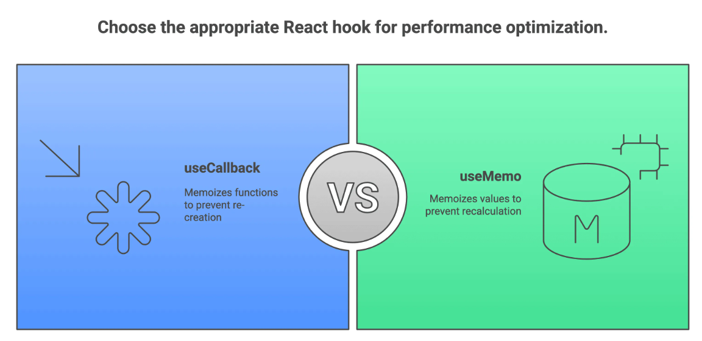

https://chatgpt.com/c/6948369c-c6cc-8321-883c-ac6c73cb4cb6


🟢 SECTION 1: React Fundamentals (FILTER ROUND – MUST PASS)
===========================================================


# 1. Build a counter with Increment, Decrement, and Reset buttons.


✅ Code - 

```js

import React, { useState } from "react";

export default function Counter() {
  // counter state
  const [count, setCount] = useState(0);

  // increment
  const handleIncrement = () => {
    setCount(prev => prev + 1);
  };

  // decrement
  const handleDecrement = () => {
    setCount(prev => prev - 1);
  };

  // reset
  const handleReset = () => {
    setCount(0);
  };

  return (
    <div style={{ padding: 20 }}>
      <h2>Counter</h2>

      <p>Count: {count}</p>

      <button onClick={handleIncrement}>Increment</button>
      <button onClick={handleDecrement}>Decrement</button>
      <button onClick={handleReset}>Reset</button>
    </div>
  );
}


```

✅ Developer-Friendly Explanation - 

→ useState(0) initializes the counter state with a default value of 0.

→ setCount(prev => prev + 1) uses a functional state update, so React always works with the latest state value.
This avoids bugs when multiple updates happen quickly.

→ Each button has a single responsibility (increment, decrement, reset), which keeps the logic clean and maintainable.

→ Whenever the state changes, React triggers a re-render to update the UI with the latest value.


❌ Common Mistakes -

setCount(count + 1); // ❌ can break in rapid updates

Why ? 

→ count may be stale.

→ Functional update is safer.

✅ What to Say in Interview ? 

"I used useState with functional updates to avoid stale state issues and implemented clear handlers for increment, decrement, and reset."


# 2. Disable the Decrement button when the counter value is 0.


```js
import React, { useState } from "react";

export default function Counter() {
  const [count, setCount] = useState(0);

  const handleIncrement = () => {
    setCount(prev => prev + 1);
  };

  const handleDecrement = () => {
    setCount(prev => prev - 1);
  };

  const handleReset = () => {
    setCount(0);
  };

  return (
    <div style={{ padding: 20 }}>
      <h2>Counter</h2>

      <p>Count: {count}</p>

      <button
        onClick={handleDecrement}
        disabled={count === 0}
      >
        Decrement
      </button>

      <button onClick={handleIncrement}>Increment</button>
      <button onClick={handleReset}>Reset</button>
    </div>
  );
}


```

✅ Developer-Friendly Explanation

→ disabled={count === 0} prevents the user from clicking Decrement when the value is 0.

→ This is UI-level protection, commonly used in forms and actions like submit, resend OTP, etc.

→ The state update logic stays simple and readable.

→ When count changes, React re-renders and updates the button’s disabled state automatically.

❌ Common Mistakes

```js

if (count > 0) {
  setCount(count - 1);
}

```

Why ❌

→ Logic is mixed inside the handler.
→ Harder to read and maintain.
→ UI should handle disabling, not conditional logic everywhere.

✅ What to Say in Interview.

"I disabled the decrement button at the UI level to prevent invalid user actions and kept the state logic clean."


# 3. Build a button that toggles between ON and OFF on each click.


```js

import React, { useState } from "react";

export default function ToggleButton() {
  const [isOn, setIsOn] = useState(false);

  const handleToggle = () => {
    setIsOn(prev => !prev);
  };

  return (
    <div style={{ padding: 20 }}>
      <h2>Toggle</h2>

      <p>Status: {isOn ? "ON" : "OFF"}</p>

      <button onClick={handleToggle}>
        {isOn ? "Turn OFF" : "Turn ON"}
      </button>
    </div>
  );
}


```

✅ Developer-Friendly Explanation

→ useState(false) starts toggle state as OFF.

→ setIsOn(prev => !prev) flips the previous value.
So true becomes false, and false becomes true.

→ Functional update ensures the toggle is always correct even if user clicks fast.

→ React re-renders after state update, so UI text changes automatically.


❌ Common Mistakes - 

```js
setIsOn(!isOn); // ❌ can be risky in rapid updates

```

Why ❌

→ isOn can be stale in batched updates.
→ Functional update is safer.

✅ Better:

setIsOn(prev => !prev);

✅ What to Say in Interview (One Line)

"I used a boolean state and toggled it using a functional update to avoid stale state issues."

# 4.  Build a password input with a Show / Hide toggle button.

```js

import React, { useState } from "react";

export default function ShowHidePassword() {
  const [password, setPassword] = useState("");
  const [showPassword, setShowPassword] = useState(false);

  const handleToggle = () => {
    setShowPassword(prev => !prev);
  };

  return (
    <div style={{ padding: 20 }}>
      <h2>Password Input</h2>

      <input
        type={showPassword ? "text" : "password"}
        value={password}
        onChange={(e) => setPassword(e.target.value)}
        placeholder="Enter password"
      />

      <button onClick={handleToggle}>
        {showPassword ? "Hide" : "Show"}
      </button>
    </div>
  );
}


```

✅ Developer-Friendly Explanation

→ password is a controlled input because its value comes from state.

→ showPassword controls the type of the input (text or password).

→ Clicking the button toggles showPassword, which changes input visibility.

→ React re-renders and updates the input type automatically.


❌ Common Mistakes
<input type="password" />

Why ❌

→ No way to toggle visibility.
→ Input becomes uncontrolled if value is not managed by state.


✅ What to Say in Interview 

"I used controlled input with state-driven input type switching to implement show and hide password functionality."


# 5. Show Login button when user is logged out, and show Logout button when user is logged in.

```js

import React, { useState } from "react";

export default function LoginLogout() {

  const [loggedIn, setLoggedIn] = useState(false);
  const handleLogin = () => setLoggedIn(true);
  const handleLogout = () => setLoggedIn(false);

  // return JSX. 

  return (
    <div style={{ padding: 20 }}>
      <h2>Login / Logout</h2>

      // Ternary Expression

      { loggedIn
        ? <button onClick={handleLogout}>Logout</button>
        : <button onClick={handleLogin}>Login</button>
      }

      <p>Status: {loggedIn ? "Logged In ✅" : "Logged Out ❌"}</p>
    </div>
  );
}


// JSX is:

// (
//     <div style={{ padding: 20 }}>
//       <h2>Login / Logout</h2>

//       {loggedIn ? (
//         <button onClick={handleLogout}>Logout</button>
//       ) : (
//         <button onClick={handleLogin}>Login</button>
//       )}

//       <p>Status: {loggedIn ? "Logged In ✅" : "Logged Out ❌"}</p>
//     </div>
//   );
// }


```


✅ Developer-Friendly Explanation - 

→ loggedIn state decides what UI to show.

→ We use ternary rendering:

if loggedIn is true → show Logout

else → show Login

→ On click, state changes → React re-renders → UI switches automatically.


❌ Common Mistakes

```js

if (loggedIn) {
  return <button>Logout</button>;
}
return <button>Login</button>;

```

Why ❌

→ Works, but becomes messy when UI grows.
→ JSX ternary is cleaner for small conditions.


```js

{ loggedIn ? return (
  <button onClick={handleLogout}>Logout</button>
) : return (
  <button onClick={handleLogin}>Login</button>
) }

```
Why ❌

→ return is NOT allowed inside JSX

→ JSX expects an expression, not a statement

→ return works only inside functions, not inside {} in JSX

👉 That's why React throws an error.

✅ What to Say in Interview ? 

"I used state-based conditional rendering with a ternary operator to switch between Login and Logout UI."


Multi-line JSX needs grouping -

This ❌ will break:

```js

{loggedIn &&
  <div>
    <h1>Hello</h1>
    <p>Welcome</p>
  </div>
}

```


This ✅ works:

```js

{loggedIn && (
  <div>
    <h1>Hello</h1>
    <p>Welcome</p>
  </div>
)}

```

So devs always use () to be safe.

# 6. Render some JSX only when a condition is true using the && operator.

```js

import React, { useState } from "react";

export default function ConditionalAnd() {
  const [loggedIn, setLoggedIn] = useState(false);

  return (
    <div style={{ padding: 20 }}>
      <h2>Conditional Rendering using &&</h2>

      <button onClick={() => setLoggedIn(prev => !prev)}>
        {loggedIn ? "Logout" : "Login"}
      </button>

      {loggedIn && <p>Welcome User 👋</p>}
    </div>
  );
}

```


✅ Developer-Friendly Explanation

→ loggedIn && <p>Welcome User</p> means: If loggedIn is true, render the JSX.

→ If loggedIn is false, React ignores the right side and renders nothing.

→ This is best when you don't need an else case.

→ Very common pattern for optional UI.

✅ How && works (Plain English)

true && "SHOW"   // returns "SHOW"
false && "SHOW"  // returns false (React renders nothing)

React does not render false, null, or undefined.

&& - Only show something
? : - Show one of two things


# 7. Render one JSX element or another based on a condition using the ternary operator.

```js

import React, { useState } from "react";

export default function ConditionalTernary() {
  const [isOnline, setIsOnline] = useState(false);

  return (
    <div style={{ padding: 20 }}>
      <h2>Conditional Rendering using Ternary</h2>

      <button onClick={() => setIsOnline(prev => !prev)}>
        Toggle Status
      </button>

      <p>
        Status: {isOnline ? "Online 🟢" : "Offline 🔴"}
      </p>
    </div>
  );
}


```
✅ Developer-Friendly Explanation

→ Ternary operator chooses one of two values.

condition ? valueIfTrue : valueIfFalse

→ If isOnline is true → show Online

→ Else → show Offline

→ Best choice when both outcomes must be handled.

❌ Common Mistakes

```js

if (isOnline) {
  <p>Online</p>;
} else {
  <p>Offline</p>;
}

```

Why 'if' is not allowed inside JSX ❌

→ if is a statement.
→ JSX allows only expressions inside {} such as ?.(Ternary Expression) 


✅ What to Say in Interview (One Line)

"I use ternary rendering when I need to switch between two UI states."


# 8. Create a controlled text input and show a live preview of what the user types.

```js
import React, { useState } from "react";

export default function LivePreviewInput() {
  const [text, setText] = useState("");

  return (
    <div style={{ padding: 20 }}>
      <h2>Controlled Input with Live Preview</h2>

      <input
        type="text"
        value={text}
        onChange={(e) => setText(e.target.value)}
        placeholder="Type something..."
      />

      <p>Live Preview: {text}</p>
    </div>
  );
}


```

✅ Developer-Friendly Explanation

→ text state controls the input value.

→ value={text} means React owns the input value.

→ onChange updates state on every keystroke.

→ State change → React re-renders → preview updates instantly.

→ This is called a controlled component.


❌ Common Mistakes

<input onChange={(e) => console.log(e.target.value)} />

Why ❌

→ Input is uncontrolled.
→ React does not know the current value.
→ Hard to validate, reset, or submit later.

✅ Why Controlled Inputs Are Preferred

→ Easy validation
→ Easy reset
→ Easy form submit
→ Predictable state

✅ What to Say in Interview

"I used a controlled input where the value comes from state, allowing real-time updates and better control over user input."


# 9. Convert an uncontrolled input into a controlled input.


❌ Uncontrolled Input (Before)

```js

function UncontrolledInput() {
  return (
    <input type="text" defaultValue="Hello" />
  );
}


```
✅ Controlled Input (After) 

```js

import React, { useState } from "react";

export default function ControlledInput() {
  const [value, setValue] = useState("Hello");

  return (
    <input
      type="text"
      value={value}
      onChange={(e) => setValue(e.target.value)}
    />
  );
}

```


✅ Developer-Friendly Explanation

→ Uncontrolled input stores its value inside the DOM.

→ Controlled input stores its value inside React state.

→ value={value} makes React the single source of truth.

→ This allows validation, reset, and submit logic easily.


❌ Common Mistakes

<input value="Hello" />

Why ❌

→ Input becomes read-only
→ User cannot type


✅ When to Use Controlled Inputs

✔ Forms
✔ Validation
✔ Submit handling
✔ Real-time feedback


✅ What to Say in Interview (One Line)

"I converted the input to a controlled component so React fully manages its value, making validation and form handling easier."


# 10. Prevent the browser’s default form submission behavior (page reload) and handle submit in React.


```js
import React, { useState } from "react";

export default function PreventFormSubmit() {
  const [name, setName] = useState("");

  const handleSubmit = (e) => {
    e.preventDefault(); // ⛔ stop page reload
    console.log("Form submitted with:", name);
  };

  return (
    <div style={{ padding: 20 }}>
      <h2>Form Submit</h2>

      <form onSubmit={handleSubmit}>
        <input
          value={name}
          onChange={(e) => setName(e.target.value)}
          placeholder="Enter name"
        />
        <button type="submit">Submit</button>
      </form>
    </div>
  );
}


```


✅ Developer-Friendly Explanation

→ By default, HTML forms reload the page on submit.

→ e.preventDefault() stops that default browser behavior.

→ React then handles the submit inside JavaScript.

→ This is required for SPA (Single Page Application) behavior.


❌ Common Mistakes

<form>
  <button>Submit</button>
</form>

Why ❌

→ Browser reloads the page
→ React state is lost
→ Bad user experience


✅ Important Note (Interview Tip)

<button type="submit">

→ This triggers onSubmit on the form.
→ Preferred over onClick for forms.


❌ Using onClick (Not Recommended)

<button onClick={handleSubmit}>Submit</button>

Problems with this approach -

1️⃣ Enter key won't work.
User presses Enter → nothing happens ❌

2️⃣ Bypasses form behavior.
HTML forms are designed to submit via onSubmit.

3️⃣ Harder to scale.
Validation, accessibility, and multiple inputs become messy.

✅ Using onSubmit (Recommended)

<form onSubmit={handleSubmit}>
  <button type="submit">Submit</button>
</form>

Why this is better

✔ Works with Enter key
✔ Supports screen readers / accessibility
✔ Central place for validation
✔ Industry standard pattern


✅ What to Say in Interview (One Line)

"I used preventDefault to stop the browser reload and handled form submission using React state."


# 11. Disable a button based on a condition (for example: input is empty, form is invalid, loading state).


```js
import React, { useState } from "react";

export default function DisableButton() {
  const [text, setText] = useState("");

  return (
    <div style={{ padding: 20 }}>
      <h2>Conditional Button Disable</h2>

      <input
        type="text"
        value={text}
        onChange={(e) => setText(e.target.value)}
        placeholder="Type something"
      />

      <button disabled={!text}>
        Submit
      </button>
    </div>
  );
}


```


✅ Developer-Friendly Explanation

→ disabled={!text} means:
If text is empty, button is disabled. (!"" is true)

→ When user types something, text becomes truthy.
Button automatically becomes enabled.

→ This is UI-level validation, very common in real forms.

→ React re-renders on state change and updates the button state.

❌ Common Mistakes
if (text !== "") {
  // enable button
}

Why ❌

→ Logic spread outside JSX
→ Harder to read


✅ Real-World Examples - 

✔ Disable submit until form is valid.
✔ Disable resend OTP button.
✔ Disable save button while loading.

✅ What to Say in Interview (One Line)

"I disable the button based on state to prevent invalid user actions and improve UX."


# 12. Pass data from a parent component to a child component using props.


```js

import React from "react";

/* Parent Component */
export default function Parent() {
  const userName = "Likan";

  return (
    <div style={{ padding: 20 }}>
      <h2>Parent Component</h2>

      <Child name={userName} />
    </div>
  );
}


/* Child Component */
function Child({ name }) {
  return <p>Child received name: {name}</p>;
}


```


✅ Developer-Friendly Explanation

→ Parent holds the data (userName).

→ Parent passes data to child using props.

→ Child receives props as function parameters.

→ Data flow in React is one-way (top → down).

→ Child cannot modify parent data directly.

❌ Common Mistakes

```js
function Child(props) {
  props.name = "Other"; // ❌
}

```

Why ❌

→ Props are read-only.
→ React enforces unidirectional data flow.


✅ What to Say in Interview 

"I pass data from parent to child using props, following React's one-way data flow."


# 13. Send data from child to parent using a callback function passed as a prop.


```js

import React, { useState } from "react";


/* Parent Component */
export default function Parent() {
  const [message, setMessage] = useState("");

  const handleNotify = (msg) => { // The parent expects the child to pass data through 'msg' argument.
    setMessage(msg);
  };

  return (
    <div style={{ padding: 20 }}>
      <h2>Parent Component</h2>

      <Child onNotify={handleNotify} />

      <p>Message from child: {message}</p>
    </div>
  );
}


/* Child Component */

function Child({ onNotify }) {
  return (
    <button onClick={() => onNotify("Hello from Child")}>
      Notify Parent
    </button>
  );
}


```


✅ Developer-Friendly Explanation

→ Parent defines a function (handleNotify).

→ Parent passes this function to child as a prop.

→ Child calls the function when an event happens.

→ Data flows upward via function call, not via state mutation.

→ This is the standard React pattern for child-to-parent communication.


❌ Common Mistakes

```js 
// ❌ child trying to change parent state directly
setMessage("Hi");

```

Why ❌

→ Child has no access to parent state.


✅ What to Say in Interview 

"To send data from child to parent, I pass a callback function and invoke it from the child."

# 14. How do you handle default props in React? Explain with an example.

```js

import React from "react";

/* Parent Component */
export default function Parent() {
  return (
    <div style={{ padding: 20 }}>
      <h2>Default Props Example</h2>

      {/* Uses default value */}
      <Button />

      {/* Overrides default value */}
      <Button label="Submit" />
    </div>
  );
}


/* Child Component */
function Button({ label = "Click Me" }) { 
  return <button>{label}</button>;
}


```

✅ Developer-Friendly Explanation

→ Default props provide a fallback value when a prop is not passed from the parent.

→ label = "Click Me" uses default parameter syntax in the function argument.

→ If the parent does not pass label, the default value is used automatically.

→ If the parent passes label, it overrides the default value.

→ This prevents undefined values in UI and makes components safer and reusable.

❌ Common Mistakes

```js

function Button(props) {
  return <button>{props.label}</button>;
}

```

Why ❌

→ If label is not passed, UI will show undefined.
→ No fallback handling is present.


✅ What to Say in Interview

"I use default props to provide fallback values so components don’t break when optional props are missing."


# 15. How do you apply styles in React? Explain inline styles vs CSS classes with code.


```css

/* styles.css */
.text {
  color: blue;
  font-size: 18px;
  font-weight: bold;
}

```

```js

import React from "react";
import "./styles.css";

export default function StylingExample() {
  const inlineStyle = {
    color: "red",
    fontSize: "18px",
    fontWeight: "bold",
  };

  return (
    <div style={{ padding: 20 }}>
      <h2>Styling in React</h2>

      {/* Inline style */}
      <p style={inlineStyle}>
        This text uses inline styles
      </p>

      {/* CSS class */}
      <p className="text">
        This text uses CSS class
      </p>
    </div>
  );
}


```


✅ Developer-Friendly Explanation

→ Inline styles are written as JavaScript objects.

→ Style keys use camelCase (fontSize, not font-size).

→ Inline styles are good for dynamic or conditional styling. (Theme)

→ CSS classes come from external stylesheets.

→ CSS classes are reusable, cleaner, and better for large applications.


❌ Common Mistakes

<p style="color: red">Text</p>


Why ❌

→ JSX does not accept string-based styles.
→ Styles must be passed as a JavaScript object.

✅ When to Use What

→ Use inline styles when:

Styles depend on state or props.

Values change dynamically. (Theme State - dark and light)

→ Use CSS classes when:

Styles are reused

App is large

You want clean separation of concerns.

✅ What to Say in Interview

"Inline styles are useful for dynamic values, while CSS classes are better for reusable and maintainable styling in larger React apps."


# 16. How does event handling work in React? Explain with an example.

```js

import React from "react";

export default function EventHandling() {
  const handleClick = () => {
    console.log("Button clicked");
  };

  return (
    <div style={{ padding: 20 }}>
      <h2>Event Handling in React</h2>

      <button onClick={handleClick}>
        Click Me
      </button>
    </div>
  );
}


```

✅ Developer-Friendly Explanation

→ React uses Synthetic Events, which wrap native browser events.

→ Event handlers are passed as functions, not function calls.

→ onClick={handleClick} means React will call the function when the event happens.

→ Event names use camelCase (onClick, onChange).

→ React automatically handles cross-browser compatibility.


❌ Common Mistakes
<button onClick={handleClick()}>


Why ❌

→ The function executes immediately during render.
→ The event handler is not attached correctly.


✅ Important Notes
```js

<button onClick={() => handleClick(args)}>

```
→ This is valid when you need to pass arguments.
→ But avoid it unless required (performance/readability).


✅ What to Say in Interview

"React uses synthetic events and expects event handlers to be passed as functions, which are executed only when the event occurs."


SECTION 2: State, Immutability & Lists
======================================


# 17. How do you update object state immutably in React? Explain with an example.

```js

import React, { useState } from "react";

export default function UpdateObjectState() {
  const [user, setUser] = useState({
    name: "Likan",
    age: 30,
  });


  const updateName = () => {
    setUser(prev => ({
      ...prev,
      name: "Amar"
    }));
  };

  // Parentheses () are required because arrow functions treat {} as a function block, so wrapping the object in () ensures the object is returned instead of undefined.

  return (
    <div style={{ padding: 20 }}>
      <h2>Update Object State Immutably</h2>

      <p>Name: {user.name}</p>
      <p>Age: {user.age}</p>

      <button onClick={updateName}>
        Update Name
      </button>
    </div>
  );
}


```

✅ Developer-Friendly Explanation

→ React state should never be mutated directly.

→ setUser(prev => ({ ...prev, name: "Amar" }))
creates a new object, not modifying the old one.

→ ...prev copies existing properties.

→ Only the changed property (name) is overridden.

→ React detects the new object reference and re-renders.


❌ Common Mistakes -

```js

user.name = "Amar";
setUser(user);

```

Why ❌

→ Mutates the existing state object.
→ React may not detect the change.Even though we pass the object to the state setter, it’s the same reference, so React may treat the state as unchanged and skip re-rendering.
→ This can lead to stale UI, unpredictable behavior, and hard-to-debug bugs.


✅ Why does Immutability Matter ?

Because React detects state changes by checking object references, not by deeply comparing values.

Detailed but simple explanation -

When you update state immutably:

```js

setUser(prev => ({
  ...prev,
  name: "Amar"
}));

```

→ A new object is created
→ Reference changes
→ React detects the change
→ Component re-renders correctly


When you update state mutably:

```js

user.name = "Amar";
setUser(user);

```

→ Same object is reused.
→ Reference stays the same.
→ React may think nothing changed.
→ Re-render may be skipped.


✅ What to Say in Interview

"I update state immutably by creating a new object so React can detect the reference change and re-render correctly."


# 18. How do you update nested object state immutably in React? Explain with an example ?

```js

import React, { useState } from "react";

export default function UpdateNestedObject() {
  const [user, setUser] = useState({
    name: "Likan",
    address: {
      city: "Bangalore",
      country: "India",
    },
  });

  const updateCity = () => {
    setUser(prev => ({
      ...prev, // retaining the old parent object
      address: {
        ...prev.address, // retaining the old child object 
        city: "Hyderabad",
      },
    }));
  };

  return (
    <div style={{ padding: 20 }}>
      <h2>Update Nested Object State</h2>

      <p>Name: {user.name}</p>
      <p>City: {user.address.city}</p>
      <p>Country: {user.address.country}</p>

      <button onClick={updateCity}>Update City</button>
    </div>
  );
}


```


✅ Developer-Friendly Explanation

→ Nested state must be updated level by level, immutably.

→ First ...prev copies the top-level object.

→ Then ...prev.address copies the nested object.

→ Only the required field (city) is overridden.

→ This creates new references at every changed level, so React detects the update and re-renders.


❌ Common Mistakes -

```js

user.address.city = "Hyderabad";
setUser(user);

```

Why ❌

→ Mutates the nested object directly.

→ Object reference remains the same.

→ React may not detect the change.

→ Can cause stale UI and unpredictable bugs.


❓ Why spread is needed twice 

```js

{
  ...prev,           // new user object
  address: {
    ...prev.address, // new address object
    city: "Hyderabad"
  }
}

```

→ Each level needs a new reference.
→ Skipping any level breaks immutability.

✅ What to Say in Interview

"It creates new objects at each level, so React sees the change and re-renders the UI."


# 19. How do you update array state immutably in React? Explain with an example.


```js

import React, { useState } from "react";

export default function UpdateArrayState() {
  const [items, setItems] = useState(["Apple", "Banana"]);

  const addItem = () => {
    setItems(prev => [...prev, "Orange"]);
  };

  return (
    <div style={{ padding: 20 }}>
      <h2>Update Array State Immutably</h2>

      <ul>
        {items.map(item => (
          <li key={item}>{item}</li>
        ))}
      </ul>

      <button onClick={addItem}>Add Item</button>
    </div>
  );
}


```

✅ Developer-Friendly Explanation -

→ Array state must be updated immutably.

→ [...] (spread operator) creates a new array.

→ ...prev copies existing items.

→ New item ("Orange") is added at the end.

→ New array reference → React detects change → UI re-renders.

❌ Common Mistakes

```js

items.push("Orange");
setItems(items);

```

Why ❌

→ push mutates the existing array.

→ Array reference stays the same.

→ React may not detect the change.

→ Can cause stale UI and bugs.

✅ Why do immutability matter for Arrays ?

→ React relies on reference change, not content change.

→ New array = new reference = guaranteed re-render.

→ Makes updates predictable and safe.

✅ What to Say in Interview ?

"I update array state immutably by creating a new array using the spread operator so React can detect changes correctly."


# 20. How do you add an item to a list in React? Explain with an example.

```js

import React, { useState } from "react";

export default function AddItemToList() {

  const [items, setItems] = useState([]);
  const [input, setInput] = useState("");

  const addItem = () => {
  if (!input.trim()) return;

  setItems(prev => [...prev, input.trim()]);
  setInput("");
};

  return (
    <div style={{ padding: 20 }}>
      <h2>Add Item to List</h2>

      <input
        value={input}
        onChange={(e) => setInput(e.target.value)}
        placeholder="Enter item"
      />

      <button onClick={addItem}>Add</button>

      <ul>
        {items.map((item, index) => (
          <li key={index}>{item}</li>
        ))}
      </ul>
    </div>
  );
}


```

✅ Developer-Friendly Explanation

→ List is stored in state as an array.

→ setItems(prev => [...prev, input]) creates a new array and adds the item.

→ This avoids mutating the existing state.

→ After adding, input is reset for better UX.

→ React re-renders because the array reference changes.


❌ Common Mistakes

```js

items.push(input);
setItems(items);

```

Why ❌

→ push mutates the existing array.
→ Reference stays the same.
→ React may skip re-render.


⚠️ Note on key (temporary)
<li key={index}>{item}</li>


→ Index is used here only for demo.
→ Proper key usage will be explained later.

✅ What to Say in Interview

"I add items by creating a new array with the spread operator so React detects the change and updates the UI."


# 21. How do you remove an item from a list in React? Explain with an example. 

```js

import React, { useState } from "react";

export default function RemoveItemFromList() {
  const [items, setItems] = useState(["Apple", "Banana", "Orange"]);

  const removeItem = (itemToRemove) => {
    setItems(prev =>
      prev.filter(item => item !== itemToRemove) // new items array reference
    );
  };

  return (
    <div style={{ padding: 20 }}>
      <h2>Remove Item from List</h2>

      <ul>
        {items.map(item => (
          <li key={item}>
            {item}
            <button
              onClick={() => removeItem(item)}
              style={{ marginLeft: 10 }}
            >
              Remove
            </button>
          </li>
        ))}
      </ul>
    </div>
  );
}


```

✅ Developer-Friendly Explanation

→ List data is stored in state as an array.

→ filter() creates a new array by removing the selected item.

→ The original array is not mutated.

→ New array reference → React detects change → UI re-renders.

→ This is the safest and most common way to remove items.

❌ Common Mistakes - 

```js

import React, { useState } from "react";

export default function RemoveItemWrong() {
  const [items, setItems] = useState(["Apple", "Banana", "Orange"]);

  const removeItem = (index) => {
    items.splice(index, 1); // ❌ mutates original array .
    setItems(items);        // ❌ same reference passed . old items array reference.
  };

  return (
    <div style={{ padding: 20 }}>
      <h2>Remove Item (Wrong Way)</h2>

      <ul>
        {items.map((item, index) => (
          <li key={item}>
            {item}
            <button
              onClick={() => removeItem(index)}
              style={{ marginLeft: 10 }}
            >
              Remove
            </button>
          </li>
        ))}
      </ul>
    </div>
  );
}


// items.splice(index, 1);

// What this line does

// → splice removes items from the original array.
// → It starts at position index.
// → It removes 1 item.
// → The original array is modified (mutated).

```

Why ❌

→ splice mutates the original array.
→ Array reference stays the same.
→ React may not re-render.
→ Can cause unpredictable bugs.


✅ Why is filter preferred ? 

→ Does not mutate original array
→ Returns a new array
→ Clean and readable
→ Guaranteed re-render


✅ What to Say in Interview.

 "I remove items immutably using filter, which creates a new array so React can detect the change and re-render."


 # 22. How do you edit / update an item in a list in React? Explain with an example. 

```js

import React, { useState } from "react";

export default function EditItemInList() {
  const [items, setItems] = useState(["Apple", "Banana", "Orange"]);

  const updateItem = (indexToUpdate) => {
    setItems(prev =>
      prev.map((item, index) =>
        index === indexToUpdate ? "Mango" : item
      )
    );
  };

  return (
    <div style={{ padding: 20 }}>
      <h2>Edit Item in List</h2>

      <ul>
        {items.map((item, index) => (
          <li key={item}>
            {item}
            <button
              onClick={() => updateItem(index)}
              style={{ marginLeft: 10 }}
            >
              Edit
            </button>
          </li>
        ))}
      </ul>
    </div>
  );
}


```


✅ Developer-Friendly Explanation

→ List data is stored in state as an array.

→ map() is used to create a new array.

→ When the index matches, the item is replaced.

→ All other items are returned unchanged.

→ New array reference → React detects change → UI re-renders.

Note - map, filter, and reduce always return a new array reference, which allows React to detect state changes and re-render.

❌ Common Mistakes -

```js

items[index] = "Mango";
setItems(items);

```

Why ❌

→ Mutates the existing array.

→ Array reference remains the same.

→ React may skip re-rendering.

→ Leads to unpredictable UI bugs.


Why map is the right choice ?

→ Does not mutate original array.

→ Creates a new array.

→ Clear intent (update one item).

→ Predictable React behavior

✅ What to Say in Interview ?

"I update list items immutably using map, replacing only the required item so React can detect the change and re-render."


# 23. How do you toggle a property (done / not done) on items in a list in React?


```js

import React, { useState } from "react";

export default function ToggleTodo() {
  const [todos, setTodos] = useState([
    { id: 1, text: "Learn React", done: false },
    { id: 2, text: "Practice Interview", done: false },
  ]);

  const toggleDone = (id) => {
    setTodos(prev =>
      prev.map(todo =>
        todo.id === id
          ? { ...todo, done: !todo.done }
          : todo
      )
    );
  };

  return (
    <div style={{ padding: 20 }}>
      <h2>Toggle Done / Not Done</h2>

      <ul>
        {todos.map(todo => (
          <li key={todo.id}>
            <span
              style={{
                textDecoration: todo.done ? "line-through" : "none"
              }}
            >
              {todo.text}
            </span>

            <button
              onClick={() => toggleDone(todo.id)}
              style={{ marginLeft: 10 }}
            >
              Toggle
            </button>
          </li>
        ))}
      </ul>
    </div>
  );
}


```


✅ Developer-Friendly Explanation - 

→ List items are objects stored inside an array.

→ map() is used to create a new array.

→ When id matches, a new object is created using spread ({ ...todo }).

→ Only the 'done' property is toggled.

→ New array + new object reference → React detects change → UI re-renders.


❌ Common Mistakes

```js

todo.done = !todo.done;
setTodos(todos);

```

Why ❌

→ Mutates the existing object inside the array.
→ Array and object references stay the same.
→ React may not detect the change.
→ Causes stale or inconsistent UI.


✅ Why this approach works

→ No mutation
→ New references at changed levels
→ Predictable React behavior


✅ What to Say in Interview

"I toggle item properties immutably using 'map' and 'object spread' so React can detect the change and re-render."


# 24. How do you clear the entire list in React? Explain with an example.

```js

import React, { useState } from "react";

export default function ClearList() {
  const [items, setItems] = useState(["Apple", "Banana", "Orange"]);

  const clearAll = () => {
    setItems([]); // clear the list
  };

  return (
    <div style={{ padding: 20 }}>
      <h2>Clear Entire List</h2>

      <ul>
        {items.map(item => (
          <li key={item}>{item}</li>
        ))}
      </ul>

      <button onClick={clearAll}>Clear All</button>
    </div>
  );
}


```

✅ Developer-Friendly Explanation

→ List is stored in state as an array.

→ setItems([]) replaces the old array with a new empty array.

→ New reference is created, so React detects the change.

→ React re-renders and the list disappears from the UI.


❌ Common Mistakes

```js

items.length = 0;
setItems(items);

```

Why ❌

→ Directly mutates the existing array.
→ Reference stays the same.
→ React may not re-render.
→ Can cause stale UI bugs.


✅ Why this works

→ Empty array is a new reference.
→ No mutation involved.
→ Clean and predictable state update.

✅ What to Say in Interview

"I clear a list by setting state to a new empty array so React detects the change and re-renders."


# 25. How do you fix a state mutation bug in React? Explain with an example.


```js

import React, { useState } from "react";

export default function FixMutationBug() {
  const [user, setUser] = useState({
    name: "Likan",
    age: 30,
  });

  const updateAge = () => {
    // ✅ FIXED: update immutably
    setUser(prev => ({
      ...prev,
      age: prev.age + 1,
    }));
  };

  return (
    <div style={{ padding: 20 }}>
      <h2>Fix State Mutation Bug</h2>

      <p>Name: {user.name}</p>
      <p>Age: {user.age}</p>

      <button onClick={updateAge}>Increase Age</button>
    </div>
  );
}


```


❌ Buggy Code (What Causes the Problem)

```js

onst updateAge = () => {    
  user.age += 1;   // ❌ mutates existing state
  setUser(user);  // ❌ same reference
};


```

✅ Developer-Friendly Explanation

→ The bug happens because state is mutated directly.

→ Mutating keeps the same object reference.

→ React may think state is unchanged and skip re-rendering.

→ The fix is to create a new object using the spread operator.

→ New reference → React detects change → UI updates correctly.

❌ Why Mutation Is Dangerous

→ UI updates become unreliable.

→ Bugs appear randomly.

→ Hard to debug in larger apps.

✅ How to Systematically Fix Mutation Bugs ?

→ Never change state directly
→ Always return a new object or array
→ Use map, filter, spread (...)
→ Think in terms of new reference.

✅ What to Say in Interview

"I fix mutation bugs by updating state immutably and returning a new reference so React can reliably re-render."


# 26. What is derived state vs stored state in React? Explain with an example.

# 27. Why should you NOT store derived state in React? Explain with an example.

```js

import React, { useState } from "react";

export default function DerivedVsStoredState() {
  const [items, setItems] = useState(["Apple", "Banana", "Orange"]);


    // ❌ derived value should NOT be stored in state
  // const [count, setCount] = useState(items.length);

  // ✅ derived state (calculated, not stored)

  const itemCount = items.length;

  return (
    <div style={{ padding: 20 }}>
      <h2>Derived vs Stored State</h2>

      <p>Total items: {itemCount}</p>

      <button onClick={() => setItems(prev => [...prev, "Mango"])}>
        Add Item
      </button>
    </div>
  );
}


```

✅ Developer-Friendly Explanation

→ Stored state is data you explicitly keep in useState
(example: items).

→ Derived state is calculated from existing state
(example: items.length).

→ itemCount is derived from items, so it does not need its own state.

→ React recalculates derived values on every render automatically.


Easy Rule - 

If a value can be calculated from state or props, don’t store it—derive it.

✅ Benefits of Derived State in React

→ Always in sync
Derived values are calculated from existing state, so they can never go out of sync.

→ Less state to manage
Fewer useState variables → simpler and cleaner code.

→ Better performance clarity
React recalculates derived values during render automatically

✅ What to Say in Interview

"Stored state is data I manage with useState, while derived state is computed from existing state and should not be stored separately."

# 28. How do you sort a list (ascending / descending) in React? Explain with an example.


```js

import React, { useState } from "react";

export default function SortList() {
  const [numbers, setNumbers] = useState([5, 2, 8, 1]);

  const sortAsc = () => {
    setNumbers(prev => [...prev].sort((a, b) => a - b));
  };

  const sortDesc = () => {
    setNumbers(prev => [...prev].sort((a, b) => b - a));
  };

  return (
    <div style={{ padding: 20 }}>
      <h2>Sort List</h2>

      <p>{numbers.join(", ")}</p>

      <button onClick={sortAsc}>Sort Ascending</button>
      <button onClick={sortDesc} style={{ marginLeft: 10 }}>
        Sort Descending
      </button>
    </div>
  );
}

```

✅ Developer-Friendly Explanation

→ sort() mutates the array, so we must copy it first.

→ [...prev] creates a new array before sorting.

→ Sorting happens on the copied array, not the original state.

→ New array reference → React detects the change → UI re-renders.


❌ Common Mistakes

```js

numbers.sort((a, b) => a - b);
setNumbers(numbers);

```

Why ❌

→ sort() mutates the original array.
→ Same reference is passed back to state.
→ React may not re-render.
→ Causes subtle bugs.


Rule - 

sort() mutates — always clone the array before sorting state.

✅ What to Say in Interview

I clone the array before sorting because sort mutates; creating a new array ensures React detects the change and re-renders.


# 29. How do you filter a list by a condition in React? Explain with an example ?

```js

import React, { useState } from "react";

export default function FilterList() {
  const [numbers] = useState([1, 2, 3, 4, 5, 6]);
  const [showEven, setShowEven] = useState(false);


  // filteredNumbers is derived state.

  const filteredNumbers = showEven
    ? numbers.filter(n => n % 2 === 0)
    : numbers;

  return (
    <div style={{ padding: 20 }}>
      <h2>Filter List</h2>

      <button onClick={() => setShowEven(prev => !prev)}>
        {showEven ? "Show All" : "Show Even"}
      </button>

      <ul>
        {filteredNumbers.map(n => (
          <li key={n}>{n}</li>
        ))}
      </ul>
    </div>
  );
}


```


✅ Developer-Friendly Explanation

→ filter() creates a new array based on a condition.

→ Original list (numbers) is not mutated.

→ Filtered result is derived, not stored in state.

→ Toggling the condition recalculates the filtered list on render.

→ New array reference → React updates the UI.


Best Practice Rule - 

Keep original data in state and derive filtered data during render.

✅ What to Say in Interview

"I filter lists using filter to derive a new array without mutating state, keeping the original data as the single source of truth."


The code will also work if we use state for filtered data.

```js

import React, { useState } from "react";

export default function FilterWithState() {
  const [numbers] = useState([1, 2, 3, 4, 5, 6]);
  const [filteredNumbers, setFilteredNumbers] = useState(numbers);

  const showEven = () => {
    setFilteredNumbers(numbers.filter(n => n % 2 === 0));
  };

  const showAll = () => {
    setFilteredNumbers(numbers);
  };

  return (
    <div style={{ padding: 20 }}>
      <h2>Filter List (Using State)</h2>

      <button onClick={showEven}>Show Even</button>
      <button onClick={showAll} style={{ marginLeft: 10 }}>
        Show All
      </button>

      <ul>
        {filteredNumbers.map(n => (
          <li key={n}>{n}</li>
        ))}
      </ul>
    </div>
  );
}


```

What's happening ?

→ numbers is the original source data.
→ filteredNumbers is also stored in state.
→ Clicking Show Even updates filteredNumbers.
→ Clicking Show All resets it back to numbers.
→ UI updates because state changes.


Important downside ?

→ You now have two states representing the same data.
→ If numbers ever changes, you must remember to update filteredNumbers.


This works, but storing filtered data duplicates state; deriving it during render is usually safer and simpler.


# 30 . How do you implement basic pagination logic in React? Explain with an example.

```js

import React, { useState } from "react";

export default function Pagination() {

  const items = ["1","2","3","4","5","6","7","8","9"]; 
  // Full dataset (source of truth)

  const perPage = 3; 
  // Number of items per page

  const [page, setPage] = useState(1);   
  // Tracks the current page

  const totalPages = Math.ceil(items.length / perPage); 
  // Total number of pages

  const visibleItems = items.slice(
    (page - 1) * perPage,
    page * perPage
  ); 
  // Items to display for the current page (derived)

  return (
    <div>
      <ul>
        {visibleItems.map(item => (
          <li key={item}>{item}</li>
        ))}
      </ul>

      <button disabled={page === 1} onClick={() => setPage(p => p - 1)}>
        Prev
      </button>

      <span> Page {page} / {totalPages} </span>

      <button disabled={page === totalPages} onClick={() => setPage(p => p + 1)}>
        Next
      </button>
    </div>
  );
}

// On each click, page state updates and visibleItems is recalculated

```

Code Explanation - 

1️⃣ Data source

const items = ["1","2","3","4","5","6","7","8","9","10"];

→ This is the full list of items
→ It never changes

2️⃣ Pagination config

const perPage = 3;

→ Number of items shown per page

3️⃣ Current page state

const [page, setPage] = useState(1);

→ Tracks which page the user is on
→ Starts from page 1

4️⃣ Total number of pages

const totalPages = Math.ceil(items.length / perPage);

Calculation (step-wise):

→ items.length = 10
→ 10 / 3 = 3.333...
→ Math.ceil(3.333...) = 4

✅ So total pages = 4

→ Math.ceil ensures even if some items are left, we still get a new page.

5️⃣ Decide which items to show

const visibleItems =
  items.slice((page - 1) * perPage, page * perPage);

This is the core logic.

Page	  slice(start, end)	    Items shown
1	      slice(0, 3)	          1, 2, 3
2	      slice(3, 6)	          4, 5, 6
3	      slice(6, 9)	          7, 8, 9
4	      slice(9, 12)	        10

→ slice does not mutate the array
→ Returns a new array every render
→ visibleItems is derived state

6️⃣ Rendering items -

```js

{visibleItems.map(item => (
  <li key={item}>{item}</li>
))}

```

→ Only items for the current page are rendered

7️⃣ Prev button
<button disabled={page === 1} onClick={() => setPage(p => p - 1)}>


→ Decreases page
→ Disabled on page 1
→ Prevents invalid navigation

8️⃣ Page indicator
<span> Page {page} / {totalPages} </span>


→ Shows current page and total pages

9️⃣ Next button
<button disabled={page === totalPages} onClick={() => setPage(p => p + 1)}>


→ Increases page
→ Disabled on last page (page 4 here)

Why this works correctly

✔ No array mutation
✔ Pagination is state-driven
✔ Displayed items are derived
✔ React re-renders automatically on page change

Interview-ready - 

"This pagination works by storing the page number in state and deriving visible items using slice, while Math.ceil ensures leftover items still get their own page."


# 31. How do you render a list using map() in React? Explain with an example.

```js

import React from "react";

export default function RenderList() {
  const items = ["Apple", "Banana", "Orange"];

  return (
    <div style={{ padding: 20 }}>
      <h2>Render List Using map()</h2>

      <ul>
        {items.map(item => (
          <li key={item}>{item}</li>
        ))}
      </ul>
    </div>
  );
}
```

✅ Developer-Friendly Explanation

→ map() is used to iterate over an array and return JSX for each item.

→ Each iteration returns one JSX element.

→ React uses key to identify each list item uniquely.


→ When the array changes, React re-renders the list.

❌ Common Mistakes
{items.map(item => {
  <li>{item}</li>;
})}

Why ❌

→ Curly braces {} create a function body.

→ Nothing is returned explicitly.

→ JSX is not rendered.

{items.map(item => (
  <li>{item}</li>
))}

Why ❌

→ Missing key prop.

→ React shows warning.

→ Can cause inefficient re-renders.

{items.map((item, index) => (
  <li key={index}>{item}</li>
))}

Why ❌

→ Index is unstable when list changes.

→ Can break UI updates and component state.

✅ Best Practice Rule -

Always render lists using map() and provide a stable, unique key (id, value).

✅ What to Say in Interview

"I render lists using map() and assign stable keys so React can efficiently track and update list items."


# 32. Why is key important when rendering lists in React? Explain with an example ?  

```js

import React from "react";

export default function KeyExample() {
  const users = [
    { id: 1, name: "Amit" },
    { id: 2, name: "Ravi" },
    { id: 3, name: "Suman" },
  ];

  return (
    <div style={{ padding: 20 }}>
      <h2>Key Example</h2>

      <ul>
        {users.map(user => (
          <li key={user.id}>{user.name}</li>
        ))}
      </ul>
    </div>
  );
}


```


✅ Developer-Friendly Explanation

→ key helps React identify which item was added, removed, or updated.

→ React uses key during reconciliation to update the DOM efficiently.

→ A stable key ensures only the affected list items re-render, not the entire list.

→ Keys must be unique.


❌ Common Mistakes
{users.map((user, index) => (
  <li key={index}>{user.name}</li>
))}

Why ❌

Using index as key in a dynamic list can confuse React and cause UI bugs. (Discussed later)

✅ Best Practice Rule

Always use a stable, unique identifier (like id) as key.
For static lists, using index as key is acceptable.
For dynamic lists, never use index as key — always use a stable unique id such as key.

✅ What to Say in Interview

"Keys help React efficiently track list items during updates, so I always use stable unique ids instead of indexes."


# 33. How do you show an empty state when a list is empty in React?

```js


import React from "react";

export default function EmptyStateExample() {
  const items = [];

  return (
    <div style={{ padding: 20 }}>
      <h2>Empty State Example</h2>

      {items.length === 0 ? (
        <p>No items available</p>
      ) : (
        <ul>
          {items.map(item => (
            <li key={item}>{item}</li>
          ))}
        </ul>
      )}
    </div>
  );
}

```


✅ Developer-Friendly Explanation

→ items.length === 0 checks if the list is empty.

→ If empty, show a fallback UI message.

→ If not empty, render the list using map().

→ This improves user experience and avoids blank screens.


❌ Common Mistakes
<ul>
  {items.map(item => (
    <li key={item}>{item}</li>
  ))}
</ul>

Why ❌

→ When the list is empty, nothing is shown.
→ User sees a blank UI with no context.

✅ Best Practice Rule

Always handle empty states to clearly communicate “no data” to users.

✅ What to Say in Interview

"I handle empty states by conditionally rendering a fallback message when the list is empty."

# 34. How do you fix the missing key warning in React lists? Explain with an example.

```js

import React from "react";

export default function FixMissingKey() {
  const users = [
    { id: 1, name: "Amit" },
    { id: 2, name: "Ravi" },
    { id: 3, name: "Suman" },
  ];

  return (
    <div style={{ padding: 20 }}>
      <h2>Fix Missing Key Warning</h2>

      <ul>
        {users.map(user => (
          <li key={user.id}>{user.name}</li>
        ))}
      </ul>
    </div>
  );
}


```


✅ Developer-Friendly Explanation

→ React shows a warning when list items don’t have a key.

→ key helps React uniquely identify each item.

→ Using a stable unique id fixes the warning.

→ React can now update only the changed items efficiently.


❌ Common Mistakes
{users.map(user => (
  <li>{user.name}</li>
))}

Why ❌

→ No key provided.
→ React cannot track items properly.
→ Leads to inefficient updates and warnings.

✅ What to Say in Interview

I fix the missing key warning by adding a stable unique key so React can efficiently track list items.

# 35. Explain why using index as key is bad in React lists.

Answer - chatGPT


🔵 SECTION 3: useEffect Mastery (INTERVIEW FAVORITE)
=====================================================


# 36. How do you run an effect only once in React? (Mount-only)

```js

import React, { useEffect } from "react";

export default function EffectOnlyOnce() {
  useEffect(() => {
    console.log("✅ Runs only once after initial render (mount)");
  }, []); // empty dependency array = run once

  return (
    <div style={{ padding: 20 }}>
      <h2>Effect Only Once</h2>
      <p>Open console to see log</p>
    </div>
  );
}

```

✅ Developer-Friendly Explanation

→ useEffect runs after render.

→ [] means no dependencies, so React runs it only once after the first render.

→ Re-renders do not re-run this effect.

❌ Common Mistakes
useEffect(() => {
  console.log("Runs after every render");
});

Why ❌

→ No dependency array provided.
→ Effect runs after every render.

✅ Best Practice Rule -

Use useEffect(() => {}, []) only for one-time setup like:

initial fetch


✅ What to Say in Interview

"I run an effect only once by passing an empty dependency array so it executes only after the component mounts."


# 37. How do you run an effect when a state changes in React? Explain with an example ?


```js

import React, { useEffect, useState } from "react";

export default function RunEffectOnStateChange() {
  const [count, setCount] = useState(0);

  useEffect(() => {
    console.log("Count changed:", count);
  }, [count]); // The effect runs once after the initial render, and then re-runs every time count changes.

  return (
    <div style={{ padding: 20 }}>
      <h2>Effect on State Change</h2>
      <p>Count: {count}</p>
      <button onClick={() => setCount(c => c + 1)}>Increment</button>
    </div>
  );
}

```
✅ Developer-Friendly Explanation

→ useEffect runs after every render by default.

→ The dependency array [count] tells React to re-run the effect only when count changes.

→ On first render, the effect runs once.

→ Each time count updates, React re-renders and the effect runs again.

❌ Common Mistakes

useEffect(() => {
  console.log("Count changed:", count);
}, []);

Why ❌

→ Empty dependency array means the effect runs only once.
→ It will NOT respond to count updates.

✅ Best Practice Rule -

Always include every state or prop used inside useEffect in the dependency array.

✅ What to Say in Interview

"I run an effect on state changes by adding that state variable to the dependency array so the effect re-runs only when it updates."


# 38. How do you fix an infinite loop in useEffect? Explain with an example.


Problem code - 

```js


import React, { useEffect, useState } from "react";

export default function InfiniteLoopBug() {
  const [count, setCount] = useState(0);

  useEffect(() => {
    setCount(count + 1); // ❌ updating state used in dependencies
  }, [count]);

  return <p>Count: {count}</p>;
}


```

❌ Why this causes an infinite loop

→ Effect runs because count changed
→ Inside effect, setCount updates count
→ State change triggers re-render
→ Effect runs again
→ Loop never ends ❌


✅ Fixed Version

```js


import React, { useEffect, useState } from "react";

export default function InfiniteLoopFix() {
  const [count, setCount] = useState(0);

  useEffect(() => {
    console.log("Effect ran once");
  }, []); // ✅ no state update inside

  return (
    <div>
      <p>Count: {count}</p>
      <button onClick={() => setCount(c => c + 1)}>Increment</button>
    </div>
  );
}


```

Alternative Fix -

```js

useEffect(() => {
  if (count < 5) {
    setCount(c => c + 1);
  }
}, [count]);

```
→ Conditional update stops infinite loop


✅ Developer-Friendly Explanation

→ Never update the same state inside an effect that depends on it
→ This creates a render → effect → render loop
→ Either:

  remove the dependency
  move state update to event handler
  or add a condition


❌ Common Mistakes

```js

useEffect(() => {
  setState(value);
}, [value]);

```

→ Guaranteed infinite loop if value always changes


✅ What to Say in Interview

"An infinite loop happens when an effect updates the same state it depends on. I fix it by moving updates to event handlers or adding conditions."


# 39. How do you fix a missing dependency bug in useEffect? Explain with an example.

Problem Code -

```js

import React, { useEffect, useState } from "react";

export default function MissingDependencyBug() {
  const [count, setCount] = useState(0);

  useEffect(() => {
    console.log("Count is:", count);
  }, []); // ❌ count is missing

  return (
    <div style={{ padding: 20 }}>
      <p>Count: {count}</p>
      <button onClick={() => setCount(c => c + 1)}>Increment</button>
    </div>
  );
}


```
❌ What goes wrong

→ Effect runs only once on mount.
→ count changes, but effect does not re-run.
→ Console always logs the initial value (0).
→ This is a stale value bug.

✅ Fixed Version -

```js

useEffect(() => {
  console.log("Count is:", count);
}, [count]); // ✅ include dependency

```

✅ Developer-Friendly Explanation

→ useEffect captures values from the render it runs in.

→ If a value is used inside the effect, it must be listed as a dependency.

→ Adding count tells React when to re-run the effect.

→ Now effect runs:

after initial render

every time count changes


❌ Common Mistakes
useEffect(() => {
  doSomething(value);
}, []); // ❌ value missing


→ Leads to stale data
→ Logic breaks silently

✅ Best Practice Rule -

If you use it inside useEffect, put it in the dependency array.
(Let ESLint guide you.)

✅ What to Say in Interview

"A missing dependency causes stale values. I fix it by adding all used state and props to the dependency array."


# 40. Explain the cleanup function in useEffect. When does it run?

```js

import React, { useEffect, useState } from "react";

export default function CleanupExample() {
  const [count, setCount] = useState(0);

  useEffect(() => {
    console.log("Effect runs:", count);

    return () => {
      console.log("Cleanup runs:", count);
    };
  }, [count]);

  return (
    <div style={{ padding: 20 }}>
      <p>Count: {count}</p>
      <button onClick={() => setCount(c => c + 1)}>Increment</button>
    </div>
  );
}

```


✅ Developer-Friendly Explanation

→ useEffect runs after render.

→ The function returned from useEffect is the cleanup function.

→ Cleanup runs before the next effect runs.

→ Cleanup also runs when the component unmounts.


Execution Order -

Initial render
Effect runs (count = 0)

Click Increment
Cleanup runs (count = 0)
Effect runs (count = 1)

Click Increment again
Cleanup runs (count = 1)
Effect runs (count = 2)

Component unmounts
Cleanup runs (last count)


❌ Common Mistakes

```js

useEffect(() => {
  setInterval(() => {
    console.log("Running...");
  }, 1000);
}, []);

```


Why ❌

→ Interval is never cleared.
→ Causes memory leaks.
→ Side effects keep running after unmount.


✅ Best Practice Rule -

Always clean up:

intervals

```js


import React, { useEffect, useState } from "react";

export default function IntervalExample() {
  const [count, setCount] = useState(0);

  useEffect(() => {
    const id = setInterval(() => {
      setCount(c => c + 1);
    }, 1000);

    // cleanup
    return () => {
      clearInterval(id);
    };
  }, []);

  return (
    <div style={{ padding: 20 }}>
      <h2>Interval Example</h2>
      <p>Count: {count}</p>
    </div>
  );
}


```

UI behavior

Count increases every second

When component unmounts → interval stops

Why cleanup

→ Prevents interval from running forever


Timeouts - 

```js

import React, { useEffect, useState } from "react";

export default function TimeoutExample() {
  const [message, setMessage] = useState("Waiting...");

  useEffect(() => {
    const id = setTimeout(() => {
      setMessage("Timeout finished");
    }, 3000);

    // cleanup
    return () => {
      clearTimeout(id);
    };
  }, []);

  return (
    <div style={{ padding: 20 }}>
      <h2>Timeout Example</h2>
      <p>{message}</p>
    </div>
  );
}


```

UI behavior

Shows "Waiting…"

After 3 seconds → shows "Timeout finished"

If the component unmounts before the timeout completes, cleanup clears the timeout so it never runs.

component unmounts - when we navigate to a different component.


Event listeners -

```js

import React, { useEffect, useState } from "react";

export default function EventListenerExample() {
  const [width, setWidth] = useState(window.innerWidth);

  useEffect(() => {
    const handleResize = () => {
      setWidth(window.innerWidth);
    };

    window.addEventListener("resize", handleResize);

    // cleanup
    return () => {
      window.removeEventListener("resize", handleResize);
    };
  }, []);

  return (
    <div style={{ padding: 20 }}>
      <h2>Event Listener Example</h2>
      <p>Window width: {width}</p>
    </div>
  );
}


```

UI behavior

Width updates when window resizes.

Listener removed on unmount.


✅ What to Say in Interview -

The cleanup function runs before the next effect and on unmount, and is used to clean up side effects like timers and subscriptions.

I clean up intervals, timeouts, subscriptions, and event listeners in useEffect to prevent memory leaks and unwanted side effects.


# 41. How do you abort an API request on component unmount in React?

Ask chatGPT


# 42. Demonstrate the stale closure problem in useEffect. Explain with code.


❌ Problem Code (Stale Closure)

```js

import React, { useEffect, useState } from "react";

export default function StaleClosureBug() {
  const [count, setCount] = useState(0);

  useEffect(() => {
    const id = setInterval(() => {
      console.log("Count:", count); // ❌ stale value
    }, 1000);

    return () => clearInterval(id);
  }, []); // ❌ count missing

  return (
    <div style={{ padding: 20 }}>
      <p>Count: {count}</p>
      <button onClick={() => setCount(c => c + 1)}>Increment</button>
    </div>
  );
}

```

❌ What goes wrong (Step-by-step)

→ Effect runs once on mount.
→ count inside the effect is captured as 0.
→ Interval keeps logging 0 forever.
→ Clicking Increment updates UI, but effect still sees old value.
→ This is a stale closure.


In our case:

The component did not unmount ✅

And the useEffect did not run again because you used [] ✅

So:

Why interval keeps logging 0

→ The interval callback was created only once (on mount).
→ At that time count = 0, so the callback “remembers” 0.
→ When you click Increment, the component re-renders, but the effect doesn’t re-run, so the interval still uses the old count.

When cleanup would run

Cleanup runs only if:

the component unmounts, OR

the effect runs again (dependency changes)

But here:

no unmount happened

effect never re-ran ([])

So cleanup never ran and the interval kept going with stale count.

Note - With [], the effect runs once, so the interval captures the initial count and never updates unless the effect re-runs or unmount happens.

✅ Fix #1: Add Dependency (Re-create effect)


```js

useEffect(() => {
  const id = setInterval(() => {
    console.log("Count:", count);
  }, 1000);

  return () => clearInterval(id);
}, [count]); // ✅ updates when count changes

```

Why it works

→ Effect re-runs when count changes.
→ Interval captures the latest count.

✅ Fix #2: Use Functional Update (Best for intervals)

```js

useEffect(() => {
  const id = setInterval(() => {
    setCount(c => c + 1); // ✅ always latest value
  }, 1000);

  return () => clearInterval(id);
}, []);

```

✔ What is GOOD here

→ No stale closure
→ Always uses latest count
→ Correct cleanup on unmount

❌ What is the PROBLEM (your point)

→ setInterval runs every 1 second forever
→ count keeps increasing automatically
→ This is not desired in many UIs

So yes — this behavior is not always good.


❌ Common Mistakes

```js

useEffect(() => {
  doSomething(value);
}, []); // ❌ value used but not listed


```


→ Effect always sees initial value

✅ Best Practice Rule -

If an effect needs fresh values over time, either:
list them as dependencies, or
use functional updates

✅ What to Say in Interview

"A stale closure happens when an effect captures old state values. I fix it by adding dependencies or using functional updates."


React has 3 different phases

1️⃣ Mount → component appears
2️⃣ Re-render → component updates
3️⃣ Unmount → component is removed

👉 useEffect Cleanup runs ONLY on:
Unmount
OR before the effect re-runs (when dependencies change)


What does NOT trigger useEffect's cleanup

❌ setState
❌ re-render
❌ clicking a button
❌ state update


# 43. How do you separate concerns using multiple useEffect hooks? Explain with code.

```js

import React, { useEffect, useState } from "react";

export default function MultipleEffects() {
  const [count, setCount] = useState(0);
  const [width, setWidth] = useState(window.innerWidth);

  // Effect 1: reacts to count changes
  useEffect(() => {
    console.log("Count changed:", count);
  }, [count]);

  // Effect 2: handles window resize
  useEffect(() => {
    const handleResize = () => setWidth(window.innerWidth);
    window.addEventListener("resize", handleResize);

    return () => window.removeEventListener("resize", handleResize);
  }, []);

  return (
    <div style={{ padding: 20 }}>
      <p>Count: {count}</p>
      <button onClick={() => setCount(c => c + 1)}>Increment</button>

      <p>Window width: {width}</p>
    </div>
  );
}


```


✅ Developer-Friendly Explanation

→ Each useEffect handles one responsibility.

→ First effect depends only on count.

→ Second effect handles window events and runs once.

→ Both effects are independent.

→ Cleanup is scoped to the effect that created the side effect.


❌ Common Mistakes -

useEffect(() => {
  console.log(count);
  window.addEventListener("resize", handleResize);
}, [count]);

Why ❌

→ Unrelated logic mixed together.
→ Resize listener re-attached on every count change.
→ Harder to debug and maintain.


✅ Best Practice Rule -

Use multiple useEffect hooks, each for a single concern, instead of one large effect.

✅ What to Say in Interview

"I separate concerns by using multiple useEffect hooks so each effect handles one responsibility with clear dependencies."


# 44. useEffect vs Event Handler — when should you use which?

```js

import React, { useEffect, useState } from "react";

export default function EffectVsEvent() {
  const [count, setCount] = useState(0);

  // ❌ Not ideal: effect for user action
  useEffect(() => {
    if (count > 0) {
      console.log("Count changed (effect)");
    }
  }, [count]);

  // ✅ Correct: event handler for user action
  const handleClick = () => {
    console.log("Button clicked");
    setCount(c => c + 1);
  };

  return (
    <div style={{ padding: 20 }}>
      <p>Count: {count}</p>
      <button onClick={handleClick}>Increment</button>
    </div>
  );
}

```

✅ Developer-Friendly Explanation

→ Event handlers run because the user did something (click, submit, input).

→ useEffect runs because state/props changed or on mount/unmount.

→ User-driven logic belongs in event handlers.

→ Side effects (subscriptions, timers, syncing) belong in useEffect.


❌ Common Mistakes
useEffect(() => {
  submitForm(); // ❌ triggered by state change
}, [formData]);

Why ❌

→ Form submission is a user action, not a side effect.
→ Causes unexpected submits and bugs.

✅ Best Practice Rule -

User action → Event handler

Side effect → useEffect

✅ What to Say in Interview

"I use event handlers for user actions and useEffect for side effects that react to state or lifecycle changes."


45. Why should you NOT put everything inside useEffect? Explain with an example.

```js

import React, { useEffect, useState } from "react";

export default function NotEverythingInEffect() {
  const [count, setCount] = useState(0);

  // ❌ Bad: using effect for user action
  useEffect(() => {
    if (count > 0) {
      console.log("Count updated");
    }
  }, [count]);

  // ✅ Good: handle user action directly
  const handleIncrement = () => {
    console.log("Button clicked");
    setCount(c => c + 1);
  };

  return (
    <div style={{ padding: 20 }}>
      <p>Count: {count}</p>
      <button onClick={handleIncrement}>Increment</button>
    </div>
  );
}

```

✅ Developer-Friendly Explanation

→ useEffect runs after render, not immediately.

→ Putting user-driven logic in useEffect makes behavior indirect and confusing.

→ Effects can run more times than expected due to dependency changes.

→ Event handlers are simpler and predictable for user actions.

❌ Common Mistakes
useEffect(() => {
  submitForm();
}, [formData]);

Why ❌

→ Form submission should happen on user action, not on state change.
→ Can cause accidental submissions and bugs.

✅ Best Practice Rule -

Use useEffect only for side effects, not for:

clicks
form submits
simple state updates

✅ What to Say in Interview

"I don’t put everything in useEffect because user actions belong in event handlers, while useEffect is meant only for side effects."


# 45. How do you implement API polling using useEffect? Explain with an example.

```js

import React, { useEffect, useState } from "react";

export default function ApiPolling() {
  const [time, setTime] = useState("");

  useEffect(() => {
    const id = setInterval(() => {
      // simulate API call
      setTime(new Date().toLocaleTimeString());
    }, 3000); // poll every 3 seconds

    // cleanup
    return () => clearInterval(id);
  }, []);

  return (
    <div style={{ padding: 20 }}>
      <h2>API Polling Example</h2>
      <p>Last updated at: {time || "Fetching..."}</p>
    </div>
  );
}

```

✅ Developer-Friendly Explanation

→ API polling means calling an API repeatedly at fixed intervals.

→ setInterval is used inside useEffect to trigger polling.

→ Effect runs once on mount ([]).

→ Cleanup clears the interval when component unmounts.

→ UI updates automatically after every poll.

🖥️ UI Behavior

→ Initially shows “Fetching…”
→ Every 3 seconds, time updates
→ When component unmounts → polling stops

❌ Common Mistakes
useEffect(() => {
  setInterval(fetchData, 3000);
}, []);

Why ❌

→ Interval is never cleared
→ Polling continues even after unmount
→ Causes memory leaks

✅ Best Practice Rule -

Always clear polling intervals in useEffect cleanup.

✅ What to Say in Interview

"I implement API polling using setInterval inside useEffect and clean it up on unmount to avoid memory leaks."

# 46. How do you sync state with localStorage using useEffect? Explain with an example.

```js 

import React, { useEffect, useState } from "react";

export default function LocalStorageSync() {
  const [theme, setTheme] = useState("light");

  useEffect(() => {
    const savedTheme = localStorage.getItem("theme");
    if (savedTheme) {
      setTheme(savedTheme);
    }
  }, []);

  useEffect(() => {
    localStorage.setItem("theme", theme);
  }, [theme]);

  return (
    <div>
      <p>Theme: {theme}</p>
      <button onClick={() => setTheme("light")}>Light</button>
      <button onClick={() => setTheme("dark")}>Dark</button>
    </div>
  );
}


```

How React runs multiple useEffects ?

Rule 1️⃣

useEffects run in the order they are written in the component.

Rule 2️⃣

All useEffects run AFTER render, not during render.


Code Explanation -

1️⃣ Import React hooks
import React, { useEffect, useState } from "react";


→ Imports useState for state
→ Imports useEffect for side effects

2️⃣ Component definition
export default function LocalStorageSync() {


→ Defines a React functional component

3️⃣ State initialization
const [theme, setTheme] = useState("light");


→ Initializes state with "light"
→ UI shows "light" on first render

4️⃣ First useEffect (read from localStorage)
useEffect(() => {
  const savedTheme = localStorage.getItem("theme");
  if (savedTheme) {
    setTheme(savedTheme);
  }
}, []);


→ Runs once after initial render
→ Reads saved theme from localStorage
→ If value exists, updates state
→ Triggers a re-render with saved theme

5️⃣ Second useEffect (write to localStorage)
useEffect(() => {
  localStorage.setItem("theme", theme);
}, [theme]);


→ Runs after every theme change
→ Saves latest theme to localStorage
→ Keeps storage and state in sync

6️⃣ UI rendering

```js

return (
  <div>
    <p>Theme: {theme}</p>

```
→ Displays current theme on screen

7️⃣ Button: set light theme

<button onClick={() => setTheme("light")}>Light</button>

→ User clicks → state updates to "light"
→ UI re-renders
→ useEffect writes "light" to storage

8️⃣ Button: set dark theme
<button onClick={() => setTheme("dark")}>Dark</button>

→ User clicks → state updates to "dark"
→ UI re-renders
→ useEffect writes "dark" to storage


# 47. Explain the execution order of useEffect hooks in React.

```js
import React, { useEffect, useState } from "react";

export default function EffectOrderExample() {
  const [count, setCount] = useState(0);

  useEffect(() => {
    console.log("Effect A (runs once)");
  }, []);

  useEffect(() => {
    console.log("Effect B (runs when count changes):", count);
  }, [count]);

  return (
    <div style={{ padding: 20 }}>
      <p>Count: {count}</p>
      <button onClick={() => setCount(c => c + 1)}>Increment</button>
    </div>
  );
}

```


✅ Developer-Friendly Explanation

→ React renders first, then runs all useEffects.

→ Multiple useEffects run in the order they are written.

→ Each effect follows its own dependency rules.

→ On updates, only effects whose dependencies changed will re-run.


Exact Execution Order - 

Initial render
Component renders (count = 0)
Effect A runs (empty deps → once)
Effect B runs (deps include count)
Console:
Effect A (runs once)
Effect B (runs when count changes): 0


Click "Increment"
setCount updates state
Component re-renders
Effect A does NOT run again
Effect B runs again (because count changed)
Console:
Effect B (runs when count changes): 1


❌ Common Mistakes
useEffect(() => {
  console.log("Runs every render");
});

Why ❌

→ No dependency array
→ Runs after every render
→ Often unnecessary and inefficient


✅ Best Practice Rule -

Use multiple useEffects for separate concerns.
Trust dependency arrays to control when effects run.


✅ What to Say in Interview

"useEffects run after render, in the order they’re declared, and only the effects whose dependencies change will re-run."


# 48. Fetch data using useEffect (with async / await)

```js
import React, { useEffect, useState } from "react";

export default function FetchData() {
  const [data, setData] = useState(null);

  useEffect(() => {
    const fetchData = async () => {
      const res = await fetch(
        "https://jsonplaceholder.typicode.com/posts/1"
      );
      const result = await res.json();
      setData(result);
    };

    fetchData();
  }, []);

  return (
    <div>
      <h2>Fetch Data</h2>
      {data ? <pre>{JSON.stringify(data, null, 2)}</pre> : <p>Loading...</p>}
    </div>
  );
}


```


✅ Developer-Friendly Explanation

→ useEffect cannot be async, so we define an inner async function.
→ await fetch() waits for the API response.
→ setData updates state → React re-renders.


"I use an async function inside useEffect to fetch data and update state after awaiting the response."


# 49. Fetch with Loading + Error handling (async / await)

```js

import React, { useEffect, useState } from "react";

export default function FetchWithLoadingError() {
  const [data, setData] = useState(null);
  const [loading, setLoading] = useState(true);
  const [error, setError] = useState("");

    useEffect(() => {
    const fetchData = async () => {
      try {
        const res = await fetch("https://jsonplaceholder.typicode.com/posts/1");
        if (!res.ok) throw new Error();
        setData(await res.json());
      } catch {
        setError("Something went wrong");
      } finally {
        setLoading(false);
      }
    };
    fetchData();
  }, []);

  return (
    <div>
      <h2>Fetch with Loading & Error</h2>
      {loading && <p>Loading...</p>}
      {error && <p>{error}</p>}
      {data && <pre>{JSON.stringify(data, null, 2)}</pre>}
    </div>
  );
}

```

✅ Developer-Friendly Explanation

→ try handles success flow.
→ catch handles errors.
→ finally runs in both cases to stop loading.
→ UI reflects loading, error, or data.

✅ Interview One-liner

"I handle loading, error, and success using async/await with try-catch-finally inside useEffect."


# >>>>>>>>>>>>>>>>>>>>>>>>>>>>>>>>>>>>>>>>>>>>>>>>>>>>>>>>>>>>>>>>>>>>>>>>>>>>>>>>>>>>>>>>>>>>>>>>>>>>>>>>>>>>>>>>>


SECTION 4: Debounce & Throttle

==============================


# 50 . Explain debounce execution flow step-by-step ? (Javascript) &

# 51 . What is a common debounce bug and how do you fix it? (Javascript/React)

1️⃣ THE CORE PROBLEM 


<!DOCTYPE html>
<html>
  <head>
    <title>Normal Search (No Debounce)</title>
  </head>
  <body>
   <input id="searchBox" type="text" placeholder="Type to search..." />   <!-- Tip - type , id , placeholder -->
    <script src="app.js"></script>
  </body>
</html>


app.js

```js

// Get the input element from DOM.

const input = document.getElementById("searchBox");

// ❌ Normal behavior (NO control)

function search() {
  console.log("API CALL");
}

// Every key press triggers search()

input.addEventListener("keyup", search);

```

What happens when user types spider ?

```js

user types s -> keyup event is triggered → search()
user types p -> keyup event is triggered → search()
user types i -> keyup event is triggered → search()
user types d -> keyup event is triggered → search()
user types e -> keyup event is triggered → search()
user types r -> keyup event is triggered → search()

```

❌ Function runs 6 times
❌ Too many API calls
❌ Bad performance


2️⃣ What debouncing means ? 

 Debouncing = don’t run the function while the user is busy; run it once after they stop.


3️⃣ STEP 1 — ADD DELAY (STILL WRONG)

```js

function search() {
  setTimeout(() => {
    console.log("API CALL");
  }, 2000);
}

input.addEventListener("keyup", search);

```

What happens when user types spider

User types 's'
→ keyup event fires
→ search() runs
→ setTimeout scheduled (API CALL after 2000ms)

User types 'p'
→ keyup event fires
→ search() runs
→ NEW setTimeout scheduled (API CALL after 2000ms)

User types 'i'
→ keyup event fires
→ search() runs
→ NEW setTimeout scheduled (API CALL after 2000ms)

User types 'd'
→ keyup event fires
→ search() runs
→ NEW setTimeout scheduled (API CALL after 2000ms)

User types 'e'
→ keyup event fires
→ search() runs
→ NEW setTimeout scheduled (API CALL after 2000ms)

User types 'r'
→ keyup event fires
→ search() runs
→ NEW setTimeout scheduled (API CALL after 2000ms)


❌ Delay exists - We are using setTimeout(2000).So the function does not run immediately , it runs after 2 seconds.

Delay is added.
Control is missing.


This is not debouncing - Even though you added a delay, the function still runs many times.

1. Just adding a delay is not debouncing. The function still runs multiple times.

2. Debouncing means the function runs only after the user stops typing.

3. If it runs on every keypress, it's not debouncing.

Key points - 

1. Debouncing waits for silence (user inactivity), cancels previous work, and runs the function only once.

2. Debouncing is not about delay — it's about delay + cancellation = control.

Current implementation:

does not wait for user inactivity ❌
does not cancel previous execution ❌
runs the function multiple times ❌


❌ All timers still execute. Meaning Every key press creates its own timer.

User types s → Timer 1 created
User types p → Timer 2 created
User types i → Timer 3 created
User types d → Timer 4 created
User types e → Timer 5 created
User types r → Timer 6 created

👉 They execute after their own 2 seconds elapse — NOT when the user stops typing.
👉 Because there is no cancellation, all timers that were created will eventually fire, in order.

Timer 1 → API CALL
Timer 2 → API CALL
Timer 3 → API CALL
Timer 4 → API CALL
Timer 5 → API CALL
Timer 6 → API CALL

👉 No timer was cancelled.
👉 All timers run.
👉 We delayed every call, but we did not stop any call.


Timeline example (typing fast) -

Assume user types spider quickly:

t = 0ms   → 's' → Timer 1 (run at ~2000ms)
t = 100ms → 'p' → Timer 2 (run at ~2100ms)
t = 200ms → 'i' → Timer 3 (run at ~2200ms)
t = 300ms → 'd' → Timer 4 (run at ~2300ms)
t = 400ms → 'e' → Timer 5 (run at ~2400ms)
t = 500ms → 'r' → Timer 6 (run at ~2500ms)

Note - t = 200ms (example) is always measured from the same reference point — the base time t = 0ms, not from the previous keypress.


What happens after ~2 seconds ?

Timer 1 → API CALL
Timer 2 → API CALL
Timer 3 → API CALL
Timer 4 → API CALL
Timer 5 → API CALL
Timer 6 → API CALL

👉 They fire very close to each other, so it feels like all API calls happen at once.In reality, they run one after another, but the time gap is too small to notice — they don't actually fire at the same time.


4️⃣ STEP 2 — Store the Timer.

```js

let timer; // Added a timer.

function search() {
  timer = setTimeout(() => {
    console.log("API CALL");
  }, 2000);
}

input.addEventListener("keyup", search);

```

What you might think ❌. "I stored the timer, so old timers should be replaced".This is the misunderstanding.

What ACTUALLY happens?

1️. timer is just a variable
It stores a "timer ID".
It does not control the timer by itself.

2️. On every key press -

User types 's'
→ setTimeout created (Timer 1)
→ timer = Timer 1

User types 'p'
→ setTimeout created (Timer 2)
→ timer = Timer 2  (Timer 1 is NOT cancelled)

User types 'i'
→ setTimeout created (Timer 3)
→ timer = Timer 3  (Timer 1 & 2 still alive)


👉 The variable timer gets a new value on every key press.

👉 But the old setTimeout timers are already scheduled.

👉 JavaScript does not cancel timers automatically.

👉 Overwriting the variable 'timer' does NOT stop the timer


"Old timers are still alive" - What does it mean ?

Timer 1 → still scheduled.
Timer 2 → still scheduled.
Timer 3 → still scheduled.

After 2 seconds:

Timer 1 → API CALL
Timer 2 → API CALL
Timer 3 → API CALL


"Multiple executions still happen" - WHY ?

Because:

You never cancelled the old timers You only replaced the reference (timer). 
'timer' now points to the latest timer.
The previous timer still exists, you just don't have its ID anymore.

👉 Losing the ID does NOT stop the timer.JavaScript still runs all scheduled timeouts.

👉 Timers don't auto-cancel - you must cancel them yourself.


❌ Why this is still not debouncing

Debouncing needs TWO things:

Delay
Cancel previous timers

But you only did:

Delay ✅
Cancel ❌ (missing)

So it is NOT debouncing.


Note - Storing a timer is useless unless you cancel the previous one.


5️⃣ STEP 3 — CANCEL PREVIOUS TIMER (DEBOUNCING IS BORN 🔥)

```js
let timer;

function search() {
  clearTimeout(timer);   // cancel previous timer
  timer = setTimeout(() => {
    console.log("API CALL");
  }, 2000);
}

input.addEventListener("keyup", search);

```

On every keyup, we clear the previous timer and start a new 2-second timer. If the user keeps typing, the timer keeps getting cancelled. When the user stops typing for 2 seconds, the callback runs and the API is called. So many keypresses result in only one API call.


So What changes compared to STEP 2? (KEY POINT)

👉 This one line is new and important:

```js

clearTimeout(timer);

```

clearTimeout(timer) cancels the previously scheduled callback so it never runs.


What happens when the user types spider fast without pause ?

```js

User types 's'
→ keyup event fires
→ clearTimeout(undefined) → nothing to cancel
→ new timer set (API CALL scheduled after 2s)

User types 'p'
→ keyup event fires
→ clearTimeout(previous timer) → cancelled
→ new timer set (API CALL scheduled after 2s)

User types 'i'
→ keyup event fires
→ clearTimeout(previous timer) → cancelled
→ new timer set

User types 'd'
→ keyup event fires
→ clearTimeout(previous timer) → cancelled
→ new timer set

User types 'e'
→ keyup event fires
→ clearTimeout(previous timer) → cancelled
→ new timer set

User types 'r'
→ keyup event fires
→ clearTimeout(previous timer) → cancelled
→ new timer set

```


When the user STOPS typing

```js

→ no more keyup events.
→ no clearTimeout call.
→ last timer survives.
→ after 2 seconds → API CALL executes ONCE.

```


Why only ONE API call happens

Because:

Every new key press kills the previous timer.
Only the last timer is allowed to live.
That last timer runs after silence.


🔑 One liner - Debouncing works by cancelling previously scheduled executions and allowing only the final one to run after a delay.


6️⃣  WHY timer IS INITIALLY undefined

let timer;

Variable declared
No value assigned
JavaScript sets it to undefined

First call:
clearTimeout(undefined); // safe, does nothing
✔ No error
✔ Clean logic
✔ No if condition needed


7️⃣ STEP 4 — MAKE DEBOUNCING REUSABLE (IMPORTANT)

We don't want debounce logic inside every function.


8️⃣ REUSABLE DEBOUNCE FUNCTION (STANDARD)

```js

function debounce(fn, delay) { 

  // fn → function to debounce
  // delay → wait time in milliseconds

  let timer; // stores the timeout ID

  return function () {    // returned function is called on every event (e.g. keyup)

    clearTimeout(timer);  // cancel the previous timer so it never executes. 

    timer = setTimeout(() => {
      fn();               // Execute the function only after user inactivity
    }, delay);
  };
}


```

Code Explanation


function debounce(fn, delay)
➡ debounce accepts a real function and delay

let timer;
➡ Stores timer ID (closure memory)

return function () {...}
➡ Returns debounced version


clearTimeout(timer);
➡ Cancels previous execution

setTimeout(...)
➡ Schedules fresh execution

fn();
➡ Runs original function


🔁 EXECUTION FLOW (STEP-BY-STEP TIMELINE)

Assume delay = 2000ms

⏱ Timeline explanation

t = 0ms
User types 's'
→ keyup event fires
→ clearTimeout(undefined)
→ timer set
→ fn scheduled to run at t = 2000ms

t = 400ms
User types 'p'
→ keyup event fires
→ clearTimeout(previous timer) → CANCELLED
→ new timer set
→ fn rescheduled to run at t = 2400ms

t = 900ms
User types 'i'.
→ keyup event fires.
→ clearTimeout(previous timer) → CANCELLED.
→ new timer set.
→ fn rescheduled to run at t = 2900ms.

(no typing after this)

t = 2900ms
→ No cancellation happened
→ Last timer survives
🔥 fn() executes ONCE

👉 The function executes 2 seconds AFTER the LAST key press
👉 The 900ms is not added as a delay
👉 It is just the time when the last key was pressed


✔ One execution for last input only


🔐 WHY CLOSURE IS REQUIRED

let timer;
timer Lives inside debounce so returned function remembers it
This is the same timer that has been used across calls
❌ If timer is inside returned function → debouncing breaks


9️⃣ USING DEBOUNCE IN REAL CODE - without args.

<!DOCTYPE html>
<html lang="en">
<head>
  <meta charset="UTF-8" />
  <title>Debounce Without Args</title>
</head>
<body>

  <h3>Debounced Search (No Arguments)</h3>

  <input
    id="searchBox"
    type="text"
    placeholder="Type to search..."
  />

  <script src="app.js"></script>
</body>
</html>


Example: Search box

```js

// 1️⃣ Get input element.

const input = document.getElementById("searchBox");

// 2️⃣ Reusable debounce function (NO arguments)

function debounce(fn, delay) {
  let timer;

  return function () {
    clearTimeout(timer);

    timer = setTimeout(() => {
      fn(); // no arguments passed
    }, delay);
  };
}

// 3️⃣ Actual function

function search() {
  console.log("API CALL");
}

// 4️⃣ Create debounced function

const debouncedSearch = debounce(search, 2000);

// 5️⃣ Attach event listener

input.addEventListener("keyup", debouncedSearch);


```

🔑 When this version is OK

Use this version when:
You don't need the typed value
You only want to trigger an action

Example:
auto-save
analytics


🔟 DEBOUNCING WITH ARGUMENTS (VERY IMPORTANT)

<!DOCTYPE html>
<html lang="en">
<head>
  <meta charset="UTF-8" />
  <title>Debounce With Arguments</title>
</head>
<body>

  <h3>Debounced Search (With Arguments)</h3>

  <input
    id="searchBox"
    type="text"
    placeholder="Type to search..."
  />

  <script src="app.js"></script>
</body>
</html>

Changes required -

👉 use args in two places.
👉 pass a parameter for callback function.

```js

// 1️⃣ Get input element.

const input = document.getElementById("searchBox");

// 2️⃣ Reusable debounce function (with arguments).

function debounce(fn, delay) {
  let timer;

  return function (...args) {
    clearTimeout(timer);

    timer = setTimeout(() => {
      fn(...args);
    }, delay);
  };
}

// 3️⃣ Actual function that needs data.
function search(text) {
  console.log("API CALL for:", text);
}

// 4️⃣ Create debounced version.
const debouncedSearch = debounce(search, 2000);

// 5️⃣ Attach event listener.
input.addEventListener("input", (e) => {
  debouncedSearch(e.target.value);
});

// keyup listens to keys.
// input listens to value changes.

```
Why is ...args used in two places in a debounce function?


```js

function debounce(fn, delay) {
  let timer;

  return function (...args) {
    clearTimeout(timer);

    timer = setTimeout(() => {
      fn(...args);
    }, delay);
  };
}


```

1️⃣ First ...args → COLLECT (REST)

```js

return function (...args) { ... }

```
This means:

"Collect all arguments passed to this function and store them in an array called args."

Example calls:

```js

debouncedSearch("s");
debouncedSearch("sp");
debouncedSearch("spider");

```

Inside debounce, this becomes:

args = ["s"]
args = ["sp"]
args = ["spider"]


📦 Arguments are collected into an array

This is called REST parameters.


2️⃣ Second ...args → SPREAD (UNPACK)

fn(...args);

This means:

"Take the array args and pass its values as individual arguments."

If: args = ["spider"];

Then: fn(...args);   // same as fn("spider")


📤 Arguments are unpacked from the array

This is called SPREAD.


Q : Why NOT just do fn(args) ❌

If you did this: fn(args); Then fn would receive: fn(["spider"]);. But our function receives, a text a single value. 


fn(["spider"]) is incorrect. 
fn("spider"); is correct.

So we must spread the array ["spider"] back to "spider" by doing ...["spider"].


Full picture - 

```js

return function (...args) {   // 1️⃣ COLLECT
  clearTimeout(timer);

  timer = setTimeout(() => {
    fn(...args);             // 2️⃣ SPREAD
  }, delay);
};

```

First ...args catches values.
Second ...args throws them back.

1️⃣1️⃣ WHERE DEBOUNCING SHOULD BE USED

✅ Search inputs.
✅ Auto-save.
✅ Input validation.


1️⃣2️⃣  COMMON MISTAKES ❌

❌ Forget clearTimeout.
❌ Declare timer inside returned function.
❌ Expect debounce to trigger immediately.


# 52. How do you create a throttled function that supports arguments? (Javascript)

# 53. What is the difference between debounce and throttle? (React/Javascript)

Throttling - 


THROTTLING IN JAVASCRIPT - 

1️⃣ THE CORE PROBLEM -

Some events fire continuously, not in short bursts.

Examples:

scroll
resize
mousemove
button spam clicks.

When you scroll once with your mouse / trackpad, JavaScript does NOT get one event.

It gets this 👇

scroll
scroll
scroll
scroll
scroll
scroll
scroll
(scroll fires MANY times per second)

👉 On many browsers

30–60+ scroll events per second
Sometimes even more.


```js

window.addEventListener("scroll", () => {
  console.log("Scrolling...");
});

```

If a function runs on every scroll , what happens ?

Function runs dozens of times per second.
Heavy calculations repeat again and again.
Browser can't keep up.

Result -

❌ High CPU usage.
❌ UI lag.
❌ Bad performance.
❌ Poor user experience.

Scroll is a continuous event
A single scroll action triggers many scroll events.
Events fire constantly while scrolling.
There is no clear "end" moment like typing and stopping.

scroll → scroll → scroll → scroll → scroll.

Why Throttling exists ?

👉 Throttling controls how often a function is allowed to run.

👉 Throttle runs the function, then waits X milliseconds, then allows it to run again, then waits X milliseconds again… as long as the event keeps happening.

👉 Throttle ignores repeated events for a short time and runs the function again only after the delay passes.

👉 Throttling exists to control the rate of execution. 


Real life analogy - 

Security gate example (THROTTLING)

👉 Imagine a security gate that checks ID cards:

👉 People keep coming one after another

👉 The gate checks only one person every 2 seconds

👉 If more people come, they have to wait

👉 After 2 seconds, the next person is checked

People keep coming ❌
Gate works at fixed time gap ✅

🔥 This is throttling


4️⃣ Core Difference - 

Debounce ❌ waits for silence.
Throttle ✅ Controls speed. runs at a fixed rate.


5️⃣ Visual Timeline -

User scrolls continuously.

|||||||||||||||||||||


Throttle (2 seconds):

🔥        🔥        🔥

✔ Runs once, then runs again every 2 seconds while scrolling continues.

✔ Ignores extra events in between.


6️⃣ STEP 1 — Normal function (Problem)

```js

function handleScroll() {
  console.log("Scroll event handled");
}

window.addEventListener("scroll", handleScroll);

```

❌ What happens ?

Function runs hundreds of times.

Performance drops.


7️⃣ STEP 2 — NAIVE DELAY 

```js

function handleScroll() {
  setTimeout(() => {
    console.log("Scroll handled");
  }, 2000);
}

window.addEventListener("scroll", handleScroll);

```

❌ Every scroll creates a timer.
❌ Still too many executions.
❌ NOT throttling.


8️⃣ STEP 3 — Core idea of throttling.

👉 Run the function, then wait some time before running it again.

👉 Don't run again until the wait time is over.

👉 So we need last execution time , current time for comparison.

9️⃣ THROTTLING FROM SCRATCH (BASIC VERSION)

<!DOCTYPE html>
<html lang="en">
<head>
  <meta charset="UTF-8" />
  <title>Throttle Example</title>
  <style>
    body {
      height: 2000px; /* to enable scrolling */
      font-family: Arial, sans-serif;
    }

    .box {
      position: fixed;
      top: 20px;
      left: 20px;
      padding: 10px 16px;
      background: #222;
      color: white;
      border-radius: 6px;
    }
  </style>
</head>
 
<body>
  <div class="box">Scroll the page</div>
  <script src="app.js"></script>
</body>
</html>


```js

// 1️⃣ Throttle Function

function throttle(fn, delay) {

  let lastExecutionTime = 0; // stores Last Execution Time (LET)

  return function () {
    const currentTime = Date.now(); // stores Current Time (CT) , currentTime = 1721815123456 ms 

    // Check if enough time has passed.

    if (currentTime - lastExecutionTime >= delay) {
      fn();                                // run the function
      lastExecutionTime = currentTime;     // update Last Execution Time
    }
  };
}

// 2️⃣ Function to run on scroll
function handleScroll() {
  console.log("Scroll handler executed at:", new Date().toLocaleTimeString());
}

// 3️⃣ Create throttled version
const throttledScroll = throttle(handleScroll, 1000);

// 4️⃣ Attach scroll listener
window.addEventListener("scroll", throttledScroll);


```

What happens when you scroll continuously ?

scroll → function runs ✅
scroll → ignored ❌
scroll → ignored ❌
(after 1 second)
scroll → function runs ✅
scroll → ignored ❌
scroll → ignored ❌
(after 1 second)
scroll → function runs ✅


✔ Executes once every 1 second.
✔ Continuous scroll events controlled.


1️⃣ EXECUTION PROCESS —

STEP 1: Page loads

const throttledScroll = throttle(handleScroll, 1000);
What happens once: throttle() is executed
lastRun is created once (inside closure)
fn = handleScroll
delay = 1000
Inner function is returned.
throttledScroll now holds the inner function
👉 Throttle setup happens only once


STEP 2: User starts scrolling

Every scroll event triggers:
throttledScroll();
This means the returned inner function runs.


STEP 3: First scroll event

Inside the returned function:
const now = Date.now();
Assume: lastRun = 0
now = 5000
Check: now - lastRun >= delay , 5000 - 0 >= 1000  ✅
So: handleScroll();   // runs
lastRun = now;   // lastRun = 5000
✔ Function executes
✔ Execution time stored


STEP 4: Continuous scrolling (fast)

Next scroll at: now = 5200.
Check: 5200 - 5000 = 200 < 1000 ❌
So: fn() is NOT called.
lastRun stays the same.
❌ Execution skipped


STEP 5: Scroll after enough time.

Next scroll at: now = 6100
Check: 6100 - 5000 = 1100 >= 1000 ✅
So: handleScroll();  // runs again
lastRun = 6100;
✔ Execution allowed again


🔁 Summary Timeline -

t = 5000 → scroll → RUN
t = 5200 → scroll → SKIP
t = 5400 → scroll → SKIP
t = 6100 → scroll → RUN


2️⃣ CLOSURE — WHAT IS ACTUALLY HAPPENING -

🔐 What is the closure here?

The returned function closes over:

{
  lastRun,
  fn,
  delay
}

These variables live in closure memory.


Why closure is REQUIRED ?

👉 Key rule: Throttle must remember the last execution time across multiple calls
👉 Without closure: lastRun would reset every scroll.
👉 Throttling would break.


How closure behaves here ?

👉 throttle() runs once.
👉 lastRun is created once.
👉 Every scroll uses the same lastRun.
👉 Only its value changes.


Memory picture:
Closure memory:
lastRun → 0 → 5000 → 6100 → ...


❌ What if lastRun was inside returned function?


```js

return function () {
  let lastRun = 0; // ❌ BAD
}

```
Ans - 

New lastRun created every scroll
Always 0
Condition always passes
Function runs EVERY time
❌ Throttle breaks


🔟 WHY Throttling does not use clearTimeout.

Debouncing: cancels previous plans

Throttling:

ignores extra calls.
relies on time difference.
no cancellation required


1️⃣1️⃣ THROTTLING WITH ARGUMENTS

```js
// 1️⃣ Throttle function (with arguments)
function throttle(fn, delay) {
  let lastRun = 0; // last execution time

  return function (...args) {
    const now = Date.now(); // current time

    // allow execution only if enough time passed
    if (now - lastRun >= delay) {
      fn(...args);      // pass latest arguments
      lastRun = now;    // update last execution time
    }
  };
}

// 2️⃣ Function that needs arguments
function handleScroll(scrollY) {
  console.log("Scroll position:", scrollY); // Logs scroll position once per second (1000ms)
}

// 3️⃣ Create throttled version
const throttledScroll = throttle(handleScroll, 1000);

// 4️⃣ Attach scroll listener
window.addEventListener("scroll", () => {
  throttledScroll(window.scrollY); // passing arguments.
});


```


1️⃣3️⃣ Button Spam Prevention.

<!DOCTYPE html>
<html lang="en">
<head>
  <meta charset="UTF-8" />
  <title>Throttle Button Submit</title>
  <style>
    body {
      font-family: Arial, sans-serif;
      padding: 40px;
    }

    button {
      padding: 10px 20px;
      font-size: 16px;
      cursor: pointer;
    }
  </style>
</head>
<body>

  <h3>Throttle Submit Button</h3>

  <button id="submitBtn">Submit</button>

  <script src="app.js"></script>

</body>
</html>


```js

// 1️⃣ Throttle Function.

function throttle(fn, delay) {

  let lastRun = 0; // Last Execution Time.

  return function (...args) {
    const now = Date.now();

    // Allow execution only if enough time passed.

    if (now - lastRun >= delay) {
      fn(...args);
      lastRun = now;
    }
  };
}

// 2️⃣ Actual submit function

function submitForm() {
  console.log("Submitted at:", new Date().toLocaleTimeString());
}

// 3️⃣ Create throttled submit function.

const throttledSubmit = throttle(submitForm, 3000);

// 4️⃣ Get button

const button = document.getElementById("submitBtn");

// 5️⃣ Attach click listener

button.addEventListener("click", throttledSubmit);


```

🔁 WHAT HAPPENS (STEP BY STEP)

User clicks button → submitForm() runs.
User clicks again within 3s → ignored.
User clicks after 3s → submitForm() runs again.


✔ Prevents multiple submissions. 
✔ Runs once and after every 3 seconds until the event is happening.
✔ Uses closure (lastRun) to remember last execution.


1️⃣4️⃣ Where Throttling should be user ? 

✅ Scroll handling.
✅ Window resize.
✅ Mouse move.
✅ Button spam.
✅ Infinite scrolling.
❌ Search input
❌ Auto-save


Note - 

Throttling controls speed — no matter how often events fire, execution happens at a fixed rate.


Throttling VS Debouncing -


🔹 Debouncing asks:

"Has the user STOPPED doing the action?"

🔹 Throttling asks:

"Has enough TIME passed since the last execution?"

This single difference changes everything.


Debouncing internally - 
Uses setTimeout.
Uses clearTimeout.
Cancels previous execution.
Only last call survives.

Throttling internally -
Uses timestamps or flags.
Checks time difference.
Ignores extra calls.
No cancellation.


Real-world use cases -

✅ Use Debouncing for:

Search input
Auto-save


✅ Use Throttling for:

Scroll events
Resize events
Mouse move
Infinite scrolling
Button spam prevention

Debouncing waits for inactivity before executing, while throttling limits execution to a fixed rate regardless of event frequency.


# 54. How do you build a debounced search input using useEffect? (React)


Use case: Search / Username availability

```js

import React, { useState, useEffect } from "react";

function DebounceExample() {

  const [value, setValue] = useState("");
  const [result, setResult] = useState("");

useEffect(() => {

  // wait 500ms after typing stops.

  const timer = setTimeout(() => {
    if (value) {
      console.log("API CALL with:", value);
      setResult(`Result for "${value}"`);
    }
  }, 500);

  // cancel previous timer on value change

  return () => clearTimeout(timer);

}, [value]);  // runs when input changes


  return (
    <div>
      <input
        type="text"
        placeholder="Search..."
        value={value} 
        onChange={(e) => setValue(e.target.value)}
      />
      <p>{result}</p>
    </div>
  );
}

export default DebounceExample;

```


What's happening ?

1️⃣ User types in input.
2️⃣ value state updates.
3️⃣ useEffect runs.
4️⃣ setTimeout waits 500ms.
5️⃣ If user types again → previous timer is cleared.
6️⃣ API is called only after typing stops.

Why is debouncing needed ?

✔ Prevents unnecessary API calls.
✔ Improves performance.


Step 0: Component loads (first render)

value = "" (empty)
React renders UI
useEffect runs after render
React starts a 500ms timer
After 500ms, callback checks:
if (value) → value is empty → ❌ API not called.
Cleanup function is saved, but not run now.


Step 1: User types first letter

Example: user types "a".
setValue("a") happens.
Component re-renders.
Before new effect runs, React runs old cleanup:
❌ old timer cleared.
Now React runs new effect: starts a new 500ms timer for "a".


Step 2: User types again quickly (within 500ms)

Example: "ab"
setValue("ab")
Re-render
React runs cleanup first:
❌ cancels timer for "a"
React runs new effect:
starts new 500ms timer for "ab"


Step 3: User keeps typing

Example: "abc" → "abcd" → ...
For every key press:
React cancels previous timer ❌
Starts a new 500ms timer ⏳
API does not run yet
👉 Because user is still typing

Step 4: User stops typing

Example: user stops at "abcd"
No more key presses
No re-render happens
So cleanup does NOT run
Timer finishes after 500ms
if (value) is true now ("abcd")
✅ API is called once:
apiCall("abcd")


Step 5: User types AGAIN 

Situation:
User had stopped typing
500 ms passed
✅ API was already called with "abcd"
Now user types again, e.g. "abcde"

1️⃣ User presses a key 'e'.
2️⃣ value changes from "abcd" → "abcde"
3️⃣ Component re-renders.
4️⃣ Before new effect runs, React runs cleanup: clearTimeout(timer).If any timer is still pending, it is cleared.
5️⃣ New useEffect runs
6️⃣ A new 500 ms timer starts for "abcde"

⏳ React waits again…

If user keeps typing:
Old timer ❌ cancelled
New timer ⏳ started
❌ API not called


If user stops typing again for 500 ms, Timer finishes.
✅ API is called again with "abcde".


🧹 When does the cleanup function run?

The cleanup function runs ONLY in these cases:

1️⃣ Before the effect runs again

👉 When a dependency changes.

```js

useEffect(() => {
  // effect

  return () => {
    // cleanup
  };
}, [value]);

```


value changes.

React runs cleanup first.

Then runs the new effect.

📌 This is how old timers are cancelled


2️⃣ When the component unmounts

👉 User leaves the page / component is removed.

React runs cleanup one last time.

Prevents timers, subscriptions, API calls from running


# 55. How do you throttle button clicks (Resend OTP use case)? (React)


```js

import React, { useRef } from "react";

function ThrottleExample() {
  const lastTime = useRef(0);

  function sendOtp() {
    console.log("OTP Sent");
  }

  function handleClick() {
    const now = Date.now();

    if (now - lastTime.current > 3000) {
      sendOtp();                 // allow action
      lastTime.current = now;    // update time
    }
  }

  return <button onClick={handleClick}>Resend OTP</button>;
}

export default ThrottleExample;


```

Button can trigger action only once every 3 seconds, even if clicked many times.

Can we use useState instead of useRef for throttling logic in React?

✅ Answer

Yes, useState can be used, but it is not recommended. Throttling requires storing a value (like a timestamp) that should persist across renders without triggering re-renders. Using useState causes unnecessary re-renders when the value updates, whereas useRef stores mutable values without re-rendering, making it the better choice.

Throttling to Prevent Submit Button Spam

```js

import React, { useRef } from "react";

function ThrottleSubmit() {
  const lastTime = useRef(0);

  function handleSubmit(e) {
    e.preventDefault();

    const now = Date.now();

    // ✅ allow submit ONLY if 3 seconds have passed
    if (now - lastTime.current > 3000) {
      console.log("Submitted ✅");
      lastTime.current = now; // update last submit time
    }
  }

  return (
    <form onSubmit={handleSubmit}>
      <button type="submit">Submit</button>
    </form>
  );
}

export default ThrottleSubmit;

→ Start: lastTime is initialized to 0.

→ User clicks: current time (now = Date.now()) is captured.

→ First check: now - lastTime > delay → true, so action is allowed.

→ Update: lastTime is set to the current time (now).

→ Fast re-click: new now is close to lastTime, so condition fails and action is blocked.

→ Wait period: time passes without clicking.

→ Next click: new now is much larger than lastTime, condition passes again.

→ End: action runs again and lastTime updates.

👉 Overall: Throttling compares the current time with the last action time and allows the action only once per time window.

```

Re-renders & Performance (SENIOR FILTER) - Refer Notes.md

========================================================= 


# 56. Why did my component re-render?

A component re-renders whenever React detects a change in state, props, context, or reference (new object, array, or function), or when its parent re-renders.


# 57. Parent re-renders, child re-renders too. How do I stop child re-render ?

Wrap the child with React.memo and keep props stable using useCallback and useMemo so references don’t change.

```js 


function Parent() {
  const [count, setCount] = React.useState(0);

  const handleClick = React.useCallback(() => {
    console.log("clicked");
  }, []);

  return (
    <>
      <button onClick={() => setCount(c => c + 1)}>Parent +</button>
      <Child onClick={handleClick} />
    </>
  );
}

const Child = React.memo(function Child({ onClick }) {
  console.log("Child render");
  return <button onClick={onClick}>Click</button>;
});


```


# 58. How do you fix unnecessary re-renders in React?

Identify the trigger, then fix the cause:

  ➜ Memoize child (React.memo)

  ➜ Stabilize props references (useCallback, useMemo)

  ➜ Avoid creating new objects inline

  ➜ Split components so the "changing part" is isolated


# 59. What is React.memo and when do you use it?

React.memo remembers a component and skips re-render if props didn't change (same reference).

Use 'React.memo' when 

➜ Parent re-renders a lot.

➜ Child is heavy / slow.

➜ Props don’t change (same reference).


```js


function Parent() {
  const [count, setCount] = React.useState(0);

  return (
    <>
      <button onClick={() => setCount(count + 1)}>
        Re-render Parent
      </button>

      <Child value={10} />
    </>
  );
}


const Child = React.memo(function Child({ value }) {
  console.log("Child rendered");
  return <p>Value: {value}</p>;
});


```


# 60. When is React.memo useless?

React.memo is useless when props keep changing or the component is already cheap to render.

# 61.  What problem does useCallback solve?

It keeps the same function reference between renders so a memoized child doesn’t re-render just because a new function was created.

❌ Problem (without useCallback)

```js

import React from "react";

function Parent() {
  const [count, setCount] = React.useState(0);

  // New function created on every render.

  const handleSave = () => {
    console.log("Saved!");
  };

  return (
    <>
      <button onClick={() => setCount(count + 1)}>
        Re-render Parent ({count})
      </button>

      <Child onSave={handleSave} />
    </>
  );
}

const Child = React.memo(({ onSave }) => {
  console.log("Child rendered");
  return <button onClick={onSave}>Save</button>;
});


export default Parent;

```

❌ What happens?

➜ Parent re-renders
➜ handleSave is a new function
➜ Props changed → Child re-renders
➜ React.memo becomes useless ❌


✅ Solution (with useCallback)

```js

import React from "react";

const Child = React.memo(({ onSave }) => {
  console.log("Child rendered");
  return <button onClick={onSave}>Save</button>;
});

function Parent() {
  const [count, setCount] = React.useState(0);

  // ✅ Same function reference unless deps change.

  const handleSave = React.useCallback(() => {
    console.log("Saved!");
  }, []);

  return (
    <>
      <button onClick={() => setCount(count + 1)}>
        Re-render Parent ({count})
      </button>

      <Child onSave={handleSave} />
    </>
  );
}

export default Parent;

```

✅ What happens now?

➜ Parent re-renders
➜ handleSave reference stays the same
➜ Child props unchanged
➜ Child does NOT re-render ✅


📌 When to use useCallback

➜ Passing handlers to React.memo child


# 62. What problem does useMemo solve? or how do you memoize an expensive calculation properly?


A: It memoizes a computed value so expensive work isn’t repeated on every render and keeps object/array references stable.

❌ Problem (without useMemo)

```js
import React, { useState } from "react";

function HeavyCalculation() {
  const [count, setCount] = useState(0);

  // ❌ Expensive calculation runs on Every render.

  console.log("Running expensive calculation...");
  let total = 0;

  for (let i = 0; i < 1_000_000; i++) {
    total += i;
  }

  console.log("Component rendered");

  return (
    <>
      <button onClick={() => setCount(count + 1)}>
        Re-render ({count})
      </button>

      <p>Result: {total}</p>
    </>
  );
}

export default HeavyCalculation;


```

❌ What happens?

➜ Initial render
✔ Component renders
✔ Expensive calculation runs

➜ Button click
✔ Component re-renders
❌ Expensive calculation runs again
❌ Slower performance

✅ Solution (with useMemo)

```js

import React, { useState, useMemo } from "react";

function HeavyCalculation() {
  const [count, setCount] = useState(0);

  // ✅ Expensive calculation runs ONLY when deps change

  const total = useMemo(() => {
    console.log("Running expensive calculation...");
    let sum = 0;

    for (let i = 0; i < 1_000_000; i++) {
      sum += i;
    }

    return sum;
  }, []); // 👈 empty deps → run once

  console.log("Component rendered");

  return (
    <>
      <button onClick={() => setCount(count + 1)}>
        Re-render ({count})
      </button>

      <p>Result: {total}</p>
    </>
  );
}

export default HeavyCalculation;


```
➜ First render
✔ Component renders
✔ Expensive calculation runs once

➜ Button click
✔ Component re-renders
❌ Calculation does NOT run again
✔ Cached value reused


📌 When to use useMemo

➜ Expensive calculations (filter, sort, map, loops)
➜ Passing arrays / objects to memoized children
➜ Keeping references stable for performance

# 63. Difference between useCallback and useMemo?

➜ useCallback(fn, deps) → memoizes the function reference
➜ useMemo(() => value, deps) → memoizes the returned value



  
# 64. Why do inline functions in JSX cause re-renders?

Inline functions create a new function every render, so React.memo sees the prop as changed (shallow compare fails) and the child re-renders.

❌ BEFORE (Inline function breaks memo)

```js

import React from "react";

export default function App() {
  const [count, setCount] = React.useState(0);
  console.log("App rendered");

  return (
    <>
      <button onClick={() => setCount(c => c + 1)}>Re-render Parent</button>

      {/* ❌ new function created on every parent render */}

      <Child onClick={() => console.log("Clicked")} />

      <p>count: {count}</p>
    </>
  );
}

const Child = React.memo(function Child({ onClick }) {
  console.log("Child rendered");
  return <button onClick={onClick}>Child Button</button>;
}); 


```


→ Click "Re-render Parent" → Child rendered again ❌
→ Because onClick={() => ...} is a new function every time.


✅ AFTER (useCallback keeps same reference)

```js

import React from "react";


export default function App() {
  const [count, setCount] = React.useState(0);
  console.log("App rendered");

  const handleClick = React.useCallback(() => {
    console.log("Clicked");
  }, []);

  return (
    <>
      <button onClick={() => setCount(c => c + 1)}>Re-render Parent</button>

      {/* ✅ stable function reference */}
      <Child onClick={handleClick} />

      <p>count: {count}</p>
    </>
  );
}


const Child = React.memo(function Child({ onClick }) {
  console.log("Child rendered");
  return <button onClick={onClick}>Child Button</button>;
});

```


✅ Why this works

→ useCallback returns same function ref until deps change

→ React.memo now sees props unchanged → child render skipped


# 65. Why do inline functions in JSX cause re-renders? How does splitting components improve performance?


Splitting isolates state. Only the component that owns the state re-renders, not unrelated siblings.

❌ BEFORE:

```js

import React from "react";

// Parent 

export default function App() {
  const [count, setCount] = React.useState(0);

  console.log("App rendered");

  return (
    <>
      <Header />
      <button onClick={() => setCount(c => c + 1)}>+</button>
      <p>{count}</p>
    </>
  );
}


// Child 1 

function Header() {
  console.log("Header rendered");
  return <h1>Static Header</h1>;
}


```

Click + → setCount updates state → App re-renders → Header also re-renders (unnecessary)

✅ AFTER:


```js
import React from "react";


// Parent -

export default function App() {
  console.log("App rendered");
  return (
    <>
      <Header />
      <Counter />
    </>
  );
}

// Child 1 

function Header() {
  console.log("Header rendered");
  return <h1>Static Header</h1>;
}

// Child 2

function Counter() {
  const [count, setCount] = React.useState(0);
  console.log("Counter rendered");

  return (
    <>
      <button onClick={() => setCount(c => c + 1)}>+</button>
      <p>{count}</p>
    </>
  );
}


```

→ Click + → setCount updates state → Counter re-renders only.

→ Header doesn't re-render because it's a sibling and props didn’t change.

→ Parent state update caused parent re-render, and that automatically re-rendered the Header sibling unnecessarily.


Rule -

→ Keep state as close as possible to where it's used.

→ If you put state in a parent, every parent re-render will also re-render all its children (even unrelated ones).


# 66. When do you colocate state ? 

Colocate by default (less re-renders). Lift only when multiple components need the same state.


❌ BEFORE (lifting too high) -

```js

import React from "react";


// parent 

export default function App() {
  const [count, setCount] = React.useState(0);
  console.log("App rendered");

  return (
    <>
      <Header />
      <Counter count={count} setCount={setCount} />
    </>
  );
}

// child 1 

function Header() {
  console.log("Header rendered");
  return <h1>Header</h1>;
}

// child 2 

function Counter({ count, setCount }) {

  // count state is stored in parent App and passed down to Counter via props. parent owns the count state and provides data + updater to Counter

  //  const [count, setCount] = React.useState(0);

  console.log("Counter rendered");
  return (
    <>
      <button onClick={() => setCount(c => c + 1)}>+</button>
      <p>{count}</p>
    </>
  );
}


```

# If the parent owns the state and passes it to the child, what is the problem? Isn’t that correct?

Yes, it is technically correct, but the problem is unnecessary re-renders.
When state is stored in a parent component, any state update causes the parent to re-render, and React then re-renders all of the parent’s children, even those that do not use the state.

This leads to:

→ Unnecessary re-renders
→ Wasted performance
→ Harder component isolation

👉 This is why state colocation is recommended by default.

If a component doesn’t use the state, it should not re-render because of that state.

Problem in this Example - 

→ count is stored in App
→ Only Counter uses count
→ Header does NOT use count

What happens when you click + - 

Click + → setCount runs → App re-renders → Header re-renders ❌ (unnecessary) → Counter re-renders ✅

So the specific problem here is: 'Header re-renders even though it is completely unrelated to count.'


❌ Why this happens ? 

Because:

→ State lives in App
→ Parent re-render forces all children to re-render
→ React does not skip children automatically


Correct solution here. Move state into Counter (colocate).

Colocate means: Keep state (or logic) as close as possible to where it is used.

If only one component uses the state, 👉 put the state inside that component.

That is called state colocation.


✅ AFTER (colocate)

```js


import React from "react";

function Header() {
  console.log("Header rendered");
  return <h1>Header</h1>;
}

function Counter() {
  const [count, setCount] = React.useState(0);
  console.log("Counter rendered");

  return (
    <>
      <button onClick={() => setCount(c => c + 1)}>+</button>
      <p>{count}</p>
    </>
  );
}

export default function App() {
  return (
    <>
      <Header />
      <Counter />
    </>
  );
}


```

Click + → State updates in Counter → Counter re-renders ✅ → Header untouched

Golden Rule - React only re-renders the component where state changes.


# >>>>>>>>>>>>>>>>>>>>>>>>>>>>>>>>>>>>


# 67. Dashboard has many widgets; one updates frequently. How to stop everything re-rendering? How to optimize dashboard with many components ?

❌ BEFORE (bad – state lifted too high)

```js

import React from "react";

// parent 

export default function Dashboard() {
  const [tick, setTick] = React.useState(0);
  console.log("Dashboard rendered");

  React.useEffect(() => {
    const id = setInterval(() => setTick(t => t + 1), 1000);
    return () => clearInterval(id);
  }, []);

  return (
    <>
      <Chart />
      <Stats />
      <Feed tick={tick} />
    </>
  );
}


// child 1

function Chart() {
  console.log("Chart rendered");
  return <div>Chart</div>;
}

// child 2 

function Stats() {
  console.log("Stats rendered");
  return <div>Stats</div>;
}

// child 3

function Feed({ tick }) {
  console.log("Feed rendered");
  return <div>Feed tick: {tick}</div>;
}

```

🔴 What happens every 1 second

setTick → Dashboard (Parent) re-renders → Chart (child 1) re-renders ❌ → Stats re-renders (child 2) ❌ → Feed re-renders ✅(child 3)

❌ Unrelated widgets re-render
❌ Poor performance on large dashboards

✅ AFTER (good – state isolated)

```js

import React from "react";

export default function Dashboard() {
  return (
    <>
      <Chart />
      <Stats />
      <Feed />
    </>
  );
}

function Chart() {
  console.log("Chart rendered");
  return <div>Chart</div>;
}

function Stats() {
  console.log("Stats rendered");
  return <div>Stats</div>;
}

function Feed() {
  const [tick, setTick] = React.useState(0);
  console.log("Feed rendered");

  React.useEffect(() => {
    const id = setInterval(() => setTick(t => t + 1), 1000);
    return () => clearInterval(id);
  }, []);

  return <div>Feed tick: {tick}</div>;
}


```

🟢 What happens now

setTick → Feed re-renders ✅
Chart untouched
Stats untouched
Dashboard untouched

# 68. What is batching ?

Batching means: React groups multiple state updates together and re-renders only once.

Instead of doing this:

state update → render
state update → render

React does this:

state update
state update
→ ONE render

Why React does batching ?

→ To reduce re-renders.
→ To improve performance.
→ To keep UI smooth.

❌ BEFORE React 18 — Limited batching

What was batched ? 

React only batched updates inside React event handlers.

```js

function handleClick() {
  setCount(c => c + 1);
  setFlag(f => !f);
}
// → ONE render ✅


```

What was NOT batched ? 

Updates from async / external sources

```js

Promise.resolve().then(() => {
  setCount(c => c + 1); // render 1
  setFlag(f => !f);    // render 2
});


```

Summary - Before React 18 -

→ React events → batched ✅
→ Async / external → not batched ❌


✅ AFTER React 18 — Automatic batching

What is batched now ? 

React 18 extended batching from React events to all async and external updates.

Where batching applies (React 18+) ?

→ Button click → batched ✅
→ Promise / async → batched ✅
→ Timeout / interval → batched ✅
→ Native / external events → batched ✅

```js

Promise.resolve().then(() => {
  setCount(c => c + 1);
  setFlag(f => !f);
});
// → ONE render ✅

```

Summary - After React 18 - 

→ All state updates → batched ✅


# 69. What is referential equality ?

Referential equality means two variables point to the same memory reference, not just having the same value.

In JavaScript:

Objects ({}), arrays ([]), and functions (() => {}) are compared by reference, not by value.

{} === {}       // false
[] === []       // false


# Why Does Referential Equality Matter in React?

👉 React memoization (React.memo, useMemo, useCallback) uses shallow comparison.

👉 If the reference changes, React treats it as "changed", even if the data inside is the same.


React memoization works on references. 

New object/array/function references mean "changed", even if values are same → This causes re-renders.

❌ BEFORE (new object every render)

```js

import React from "react";


export default function App() {
  const [count, setCount] = React.useState(0);

  const config = { mode: "dark" }; // ❌ new reference every render

  return (
    <>
      <button onClick={() => setCount(c => c + 1)}>Re-render</button>
      <Child config={config} />
      <p>{count}</p>
    </>
  );
}

const Child = React.memo(function Child({ config }) {
  console.log("Child rendered");
  return <div>Mode: {config.mode}</div>;
});

```

✅ AFTER (useMemo keeps same reference)


```js

import React from "react";


export default function App() {
  const [count, setCount] = React.useState(0);

  const config = React.useMemo(() => ({ mode: "dark" }), []);

  return (
    <>
      <button onClick={() => setCount(c => c + 1)}>Re-render</button>
      <Child config={config} />
      <p>{count}</p>
    </>
  );
}

const Child = React.memo(function Child({ config }) {
  console.log("Child rendered");
  return <div>Mode: {config.mode}</div>;
});

```

"Memoization" depends on stable references, not deep equality.


# 70. What is prop drilling and how do you solve it?

Prop drilling means passing data through components that don’t need it, just to reach a deeper component.


🔴 BEFORE (Prop drilling – bad) 

```js

import React from "react";

export default function App() {
  const user = "Likan";
  return <Layout user={user} />;
}

function Layout({ user }) {
  return (
    <div>
      <Header user={user} />
      <main>Content</main>
    </div>
  );
}

function Header({ user }) {
  return <h1>Hello {user}</h1>;
}


```


What's the problem here ?

user is passed through Layout
Layout does not use user. Header does.
This is prop drilling


Performance impact -

When user changes:

user change →
App re-renders →
Layout re-renders ❌ (does not use user)
Header re-renders ✅


❌ Extra re-render
❌ More props to track
❌ Harder to maintain at scale


🟢 AFTER (use Context API – best fix)

```js

import React from "react";

/* 1️⃣ Create Context */

const UserContext = React.createContext();

/* 2️⃣ Top-level App provides the data */

export default function App() {
  const user = "Likan";

  return (
    <UserContext.Provider value={user}>
      <Layout />
    </UserContext.Provider>
  );
}

/* 3️⃣ Middle component (no props needed) */

function Layout() {
  console.log("Layout rendered");
  return (
    <div>
      <Header />
      <main>Content</main>
    </div>
  );
}

/* 4️⃣ Deep child consumes context directly */

function Header() {
  const user = React.useContext(UserContext);
  console.log("Header rendered");

  return <h1>Hello {user}</h1>;
}


```

→ Use Context so Header can read user directly, without passing it through Layout.


Performance impact (after fix)

→ When user changes:
→ user change →
→ App re-renders →
→ Header re-renders ✅
→ Layout does NOT re-render ❌


Note -

→ When a context value changes, all components that consume that context will re-render.


# 71. Why does Context sometimes cause unnecessary re-renders, and how do you fix it?


When a Context provider value changes, all consuming components re-render, even if they use only part of the data.

To fix this, split contexts by concern and avoid passing large or frequently changing objects in a single context.

❌ BEFORE — One big context (classic mistake)

```js

const AppContext = React.createContext();


function App() {
  const [theme, setTheme] = React.useState("light");
  const [cart, setCart] = React.useState(0);

  return (
    <AppContext.Provider value={{ theme, cart, setCart }}>
      <Header />
      <Cart />
    </AppContext.Provider>
  );
}


function Header() {
  const { theme } = React.useContext(AppContext);
  console.log("Header rendered");
  return <h1>{theme}</h1>;
}

function Cart() {
  const { cart, setCart } = React.useContext(AppContext);
  console.log("Cart rendered");
  return (
    <button onClick={() => setCart(c => c + 1)}>
      Cart: {cart}
    </button>
  );
}


```

When cart updates, the Context provider value changes, so all consumers re-render — including Header, even though Header does not use cart.


✅ AFTER — Split Contexts (Production Fix)

```js

const ThemeContext = React.createContext();
const CartContext = React.createContext();

function Header() {
  const theme = React.useContext(ThemeContext);
  console.log("Header rendered");
  return <h1>{theme}</h1>;
}

function Cart() {
  const { cart, setCart } = React.useContext(CartContext);
  console.log("Cart rendered");
  return (
    <button onClick={() => setCart(c => c + 1)}>
      Cart: {cart}
    </button>
  );
}

function App() {
  const [theme, setTheme] = React.useState("light");
  const [cart, setCart] = React.useState(0);

  return (
    <ThemeContext.Provider value={theme}>
      <CartContext.Provider value={{ cart, setCart }}>
        <Header />
        <Cart />
      </CartContext.Provider>
    </ThemeContext.Provider>
  );
}

```

"Context updates re-render all consumers — split contexts to isolate updates."

# 72. What is a Custom Hook?

A custom hook is a normal JavaScript function that:

✅ starts with use...
✅ uses React hooks inside (useState, useEffect, useRef, etc.)
✅ extracts reusable logic so you don’t repeat it in many components
❌ does NOT return JSX (only components return JSX)

🧠 Golden Rule

Hooks = logic (return values/functions)
Components = UI (return JSX).


# 73. Why custom hooks exist?

👉 To avoid repeating the same logic in many components.

❌ BEFORE: Without Custom Hook (Problematic Pattern)

```js

// 1. Login Component

import { useState } from "react";

export function LoginPassword() {
  const [show, setShow] = useState(false);

  function togglePassword() {
    setShow(prev => !prev);
  }

  return (
    <div>
      <input type={show ? "text" : "password"} />
      <button onClick={togglePassword}>{show ? "Hide" : "Show"}</button>
    </div>
  );
}

// 2. Sign-up component.  

import { useState } from "react";

export function SignupPassword() {
  const [show, setShow] = useState(false);

  function togglePassword() {
    setShow(prev => !prev);
  }

  return (
    <div>
      <input type={show ? "text" : "password"} />
      <button onClick={togglePassword}>{show ? "Hide" : "Show"}</button>
    </div>
  );
}

// 3. change Password Component

import { useState } from "react";

export function ChangePassword() {
  const [show, setShow] = useState(false);

  function togglePassword() {
    setShow(prev => !prev);
  }

  return (
    <div>
      <input type={show ? "text" : "password"} />
      <button onClick={togglePassword}>{show ? "Hide" : "Show"}</button>
    </div>
  );
}


// 4. Confirm password Component


import { useState } from "react";

export function ConfirmPassword() {
  const [show, setShow] = useState(false);

  function togglePassword() {
    setShow(prev => !prev);
  }

  return (
    <div>
      <input type={show ? "text" : "password"} />
      <button onClick={togglePassword}>{show ? "Hide" : "Show"}</button>
    </div>
  );
}


```

🚨 Problems -

1️⃣ Logic Duplication

👉 Same show/hide password logic is written again and again in different components.

2️⃣ Tight Coupling to UI

👉 Password logic lives inside the component, so it can't be reused easily elsewhere.

3️⃣ Poor Maintainability

👉 If the logic changes, you must update many files instead of one.


4️⃣ Violates Single Responsibility

👉 Component handles both how it looks (UI rendering) and how it works (state management).


After Custom hooks -

```js

// useToggle.js -> custom hook 

import { useState } from "react";

export function useToggle(initialValue = false) {
  const [value, setValue] = useState(initialValue);

  function toggle() {
    setValue(prev => !prev);
  }

  return { value, toggle };
}


// 🧩 Component 1 – LoginPassword.jsx (UI Only)

import { useToggle } from "./useToggle";

export function LoginPassword() {
  const { value: show, toggle } = useToggle(false);

  return (
    <div>
      <input type={show ? "text" : "password"} />
      <button onClick={toggle}>{show ? "Hide" : "Show"}</button>
    </div>
  );
}


// 🧩 Component 2 – Signup Password - SignupPassword.jsx (UI Only)

import { useToggle } from "./useToggle";

export function SignupPassword() {
  const { value: show, toggle } = useToggle(false);

  return (
    <div>
      <input type={show ? "text" : "password"} />
      <button onClick={toggle}>{show ? "Hide" : "Show"}</button>
    </div>
  );
}


// 🧩 Component 3 -  ChangePassword.jsx (UI Only)

import { useToggle } from "./useToggle";

export function ChangePassword() {
  const { value: show, toggle } = useToggle(false);

  return (
    <div>
      <input type={show ? "text" : "password"} />
      <button onClick={toggle}>{show ? "Hide" : "Show"}</button>
    </div>
  );
}


// 🧩 Component 4 – Confirm Password - ConfirmPassword.jsx (UI Only)

import { useToggle } from "./useToggle";

export function ConfirmPassword() {
  const { value: show, toggle } = useToggle(false);

  return (
    <div>
      <input type={show ? "text" : "password"} />
      <button onClick={toggle}>{show ? "Hide" : "Show"}</button>
    </div>
  );
}


// Note - When the state inside a custom hook changes, the component that uses that hook re-renders.

```

✅ Benefit / Solutions - (How Custom Hook Helps)


1️⃣ Fix Logic Duplication
👉 Put the show/hide logic in one custom hook (useToggle / usePasswordVisibility) and reuse it in all components.

2️⃣ Fix Tight Coupling to UI
👉 Move the password logic out of the component into a custom hook, so the component only consumes the state and handlers exposed by the hook.

3️⃣ Fix Poor Maintainability
👉 If logic changes (example: auto-hide after 5 sec), update the hook in one file, and all components get the update automatically.

4️⃣ Fix Single Responsibility Issue
👉 Custom hook handles state + behavior, component handles only UI rendering — clean separation.

Note - This is where we have reused logic without code duplication


# 74. What a Custom Hook returns ? 

Custom Hook returns -

values
functions
arrays
objects

Examples:
return value;
return [value, setValue];
return { data, loading, error };


❌ Cannot return:

return <div>Hello</div>; // ❌ JSX (wrong)


# >>>>>>>>>>>>>>>>>>>>>>>>>>>>


# 75. useDebouncedValue custom hook - 

Debouncing in Forms - 


```js

import React, { useState, useEffect } from "react";

function DebounceExample() {

  // Stores the current value typed by the user.

  const [value, setValue] = useState("");

  // Stores the result shown after debounce.

  const [result, setResult] = useState("");

  useEffect(() => {

    // Starts a timer that runs after user stops typing for 500ms.

    const timer = setTimeout(() => {

      // Only runs when input is not empty.

      if (value) {
        console.log("API CALL with:", value);

        // Update result after debounce delay.

        setResult(`Result for "${value}"`);
      }

    }, 500);

    // Cleanup: If user types again before 500ms, cancel the previous timer.
    
    return () => clearTimeout(timer);

  }, [value]); // Effect runs every time `value` changes

  return (
    <div>
      {/* Input field */}
      <input
        type="text"
        placeholder="Search..."
        value={value}

        // Update value on every keystroke
        onChange={(e) => setValue(e.target.value)}
      />

      {/* Show debounced result */}
      <p>{result}</p>
    </div>
  );
}

export default DebounceExample;

```

using custom hook -


```js

// useDebouncedValue.js - custom hook.


import { useState, useEffect } from "react";

function useDebounce(value, delay = 500) {

  // Stores the debounced (delayed) value.

  const [debouncedValue, setDebouncedValue] = useState(value);

  useEffect(() => {

    // Start a timer whenever value changes

    const timer = setTimeout(() => {

      // Update debounced value AFTER delay

      setDebouncedValue(value);

    }, delay);

    // Cleanup: If value changes again before delay, cancel the previous timer

    return () => clearTimeout(timer);

  }, [value]); // Runs when value.

  // Return the debounced value

  return debouncedValue;
}

export default useDebounce;


// ==========================================================

// DebounceExample.jsx - Componnet useing the Hook 

import React, { useState, useEffect } from "react";

import useDebounce from "./useDebounce";

function DebounceExample() {

  // Stores what the user types.

  const [value, setValue] = useState("");

  // Stores the result after debounce.

  const [result, setResult] = useState("");

  // Get debounced value (updates only after 500ms).

  const debouncedValue = useDebounce(value, 500);

  useEffect(() => {

    // Run API logic only when debounced value changes.

    if (debouncedValue) {
      console.log("API CALL with:", debouncedValue);
      setResult(`Result for "${debouncedValue}"`);
    }

  }, [debouncedValue]); // Runs after debounce finishes.

  return (
    <div>

      {/* Input field */}

      <input
        type="text"
        placeholder="Search..."
        value={value}

        // Update value on every keystroke.

        onChange={(e) => setValue(e.target.value)}
      />

      {/* Show debounced result */}

      <p>{result}</p>
    </div>
  );
}

export default DebounceExample;


```

# 76. What are "hook dependency pitfalls"?.

Hook dependency pitfalls happen when you use a value inside useEffect/useCallback/useMemo but forget to include it in dependencies. This causes stale values, wrong behavior, or bugs that look random.


❌ Wrong Custom Hook (Bug) - 

```js

// useKeyPress.js (WRONG)

import { useEffect } from "react";

export function useKeyPress(targetKey, handler) {
  useEffect(() => {
    function onKeyDown(e) {
      if (e.key === targetKey) {
        handler(); // uses handler
      }
    }

    window.addEventListener("keydown", onKeyDown);

    return () => window.removeEventListener("keydown", onKeyDown);

    // ❌ PITFALL: handler is missing in deps

  }, [targetKey]);
}

```

Component using it ( ❌Bug will show here) -

```js

// App.jsx
import React, { useState } from "react";
import { useKeyPress } from "./useKeyPress";

export default function App() {
  const [count, setCount] = useState(0);

  // handler uses count (changes over time)
  function onEnter() {
    alert("Count is: " + count);
  }

  useKeyPress("Enter", onEnter);

  return (
    <div>
      <h2>Count: {count}</h2>
      <button onClick={() => setCount(c => c + 1)}>Increase</button>
      <p>Press Enter to show count</p>
    </div>
  );
}


```


🧪 Problem recreation (step-by-step)

1️⃣ First render
count = 0
onEnter() closes over count = 0
useKeyPress attaches listener with old handler
✅ Press Enter → shows 0

2️⃣ Click “Increase” 3 times
UI shows count = 3
New handler onEnter() now closes over count = 3
BUT ❌ effect does NOT re-run (because deps are only [targetKey])
So the listener still uses the old handler.

3️⃣ Press Enter again
❌ Alert still shows: “Count is: 0” (stale value)
Even though UI shows 3.

That's the dependency pitfall.


✅ Fix : Add handler to deps


Correct Custom Hook - 

```js

// useKeyPress.js (FIXED)

import { useEffect } from "react";

export function useKeyPress(targetKey, handler) {
  useEffect(() => {
    function onKeyDown(e) {
      if (e.key === targetKey) {
        handler();
      }
    }

    window.addEventListener("keydown", onKeyDown);

    return () => window.removeEventListener("keydown", onKeyDown);

    // ✅ FIX: include handler

  }, [targetKey, handler]);
}

```

Why this works ? 

When handler changes (because count changed.a new reference for handler is created on rerender with updated closure count value ,So handler changes),

effect re-runs

old listener removed

new listener added using latest handler ✅


# 77. useThrottle Custom hook in action 

Throttling in Forms - 

```js

import React, { useRef } from "react";

function ThrottleExample() {
  const lastTime = useRef(0);

  function sendOtp() {
    console.log("OTP Sent");
  }

  function handleClick() {
    const now = Date.now();

    if (now - lastTime.current > 3000) {
      sendOtp();                 // allow action
      lastTime.current = now;    // update time
    }
  }

  return <button onClick={handleClick}>Resend OTP</button>;
}

export default ThrottleExample;


```

✅ Custom Hook: useThrottleCallback (for buttons like "Resend OTP")


```js

// useThrottleCallback.js


import { useRef, useEffect, useCallback } from "react";

export function useThrottleCallback(fn, delay = 3000) {
  const lastTimeRef = useRef(0);
  const fnRef = useRef(fn);

  // Always keep latest fn in ref.

  useEffect(() => {
    fnRef.current = fn;
  }, [fn]);

  // Stable throttled function.

  const throttledFn = useCallback(() => {
    const now = Date.now();

    if (now - lastTimeRef.current >= delay) {
      fnRef.current();          // ✅ always latest fn
      lastTimeRef.current = now;
    }
  }, [delay]);

  return throttledFn;
}


✅ Component Using It (Your OTP example)

// ThrottleExample.jsx

import React, { useState } from "react";
import { useThrottleCallback } from "./useThrottleCallback";

export default function ThrottleExample() {
  const [count, setCount] = useState(0);

  // ❌ This function WILL be recreated on every render.

  function sendOtp() {
    console.log("OTP Sent | count =", count);
  }

  // ✅ handleClick stays STABLE anyway.

  const handleClick = useThrottleCallback(sendOtp, 3000);

  return (
    <div>
      <button onClick={() => setCount(c => c + 1)}>
        Re-render Parent
      </button>

      <button onClick={handleClick}>
        Resend OTP
      </button>
    </div>
  );
}


```


Why 2 usecallback ? 

1️⃣ useCallback on sendOtp (component level)

What problem it solves ? 

In React, functions are recreated on every render
sendOtp is a function defined inside the component
When the component re-renders, sendOtp gets a new reference

Why this is a problem ?
When you pass sendOtp to a hook:
The hook sees it as "changed".
This can force the hook to recreate its internal logic

What useCallback does here ?
It stabilizes the reference of sendOtp.
Prevents unnecessary downstream updates.

📌 This is about stabilizing the INPUT to the hook


2️⃣ useCallback inside the custom hook (hook level)

What problem it solves ? 

The hook RETURNS a function (the throttled function)
Without useCallback, that returned function is:
recreated on every render
a new reference each time

Why this is a problem
The consumer receives a new function every render
This breaks:
memoization
effect dependencies
predictable behavior

What useCallback does here
It stabilizes the function returned by the hook
Ensures consumers receive a consistent function reference

📌 This is about stabilizing the OUTPUT of the hook


# 78. What are "Rules of Hooks"? 


Rules:

✅ Call hooks only at the top level (not inside if/for/while/functions).

✅ Call hooks only inside React function components or custom hooks.

✅ Custom hook name must start with use (so linting can verify rules).


# 79. When should a custom hook return a function and when should it return a value?

✅ Answer:

Return a value when hook gives derived data/state.


Return a function when hook exposes an action.

Return both when it's like useState pattern.


# 80.  Difference between a custom hook and a utility function?


Custom Hook:

Uses React hooks → useState, useEffect, useMemo, etc.

Knows about React lifecycle (mount, update, unmount)

Works only inside React components or other hooks

Runs during render

Example - 

```js

function useCounter() {
  const [count, setCount] = React.useState(0);

  React.useEffect(() => {
    console.log("Component rendered");
  }, []);

  return { count, setCount };

}

```

👉 This depends on React rendering → so it must be a hook.


👉 What it is: A plain JavaScript function with no React knowledge.

Key points (easy)

Pure JS
No useState, no useEffect
No lifecycle
Can be used anywhere:
React
Node.js
Tests
Backend


Example - 

```js

function add(a, b) {
  return a + b;
}

```


👉 This does not depend on React → so it’s a utility.


# 81. When should you NOT create a custom hook?


Don’t create a custom hook when:

1️⃣ Logic is used only once

No reuse = over-engineering
Keeping logic inside the component is clearer

👉 If it’s not reused, it’s not a hook.


2️⃣ It’s just a pure helper function

No useState, useEffect, lifecycle
Just calculation / formatting

👉 Use a utility function, not a hook.


3️⃣ Hook hides too much logic

Makes code harder to read
You can’t easily understand what’s happening

👉 Abstraction should simplify, not confuse.


4️⃣ Hook causes unnecessary re-renders

Bad dependencies
Wrong abstraction
Performance issues

👉 A hook that hurts performance is a bad hook.


# 82. What is cleanup in hooks? When is it needed?

Cleanup is the function returned from useEffect. It runs:
before the effect runs again (dependency change)
when component unmounts

Needed for:
removing event listeners
clearing timers
aborting fetch
canceling subscriptions


# 83 . What is a Hook Composition ? 

Hook composition means creating a higher-level hook by combining smaller hooks, while all state still belongs to the component using it.

Hook composition = building one custom hook by using other hooks (built-in or custom).

Just like:

  Functions call functions

  Components use components

  Hooks use hooks


✅ FULL EXAMPLE: Basic Hook Composition -


📁 File: useAuth.js  - User Authentication Custom Hook

```js

import React from "react";

/**
 * useAuth
 * - Handles authentication state
 * - Single responsibility: user data
 */
export function useAuth() {
  const [user, setUser] = React.useState(null);

  // fake login for demo
  function login() {
    setUser({ id: 1, name: "Likan" });
  }

  function logout() {
    setUser(null);
  }

  return {
    user,
    login,
    logout,
  };
}

```

📁 File: useTheme.js - Theme Custom hook

```js

import React from "react";

/**
 * useTheme
 * - Handles theme state
 * - Single responsibility: theme handling
 */
export function useTheme() {
  const [theme, setTheme] = React.useState("dark");

  function toggleTheme() {
    setTheme((prev) => (prev === "dark" ? "light" : "dark"));
  }

  return {
    theme,
    toggleTheme,
  };
}

```

📁 File: useAppContext.js (👉 Hook Composition happens here)

```js

import { useAuth } from "./useAuth";
import { useTheme } from "./useTheme";

/**
 * useAppContext
 * - Composes multiple hooks into one
 * - This is HOOK COMPOSITION
 */
export function useAppContext() {
  const auth = useAuth();   // hook using hook
  const theme = useTheme(); // hook using hook

  return {
    ...auth,
    ...theme,
  }; // spreads object properties. 
}

```

📁 File: Dashboard.js


```js

import React from "react";
import { useAppContext } from "./useAppContext";

/**
 * Dashboard component
 * - Uses ONE hook instead of many
 */

export default function Dashboard() {
  const { user, login, logout, theme, toggleTheme } = useAppContext();

  return (
    <div
      style={{
        padding: "20px",
        background: theme === "dark" ? "#222" : "#eee",
        color: theme === "dark" ? "#fff" : "#000",
      }}
    >
      <h2>Dashboard</h2>

      {/* AUTH */}
      {user ? (
        <>
          <p>Welcome, {user.name}</p>
          <button onClick={logout}>Logout</button>
        </>
      ) : (
        <button onClick={login}>Login</button>
      )}

      <hr />

      {/* THEME */}
      <p>Theme: {theme}</p>
      <button onClick={toggleTheme}>Toggle Theme</button>
    </div>
  );
}

```


📁 File: App.js

```js

import React from "react";
import Dashboard from "./Dashboard";

export default function App() {
  return <Dashboard />;
}

```
# >>>>>>>>>>>>>>>>>>>>>>>>>>>>>>>>>>>>>>>

# 84. useLocalStorage -

❌ Without custom hook → code duplication


```js

// Component 1: Theme.jsx

function ThemeToggle() {
  const [theme, setTheme] = useState(() => {
    const saved = localStorage.getItem("theme");
    return saved ? saved : "light";
  });

  useEffect(() => {
    localStorage.setItem("theme", theme);
  }, [theme]);

  return (
    <button onClick={() => setTheme(prev => prev === "light" ? "dark" : "light")}>
      Theme: {theme}
    </button>
  );
}

```

Component 2: Language

```js

import { useState, useEffect } from "react";

function LanguageSelector() {
  const [lang, setLang] = useState(() => {
    const saved = localStorage.getItem("lang");
    return saved ? saved : "en";
  });

  useEffect(() => {
    localStorage.setItem("lang", lang);
  }, [lang]);

  return (
    <div>
      <p>Language: {lang}</p>

      <button onClick={() => setLang("en")}>English</button>
      <button onClick={() => setLang("fr")}>French</button>
      <button onClick={() => setLang("hi")}>Hindi</button>
    </div>
  );
}

export default LanguageSelector;

```

Component 3: Sidebar

```js
import { useState, useEffect } from "react";

function Sidebar() {
  const [open, setOpen] = useState(() => {
    const saved = localStorage.getItem("sidebar");
    return saved ? JSON.parse(saved) : false;
  });

  useEffect(() => {
    localStorage.setItem("sidebar", JSON.stringify(open));
  }, [open]);

  return (
    <div>
      <button onClick={() => setOpen(o => !o)}>
        {open ? "Close Sidebar" : "Open Sidebar"}
      </button>

      {open && (
        <div style={{ border: "1px solid black", padding: "10px" }}>
          <p>Sidebar Content</p>
        </div>
      )}
    </div>
  );
}

export default Sidebar;

```

🔴 What problem do you see now?

❌ Same 'logic' repeated. static logic
❌ Only 'key name' changes. dynamic key name.
❌ More components → more duplication.


  
🟢 WITH custom hook → single source of truth.

useLocalStorage.js - 

```js

import { useState, useEffect } from "react";


/**
 * useLocalStorage(key, initialValue)
 * - Gives you state like useState()
 * - But it also saves/reads that state from localStorage automatically
 */


// 1. Initial Read (runs only on first mount because of lazy initializer).

export function useLocalStorage(key, initialValue) {
  const [value, setValue] = useState(() => {
    try {
      const saved = localStorage.getItem(key);  // string | null

      // If something exists in storage → parse and return it. If nothing exists → return initialValue.

      return saved !== null ? JSON.parse(saved) : initialValue;
    } catch {

      // If JSON.parse fails or localStorage errors → fallback to initialValue.

      return initialValue;
    }
  });

  useEffect(() => {
    try {
      localStorage.setItem(key, JSON.stringify(value));
    } catch {}
  }, [key, value]);

  return { value, setValue }; // useEffect uses key, value variables . 2 dependancies.
}


// Note - localStorage can store only strings, but React state usually needs real data types (number, boolean, object, array).

// So we stringify when saving and parse when reading.


```

❌ Normal initialization
useState(getValue());
getValue() runs on every render
Even though React uses it only once
❌ Wastes work (bad for localStorage, JSON.parse)

✅ Lazy initialization
useState(() => getValue());
getValue() runs only once (on first render)
Skipped on re-renders
✅ Best for expensive logic


Full Code Example - 


```js

import React from "react";

import { useLocalStorage } from "./useLocalStorage";

export default function App() {

  const { value: theme, setValue: setTheme } =
  useLocalStorage("theme", "light");

const { value: lang, setValue: setLang } =
  useLocalStorage("lang", "en");

const { value: open, setValue: setOpen } =
  useLocalStorage("sidebar", false);


  function toggleTheme() {
    setTheme((prev) => (prev === "light" ? "dark" : "light"));
  }

  function toggleSidebar() {
    setOpen((prev) => !prev);
  }

  function changeLang(e) {
    setLang(e.target.value);
  }

  return (
    <div
      style={{
        padding: 16,
        fontFamily: "sans-serif",
        background: theme === "dark" ? "#111" : "#fff",
        color: theme === "dark" ? "#fff" : "#111",
        minHeight: "100vh",
      }}
    >
      <h2>useLocalStorage Demo</h2>

      <p>
        <b>Theme:</b> {theme}
      </p>
      <p>
        <b>Language:</b> {lang}
      </p>
      <p>
        <b>Sidebar Open:</b> {open ? "Yes ✅" : "No ❌"}
      </p>

      <hr />

      <button onClick={toggleTheme}>
        Toggle Theme ({theme === "dark" ? "Switch to Light" : "Switch to Dark"})
      </button>

      <button onClick={toggleSidebar} style={{ marginLeft: 8 }}>
        {open ? "Close Sidebar" : "Open Sidebar"}
      </button>

      <select value={lang} onChange={changeLang} style={{ marginLeft: 8 }}> // value is default selected value
        <option value="en">English</option> // value of the dropdown items
        <option value="hi">Hindi</option>
        <option value="od">Odia</option>
      </select>

      <hr />

      {open && (
        <div
          style={{
            padding: 12,
            border: "1px solid",
            marginTop: 12,
            borderRadius: 8,
          }}
        >
          <b>Sidebar</b>
          <p>This open/close state is persisted in localStorage.</p>
        </div>
      )}
    </div>
  );
}


```

🧠 Why this is a BIG DEAL (real-world thinking)

❌ Without hook

Copy-paste logic
Bug fix everywhere
Hard to maintain


✅ With hook

Logic written once
Bug fixed once
Consistent behavior
Easy testing


Code Explanation - 

✅ A. First time App loads (Mount / Initial render)

React calls your component function: App()
React reaches this line: 'const [theme, setTheme] = useLocalStorage("theme", "light");'
React enters useLocalStorage("theme","light").
Inside the hook, React executes useState(() => {...}).
React runs that initializer function only on first mount.
Inside initializer, browser runs: localStorage.getItem("theme")
If localStorage has nothing, it returns null.
Hook returns "light" as the initial state.
So back in App, you now have: theme = "light" , setTheme = function (React state updater)
Next React reaches: const [lang, setLang] = useLocalStorage("lang", "en");
Same process happens: localStorage.getItem("lang")
If nothing exists → initial state becomes "en" Now: lang = "en"
Next React reaches: const [open, setOpen] = useLocalStorage("sidebar", false);
Same process: localStorage.getItem("sidebar").If nothing exists → initial state becomes false
Now: open = false
Now React creates your event functions (just created, not run yet):
toggleTheme()
toggleSidebar()
changeLang()
React now calculates JSX using the current values:
theme = "light" → background becomes white
open = false → sidebar block does NOT render
lang = "en" → select shows English
React paints UI on screen.


✅ B. After UI is painted / Dom updates (Effects run)

After the screen is shown, React runs the useEffect inside each useLocalStorage.
For theme hook effect, React runs: localStorage.setItem("theme", JSON.stringify("light"))
For lang hook effect, React runs: localStorage.setItem("lang", JSON.stringify("en"))
For sidebar hook effect, React runs: localStorage.setItem("sidebar", JSON.stringify(false))
Now localStorage permanently stores these values.


✅ C. When you click "Toggle Theme"


1. User interaction
You click the Toggle Theme button.
<button onClick={toggleTheme}>

2. React calls the event handler
toggleTheme()
This function runs immediately in response to the click.

3. State update is requested
Inside toggleTheme:
setTheme(prev => (prev === "light" ? "dark" : "light"));
What happens here:
prev is read from React’s useState stored state
Current stored value = "light"

4. New state is calculated
React computes the next value → "dark"

5. React stores the new state
"dark" is saved in React’s internal state slot for this useState
UI does not update yet

6. React re-renders the component
React calls App() again from the top

7. React enters the custom hook again.
useLocalStorage("theme", "light").
Inside the hook during this render:
useState returns the existing stored value → "dark".
The initializer function does NOT run again.
useEffect is registered (but not executed yet).

8. JSX is recalculated.
theme === "dark".
Background becomes dark (#111).
Text becomes white.

9. React updates the UI (commit phase).
Only the changed styles are updated in the DOM.
The user now sees dark mode.

10. useEffect runs (after UI update).
localStorage.setItem("theme", "\"dark\"");
Side effect runs after the render is committed.
New theme value is saved to localStorage.

11. Later, when you refresh the page.
useState initializer reads "dark" from localStorage.
Initial state becomes "dark".
App opens directly in dark mode.


✅ D. When you click "Open Sidebar / Close Sidebar"

1. User interaction
You click the Open Sidebar / Close Sidebar button.
<button onClick={toggleSidebar}>

2. React calls the event handler
toggleSidebar()
This function runs immediately after the click.

3. State update is requested
Inside toggleSidebar:
setOpen(prev => !prev);
What happens here:
prev is read from React’s useState stored state
Current stored value = false (sidebar is closed)

4. New state is calculated
React flips the value:
false → true

5. React stores the new state
true is saved in React’s internal state slot for this useState
UI does not update yet

6. React re-renders the component
React calls App() again from the top

7. React enters the custom hook again
useLocalStorage("sidebar", false)
Inside the hook during this render:
useState returns the existing stored value → true
The initializer function does NOT run again
useEffect is registered (but not executed yet)

8. JSX is recalculated
Now this condition becomes true:
{open && <div>Sidebar...</div>}
open === true
Sidebar <div> is included in the JSX

9. React updates the UI (commit phase)
React inserts the Sidebar <div> into the DOM
Sidebar becomes visible on screen

10. useEffect runs (after UI update)
localStorage.setItem("sidebar", "true");
Side effect runs after the render is committed
Sidebar state is saved to localStorage

11. When you click again
setOpen(prev => !prev) runs
true → false
React re-renders
Sidebar <div> is removed from JSX
UI updates to hide the sidebar
useEffect saves "false" to localStorage


✅ E. When you change Language (select dropdown)

1. User interaction
You select a new option from the dropdown (for example Hindi).
<select value={lang} onChange={changeLang}>

2. Browser triggers change event
The browser fires a change event on the <select> element.

3. React calls the event handler
changeLang(e)
This function runs immediately after the selection changes.

4. State update is requested
Inside changeLang:
setLang(e.target.value);
What happens here:
e.target.value is read from the DOM
New value = "hi"

5. React stores the new state
"hi" is saved in React’s internal useState slot for language
UI does not update yet

6. React re-renders the component
React calls App() again from the top

7. React enters the custom hook again
useLocalStorage("lang", "en")
Inside the hook during this render:
useState returns the existing stored value → "hi"
The initializer function does NOT run again
useEffect is registered (but not executed yet)

8. JSX is recalculated
<select value={lang}>
lang === "hi"
Dropdown now shows Hindi as the selected option

9. React updates the UI (commit phase)
The <select> element updates visually
User sees Hindi selected

10. useEffect runs (after UI update)
localStorage.setItem("lang", "\"hi\"");
Side effect runs after render is committed
New language value is saved to localStorage

11. On page refresh
useState initializer reads "hi" from localStorage
Initial state becomes "hi"
Dropdown remains on Hindi

# >>>>>>>>>>>>>>>>>>>>>>>>>>>>>>>>>>>>>>>>>>>>>>>>>>>>>>>>>>>>>>>>>>>>>>>>>>>>>>>

# 85. usefetch - 

Fetching data -

🔴 CASE 1: WITHOUT custom hook

(each component writes fetch logic itself)


```js

//  Users.jsx ❌ (Fetch logic inside component.) 

import { useEffect, useState } from "react";

export function Users() {
  const [data, setData] = useState(null);
  const [loading, setLoading] = useState(true);
  const [error, setError] = useState("");

  useEffect(() => {
    async function fetchUsers() {
      try {
        setLoading(true);
        setError("");

        const res = await fetch(
          "https://jsonplaceholder.typicode.com/users"
        );
        const json = await res.json();

        setData(json);
      } catch (e) {
        setError("Something went wrong");
      } finally {
        setLoading(false);
      }
    }

    fetchUsers();
  }, []);

  if (loading) return <p>Loading users...</p>;
  if (error) return <p>{error}</p>;

  return (
    <ul>
      {data.map(u => <li key={u.id}>{u.name}</li>)}
    </ul>
  );
}

```

✅ Execution Flow


🔵 Initial Render -

State values
data    = null
loading = true
error   = ""

UI decision
loading === true
React displays:
Loading users...


🔵 Inside fetchUsers() — START PHASE

Step 1: Start loading
setLoading(true);
setError("");

What happens:
React schedules state updates:
loading = true
error = ""
These are state updates, so React prepares for a re-render
UI does not change immediately


🔵 await fetch(...) — IMPORTANT PAUSE

const res = await fetch(url);
What happens here:
Browser starts the API call
JavaScript engine suspends the execution of fetchUsers
Local variables and function state are saved
Function comes out (pauses) at this point

Control is returned to:
React
Browser
Event loop


🔵 Re-render happens (because of setLoading & setError)

React now re-renders the component because state updates were scheduled.
Current state during this render
loading = true
error   = ""
data    = null
UI decision
loading === true
UI still displays:
Loading users...
(No visible change, but render DID happen)


🔵 Fetch completes — function RESUMES

When the API response arrives:
const json = await res.json();
Parsing happens
After this line, execution becomes synchronous again

🔵 Data handling phase
Success case
setData(json);
React schedules:
data = actual users data
Error case
setError("Something went wrong");
React schedules:
error = "Something went wrong"

🔵 finally block — ALWAYS EXECUTES
setLoading(false);
Important:
This runs whether success or failure
React schedules:
loading = false

🔵 Final Re-render (based on updated state)

React re-renders again due to:
setData(...) or setError(...)
setLoading(false)

✅ Final UI — SUCCESS CASE

Final state
loading = false
data    = actual users data
error   = ""

UI result
Loading text is removed
User list is displayed

❌ Final UI — FAILURE CASE

Final state
loading = false
data    = null
error   = "Something went wrong"

UI result
Loading text is removed
Error message is displayed


```js

// Posts.jsx ❌ (SAME logic again)

import { useEffect, useState } from "react";

export function Posts() {
  const [data, setData] = useState(null);
  const [loading, setLoading] = useState(true);
  const [error, setError] = useState("");

  useEffect(() => {
    async function fetchPosts() {
      try {
        setLoading(true);
        setError("");

        const res = await fetch(
          "https://jsonplaceholder.typicode.com/posts"
        );
        const json = await res.json();

        setData(json);
      } catch (e) {
        setError("Something went wrong");
      } finally {
        setLoading(false);
      }
    }

    fetchPosts();
  }, []);

  if (loading) return <p>Loading posts...</p>;
  if (error) return <p>{error}</p>;

  return (
    <ul>
      {data.map(p => <li key={p.id}>{p.title}</li>)}
    </ul>
  );
}

```

❌ Problem WITHOUT custom hook (very important)

You repeated the same logic:

useState for data
useState for loading
useState for error
useEffect
try / catch / finally
fetch → json
👉 Only the URL changed.

If tomorrow:
error handling changes
loading logic changes
❌ You must update every component


🟢 CASE 2: WITH custom hook

(fetch logic written ONCE, reused everywhere)

useFetch.js ✅ (logic extracted)

```js

import { useEffect, useState } from "react";

export function useFetch(url) {
  const [data, setData] = useState(null);
  const [loading, setLoading] = useState(true);
  const [error, setError] = useState("");

  useEffect(() => {
    async function fetchData() {
      try {
        setLoading(true);
        setError("");

        const res = await fetch(url);
        const json = await res.json();

        setData(json);
      } catch (e) {
        setError("Something went wrong");
      } finally {
        setLoading(false);
      }
    }

    fetchData();
  }, [url]);

  return { data, loading, error };
}
```

Users.jsx ✅ (clean & simple)

```js

import { useFetch } from "./useFetch";

export function Users() {
  const { data, loading, error } = useFetch(
    "https://jsonplaceholder.typicode.com/users"
  );

  if (loading) return <p>Loading users...</p>;
  if (error) return <p>{error}</p>;

  return (
    <ul>
      {data.map(u => <li key={u.id}>{u.name}</li>)}
    </ul>
  );
}

```

Posts.jsx ✅ (same logic reused)

```js

import { useFetch } from "./useFetch";

export function Posts() {
  const { data, loading, error } = useFetch(
    "https://jsonplaceholder.typicode.com/posts"
  );

  if (loading) return <p>Loading posts...</p>;
  if (error) return <p>{error}</p>;

  return (
    <ul>
      {data.map(p => <li key={p.id}>{p.title}</li>)}
    </ul>
  );
}

```


# 86. pagination - 


Pagination ( WITH API ) - 

```js


import React, { useEffect, useState } from "react";

export default function SimplePagination() {

  // Current page number (starts from page 1).

  const [page, setPage] = useState(1);
  
  // Total number of pages (hardcoded for demo).

  const TOTAL_PAGES = 4;   

  // Number of items to show per page.

  const LIMIT = 3;  

  // Stores users data for the current page.

  const [users, setUsers] = useState([]);   

  useEffect(() => {
    async function fetchUsers() {
      const res = await fetch(
        `https://jsonplaceholder.typicode.com/users?_page=${page}&_limit=${LIMIT}`
      );
      const data = await res.json();
      setUsers(data);
    }

    fetchUsers();
  }, [page]);

  return (
    <div style={{ padding: 16 }}>
      <h3>Simple Pagination (async/await)</h3>

      <button
        onClick={() => setPage(page - 1)}
        disabled={page === 1}
      >
        Prev
      </button>

      <span style={{ margin: "0 10px" }}>
          Page {page} of {TOTAL_PAGES}
      </span>

      <button
        onClick={() => setPage(page + 1)}
        disabled={page === TOTAL_PAGES}
      >
        Next
      </button>

      <ul>
        {users?.map(u => (
          <li key={u.id}>{u.name}</li>
        ))}
      </ul>
    </div>
  );
}


```


Pagination Using slice() (NO API, NO useEffect) - 


```js

import React, { useState } from "react";

const USERS = [
  { id: 1, name: "Amit" },
  { id: 2, name: "Rahul" },
  { id: 3, name: "Sita" },
  { id: 4, name: "Gita" },
  { id: 5, name: "Ramesh" },
  { id: 6, name: "Kiran" },
  { id: 7, name: "Neha" },
  { id: 8, name: "Pooja" },
  { id: 9, name: "Anil" },
  { id: 10, name: "Sunita" }
];

export default function SimplePaginationLocal() {

  const LIMIT = 3; /
  const TOTAL_PAGES = Math.ceil(USERS.length / LIMIT);
  const [page, setPage] = useState(1);


  // Calculate start & end index.

  const startIndex = (page - 1) * LIMIT;
  const endIndex = startIndex + LIMIT;

  // Get users for current page.

  const currentUsers = USERS.slice(startIndex, endIndex);

  return (
    <div style={{ padding: 16 }}>
      <h3>Simple Pagination (Local Data)</h3>

      <button
        onClick={() => setPage(page - 1)}
        disabled={page === 1}
      >
        Prev
      </button>

      <span style={{ margin: "0 10px" }}>
        Page {page} of {TOTAL_PAGES}
      </span>

      <button
        onClick={() => setPage(page + 1)}
        disabled={page === TOTAL_PAGES}
      >
        Next
      </button>

      <ul>
        {currentUsers.map(u => (
          <li key={u.id}>{u.name}</li>
        ))}
      </ul>
    </div>
  );
}


```


Core pagination formula (MEMORIZE)

```js 

startIndex = (page - 1) * LIMIT
endIndex = startIndex + LIMIT

```

✅ Use a custom hook when:

You will paginate in multiple components (Users, Posts, Products…).
You want to reuse the same logic (page, next/prev, fetch).
You want UI files to stay clean (component only renders UI).


```js

// useUsersPagination.js - custom hook 

import { useEffect, useState } from "react";

export function useUsersPagination(LIMIT = 3) {

  const TOTAL_PAGES = 4; 
  const [page, setPage] = useState(1);
  const [users, setUsers] = useState([]);

  useEffect(() => {
    async function fetchUsers() {
      const res = await fetch(
        `https://jsonplaceholder.typicode.com/users?_page=${page}&_limit=${LIMIT}`
      );
      const data = await res.json();
      setUsers(data);
    }

    fetchUsers();
  }, [page, LIMIT]);

  function next() {
    if (page < TOTAL_PAGES) setPage(page + 1);
  }

  function prev() {
    if (page > 1) setPage(page - 1);
  }

  return { users, page, TOTAL_PAGES, next, prev };
}

```

Using it in component - 

```js

// Component using the custom hook. 

import React from "react";

import { useUsersPagination } from "./useUsersPagination";

export default function UsersPage() {
  const { users, page, TOTAL_PAGES, next, prev } = useUsersPagination(3);

  return (
    <div style={{ padding: 16 }}>
      <button onClick={prev} disabled={page === 1}>Prev</button>

      <span style={{ margin: "0 10px" }}>
        Page {page} of {TOTAL_PAGES}
      </span>

      <button onClick={next} disabled={page === TOTAL_PAGES}>Next</button>

      <ul>
        {users.map(u => (
          <li key={u.id}>{u.name}</li>
        ))}
      </ul>
    </div>
  );
}

```

A custom hook extracts the logic from the component so the component can focus only on UI, while the hook handles the state and side-effects.

When you move logic into a custom hook and keep the component focused on UI:

👉 You are applying Data Abstraction
👉 You are following Single Responsibility Principle (SRP)


# 87 . Window Resizing.

✅ 1️⃣ Window resize logic WITHOUT custom hook (normal way)

Everything is written inside the component.

```js

import React, { useEffect, useState } from "react";

export default function App() {
  const [width, setWidth] = useState(window.innerWidth);

  useEffect(() => {
    function handleResize() {
      setWidth(window.innerWidth);
    }

    // start listening
    window.addEventListener("resize", handleResize);

    // cleanup when component unmounts
    return () => {
      window.removeEventListener("resize", handleResize);
    };
  }, []);

  return (
    <div>
      <h3>Window Width</h3>
      <p>{width}px</p>
    </div>
  );
}

```

What's happening ?

Component renders.
width is set to current window width.
useEffect runs once.
Resize event updates width.
State update → re-render → UI updates.

⚠️ Problem with this approach

If another component needs window size.
You must copy-paste the same logic again ❌.


✅ 2️⃣ Same logic using custom hook (recommended)

```js

// useWindowSize.js

import { useEffect, useState } from "react";

export function useWindowSize() {
  const [width, setWidth] = useState(window.innerWidth);

  useEffect(() => {
    function handleResize() {
      setWidth(window.innerWidth);
    }

    window.addEventListener("resize", handleResize);

    return () => {
      window.removeEventListener("resize", handleResize);
    };
  }, []);

  return width;
}

// Usage in component

import { useWindowSize } from "./useWindowSize";

export default function App() {
  const width = useWindowSize();

  return (
    <div>
      <h3>Window Width</h3>
      <p>{width}px</p>
    </div>
  );
}

```

The browser triggers the resize event, and when the handler updates state, React re-renders the component to show the updated width.


# 89. Keyboard Events - 

❌ Without custom hook - 👉 When user presses Escape, we log a message.

```js

import { useEffect } from "react";

function Modal() {

  useEffect(() => {

    function handleKeyDown(e) {
      if (e.key === "Escape") {
        console.log("Escape pressed → Close modal");
      }
    }

    window.addEventListener("keydown", handleKeyDown);

    return () => {
      window.removeEventListener("keydown", handleKeyDown);
    };

  }, []);

  return <div>Press ESC</div>;
}

export default Modal;


```

❌ Attach keyboard listener ONLY after button click - without custom hook

```js


import { useEffect, useState } from "react";

function Modal() {

  // Track whether keyboard listening is enabled

  const [enabled, setEnabled] = useState(false);

  useEffect(() => {

    // If not enabled → do nothing

    if (!enabled) return;

    function handleKeyDown(e) {
      if (e.key === "Escape") {
        console.log("Escape pressed → Close modal");
      }
    }

    window.addEventListener("keydown", handleKeyDown);

    return () => {
      window.removeEventListener("keydown", handleKeyDown);
    };

  }, [enabled]);

  return (
    <div>
      <button onClick={() => setEnabled(true)}>
        Enable ESC Key
      </button>

      <p>Press ESC after clicking button</p>
    </div>
  );
}

export default Modal;


```

✅ With custom hook -

```js

// useEscapeKey.js 

import { useEffect } from "react";

function useEscapeKey() {
  useEffect(() => {

    function handleKey(e) {
      if (e.key === "Escape") {
        console.log("ESC pressed");
      }
    }

    window.addEventListener("keydown", handleKey);

    return () => window.removeEventListener("keydown", handleKey);

  }, []);
}

export default useEscapeKey;


// Component Modal using useEscape custom Hook.

import useEscapeKey from "./useEscapeKey";

function Modal() {

  useEscapeKey();

  return <div>Press ESC</div>;
}

export default Modal;


```

# 90. usePrevious hook -


without custom hook -


```js

import { useEffect, useRef, useState } from "react";

function Counter() {
  const [count, setCount] = useState(0);

  const prevCountRef = useRef(); // stores previous value

  useEffect(() => {
    prevCountRef.current = count; // save current count
  });

  return (
    <div>
      <p>Current: {count}</p>
      <p>Previous: {prevCountRef.current}</p>

      <button onClick={() => setCount(count + 1)}>
        Increment
      </button>
    </div>
  );
}

export default Counter;


```


Using useState to store previous value  -


```js

import { useEffect, useState } from "react";

function Counter() {
  const [count, setCount] = useState(0);

  // ✅ previous value stored in state
  const [prevCount, setPrevCount] = useState(undefined);

  useEffect(() => {
    // whenever count changes, store it as previous for the *next* render
    setPrevCount(count);
  }, [count]);

  return (
    <div>
      <p>Current: {count}</p>
      <p>Previous: {prevCount}</p>

      <button onClick={() => setCount((c) => c + 1)}>
        Increment
      </button>
    </div>
  );
}

export default Counter;

```


✅ What you'll see

Start: Current: 0, Previous: undefined

After 1st click: Current: 1, Previous: 0

After 2nd click: Current: 2, Previous: 1


Why is state a problem for previous value?

Answer: 

Because updating state always triggers a re-render, even when we only want to remember a value. 
This causes extra unnecessary renders and can hurt performance.

In our case, when count changes, the component already re-renders once. 
If we store the previous value using state inside useEffect, updating that state triggers another re-render, even though the UI does not need to change again. This causes extra unnecessary renders for every count update.


Why is useRef suggested instead?

Answer: 

Because updating a ref does NOT trigger a re-render. It lets us store the previous value silently, making it the correct tool for remembering values without affecting the UI.

In our case, we only need to remember the previous count before useEffect runs, not trigger another render. useRef stores the value across renders without causing a re-render, so we get the previous value correctly on the next render without any extra rendering.


✅ Custom Hook: usePrevious

```js

import { useEffect, useRef } from "react";

function usePrevious(value) {
  const ref = useRef();

  useEffect(() => {
    ref.current = value; // save current value after render
  });

  return ref.current; // return previous value
}

export default usePrevious;

// component using the custom hook 

import { useState } from "react";
import usePrevious from "./usePrevious";

function Counter() {
  const [count, setCount] = useState(0);

  const prevCount = usePrevious(count);

  return (
    <div>
      <p>Current: {count}</p>
      <p>Previous: {prevCount}</p>

      <button onClick={() => setCount(count + 1)}>
        Increment
      </button>
    </div>
  );
}

export default Counter;

/*

Render:
count = 0
previous = undefined

Click →
Render:
count = 1
previous = 0

Click →
Render:
count = 2
previous = 1

*/


```


# 91. Interval - 


setInterval - Example: counter increases every 1 second

1️⃣ Without Custom Hook.

```js


import { useEffect, useState } from "react";

function Counter() {
  const [count, setCount] = useState(0);

  useEffect(() => {
    const id = setInterval(() => {
      setCount((c) => c + 1);
    }, 1000);

    return () => clearInterval(id); // cleanup
  }, []);

  return <div>Count: {count}</div>;
}


```


Easy explanation -

Component mounts → interval starts.
Every 1 second → state updates.
Component unmounts → interval cleared.


❌ Problem (without hook)

Logic sits inside component
Repeated code in multiple components
Component becomes noisy


2️⃣ With Custom Hook.


```js

// Custom Hook: useCounterInterval

import { useEffect, useState } from "react";

function useCounterInterval(delay) {
  const [count, setCount] = useState(0);

  useEffect(() => {
    const id = setInterval(() => {
      setCount((c) => c + 1);
    }, delay);

    return () => clearInterval(id);
  }, [delay]);

  return count;
}

export default useCounterInterval;

// Component Using the Hook
import useCounterInterval from "./useCounterInterval";

function Counter() {
  const count = useCounterInterval(1000);

  return <div>Count: {count}</div>;
}

export default Counter;

```


# 92 . TimeOut 

setTimeout - Example: message after 2 seconds

1️⃣ Without Custom Hook -

```js

import { useEffect, useState } from "react";

function Message() {
  const [show, setShow] =  (false);

  useEffect(() => {
    const id = setTimeout(() => {
      setShow(true);
    }, 2000);

    return () => clearTimeout(id); // cleanup
  }, []);

  return <div>{show ? "Hello!" : "Waiting..."}</div>;
}

export default Message;

```

Easy explanation -

Component mounts → timeout starts.
After 2 seconds → runs once.
Cleanup prevents memory leaks.


❌ Problem (without hook)

Logic sits inside component.
Repeated code in multiple components.
Component becomes noisy.


2️⃣ with custom hook -

```js


import { useEffect, useState } from "react";

function useDelayedToggle(delay) {
  const [show, setShow] = useState(false);

  useEffect(() => {
    const id = setTimeout(() => {
      setShow(true);
    }, delay);

    return () => clearTimeout(id);
  }, [delay]);

  return show;
}

export default useDelayedToggle;

//  Component Using the Hook

import useDelayedToggle from "./useDelayedToggle";

function Message() {
  const show = useDelayedToggle(2000);

  return <div>{show ? "Hello!" : "Waiting..."}</div>;
}

export default Message;


```

# 93. Handle Click outside.

without custom hook - 

```js


import { useEffect, useRef, useState } from "react";

function Box() {
  const ref = useRef(null);
  const [open, setOpen] = useState(true);

  useEffect(() => {
    const handler = (e) =>
      ref.current && !ref.current.contains(e.target) && setOpen(false);

    document.addEventListener("mousedown", handler);
    return () => document.removeEventListener("mousedown", handler);
  }, []);

  return open ? <div ref={ref}>Box</div> : null;
}

```

👉 Component renders for the first time.

👉 useRef prepares a pointer for the box DOM.

👉 useState(true) says "box should be visible".

👉 Box is shown on the screen.

👉 useEffect runs after render.

👉 Click listener is added to the document.

👉 User clicks anywhere on the page.

👉 Click handler runs.

👉 Code checks: "Does the box exist?".

👉 Code checks: "Was the click outside the box?"

👉 If yes → close the box.

👉 State updates (open = false).

👉 Component re-renders.

👉 Box disappears from the UI.

👉 When component unmounts → event listener is removed.


✅ Custom Hook: useOutsideClick.

```js

// useOutsideClick custom hook.

import { useEffect } from "react";

function useOutsideClick(ref, onOutside) {
  useEffect(() => {
    const handler = (e) =>
      ref.current && !ref.current.contains(e.target) && onOutside();

    document.addEventListener("mousedown", handler);
    return () => document.removeEventListener("mousedown", handler);
  }, [ref, onOutside]);
}

export default useOutsideClick;

// Note - We pass a callback so the hook stays generic and reusable; otherwise the hook becomes tied to one specific UI behavior.

// ✅ Component Using the Hook.

import { useRef, useState } from "react";

import useOutsideClick from "./useOutsideClick";

function Box() {
  const ref = useRef(null);
  const [open, setOpen] = useState(true);

  useOutsideClick(ref, () => setOpen(false));

  return open ? <div ref={ref}>Box</div> : null;
}

export default Box;

```

✅ Custom Hook Rule for events - 

The hook should NOT decide:

👉 what state to change

👉 what UI to close

👉 what action to perform

✅ In our case 

The hook does NOT know:

👉 what the open state represents.

👉 what the ref actually refers to.

👉 which UI element is being closed.

👉 which state exists in the component.

👉 whether it’s a modal, dropdown, tooltip, or alert.

👉 Because all of this belongs to the component, not the hook.


✅ What the hook actually knows

👉 An outside click happened.

👉 A ref was provided.

👉 A callback was provided.


Custom Hook Categories -

🔴 1. Event / Listener Hook

What it is: Hook only listens to an event.

Hook does:
Detects when something happens
Calls a callback
Hook does NOT:
Change state
Decide UI

Rule: Hook listens, component decides

Example: useOutsideClick(ref, onOutside)


🟢 2. State / Utility Hook

What it is: Hook manages state and gives a value.

Hook does:
Owns state
Handles logic

Rule: Hook gives state, component renders

Example: useDelayedToggle(delay)


# 94.  Why do we store callbacks in useRef in some custom hooks like useInterval, useEventListener?

✅ Answer

We store callbacks in a ref to avoid stale closures while keeping the effect stable, so we don’t re-create intervals or re-attach listeners on every render.

Ref lets the long-running callback always call the latest function without re-subscribing.

❌ Problem Statement - 

When useEffect handles a long-running side effect like setInterval or addEventListener with an empty dependency array [], the effect runs only once after the initial render.

Because of this, the callback function passed inside setInterval or addEventListener is created only once.
If that callback uses a state variable, it takes the value from the surrounding closure at that time.

Later, even though the state updates and the component re-renders, the callback keeps using the old (stale) value every time it executes.

That's why the UI count keeps increasing on button clicks, but the callback still logs the old value.
This is known as the stale closure problem.


```js

import { useEffect, useState } from "react";

function Counter() {
  
  const [count, setCount] = useState(0);

  // Callback - 

  // () => {
  //     console.log("count:", count);
  // }

  useEffect(() => {
    const id = setInterval(() => {
      console.log("count:", count); // stale.
    }, 1000);

    return () => clearInterval(id);

  }, []); // effect runs once.

  return <button onClick={() => setCount(c => c + 1)}>+</button>;
}

export default Counter;

```

❌ Explanation 

➡️ useEffect([]) runs only once on mount.

➡️ setInterval is created once.

➡️ The interval callback is defined once.

➡️ That callback captures the state from that render.

➡️ State updates trigger re-renders, not callback recreation.

➡️ The interval keeps calling the same old function.

➡️ So it keeps reading the old state value.


✅ This is the stale closure problem.


✅ Solution Explanation (Dev-friendly)

Store the latest callback/state in a ref and let the interval call ref.current(), so the interval stays stable while the logic always uses fresh state.

```js

import { useEffect, useRef, useState } from "react";

function Counter() {
  const [count, setCount] = useState(0);

  // 1. ref that will always hold the latest callback

  const callbackRef = useRef(null);

  // 2. update ref on every render (so it captures latest count)

  callbackRef.current = () => {
    console.log("count:", count);
  };

  // 3. set up interval once. (stable)

  useEffect(() => {
    const id = setInterval(() => {

      // 4. interval calls latest callback.

      callbackRef.current();
    }, 1000);

    return () => clearInterval(id);

  }, []); // 5. effect runs once.

  return <button onClick={() => setCount((c) => c + 1)}>+</button>;
}

export default Counter;


```
➡️ On every render, we are storing a new function reference inside callbackRef.current.

➡️ Yes, on every render the new callback captures the latest count.


👉 Result: interval stays stable ✅ + callback stays fresh ✅

👉 We don't use useState because we don’t need to update the UI; we only need a place to store the latest value, and useRef is used purely for storage without causing re-renders.


# 95.  Automatic Batching 

What it means ?

React groups multiple setState() calls into one render.

```js

setCount(c => c + 1);
setFlag(f => !f);

```

Result - ✅ ONE render, not two

Why it exists
Less re-renders
Faster UI

Interview line - "React 18 batches all state updates automatically, even inside async code."


# 96. Blocking vs Non-Blocking (core idea)

Blocking update ❌
setResults(bigFilter(data));


👉 UI freezes while filtering

Non-blocking update ✅
startTransition(() => {
  setResults(bigFilter(data));
});


👉 UI stays responsive

This is the reason React 18 exists.


Concurrent rendering lets React pause, resume, or drop low-priority renders so urgent UI updates (typing, clicks) stay responsive.

# 97. useTransition - What it does ?


Goal
Typing should be instant
Filtering a big list should not freeze UI


❌ Without useTransition (BLOCKING UPDATES)

```js

import { useState } from "react";

const BIG_LIST = Array.from({ length: 20000 }, (_, i) => `Item ${i}`);

function filterBigList(list, query) {
  const result = [];

  for (let i = 0; i < list.length; i++) {
    for (let j = 0; j < 300; j++) {}  // Simulate CPU-heavy work.
    if (list[i].includes(query)) {
      result.push(list[i]);
    }
  }
  return result;
}

export default function BlockingExample() {
  const [text, setText] = useState("");
  const [list, setList] = useState(BIG_LIST);

  function onType(e) {
    const value = e.target.value;
    setText(value);          
    setList(filterBigList(BIG_LIST, value)); 
  }

  // setText is urgent because it must show what the user types immediately—if it’s delayed, typing lags and feels broken.

  // setList(...) is NOT urgent, but React treats it as urgent here because it runs during typing—so the heavy work blocks the UI and causes lag.

  return (
    <>
      <h3>❌ Blocking update</h3>
      <input value={text} onChange={onType} />
      <p>Items: {list.length}</p>
    </>
  );
}


```

The input field is impacted — characters appear late or get stuck because heavy filtering blocks the browser from repainting and handling keystrokes.

In simple terms -

❌ Typing → delayed / laggy.

❌ Screen repaint → input doesn’t update instantly.

❌ Event handling → browser waits until filterBigList finishes.


❌ Problem -

Initially it shows 20,000 items; the lag starts only when typing because each keypress runs a heavy synchronous filter that blocks the main thread.

Browser blocks.

Typing feels laggy.


✅ With useTransition - (NON BLOCKING UPDATES) 


```js

import { useState, useTransition } from "react";

const BIG_LIST = Array.from({ length: 20000 }, (_, i) => `Item ${i}`);

function filterBigList(list, query) {
  const result = [];
  for (let i = 0; i < list.length; i++) {
    for (let j = 0; j < 300; j++) {}  // Simulate CPU-heavy work.
    if (list[i].includes(query)) {
      result.push(list[i]);
    }
  }
  return result;
}


export default function TransitionExample() {
  const [text, setText] = useState("");
  const [list, setList] = useState(BIG_LIST);
  const [isPending, startTransition] = useTransition();

  function onType(e) {
    const value = e.target.value;

    setText(value); // ✅ urgent → input stays instant

    startTransition(() => {
      setList(filterBigList(BIG_LIST, value)); // ✅ low priority
    });
  }

  return (
    <>
      <h3>✅ Non-blocking update (useTransition)</h3>

      <input value={text} onChange={onType} />

      {isPending && <p>Updating list…</p>}

      <p>Items: {list.length}</p>
    </>
  );
}


```

What React is doing internally ?

1️⃣ Page loads → shows Items: 20000
2️⃣ You type → text appears instantly
3️⃣ React says "filter later" → shows Updating list…
4️⃣ Filtering finishes → setList runs
5️⃣ React re-renders → Items count updates correctly

🔑 Key understanding -

❌ useTransition does NOT make code faster.
❌ It does NOT run on another thread.
✅ It changes priority.
✅ It prevents UI freezing.


# 98. useDeferredValue — What it does ? When concurrency helps ? 

→ Typing must be instant.

→ Expensive rendering must not block UI.

❌ Problem (Without useDeferredValue)

→ User types into an input.

→ The typed value is used to filter / render a huge list.

→ Every keystroke triggers heavy re-rendering.

What happens ?

Key press

→ state update.

→ expensive render.

→ browser blocked.

→ typing lags.

Input value and heavy UI are tied together.

```js

import { useState } from "react";

const BIG_LIST = Array.from({ length: 20000 }, (_, i) => `Item ${i}`);

function filterBigList(list, query) {
  return list.filter(item => item.includes(query));
}

export default function BlockingExample() {
  const [text, setText] = useState("");

  const filteredList = filterBigList(BIG_LIST, text);

  return (
    <>
      <h3>❌ Blocking render</h3>
      <input value={text} onChange={e => setText(e.target.value)} />
      <p>Items: {filteredList.length}</p>
    </>
  );
}

```


❌ Why this blocks ?

text changes

React immediately re-renders

filterBigList runs on every keystroke

UI freezes


✅ With useDeferredValue (NON-BLOCKING)


Let React delay updating a derived value

Input updates immediately

Expensive UI uses a delayed version of the value

```js

import { useState, useDeferredValue } from "react";

const BIG_LIST = Array.from({ length: 20000 }, (_, i) => `Item ${i}`);

function filterBigList(list, query) {
  return list.filter(item => item.includes(query));
}

export default function DeferredValueExample() {
  const [text, setText] = useState("");

  const deferredText = useDeferredValue(text);

  const filteredList = filterBigList(BIG_LIST, deferredText);

  return (
    <>
      <h3>✅ Deferred rendering</h3>

      <input value={text} onChange={e => setText(e.target.value)} />

      {text !== deferredText && <p>Updating list…</p>}

      <p>Items: {filteredList.length}</p>
    </>
  );
}

```
useDeferredValue — Process 

→ At first → input and items count are shown

→ When user types → React has two priorities

→ High priority → input typing (must never get stuck)

→ Low priority → filtering list & updating items count

→ Heavy work should not block typing

→ So React uses a deferred value for heavy computation

→ Input updates immediately

→ List update is delayed

→ While text !== deferredText → show “Updating list…”

→ Old count stays visible during update

→ When deferred work finishes → list updates

→ Now text === deferredText

→ "Updating list…" disappears

→ Correct items count is shown

→ User experience stays smooth


# 99.  Suspense basics (lazy loading) — with a condition (button)


```js

// App.jsx

import React, { Suspense, lazy, useState } from "react";

const Profile = lazy(() => import("./Profile"));

export default function App() {
  const [show, setShow] = useState(false);

  return (
    <div style={{ fontFamily: "sans-serif" }}>
      <h2>1) Suspense Basics (lazy)</h2>

      <button onClick={() => setShow(true)}>
        Load Profile
      </button>

      <hr />

      <Suspense fallback={<p>Loading Profile...</p>}>
        {show ? <Profile /> : <p>Click button to load</p>}
      </Suspense>
    </div>
    );
}


// Profile.jsx

import { useEffect } from "react";

export default function Profile() {
  useEffect(() => {
    console.log("✅ Profile mounted (loaded and rendered)");
  }, []);

  return (
    <div>
      <h3>Profile Loaded ✅</h3>
      <p>Check console to confirm load.</p>
    </div>
  );
}

```

Explanation -

Before click → <Profile /> is not rendered → not downloaded
Click → React tries to render <Profile />
Since it’s lazy → it downloads → fallback shows
After download → Profile mounts → console logs

Interview Qs -

Q: When does a lazy component load?
A: When React first tries to render it.

Q: What does Suspense do?
A: Shows fallback until lazy module is ready.

# 100. When concurrency hurts ? In React 18 concurrency, when does useTransition hurt UX? Explain with code and why it happens.


Concurrency is for making heavy / non-critical updates interruptible.

useTransition hurts when you wrap urgent UI updates (like typing, clicking, scrolling) inside startTransition.
Because transition updates are low priority, React may delay them during heavy renders, making the UI feel laggy (input text appears late).

```js
import React, { useMemo, useState, useTransition } from "react";

const BIG_LIST = Array.from({ length: 25000 }, (_, i) => `Item ${i}`);

function slowFilter(list, query) {
  // simulate heavy CPU work
  const res = [];
  for (let i = 0; i < list.length; i++) {
    for (let j = 0; j < 300; j++) {} // burn CPU
    if (list[i].toLowerCase().includes(query.toLowerCase())) {
      res.push(list[i]);
    }
  }
  return res;
}

export default function App() {
  const [text, setText] = useState("");
  const [, startTransition] = useTransition();

  // ✅ heavy render work depends on text
  const filtered = useMemo(() => slowFilter(BIG_LIST, text), [text]);

  function onType(e) {
    const value = e.target.value;

    // ❌ BAD: typing is urgent, but we made it non-urgent

    startTransition(() => {
      setText(value);
    });
  }

  return (
    <div style={{ fontFamily: "sans-serif" }}>
      <h2>When concurrency hurts (BAD)</h2>

      {/* Controlled input: it shows React state */}

      <input value={text} onChange={onType} placeholder="Type fast..." />

      <p>Results: {filtered.length}</p>

      <ul>
        {filtered.slice(0, 10).map((x) => (
          <li key={x}>{x}</li>
        ))}
      </ul>

      <p>Typing may feel delayed ❌</p>
    </div>
  );
}


```

This code hurts UX because it wraps urgent input state (setText) inside startTransition, allowing React to delay the update during heavy rendering, which makes controlled input typing feel laggy.


# 101. priority updates -

Priority updates in React 18 allow React to differentiate between urgent and non-urgent state updates. User interactions like typing or clicking are treated as high priority, while expensive rendering work can be deferred so the UI stays responsive. React achieves this using concurrent rendering, and developers can explicitly mark non-urgent updates using APIs like useTransition.


# 102. priority updates vs Progressive Rendering  


1️⃣ Priority Updates = WHEN ( Priority updates decide when React renders.)

Think like this - "Should this happen NOW or LATER?"

Example -

You are typing in a search box.
Typing → must update NOW
Filtering 10,000 items → can update LATER


So React says:
Typing → do it NOW
Heavy work → wait


This decision is Priority Updates. It decides when React runs an update.


2️⃣ Progressive Rendering = WHAT ( Progressive rendering decides WHAT React renders first.)

Think like this  "What can I show the user RIGHT NOW?"


Example -

A page has:
Header
Profile
Posts (slow API)

React says:

Show Header now
Show Profile loader now
Show Posts later


✅ This decision is Progressive Rendering.

👉 It decides WHAT React shows first.

