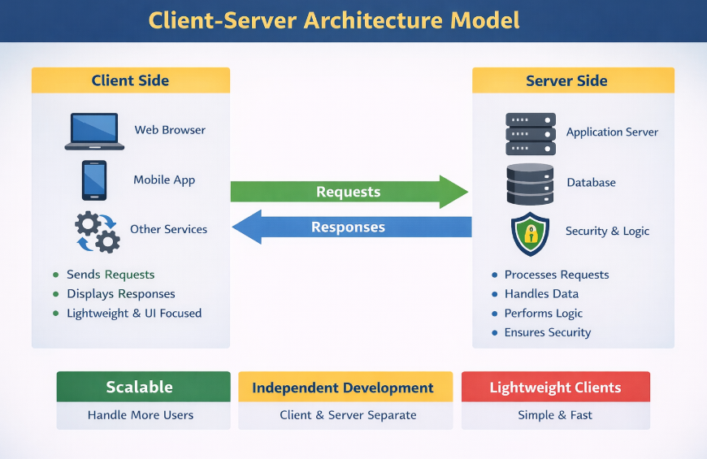
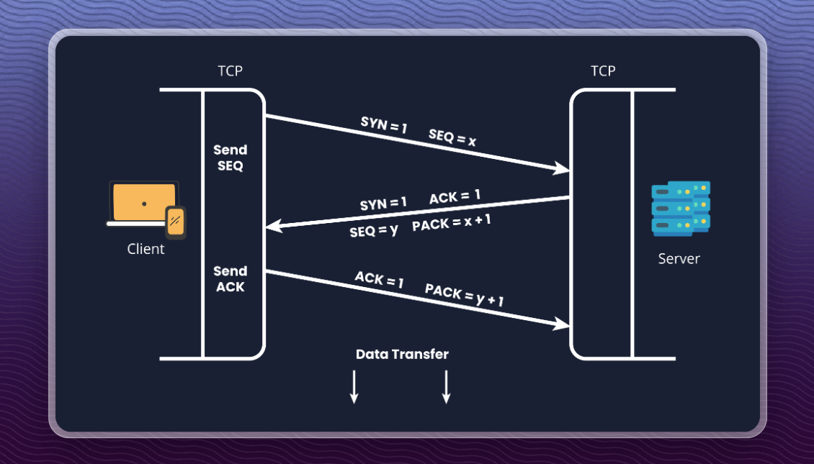
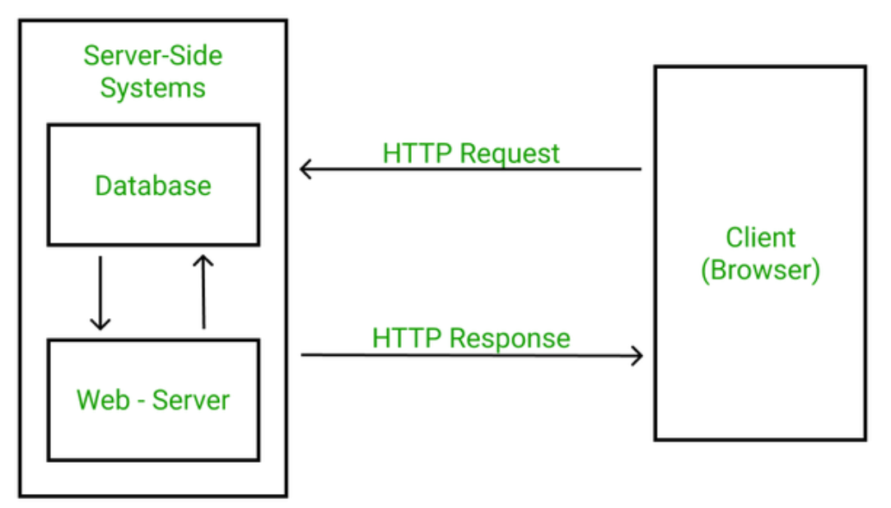
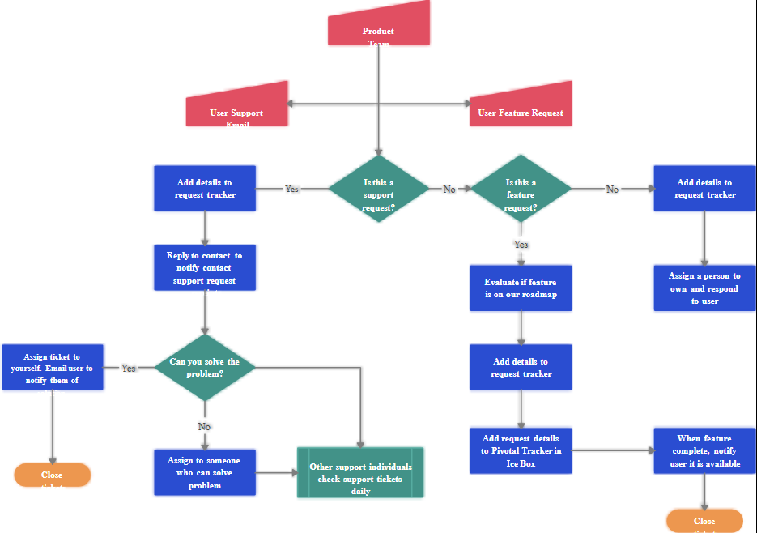

# SECTION 2 — SYSTEM FUNDAMENTALS (NON-NEGOTIABLE)

This section decides whether the interviewer believes you actually understand how systems work.

## 2.1 CLIENT–SERVER MODEL

Client–Server = separation of responsibility.

### Interview Question — What is the client–server model?

Answer -

The client–server model separates concerns: the client handles user interaction, and the server handles business logic & data.

Example -
Browser / Mobile App → Client
Backend API → Server
Database → Server-side component

Why does this matter?

1. Enables scaling - You can scale the server without changing the client.

Simple explanation:
Many clients → one backend
Add more servers when users grow

Because servers can be scaled independently to handle more users.

2. Allows independent development - Client and server can be built and changed separately.

Simple explanation:

Frontend team works on UI

Backend team works on APIs

They communicate via contracts (APIs)

Interview line: Client and server teams can work independently without blocking each other.

3. Keeps clients lightweight

Meaning: Clients don’t do heavy work.

Simple explanation:

Browser/mobile only sends requests

Server handles logic, data, security

Interview line: "Clients remain simple while servers handle complex processing."

#### Counter-Question: Can a database be a client?

"No. A database is a server-side component that responds to requests."

❌ Common mistake — Saying client = frontend only.
✅ Correct — Client = any request initiator.

## 2.2 END-TO-END REQUEST–RESPONSE LIFECYCLE (VERY IMPORTANT)

### Interview Question — Explain a web request end to end.

Answer -

User performs an action (click, submit)

Client creates an HTTP request

Request travels over the network

Request reaches load balancer (if present)

Load balancer routes to backend service

Backend executes business logic

Backend reads/writes data from cache or database

Server sends HTTP response with status code

Client renders the response

One-line version - A user action triggers an HTTP request that flows through backend logic and data layers and returns a response to the client.

#### Counter-Question: Where does authentication happen?

"At the backend, usually before business logic execution."

## 2.3 STATELESS VS STATEFUL SYSTEMS

Servers store client session data to remember the user between requests.

HTTP is stateless by default.

That means:

Every request looks like a new request.

Server forgets the user after responding.

So if the server needs to: - Know who the user is - Remember what they did earlier - Maintain ongoing interactions

👉 It needs session data.

### What kind of things are stored in session data?

Examples:

User login status.
Shopping cart contents.
User preferences (temporary).
Permissions for the session.

Concrete example -

Without session data ❌

User logs in.
Next request → server forgets them.
User must log in again.

With session data ✅

User logs in.
Server stores session ID + data.
Next requests → server recognizes the user.

### Interview Question — What is a stateless system?

Answer - "A stateless system does not store client session data on the server; each request is independent."

Stateless characteristics -
No session stored on server.
Easy horizontal scaling.
Load balancer can route to any instance.

Real-world example -
Fetch user profile via API.

Each request includes -
Authorization token.
Request parameters.

Server -
Verifies token.
Processes request.
Forgets client after responding.

👉 No session stored.

Example - REST APIs are stateless because each request contains all the information needed.

### Interview Question — What is a stateful system?

Answer - "A stateful system stores client state on the server across requests."

Stateful characteristics.

Session stored on server.

### Why are stateful systems harder to scale?

In a stateful system:

Server stores session data (login, cart, context)

That data lives on one server.

👉 The client now depends on that server.

1️⃣ User growth problem (scaling storage)

What happens when users grow ?

One server cannot store all session data.

Memory and storage become a bottleneck.

So we try to: 👉 Add new servers to handle more users.

2️⃣ State sharing problem (core issue)

Now comes the real problem:

Session data exists on Server A

A new request may go to Server B

❌ Server B does not have the session data

To fix this, we must: Share session data between servers.

Use a central session store (Redis / DB)

This adds: Extra network calls, Latency, Complexity

3️⃣ Load balancer limitation (your exact point)

If session data is tied to a server:

Load balancer cannot freely route requests

It must always send the user to the same server

This requires sticky sessions. Sticky sessions mean a user's requests are always routed to the same server.

Problems:

Uneven load

Poor scaling

Harder failover - When one server fails, it is difficult to move users to another server without losing their session or data.

👉 This is why stateful systems don't scale smoothly.

4️⃣ Single Point of Failure (SPOF)

If session data lives on one server, Server crashes → session data lost → Users are logged out → In-progress actions break (cart, checkout)

Even with shared storage: Central session store can also become SPOF → Needs replication, backups, monitoring → More complexity again.

Example - Shopping Cart Stored on Server

### Why is this stateful?

Cart items are stored in server memory or database.

Server must remember cart between requests.

Example - User adds items → cart is saved on the server → retrieved on next request.

📌 If session data is lost → cart is lost.

Interview line - "Shopping carts stored on the server are a common example of stateful systems."

#### Counter-Question: Which is better? stateless or stateful.

"Stateless systems scale better; stateful systems are simpler but limit scalability."

## 2.4 SYNCHRONOUS VS ASYNCHRONOUS COMMUNICATION

### Interview Question — What is synchronous communication ?

Answer - "Synchronous communication means the client waits until the server responds."

Examples: Login , Fetch user profile , Checkout confirmation

### Interview Question — What is asynchronous communication?

Answer — "Asynchronous communication allows the client to continue without waiting for the task to finish."

1. Email sending -

What happens
User clicks "Sign up"
Email must be sent (verification / welcome)

Why async
Sending email involves:
External mail server
Network delay
User should not wait for email to be sent

👉 Email is sent in background
👉 User immediately sees success message

One-liner - "Email sending is async because it’s slow and not required for immediate user response."

2. Notifications

What happens
User places an order
System sends SMS / push notification

Why async
Notification delivery Depends on third-party services Can be delayed or retried.
User action is already completed.

👉 Notification is not blocking the main flow.
One-liner - "Notifications are async because they are secondary actions and should not block user flow."

3. File processing

What happens
User uploads a file
System resizes / scans / converts it

Why async
File processing is CPU-intensive which takes time
User only needs confirmation that upload succeeded

👉 Processing happens after upload

One-liner - "File processing is async because it is time-consuming and should not delay user response."

#### Counter-Question: Why use async?

"To avoid blocking users for long-running tasks and improve system responsiveness."

❌ Common mistake — Making everything async
✅ Correct — Use async only where immediate response is not required.

## 2.5 REST API BASICS (ARCHITECT LEVEL)

Interview Question — What is REST?

Answer —"REST is an architectural style where systems communicate using standard HTTP methods and stateless requests."

HTTP METHODS (ONLY THESE MATTER)

GET → Read data
POST → Create data
PUT → Update data
DELETE → Remove data

REQUEST / RESPONSE BASICS -

Request contains:
Method
Headers
Body (optional)

Response contains:
Status code
Headers
Body

STATUS CODES (BASIC AWARENESS)

200 Success
201 Created
400 Bad request
401 Unauthorized
403 Forbidden
404 Not found
500 Server error

#### Counter-Question: Do architects need to memorize all codes?

"No. Architects need awareness, not memorization."

✅ SECTION 2 — CHECKPOINT (Memorize this)

"A client sends an HTTP request triggered by user action.

The request reaches the backend, possibly via a load balancer.

The backend executes business logic, interacts with cache or database,and returns a response with a status code.

Stateless services scale better, and asynchronous processing is used for long-running tasks."

If you can say this calmly in under 1 minute,

👉 You pass Section 2.

🔑 What interviewers conclude after this section

You understand real systems.

You are not guessing.

You are architecture-ready.
