# SECTION 3 — Application Architecture

Goal: Choose the right structure, not fancy ones.

This section decides whether the interviewer trusts your architectural judgment.

## 3.1 MONOLITHIC ARCHITECTURE

### Interview Question - What is a monolithic architecture?


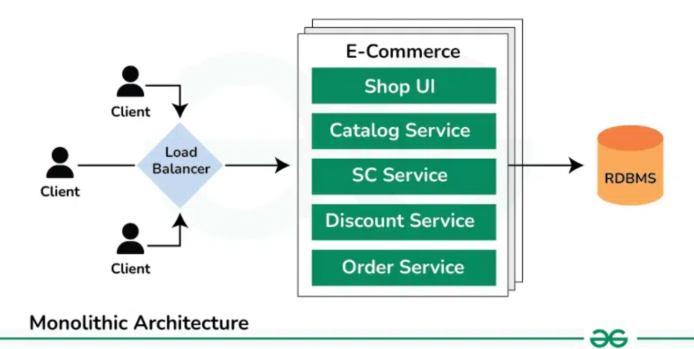

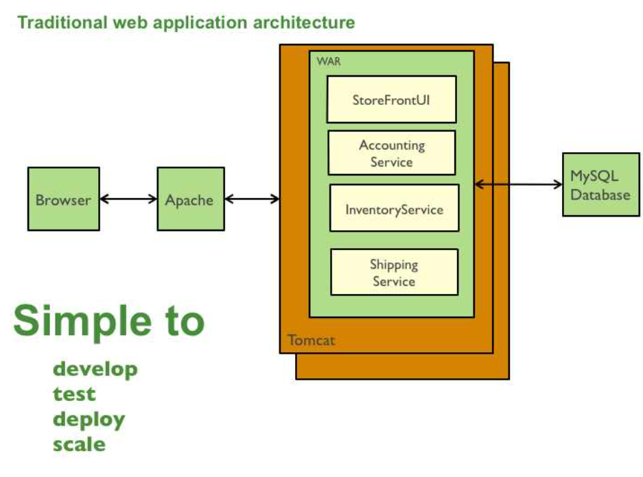

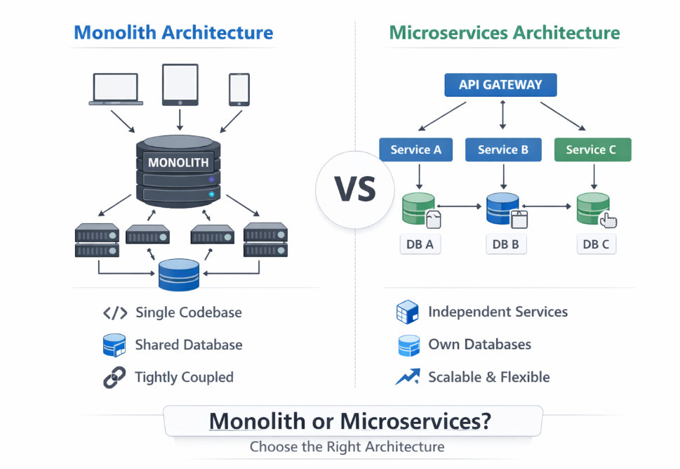

Answer —

Monolithic architecture is a software design where all parts of an application are built, deployed, and run together as a single unit.

In a monolith -

👉 UI

👉 Business logic

👉 APIs

👉 Authentication

👉 Database access

All live in one codebase and are deployed together.


### What does "single unit" mean ?

👉 One codebase.

👉 One build.

👉 One deployment.

👉 One runtime.

👉 Usually one database.


### Why developers use monoliths ?

1️⃣ Simplicity

Easy to build for small teams.

Easy to test and debug.

Easy to deploy (single package).

One application → one build → one deployment


2️⃣ Easy debugging -

No network calls between components.

All logs & errors are in one place, because the app runs as one single process.


### When is a monolith the RIGHT choice ?


Small teams.

Early-stage products.

Unclear requirements.

Low to medium traffic.

"Most large systems start as monoliths."


#### Counter-Question: Are monoliths bad ?

No. 

Monoliths become problematic only when scale and team size grow.


1.	Hard to scale - You can't scale just one feature (like login); you must scale the whole app → waste of resources.

2.	Tightly coupled - Change in one module (e.g. payments) can break others → more testing needed.

3.	Slows development - Large codebase, team conflicts, harder to maintain.

4.	Less flexible - Can't use new tech for just one part (e.g. new DB for analytics). Innovation slows down.


## 3.2 MODULAR MONOLITH (VERY IMPORTANT CONCEPT)


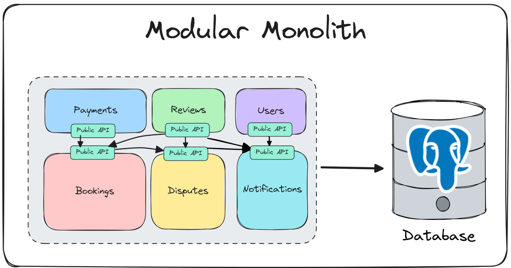

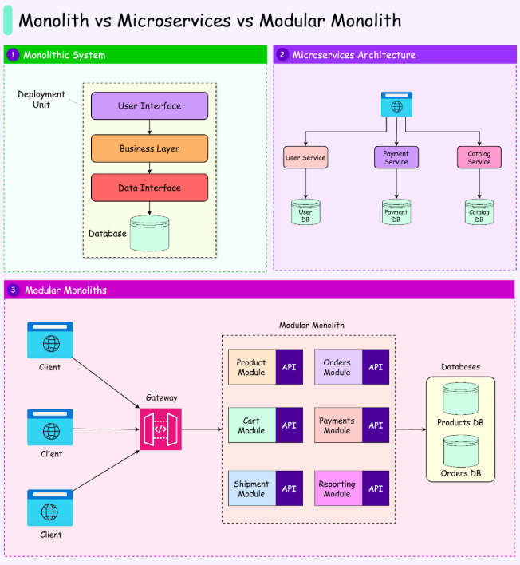

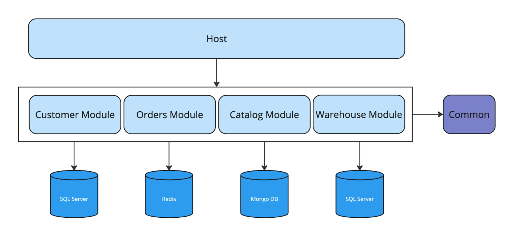


### Interview Question — What is a modular monolith?

Answer - A modular monolith is a single application that is internally divided into well-defined modules, where each module has clear boundaries and responsibilities.


### 🔒 What stays the same ?

👉 One codebase.

👉 One build.

👉 One deployment.

👉 One runtime.

👉 Usually one database.

It is still a monolith.


### 🧱 What changes ?

👉 Code is split into independent modules.

👉 Each module owns its own business logic.

👉 Modules interact only through public interfaces. One module can only talk to another module using methods that are intentionally exposed and cannot touch its internal code or data directly.No shared internal logic between modules.


ATM example -

You want money from a bank.

You use an ATM screen + buttons.

You don’t access the bank's internal systems.

ATM screen = public interface

Bank internals = hidden


Code Example -

Payment Module (has internals + one public method) - 

```js


// payment.js

// ❌ internal (hidden – NOT exported)

function validateCard() {
  console.log("Validating card...");
}

// ❌ internal (hidden)
function deductMoney(amount) {
  console.log("Deducting", amount);
}

// ✅ public interface (exported)
export function makePayment(amount) {
  validateCard();
  deductMoney(amount);
  console.log("Payment successful");
}

```

Order Module (uses ONLY the public interface) - 

```js

// order.js

import { makePayment } from "./payment.js";

function placeOrder() {
  makePayment(500);   // ✅ allowed
}

placeOrder();


```

What Order Module CANNOT do

```js

// ❌ NOT allowed — breaks module boundary

import { validateCard } from "./payment.js";


```
👉 validateCard is internal and not accessible.


What this proves - 

Order module does not know how payment works.

Payment module can change internally anytime.

Order module stays safe.


📂 Folder Structure (mental picture) - 

```js

src/
 ├── payment/
 │    ├── payment.js
 ├── order/
 │    ├── order.js

 ```


📦 Example modules - 

User module

Order module

Payment module


Each module can be developed and tested independently, even though the app deploys together.


### Why does this matter?

👉 Prevents tight coupling.

👉 Improves maintainability.

👉 Makes the codebase scalable for teams.

👉 Makes future microservice migration easier.


Maintainability = how easy it is to:

👉 Understand the code

👉 Change the code

👉 Fix bugs

Add new features without breaking others


In a modular monolith:

Each module has a clear responsibility.

Code is organized by business domain, not random folders.

Changes stay inside one module.

Example:

Need to change Payment logic ?

👉 You touch only the Payment module.

👉 Lower risk, less testing, faster change.


 Interview line: "A modular monolith provides structure without distributed-system complexity."

❌ BEFORE: Traditional Monolith (Tight Coupling) - 


orderController.js - 

```js

// ❌ Order logic + Payment logic mixed together

import Order from "./orderModel.js";

let walletBalance = 1000;

export async function placeOrder(req, res) {

  const { item, price } = req.body;

  // ❌ payment logic directly inside order logic


  // payment rule #1

  if (walletBalance < price) {
    return res.status(400).json({ error: "Payment failed" });
  }

  walletBalance -= price;

  const order = await Order.create({ item, price });

  res.json(order);
}


```
🚨 Problems -

Order depends on payment internals.

Changing payment rules forces order changes.

Hard to test or modify.

👉 This is tight coupling.


✅ AFTER: Modular Monolith (Clean Boundaries)

We split logic into modules with public interfaces

📦 Payment Module - paymentService.js - 

```js

let walletBalance = 1000;

// ✅ Public interface

export function makePayment(amount) {
  if (walletBalance < amount) {
    throw new Error("Payment failed");
  }

  walletBalance -= amount;
}


```

📦 Order Module - orderService.js

```js

import Order from "./orderModel.js";
import { makePayment } from "../payment/paymentService.js";

export async function placeOrder(item, price) {

  makePayment(price); // ✅ interface, not internals

  return await Order.create({ item, price });
}


```

📦 Controller - orderController.js

```js


import { placeOrder } from "./orderService.js";

export async function createOrder(req, res) {
  try {
    const order = await placeOrder(req.body.item, req.body.price);
    res.json(order);
  } catch (err) {
    res.status(400).json({ error: err.message });
  }
}


```


1️⃣ Prevents Tight Coupling -

Seen in code:

Order does NOT know wallet logic.

Order only calls makePayment().

makePayment(price); // contract-based call.

👉 Payment internals can change freely.

👉 Order stays safe.


2️⃣ Improves Maintainability -

Meaning (via code):

Want to change payment rules ?

👉 Change only paymentService.js file.


No need to touch: Order service, Controllers

Routes - 

✅ Smaller changes.
✅ Lower risk.
✅ Easier debugging.


3️⃣ Makes Codebase Scalable for Teams.

Team ownership (real-world)

Team A → Order module

Team B → Payment module


From code:

Separate files

Clear responsibilities

Minimal conflicts

👉 Multiple teams work in same repo without stepping on each other.

⚠️ This is team scalability, not traffic scaling.


4️⃣ Makes Future Microservice Migration Easier

👉 If your Order module already talks to Payment via a function,

👉 later you can replace the internal logic with a network call using fetch,

👉 and Order code does NOT change.

That’s why modular monoliths are microservice-ready.


✅ TODAY — Modular Monolith (Same App) . orderService.js

```js

import { makePayment } from "../payment/paymentService.js";

export function placeOrder(price) {
  makePayment(price);   // Order only knows the amount (price) that needs to be paid. Order does NOT know how payment is done
  return "Order placed";
}

```

👉 Order does not care how payment happens.


paymentService.js (Local implementation)

```js

let walletBalance = 1000;

export function makePayment(price) {
  if (walletBalance < price) {
    throw new Error("Payment failed");
  }

  walletBalance -= price;
}

```


🔄 TOMORROW — Payment Becomes a Microservice

Only paymentService.js changes


```js

// paymentService.js

export async function makePayment(price) {
  const response = await fetch("http://payment-service/pay", {
    method: "POST",
    headers: { "Content-Type": "application/json" },
    body: JSON.stringify({ price })
  });

  if (!response.ok) {
    throw new Error("Payment failed");
  }
}

```


👉 The payment logic has moved to the Payment microservice.
👉 This function is now only a client / adapter that talks to that service.
👉 The service code implementation lives inside the Payment Microservice,
👉 NOT in the Order app anymore.

🧱 Architecture - 

Order Service (your app)
   |
   |  fetch("/pay")
   v
Payment Service (separate app)


🚨 Critical Point - 

orderService.js stays EXACTLY the same.
makePayment(price);

✅ No refactor.
✅ No touching order logic.
✅ No ripple effects.


🧠 Why this works

Because:
Order depends on a function interface. makePayment(price);
Not on payment internals.Order does NOT know tax calculation , retry logic,validation rules.Those live inside Payment module / service
Not on database.Order does NOT know: where balance is stored , MongoDB / SQL / Redis , tables or collections
Not on wallet logic.Order does NOT know: wallet balance , card / UPI logic, payment method

So:
Local function today.
Network call tomorrow.

👉 Caller doesn't care.


#### Counter-Question: Why not use microservices directly?


"Because modular monoliths give most benefits with far less operational overhead."


## 3.3 MICROSERVICES ARCHITECTURE


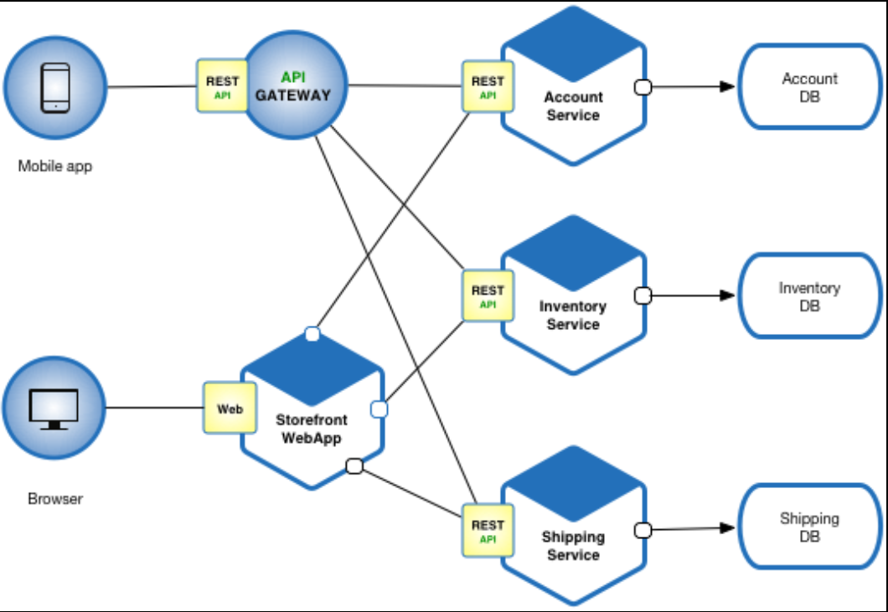

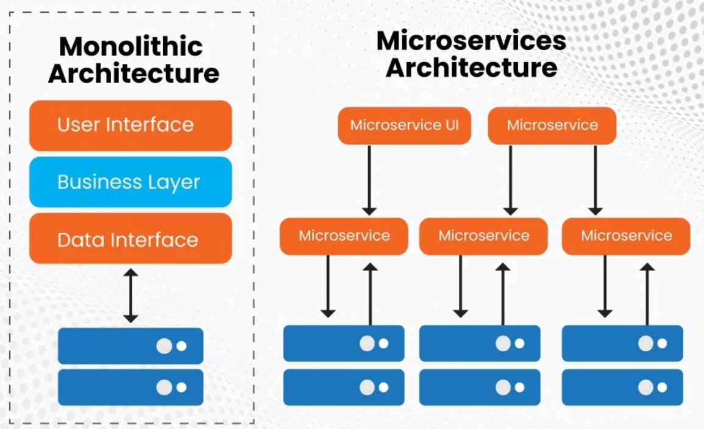

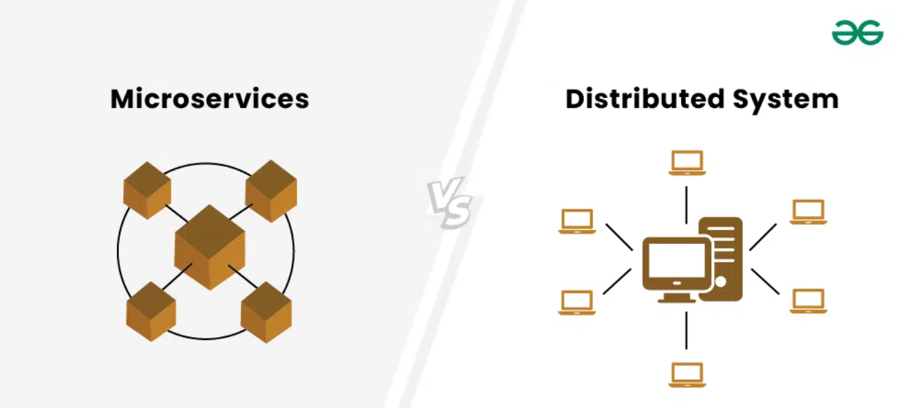


### Interview Question - What is a microservices architecture?

Answer -

Microservices architecture splits an application into small, independently deployable services that communicate over the network.

Key characteristics

1️⃣ Has its own deployment

Meaning:

Each service is built and deployed separately

Updating Payment does not redeploy Order or User

Why it matters:

Faster releases

Lower blast radius (one service fails, others keep running)


2️⃣ Owns its own data

Meaning:

Each service has its own database

No other service directly touches it

Order Service → Order DB
Payment Service → Payment DB
User Service → User DB


Why it matters:

Prevents tight coupling

Teams can change schemas independently


3️⃣ Can scale independently

Meaning:

You scale only the busy service.

Example:

High payments → scale Payment Service.

Low orders → don’t scale Order Service.

Why it matters:

Cost-efficient

Better performance under uneven load


4️⃣ Communication via HTTP or messaging


Services talk via:

HTTP/REST or gRPC (sync)

Message queues/events (async)

Order → HTTP → Payment
Order → Event → Shipping


### Why do teams adopt microservices?

1️⃣ Independent scaling

Each service scales based on its own traffic.

No need to scale the entire system.

2️⃣ Independent deployments

Teams release features without coordination hell.

Faster CI/CD.

3️⃣ Team autonomy

Teams own services end-to-end

Team A → Order
Team B → Payment
Team C → Search

### ⚠️ Hidden Costs (VERY IMPORTANT — interviewers LOVE this)


These are the reasons microservices hurt teams if adopted blindly.


1️⃣ Network latency

Meaning:

Function call → milliseconds
Network call → tens/hundreds of milliseconds
function call ❌ fast
HTTP call ❌ slower


2️⃣ Distributed debugging


Distributed debugging means debugging is harder because the system is spread across multiple services, not one application.

In a monolith:
One app
One log
One stack trace

👉 Debugging is straightforward.

In microservices:

Many services
Many logs
Many servers

👉 You must trace a single request across multiple services.

User clicks "Place Order"

Frontend
  ↓
Order Service
  ↓
Payment Service
  ↓
Inventory Service


❌ Error happens somewhere.

Now to debug:
Check Order logs
Check Payment logs
Check Inventory logs
Match request IDs
Correlate timestamps
👉 This is distributed debugging


3️⃣ Data consistency challenges
Meaning:
No shared DB.
Transactions across services are hard

Example:
Order created
Payment failed
Now system is in partial state
Requires:
retries
compensating actions
eventual consistency

📦 Real Example (Order → Payment)

Step 1: Order Service
Order created ✅

Step 2: Payment Service
Payment failed ❌


Now the system is in a partial state:
Order exists
Payment does not
❌ This is inconsistent

Compensating Action (Fix) - 

Order Service performs a compensating action:

Cancel the order
OR
Mark order as FAILED


👉 This restores consistency

🧠 Think of it like this

"If you can’t rollback, you compensate."


Order Service (simplified)

```js

try {
  createOrder();
  await pay();
} catch {
  cancelOrder(); // 👈 compensating action
}

```


A compensating action is an operation that reverses or corrects a previously completed step when a later step fails in a distributed system


Real life example- "If payment fails after booking a cab, the ride is cancelled."


4️⃣ DevOps & observability overhead

Meaning: You now need:

CI/CD pipelines
Monitoring.
Alerts.
Distributed tracing.
Service discovery.
Load balancing.

👉 Operational complexity explodes


"Microservices move complexity from code to operations."

Meaning: Code becomes simpler per service , Infrastructure and ops become harder

Microservices help at scale, but cost more to operate.


#### Counter-Question: Are microservices always better?

"No. Microservices solve scaling and organizational problems, not development problems."

What this REALLY means:

If you have: small team , simple app , low traffic
❌ microservices will slow you down


"Microservices enable independent scaling, deployment, and team ownership, but introduce operational complexity such as network latency, distributed debugging, and data consistency challenges."


## 3.4 LAYERED ARCHITECTURE

Layered Architecture is a backend design pattern.


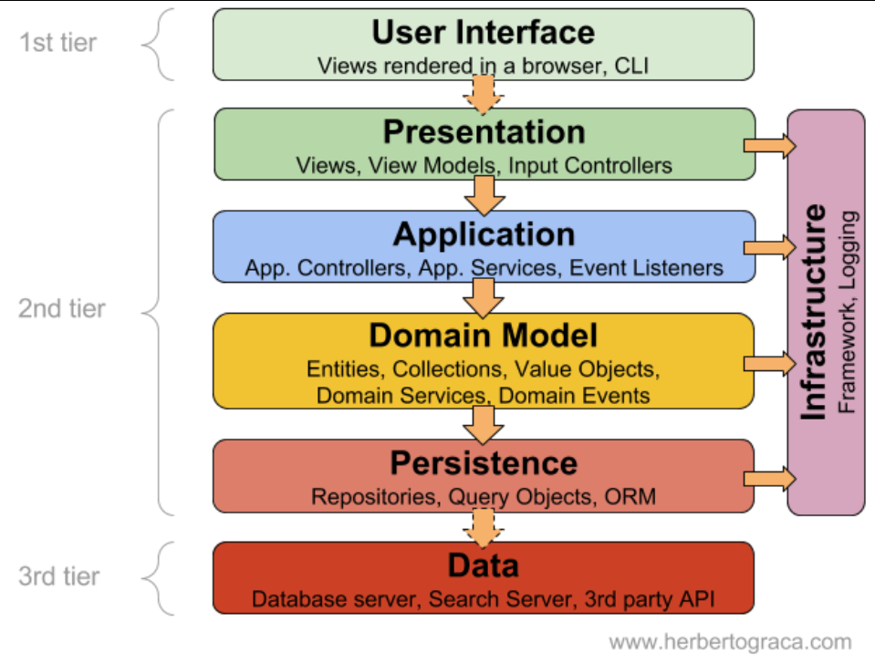

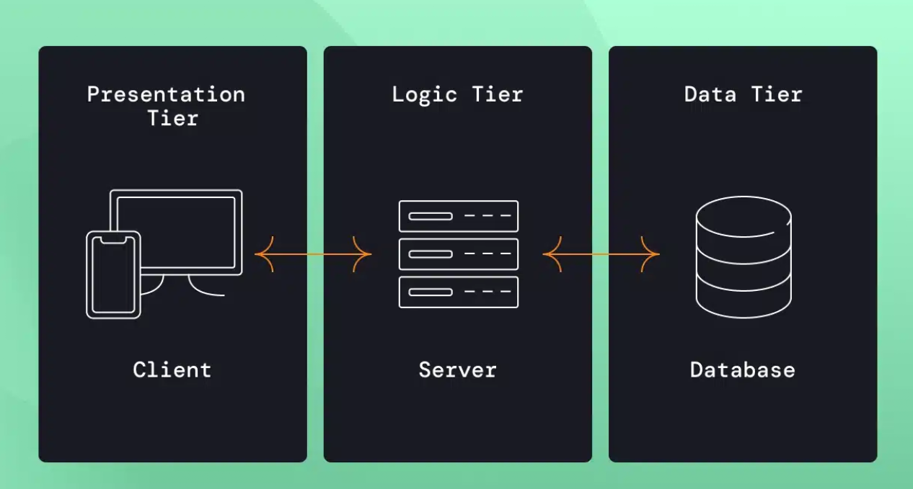

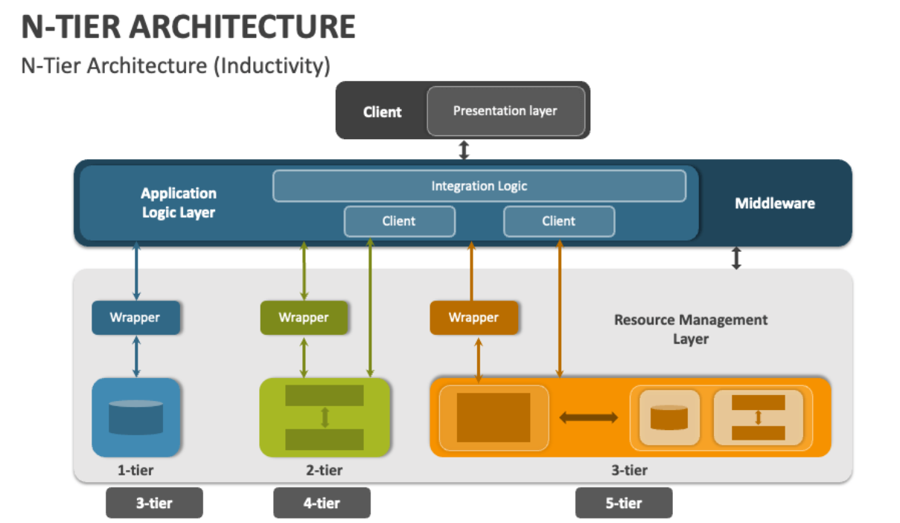

### Interview Question — What is layered architecture?


Answer — Layered architecture is a design approach where a system is organized into logical layers,
with each layer having a single, well-defined responsibility.

🧱 Core Layers -

1️⃣ Presentation Layer (Controller) -

Responsibility -
Handle HTTP.
Validate input.
Send response.

❌ No business rules.
❌ No DB access.


2️⃣ Business Logic Layer (Service)

Responsibility -
Business rules
Decisions
Workflow

❌ No HTTP.
❌ No DB queries.


3️⃣ Data Access Layer (Repository)

Responsibility -
Database interaction
ORM / queries

❌ No business decisions
❌ No request handling


Frontend (React) — Just sends request

```js

import { useState } from "react";

export default function RegisterMini() {
  const [email, setEmail] = useState("test@example.com");
  const [password, setPassword] = useState("password123");
  const [msg, setMsg] = useState("");

  async function submit() {
    setMsg("Loading...");
    const res = await fetch("http://localhost:3000/users/register", {
      method: "POST",
      headers: { "Content-Type": "application/json" },
      body: JSON.stringify({ email, password }),
    });
    const data = await res.json();
    setMsg(res.ok ? `✅ ${data.message} (id=${data.userId})` : `❌ ${data.error}`);
  }

  return (
    <div>
      <input value={email} onChange={(e) => setEmail(e.target.value)} />
      <input value={password} type="password" onChange={(e) => setPassword(e.target.value)} />
      <button onClick={submit}>Register</button>
      <p>{msg}</p>
    </div>
  );
}


```
That's it — UI just sends data and shows response.

Additional details - 

headers: { "Content-Type": "application/json" } tells the server:

👉 "The data I’m sending in the request body is JSON."


body: JSON.stringify({ email, password })

👉 HTTP request bodies can only send text or bytes, not JavaScript objects.
👉 { email, password } is a JavaScript object which exists only inside JavaScript memory and  cannot be sent directly over the network.


fetch() sends data as text
fetch expects the body to be:
a string
or binary data
❌ It cannot send raw JS objects.


# >>>>>>>>>>>>>>


✅ Backend (3-Layer Architecture) -

Folder structure
backend/
  server.js
  routes.js
  controllers/userController.js
  services/userService.js
  repositories/userRepository.js


0) server.js (boot + middleware)

```js

// Import the Express framework. Express helps us create an HTTP server easily 

import express from "express";


// Import application routes (controllers are connected there)

import routes from "./routes.js";


// Create an Express application instance

const app = express();


// --------------------
// Middleware section
// --------------------

// Parse incoming request bodies that are JSON.
// Converts JSON request body → JS object → available as req.body

app.use(express.json());


// ------------------------------------------------------
// CORS Middleware (for frontend → backend communication)
// ------------------------------------------------------

// This allows requests from browsers running on a different origin
// (e.g., React on localhost:5173 calling API on localhost:3000)


app.use((req, res, next) => {

  // Allow requests from ANY origin (*).
  // In production, this should be a specific domain.

  res.setHeader("Access-Control-Allow-Origin", "*");
  res.setHeader("Access-Control-Allow-Headers", "Content-Type");
  res.setHeader("Access-Control-Allow-Methods", "GET,POST,PUT,DELETE,OPTIONS");
  if (req.method === "OPTIONS") return res.sendStatus(204);
  next();
});

app.use(routes);

app.listen(3000, () => console.log("API running on http://localhost:3000"));

```


👉 From the UI, you send JSON as a string
👉 On the server, express.json() parses that string into a JavaScript object


1️⃣ Presentation Layer = Controller
✅ Handle HTTP + validate input + send response
❌ No business rules, ❌ No DB access
controllers/userController.js

```js

import { registerUser } from "../services/userService.js";

// 🟦 Controller = HTTP only
export async function registerUserController(req, res) {
  try {
    // ✅ Handle HTTP: read req.body
    const { email, password } = req.body;

    // ✅ Validate input (basic presence checks only)
    if (!email || !password) {
      return res.status(400).json({ error: "Email and password are required" });
    }

    // ❌ No business rules here (no password policy / uniqueness checks)
    // ❌ No DB here (no repository calls)

    const user = await registerUser(email, password);

    // ✅ Send response
    return res.status(201).json({ message: "User registered", userId: user.id });
  } catch (err) {
    return res.status(400).json({ error: err.message });
  }
}

```


2️⃣ Business Logic Layer = Service
✅ Business rules + decisions + workflow
❌ No HTTP, ❌ No DB queries
services/userService.js


```js

import { findUserByEmail, saveUser } from "../repositories/userRepository.js";

// 🟥 Service = rules + workflow
export async function registerUser(email, password) {
  // ✅ Business rule (lives here)
  if (password.length < 8) {
    throw new Error("Password must be at least 8 characters");
  }

  // ✅ Decision: unique email
  const existing = await findUserByEmail(email);
  if (existing) {
    throw new Error("User already exists");
  }

  // ✅ Workflow step (mock hashing)
  const userToSave = { email, passwordHash: "hashed_" + password };

  // ❌ No HTTP here (no req/res, no status codes)
  // ❌ No DB queries here (no direct DB calls) — only repository

  return await saveUser(userToSave);
}

```


3️⃣ Data Access Layer = Repository
✅ DB/ORM/queries
❌ No business decisions, ❌ No request handling
repositories/userRepository.js
// pretend DB (in-memory). Replace later with Mongo/Mongoose.
const users = [];

// 🟩 Repository = data access only
export async function findUserByEmail(email) {
  // ✅ data query
  return users.find((u) => u.email === email) || null;
}

export async function saveUser(user) {
  // ✅ data insert
  const saved = { id: users.length + 1, ...user };
  users.push(saved);
  return saved;
}

// ❌ No business rules here (no password checks)
// ❌ No HTTP here (no req/res)


Routing glue: routes.js
import express from "express";
import { registerUserController } from "./controllers/userController.js";

const router = express.Router();
router.post("/users/register", registerUserController);

export default router;


✅ This code PROVES your 3 points
Controller proves:

✅ reads HTTP request (req.body)

✅ validates input (presence)

✅ returns HTTP response

❌ no password rule

❌ no DB access

Service proves:

✅ password rule + “user exists” decision

✅ workflow (hashing step)

❌ no req/res

❌ no DB queries (only calls repository)

Repository proves:

✅ data operations only

❌ no business rules

❌ no HTTP


###  Why does layered architecture matter?

1️⃣ Clear separation of concerns

Each layer has one job, which keeps code clean and understandable.

2️⃣ Easier testing

Business logic can be tested without UI

Database can be mocked

3️⃣ Easier maintenance

Change UI → business logic stays safe

Change DB → business rules stay safe

👉 Less ripple effect.

🎯 Interview Power Line (MEMORIZE)

“Layered architecture improves maintainability and testability by enforcing clear separation of concerns.”


####  Counter-Question: Can layers be bypassed?

❌ Correct Answer

"No. Bypassing layers creates tight coupling and fragile systems."

Why?

If:

Controller talks directly to DB

Business logic is skipped

Then:

Changes ripple everywhere

Testing becomes hard

System becomes fragile


3.5 COMPONENT-BASED ARCHITECTURE


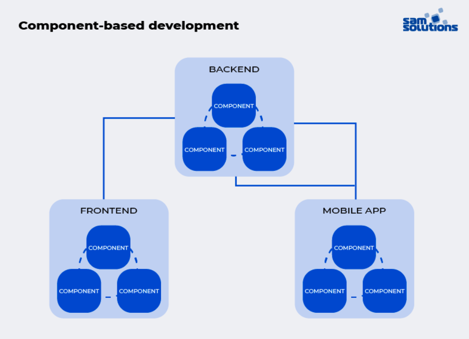


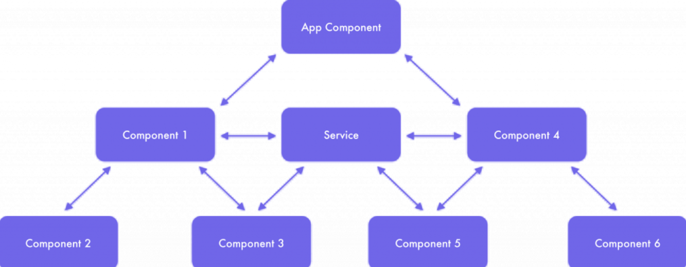

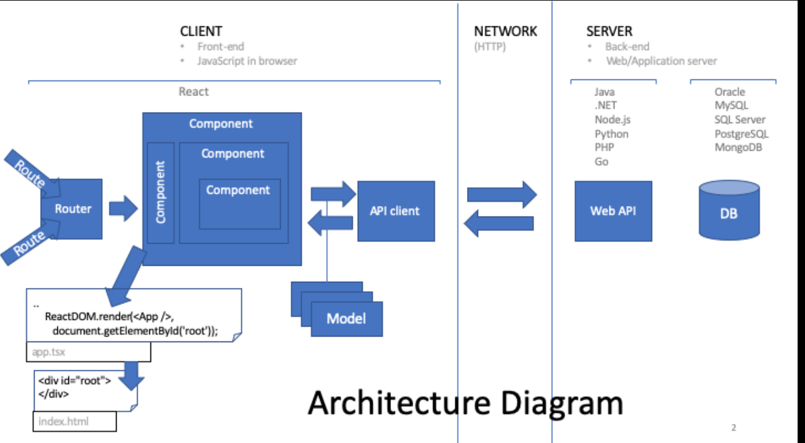

Interview Question — What is component-based architecture?

Answer —
Component-based architecture builds systems using reusable, self-contained components.

Characteristics

Single responsibility

Reusable

Independently testable

Commonly used in frontend frameworks (React, Angular).

Interview line:

“Component-based architecture improves reuse and consistency.”


3.6 API GATEWAY — WHAT & WHY

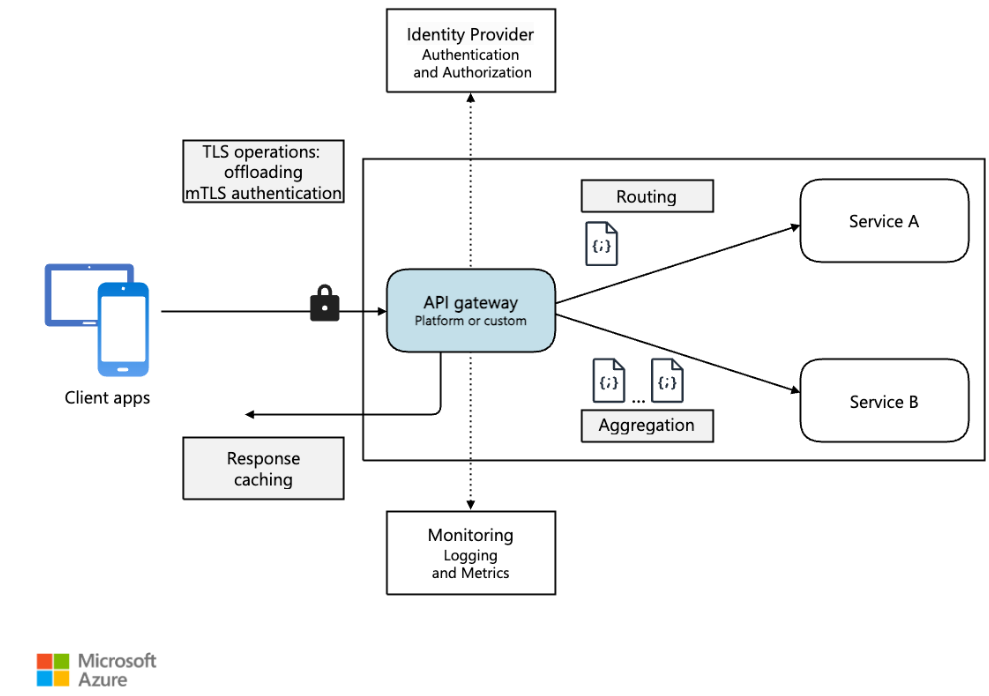

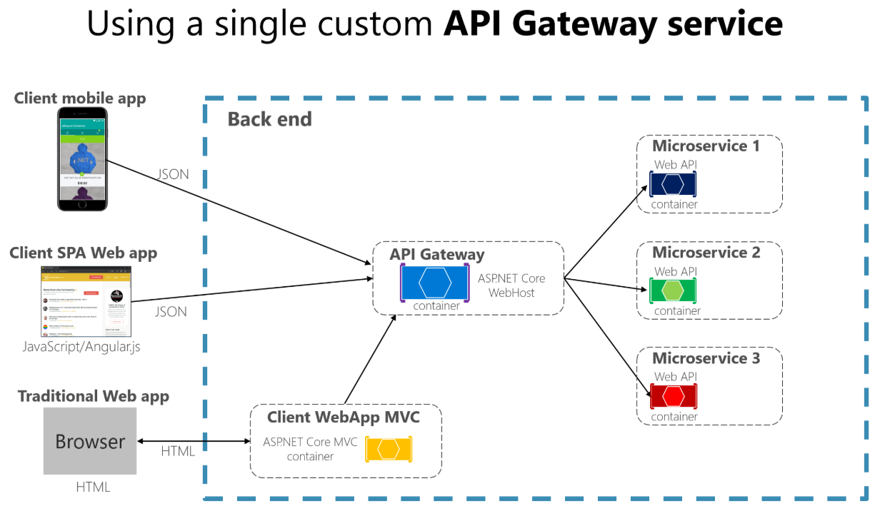

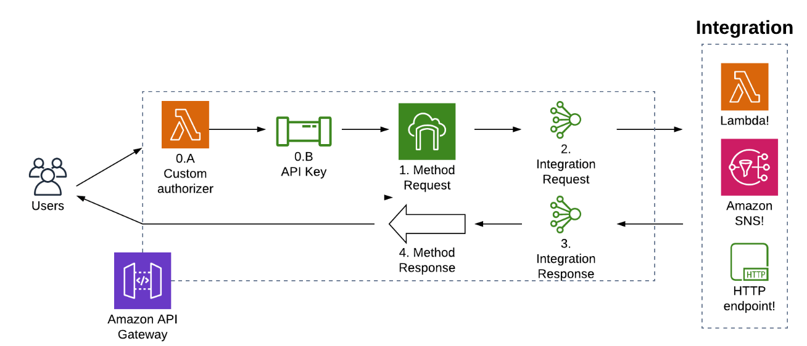


Interview Question — What is an API Gateway?

Answer —
An API Gateway is a single entry point between clients and backend services.

Why is it needed?

Request routing

Authentication & authorization

Rate limiting

Aggregation

Logging & monitoring

Why not expose services directly?

Because:

Clients become tightly coupled to services

Security becomes harder

Internal architecture leaks to clients

Interview line:

“An API Gateway hides backend complexity from clients.”

# >>>>>>>>>>>>>>


## 3.7 WHEN NOT TO USE MICROSERVICES (TRAP QUESTION)

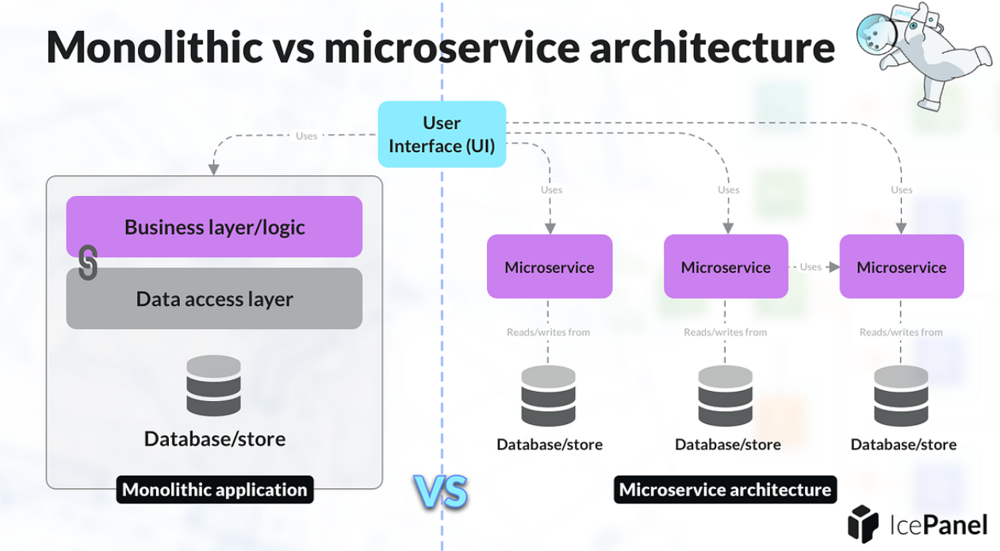


Do NOT use microservices when:

Small team.
Early-stage product.
Unclear domain boundaries
No DevOps maturity
Low traffic.
Simple business logic.

A domain boundary answers questions like:

What does Order own?
What does Payment own?
What does User own?


✅ SECTION 3 — CHECKPOINT
You must confidently answer:

❓ Why not microservices from day one?

Perfect answer —

"Because microservices introduce operational and architectural complexity.
For early-stage systems, a well-designed modular monolith delivers faster development, lower cost, and easier maintenance.
Microservices should be introduced only when scale, team size, and domain complexity justify them."

If you can say this calmly:

👉 You pass Section 3
👉 You sound senior
👉 You show architectural judgment

🔑 What interviewers conclude after this section

You understand trade-offs.
You don’t chase trends.
You think like an architect.
