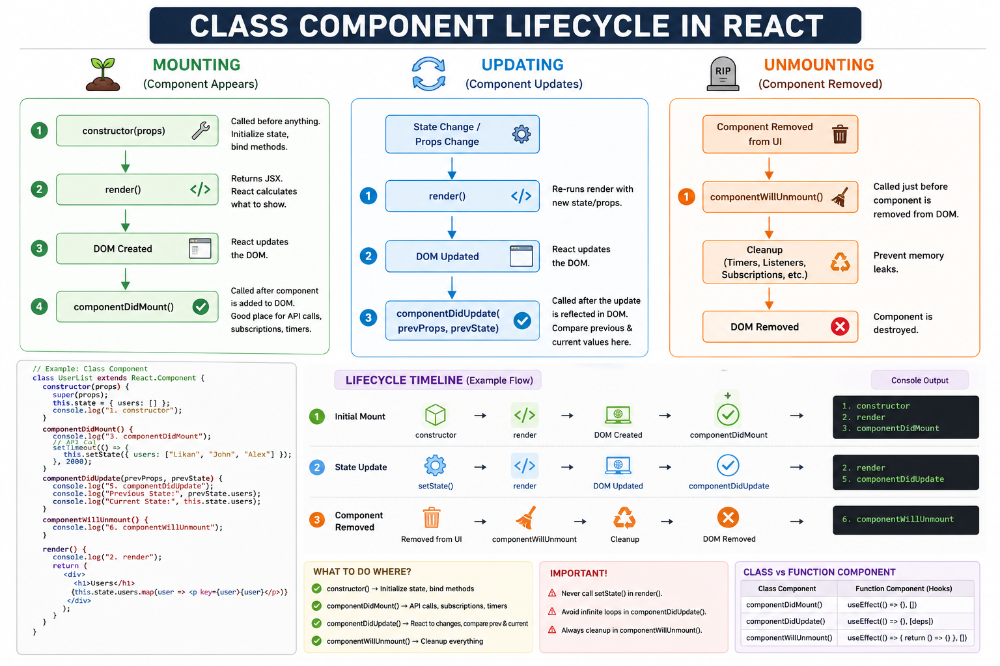
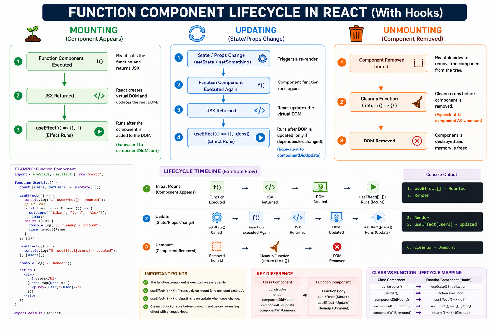

📖 Topic 4.1 — Component Creation

Before learning Component Creation, remember:

So far we've been writing:

<h1>Hello</h1>

<button>Login</button>

<input />

These are normal React Elements.

Question:

What if we need the same UI in 20 places?

First Question

Imagine an application:

Login Page

Login Button

Signup Page

Login Button

Forgot Password Page

Login Button

Should we write:

<button>Login</button>

again and again?

No.

That creates duplication.

The Problem

Without Components:

function App() {
  return (
    <div>

      <button>Login</button>

      <button>Login</button>

      <button>Login</button>

      <button>Login</button>

    </div>
  );
}

Imagine:

100 Buttons

100 Cards

100 Tables

100 Forms

Changing all of them becomes painful.

React's Solution

Components.

Create once.

Reuse everywhere.

What Is A Component?

Definition:

A Component is a reusable piece of UI.

Think:

HTML Element

button
input
div

Built-in UI

React Component:

Button
Navbar
Sidebar
Card
UserProfile

Custom UI.

Creating Your First Component

Example:

function Button() {
  return (
    <button>
      Login
    </button>
  );
}

This is a Component.

Why Is It A Component?

Because:

function Button() {

starts with:

Capital Letter

React treats it differently.

Using A Component

Example:

function App() {
  return (
    <Button />
  );
}

Output:

<button>
  Login
</button>
Important Rule

HTML Elements:

<button />
<div />
<input />

lowercase.

Components:

<Button />
<Navbar />
<UserCard />

uppercase.

Why?

React uses capitalization to identify:

HTML Element

VS

React Component
What React Sees

You write:

<Button />

React transforms:

jsx(Button, {})

Notice:

Button

not:

"button"

Difference:

HTML Element:

<button />

becomes:

jsx("button", {})

Component:

<Button />

becomes:

jsx(Button, {})

Huge difference.

Internal Working

Component:

function Button() {
  return (
    <button>
      Login
    </button>
  );
}

Usage:

<Button />

React creates:

{
  type: Button,
  props: {}
}

React sees:

type = Function

Then React executes:

Button()

Result:

<button>
  Login
</button>

Then React converts that into:

{
  type: "button",
  props: {
    children: "Login"
  }
}
Complete Flow
<Button />

     ↓

React Element

{
  type: Button
}

     ↓

React Executes

Button()

     ↓

Returns

<button />

     ↓

New React Element

     ↓

Rendered
Component Tree

Example:

function App() {
  return (
    <Button />
  );
}

Tree:

App
│
└── Button
     │
     └── button

Notice:

App
Button

are Components.

button

is an HTML Element.

Why Components Are Powerful

Imagine:

Without Components

<h1>User</h1>

<p>Email</p>

repeated 50 times.

With Component:

<UserCard />

repeated 50 times.

Cleaner.

Reusable.

Maintainable.

Real World Example

Netflix:

MovieCard
MovieCard
MovieCard
MovieCard

Amazon:

ProductCard
ProductCard
ProductCard

WhatsApp:

Message
Message
Message

Everything is Components.

Component Naming Rules

✅ Correct

function Button() {}

function UserCard() {}

function LoginForm() {}

❌ Wrong

function button() {}

function userCard() {}

React may treat them as HTML tags.

Mental Model

Think:

Component

↓

Function

↓

Returns JSX

↓

Creates React Elements

↓

Rendered
Senior Engineer Mental Model

Junior Developers Think:

Component
=
Reusable UI

Correct.

Senior Developers Think:

Component
=
Function

Input
 ↓
Props

Output
 ↓
React Elements

A component is essentially:

UI Factory

You give input.

It produces UI.

Interview Questions
Q: What is a React Component?

Answer:

A React Component is a reusable piece of UI implemented as a JavaScript function or class that returns React Elements.

Q: Why must Component names start with a capital letter?

Answer:

React uses capitalization to distinguish Components from HTML elements.

Q: What happens when React sees <Button />?

Answer:

React creates a React Element whose type is Button, executes the component function, and renders the returned React Elements.

Q: Is a Component a React Element?

Answer:

No.

A Component is a function.

A React Element is the object returned after JSX transformation.

🧠 Revision Card
COMPONENT CREATION

Problem:

Repeated UI

↓

Duplication

Solution:

Component

------------------

Create

function Button() {
  return (
    <button>
      Login
    </button>
  );
}

Use

<Button />

------------------

HTML Element

<button />

↓

jsx("button")

------------------

Component

<Button />

↓

jsx(Button)

------------------

Flow

<Button />

↓

React Element

↓

Button()

↓

Returns JSX

↓

React Elements

↓

Render

------------------

Remember

Component
=
Function

Returns JSX


# >>


📖 Topic 4.2 — Component Composition

Before learning Component Composition, remember:

We learned:

function Button() {
  return (
    <button>
      Login
    </button>
  );
}

and:

<Button />

creates reusable UI.

First Question

Imagine building Netflix.

Should we write:

function App() {
  return (
    <div>

      Navbar

      Sidebar

      Movie List

      Footer

    </div>
  );
}

inside one giant component?

No.

After a few months:

1000 lines
2000 lines
5000 lines

becomes impossible to maintain.

The Problem

Without Composition:

function App() {

  return (

    <div>

      Header Code

      Menu Code

      Search Code

      Profile Code

      Movie Code

      Footer Code

    </div>

  );

}

Everything inside one file.

Huge mess.

React's Solution

Break UI into smaller Components.

Then combine them.

This is called:

Component Composition
What Is Component Composition?

Definition:

Component Composition is the process of building larger components using smaller components.

Think:

Small Components
        ↓
Combined
        ↓
Large Component
Real Life Example

A Car consists of:

Engine
Wheels
Doors
Seats

Combined together.

React works the same way.

Navbar
Sidebar
Content
Footer

Combined together.

Example

Small Components:

function Navbar() {
  return <h1>Navbar</h1>;
}
function Sidebar() {
  return <h1>Sidebar</h1>;
}
function Footer() {
  return <h1>Footer</h1>;
}

Compose Them:

function App() {

  return (

    <>
      <Navbar />
      <Sidebar />
      <Footer />
    </>

  );

}

Output:

Navbar

Sidebar

Footer
What React Sees

You write:

<App />

React creates:

{
  type: App
}

React executes:

App()

returns:

<>
  <Navbar />
  <Sidebar />
  <Footer />
</>

React sees:

{
  type: Navbar
}

{
  type: Sidebar
}

{
  type: Footer
}

Then React executes:

Navbar()

Sidebar()

Footer()

one by one.

Component Tree

Example:

<App />

Tree:

App
├── Navbar
├── Sidebar
└── Footer

After execution:

App
├── Navbar
│     └── h1
├── Sidebar
│     └── h1
└── Footer
      └── h1
Important Mental Model

React does NOT think:

Pages

React thinks:

Trees

Example:

App
├── Header
├── Main
│     ├── Sidebar
│     └── Content
└── Footer

Every React application is a Component Tree.

Nested Composition

Components can contain Components.

Example:

function Layout() {

  return (
    <>
      <Navbar />
      <Content />
    </>
  );

}

Content:

function Content() {

  return (
    <>
      <MovieList />
      <Pagination />
    </>
  );

}

Tree:

Layout
├── Navbar
└── Content
      ├── MovieList
      └── Pagination
Why Composition Is Powerful

Without Composition:

Huge Component
      ↓
Hard To Read
Hard To Test
Hard To Reuse

With Composition:

Small Components
      ↓
Reusable
Maintainable
Testable
Real World Example

Netflix:

App
├── Navbar
├── Banner
├── MovieSection
│      ├── MovieCard
│      ├── MovieCard
│      └── MovieCard
└── Footer

Amazon:

App
├── Navbar
├── SearchBar
├── ProductList
│      ├── ProductCard
│      └── ProductCard
└── Footer
Internal Working

Flow:

<App />

    ↓

App()

    ↓

Returns

<Navbar />
<Sidebar />
<Footer />

    ↓

React Executes

Navbar()
Sidebar()
Footer()

    ↓

Returns JSX

    ↓

Element Tree

    ↓

DOM
Component Composition vs Inheritance

Many frameworks historically used:

Inheritance

React prefers:

Composition

React team recommends:

Composition Over Inheritance

We'll discuss this deeply in Advanced Patterns later.

Senior Engineer Mental Model

Junior Developers Think:

Composition
=
Using Components Inside Components

Correct.

Senior Developers Think:

Component Tree

↓

UI Architecture

↓

Application Structure

A large React application is essentially a tree of composed components.

Interview Questions
Q: What is Component Composition?

Answer:

Component Composition is the practice of building larger components by combining smaller reusable components.

Q: Why is Component Composition important?

Answer:

It improves reusability, maintainability, readability, and scalability.

Q: Does React prefer Composition or Inheritance?

Answer:

React strongly prefers Composition over Inheritance.

Q: What structure does Component Composition create?

Answer:

A Component Tree.

🧠 Revision Card
COMPONENT COMPOSITION

Definition:

Small Components
        ↓
Combined
        ↓
Large Component

Example:

<App />

↓

<Navbar />
<Sidebar />
<Footer />

-------------------

Component Tree

App
├── Navbar
├── Sidebar
└── Footer

-------------------

Benefits

✓ Reusable
✓ Maintainable
✓ Scalable
✓ Testable

-------------------

Remember

React Apps
=
Component Trees

React prefers

Composition
Over
Inheritance


# >>

📖 Topic 4.3 — Reusable Components

Before learning Reusable Components, remember:

We learned:

function Button() {
  return (
    <button>
      Login
    </button>
  );
}

Usage:

<Button />

Good.

But there is a problem.

First Question

Suppose we need three user cards:

Likan
John
Alex

Should we create:

function LikanCard() {
  return <h1>Likan</h1>;
}

function JohnCard() {
  return <h1>John</h1>;
}

function AlexCard() {
  return <h1>Alex</h1>;
}

?

No.

That creates duplication.

The Problem

Without Reusable Components:

function User1() {
  return <h1>Likan</h1>;
}

function User2() {
  return <h1>John</h1>;
}

function User3() {
  return <h1>Alex</h1>;
}

Imagine:

100 Users

100 Components

Impossible to maintain.

React's Solution

Create one Component.

Reuse it multiple times.

What Is A Reusable Component?

Definition:

A Reusable Component is a component that can be used multiple times to display similar UI.

Think:

One Component

↓

Many Uses
Example

Component:

function UserCard() {

  return (
    <h1>User</h1>
  );

}

Usage:

<UserCard />
<UserCard />
<UserCard />

Output:

User

User

User
Reusability Achieved

One Component.

Multiple Instances.

UserCard
    ↓
Used 100 Times
But There Is A Problem

All cards show:

User

What if we need:

Likan
John
Alex

?

Current Component cannot do that.

First Version Of Reuse
function Button() {

  return (
    <button>
      Login
    </button>
  );

}

Usage:

<Button />
<Button />
<Button />

Output:

Login
Login
Login

Every instance is identical.

Real World Example

Netflix:

MovieCard
MovieCard
MovieCard
MovieCard

Same component.

Different movie data.

Amazon:

ProductCard
ProductCard
ProductCard

Same component.

Different product data.

WhatsApp:

Message
Message
Message

Same component.

Different message data.

Internal Working

Example:

<UserCard />
<UserCard />
<UserCard />

React creates:

{
  type: UserCard
}

{
  type: UserCard
}

{
  type: UserCard
}

React executes:

UserCard()
UserCard()
UserCard()

Three times.

Important:

One Component

≠

One Instance

Example:

<UserCard />
<UserCard />
<UserCard />

creates:

Instance 1

Instance 2

Instance 3

All independent.

Component Tree

Example:

<App />

returns:

<UserCard />
<UserCard />
<UserCard />

Tree:

App
├── UserCard
├── UserCard
└── UserCard

React executes each separately.

Why Reusable Components Matter

Without Reusability:

Copy Paste UI

Copy Paste Logic

Copy Paste Bugs

With Reusability:

Write Once

Use Everywhere
The Missing Piece

Current reusable component:

<UserCard />
<UserCard />
<UserCard />

cannot display:

Likan
John
Alex

because all instances are identical.

Question:

How do we pass different data into each component?

Example:

<UserCard name="Likan" />

<UserCard name="John" />

<UserCard name="Alex" />

This introduces:

Props

which is our next major topic.

Mental Model

Think:

Component

↓

Blueprint

↓

Create Instances

↓

Render UI

Like:

House Blueprint

↓

House 1

House 2

House 3

Same blueprint.

Different houses.

Senior Engineer Mental Model

Junior Developers Think:

Reusable Component
=
Avoid Copy Paste

Correct.

Senior Developers Think:

Reusable Component

↓

Encapsulation

↓

Consistency

↓

Scalability

↓

Maintainability

Reusable Components are the foundation of large React applications.

Interview Questions
Q: What is a Reusable Component?

Answer:

A Reusable Component is a component that can be used multiple times across an application to render similar UI.

Q: Why do we create Reusable Components?

Answer:

To avoid code duplication and improve maintainability.

Q: Does React create a new instance for every component usage?

Answer:

Yes. Each component usage creates a separate component instance.

Q: What is the next step after creating Reusable Components?

Answer:

Passing data using Props.

🧠 Revision Card
REUSABLE COMPONENTS

Problem

Repeated UI

↓

Duplication

Solution

Reusable Component

------------------

Example

function UserCard() {
  return <h1>User</h1>;
}

Use

<UserCard />
<UserCard />
<UserCard />

------------------

One Component

↓

Many Instances

------------------

Benefits

✓ Less Duplication
✓ Easier Maintenance
✓ Consistent UI
✓ Scalable

------------------

Limitation

All Instances Same

Need:

<UserCard name="Likan" />
<UserCard name="John" />

↓

Props


# >>>>>>>>


📖 Topic 4.4 — Props Fundamentals

Before learning Props, remember:

We learned:

function UserCard() {
  return <h1>User</h1>;
}

Usage:

<UserCard />
<UserCard />
<UserCard />

Output:

User
User
User

All components look identical.

First Question

Suppose we need:

Likan
John
Alex

Should we create:

function LikanCard() {
  return <h1>Likan</h1>;
}

function JohnCard() {
  return <h1>John</h1>;
}

function AlexCard() {
  return <h1>Alex</h1>;
}

?

No.

That defeats reusability.

The Problem

Reusable Component:

function UserCard() {
  return <h1>User</h1>;
}

Usage:

<UserCard />
<UserCard />
<UserCard />

All instances show:

User

Question:

How do we pass different data into the same component?

React's Solution

Props.

What Are Props?

Definition:

Props are inputs passed to a Component.

Think:

Component

↓

Input

↓

Output UI
First Example

Component Usage:

<UserCard name="Likan" />

Here:

name="Likan"

is a Prop.

Reading Props

Component:

function UserCard(props) {

  return (
    <h1>{props.name}</h1>
  );

}

Usage:

<UserCard name="Likan" />

Output:

Likan
What's Happening?

React creates:

{
  type: UserCard,
  props: {
    name: "Likan"
  }
}

Notice:

props: {
  name: "Likan"
}

React executes:

UserCard({
  name: "Likan"
});

Inside Component:

props.name

becomes:

"Likan"
Visual Flow
<UserCard name="Likan" />

        ↓

props = {
  name: "Likan"
}

        ↓

props.name

        ↓

"Likan"

        ↓

Rendered
Multiple Props

Example:

<UserCard
  name="Likan"
  age={33}
/>

React creates:

{
  props: {
    name: "Likan",
    age: 33
  }
}

Component:

function UserCard(props) {

  return (
    <>
      <h1>{props.name}</h1>
      <p>{props.age}</p>
    </>
  );

}

Output:

Likan

33
Props Can Be Strings
<UserCard name="Likan" />

Equivalent to:

{
  name: "Likan"
}
Props Can Be Numbers
<UserCard age={33} />

Equivalent:

{
  age: 33
}
Props Can Be Booleans
<UserCard isAdmin={true} />

Equivalent:

{
  isAdmin: true
}

Shortcut:

<UserCard isAdmin />

Same as:

<UserCard isAdmin={true} />
Props Can Be Arrays
<UserCard
  skills={[
    "React",
    "Node"
  ]}
/>

Equivalent:

{
  skills: [
    "React",
    "Node"
  ]
}
Props Can Be Objects
<UserCard
  user={{
    name: "Likan",
    age: 33
  }}
/>

Equivalent:

{
  user: {
    name: "Likan",
    age: 33
  }
}
Props Can Be Functions
<UserCard
  onDelete={handleDelete}
/>

Equivalent:

{
  onDelete: handleDelete
}

We'll use this later for:

Child → Parent Communication
Important Rule

Props Are Read Only.

Component:

function UserCard(props) {

  props.name = "John";

}

❌ Wrong

Why?

Props belong to:

Parent Component

not:

Child Component

React expects:

Parent

↓

Pass Props

↓

Child Reads Props
Props Mental Model

Think:

Function Input

Example:

function add(a, b) {
  return a + b;
}

Call:

add(10, 20)

Input:

10
20

Component:

function UserCard(props) {
  return <h1>{props.name}</h1>;
}

Call:

<UserCard name="Likan" />

Input:

Likan
Component = Function

Senior React Developers think:

Component

=

Function

Input
 ↓
Props

Output
 ↓
React Elements

This is one of the most important React mental models.

Internal Working

Usage:

<UserCard name="Likan" />

JSX becomes:

jsx(
  UserCard,
  {
    name: "Likan"
  }
)

React Element:

{
  type: UserCard,
  props: {
    name: "Likan"
  }
}

React executes:

UserCard({
  name: "Likan"
})

Returns:

<h1>Likan</h1>
Senior Engineer Mental Model

Junior Developers Think:

Props
=
Passing Data

Correct.

Senior Developers Think:

Component

↓

Pure Function

↓

Props In

↓

UI Out

React applications are mostly components receiving props and producing UI.

Interview Questions
Q: What are Props?

Answer:

Props are inputs passed from a parent component to a child component.

Q: Are Props mutable?

Answer:

No. Props are read-only and should never be modified by the child component.

Q: Can Props contain objects and functions?

Answer:

Yes. Props can contain strings, numbers, booleans, arrays, objects, functions, and even React elements.

Q: What is the relationship between Components and Props?

Answer:

A Component receives Props as input and returns React Elements as output.

🧠 Revision Card
PROPS FUNDAMENTALS

Props

↓

Component Inputs

Example

<UserCard name="Likan" />

------------------

Component

function UserCard(props) {

  return (
    <h1>{props.name}</h1>
  );

}

------------------

Props Can Be

✓ String
✓ Number
✓ Boolean
✓ Array
✓ Object
✓ Function

------------------

Rule

Props Are Read Only

❌ Never Modify Props

------------------

Mental Model

Component

=

Function

Input
 ↓
Props

Output
 ↓
UI


# >>>

📖 Topic 4.5 — Default Props

Before learning Default Props, remember:

We learned:

function UserCard(props) {

  return (
    <h1>{props.name}</h1>
  );

}

Usage:

<UserCard name="Likan" />

Output:

Likan

Everything works.

First Question

What happens if someone writes:

<UserCard />

without:

name="Likan"

?

The Problem

Component:

function UserCard(props) {

  return (
    <h1>{props.name}</h1>
  );

}

Usage:

<UserCard />

React executes:

UserCard({})

Notice:

{}

No name.

Inside component:

props.name

becomes:

undefined

Output:

undefined

or empty UI.

React's Solution

Provide a default value.

What Are Default Props?

Definition:

Default Props are fallback values used when a prop is not provided.

Think:

Provided Value
       ↓
Use It

No Value
       ↓
Use Default
First Example

Component:

function UserCard(props) {

  const name =
    props.name || "Guest";

  return (
    <h1>{name}</h1>
  );

}

Usage:

<UserCard />

Output:

Guest

Usage:

<UserCard name="Likan" />

Output:

Likan
Modern React Way

Use parameter defaults.

Component:

function UserCard({
  name = "Guest"
}) {

  return (
    <h1>{name}</h1>
  );

}

Usage:

<UserCard />

Output:

Guest

Usage:

<UserCard name="Likan" />

Output:

Likan
What's Happening?

React executes:

UserCard({})

Parameter:

{
  name = "Guest"
}

means:

if (name === undefined) {
  name = "Guest";
}
Multiple Default Props

Example:

function UserCard({

  name = "Guest",

  age = 0,

  isAdmin = false

}) {

  return (
    <div>

      <h1>{name}</h1>

      <p>{age}</p>

    </div>
  );

}

Usage:

<UserCard />

Output:

Guest

0
Important Rule

Default values work only for:

undefined

Example:

<UserCard
  name={undefined}
/>

Output:

Guest

But:

<UserCard
  name={null}
/>

Output:

null

Default NOT used.

Edge Case 1

Example:

<UserCard
  age={0}
/>

Default:

age = 18

Output:

0

Why?

Because:

0

is provided.

Not undefined.

Edge Case 2

Example:

<UserCard
  name=""
/>

Output:

""

Default NOT used.

Because:

""

is provided.

Not undefined.

Old React Way

Older React versions used:

UserCard.defaultProps = {

  name: "Guest"

};

Example:

function UserCard(props) {

  return (
    <h1>{props.name}</h1>
  );

}

UserCard.defaultProps = {

  name: "Guest"

};

Still works in some cases.

But modern React prefers:

function UserCard({
  name = "Guest"
}) {}
Internal Working

Usage:

<UserCard />

React creates:

{
  props: {}
}

React executes:

UserCard({})

Parameter default:

{
  name = "Guest"
}

becomes:

name = "Guest"

Returned UI:

<h1>Guest</h1>
Mental Model

Think:

Prop Exists
       ↓
Use Prop

Prop Missing
       ↓
Use Default
Senior Engineer Mental Model

Junior Developers Think:

Default Props
=
Fallback Value

Correct.

Senior Developers Think:

Component Contract

↓

Safe Defaults

↓

Predictable UI

Default values make components resilient.

Interview Questions
Q: What are Default Props?

Answer:

Default Props are fallback values used when a prop is not provided.

Q: When are Default Props applied?

Answer:

Only when the prop value is undefined.

Q: Will default values be used for null?

Answer:

No.

<UserCard name={null} />

uses null, not the default.

Q: What is the modern way to define Default Props?

Answer:

Using parameter defaults.

function UserCard({
  name = "Guest"
}) {}
🧠 Revision Card
DEFAULT PROPS

Purpose

Fallback Values

------------------

Example

function UserCard({
  name = "Guest"
}) {

  return <h1>{name}</h1>;

}

------------------

<UserCard />

↓

Guest

------------------

<UserCard
  name="Likan"
/>

↓

Likan

------------------

Default Used Only For

undefined

------------------

Not Used For

null
0
false
""

------------------

Modern Way

Parameter Defaults

function UserCard({
  name = "Guest"
}) {}

# >>


📖 Topic 4.6 — Props Destructuring

Before learning Props Destructuring, remember:

We learned:

function UserCard(props) {

  return (
    <>
      <h1>{props.name}</h1>
      <p>{props.age}</p>
      <p>{props.email}</p>
    </>
  );

}

Works perfectly.

But there is a problem.

First Question

Imagine a component with 20 props.

function UserCard(props) {

  return (
    <>
      {props.name}
      {props.age}
      {props.email}
      {props.phone}
      {props.address}
      ...
    </>
  );

}

Question:

Do we really want to write:

props.
props.
props.
props.
props.

everywhere?

No.

Code becomes noisy.

The Problem

Example:

function UserCard(props) {

  return (
    <div>

      <h1>{props.name}</h1>

      <p>{props.age}</p>

      <p>{props.email}</p>

    </div>
  );

}

Notice:

props
props
props

repeated again and again.

JavaScript's Solution

Destructuring.

React heavily uses it.

What Is Destructuring?

Definition:

Destructuring is a JavaScript feature that extracts values from objects into variables.

Example:

const user = {

  name: "Likan",

  age: 33

};

Without destructuring:

user.name

user.age

With destructuring:

const {

  name,

  age

} = user;

Now:

name

age

can be used directly.

Applying It To Props

Props Object:

{
  name: "Likan",
  age: 33
}

Instead of:

props.name

props.age

we extract them.

First React Example

Before:

function UserCard(props) {

  return (
    <h1>{props.name}</h1>
  );

}

After:

function UserCard({ name }) {

  return (
    <h1>{name}</h1>
  );

}

Output:

Likan

Same result.

Cleaner code.

What's Happening?

Usage:

<UserCard name="Likan" />

React executes:

UserCard({
  name: "Likan"
});

Parameter:

{
  name
}

extracts:

name = "Likan"

Inside component:

{name}

instead of:

{props.name}
Multiple Props

Before:

function UserCard(props) {

  return (

    <div>

      {props.name}

      {props.age}

      {props.email}

    </div>

  );

}

After:

function UserCard({

  name,

  age,

  email

}) {

  return (

    <div>

      {name}

      {age}

      {email}

    </div>

  );

}

Much cleaner.

Visual Flow

Usage:

<UserCard

  name="Likan"

  age={33}

/>

React passes:

{
  name: "Likan",

  age: 33
}

Destructuring:

{
  name,

  age
}

becomes:

name = "Likan"

age = 33

Flow:

Props Object

↓

Destructuring

↓

Individual Variables

↓

Render UI
Destructuring Inside Function

Another valid approach:

function UserCard(props) {

  const {

    name,

    age

  } = props;

  return (
    <h1>{name}</h1>
  );

}

Both work.

Most React developers prefer:

function UserCard({

  name,

  age

}) {

}

because it is shorter.

Combining With Default Props

We learned:

function UserCard({

  name = "Guest"

}) {

}

This is actually:

Destructuring
+
Default Values

combined together.

Edge Case 1

Suppose:

<UserCard />

Component:

function UserCard({

  name

}) {

}

Works.

Because React passes:

{}

and:

name

becomes:

undefined
Edge Case 2

Nested Objects

Example:

<UserCard
  user={{
    name: "Likan",
    age: 33
  }}
/>

Props:

{
  user: {
    name: "Likan",
    age: 33
  }
}

Destructuring:

function UserCard({

  user

}) {

}

Then:

user.name

Later we'll learn advanced nested destructuring.

Internal Working

Usage:

<UserCard
  name="Likan"
/>

React Element:

{
  type: UserCard,

  props: {
    name: "Likan"
  }
}

React executes:

UserCard({
  name: "Likan"
});

Parameter:

{
  name
}

extracts:

name = "Likan"

Then:

<h1>{name}</h1>

renders.

Mental Model

Think:

Props Object

↓

Unpack Values

↓

Use Directly

Like opening a package.

Before:

props.name

After unpacking:

name
Senior Engineer Mental Model

Junior Developers Think:

Destructuring

=

Cleaner Syntax

Correct.

Senior Developers Think:

Props Object

↓

Extract Needed Values

↓

Improve Readability

↓

Reduce Noise

Large React codebases use destructuring everywhere.

Interview Questions
Q: What is Props Destructuring?

Answer:

Props Destructuring is the process of extracting prop values directly from the props object.

Q: Why do we use Props Destructuring?

Answer:

To make code cleaner, shorter, and easier to read.

Q: Which is preferred?
props.name

or

name

Answer:

Most React projects prefer destructuring and use:

name
Q: Can Destructuring be combined with default values?

Answer:

Yes.

function UserCard({
  name = "Guest"
}) {}
🧠 Revision Card
PROPS DESTRUCTURING

Before

props.name

props.age

props.email

------------------

After

{name}

{age}

{email}

------------------

Example

function UserCard({
  name,
  age
}) {

  return (
    <h1>{name}</h1>
  );

}

------------------

Flow

Props Object

↓

Destructuring

↓

Variables

↓

UI

------------------

Benefits

✓ Cleaner
✓ Shorter
✓ Readable

------------------

Common In React

function UserCard({
  name,
  age
}) {}


# >


📖 Topic 4.7 — Props Drilling

Before learning Props Drilling, remember:

We learned:

function UserCard({
  name
}) {

  return (
    <h1>{name}</h1>
  );

}

Usage:

<UserCard
  name="Likan"
/>

Data flows from:

Parent

↓

Child

Simple.

No problem.

First Question

Suppose:

App
 ↓
Header
 ↓
Navbar
 ↓
UserProfile

and:

name = "Likan"

exists inside:

App

Question:

How does:

UserProfile

get access to:

name

?

First Solution

Pass Props.

Example:

<App />

↓

<Header
  name={name}
/>

↓

<Navbar
  name={name}
/>

↓

<UserProfile
  name={name}
/>

Works.

The Problem

Notice:

Header

doesn't use:

name
Navbar

doesn't use:

name

Only:

UserProfile

needs it.

Yet everyone receives it.

What Is Props Drilling?

Definition:

Props Drilling is the process of passing props through multiple intermediate components just to reach a deeply nested component.

Visual Example
App
 ↓
Header
 ↓
Navbar
 ↓
UserProfile

Data:

name = "Likan"

Travel:

App
 ↓
Header
 ↓
Navbar
 ↓
UserProfile

Every level passes it.

Example In Code

App:

function App() {

  return (
    <Header
      name="Likan"
    />
  );

}

Header:

function Header({
  name
}) {

  return (
    <Navbar
      name={name}
    />
  );

}

Navbar:

function Navbar({
  name
}) {

  return (
    <UserProfile
      name={name}
    />
  );

}

UserProfile:

function UserProfile({
  name
}) {

  return (
    <h1>{name}</h1>
  );

}

Finally:

Likan

appears.

What's Wrong Here?

Header:

name

not used.

Navbar:

name

not used.

Only:

UserProfile

needs it.

Yet:

Header
Navbar

must forward it.

This is:

Props Drilling
Small App

No Problem

App
 ↓
Child

Easy.

Large App

Problem

App
 ↓
Layout
 ↓
Header
 ↓
Navbar
 ↓
Menu
 ↓
Profile
 ↓
UserProfile

Now every component forwards:

name

Code becomes messy.

Why Props Drilling Happens

Because React follows:

One Way Data Flow

Data flows:

Parent

↓

Child

Not:

Child

↑

Parent

Therefore:

name

must travel through every level.

Visual Flow
App
(name)

 ↓

Header
(name)

 ↓

Navbar
(name)

 ↓

UserProfile
(name)

Only final component uses it.

Real World Example

Imagine:

Logged-in user:

user

Needed by:

Profile Avatar

Deep inside app.

Without special tools:

user

travels through:

App
 ↓
Layout
 ↓
Header
 ↓
Navigation
 ↓
Profile

This happens frequently.

React's First Solution

Keep using props.

Works for:

Small Apps

But for large applications:

Too Much Drilling

React introduced:

Context API

Later.

State libraries also help:

Redux

Zustand

Jotai

MobX

Don't worry.

We'll learn them later.

Internal Working

React does nothing special.

Example:

<Header
  name="Likan"
/>

React passes:

{
  name: "Likan"
}

Header forwards:

<Navbar
  name={name}
/>

React passes again:

{
  name: "Likan"
}

Navbar forwards again.

And so on.

React simply follows:

Parent

↓

Child

↓

Child

↓

Child
Mental Model

Think:

Package Delivery

Example:

App
 ↓
Header
 ↓
Navbar
 ↓
UserProfile

Package:

name

gets passed through every checkpoint.

Even if checkpoints never open it.

Senior Engineer Mental Model

Junior Developers Think:

Props Drilling
=
Passing Props Many Times

Correct.

Senior Developers Think:

Props Drilling

↓

Data Dependency Problem

↓

Architecture Problem

↓

Context API Candidate

Props Drilling is often a signal that state placement should be reconsidered.

Interview Questions
Q: What is Props Drilling?

Answer:

Props Drilling is the process of passing props through intermediate components to reach deeply nested child components.

Q: Why is Props Drilling considered a problem?

Answer:

Because intermediate components often receive and forward props they don't actually use.

Q: Does React automatically solve Props Drilling?

Answer:

No.

React's default solution is passing props through each level.

Q: What are common solutions to Props Drilling?

Answer:

Context API
Redux
Zustand
Other State Managers
🧠 Revision Card
PROPS DRILLING

Definition

Passing Props Through
Multiple Components

-------------------

App
 ↓
Header
 ↓
Navbar
 ↓
UserProfile

-------------------

Problem

Header Doesn't Use Prop

Navbar Doesn't Use Prop

UserProfile Needs Prop

-------------------

Data Flow

Parent
 ↓
Child
 ↓
Child
 ↓
Child

-------------------

Issues

✓ Extra Code
✓ Hard Maintenance
✓ Deep Trees Become Messy

-------------------

Future Solutions

Context API
Redux
Zustand

Remember

Props Drilling
=
Data Passing Through
Unnecessary Components


# >>>


📖 Topic 4.8 — Children Props

Before learning Children Props, remember:

We learned:

function UserCard({
  name
}) {
  return <h1>{name}</h1>;
}

Usage:

<UserCard
  name="Likan"
/>

React passes:

{
  name: "Likan"
}

as props.

Simple.

First Question

Suppose you write:

<Card>

  <h1>Hello</h1>

</Card>

Question:

Where does:

<h1>Hello</h1>

go?

Does React ignore it?

No.

React automatically passes it into:

props.children
The Problem

Imagine creating a Card component.

Without children:

function Card() {

  return (
    <div className="card">

      ????

    </div>
  );

}

How can Card know what content belongs inside it?

React's Solution

Children Prop.

What Is Children Prop?

Definition:

children is a special prop automatically passed by React that contains everything placed between a component's opening and closing tags.

First Example

Usage:

<Card>

  <h1>Hello</h1>

</Card>

React creates:

{
  children: <h1>Hello</h1>
}

Component:

function Card(props) {

  return (
    <div>

      {props.children}

    </div>
  );

}

Output:

<div>
  <h1>Hello</h1>
</div>
Visual Flow
<Card>

  <h1>Hello</h1>

</Card>

        ↓

props.children

        ↓

<h1>Hello</h1>

        ↓

Rendered
What React Actually Sees

You write:

<Card>

  <h1>Hello</h1>

</Card>

React roughly creates:

jsx(Card, {
  children: jsx("h1", {
    children: "Hello"
  })
})

Notice:

children

is just another prop.

Children Is A Prop

React treats:

<UserCard
  name="Likan"
/>

as:

{
  name: "Likan"
}

Similarly:

<Card>

  <h1>Hello</h1>

</Card>

becomes:

{
  children: <h1>Hello</h1>
}

Important:

children

is just a prop

with special meaning
Multiple Children

Example:

<Card>

  <h1>Hello</h1>

  <p>Welcome</p>

</Card>

React stores:

{
  children: [
    <h1>Hello</h1>,
    <p>Welcome</p>
  ]
}

Output:

<div>
  <h1>Hello</h1>
  <p>Welcome</p>
</div>
Children Can Be Anything

String:

<Card>
  Hello
</Card>

Number:

<Card>
  100
</Card>

Element:

<Card>
  <h1>Hello</h1>
</Card>

Array:

<Card>
  {[1, 2, 3]}
</Card>

Components:

<Card>
  <Button />
</Card>

React Node.

Anything React can render.

Real World Example

Component:

function Modal(props) {

  return (
    <div className="modal">

      {props.children}

    </div>
  );

}

Usage:

<Modal>

  <h1>Delete User?</h1>

  <button>Yes</button>

</Modal>

Modal doesn't know the content.

Parent provides it.

Why Children Are Powerful

Without children:

function Card() {

  return (
    <div>
      Fixed Content
    </div>
  );

}

Not reusable.

With children:

<Card>

  Anything

</Card>

Highly reusable.

Props vs Children

Normal Prop:

<UserCard
  name="Likan"
/>

React creates:

{
  name: "Likan"
}

Children Prop:

<Card>
  Hello
</Card>

React creates:

{
  children: "Hello"
}

Both are props.

Props Destructuring With Children

Instead of:

function Card(props) {

  return (
    <div>
      {props.children}
    </div>
  );

}

Use:

function Card({
  children
}) {

  return (
    <div>
      {children}
    </div>
  );

}

Much cleaner.

Component Tree Example
<Card>

  <Button />

</Card>

Tree:

Card
│
└── Button
     │
     └── button

Notice:

Button

became:

props.children

inside Card.

Internal Working

Usage:

<Card>

  <h1>Hello</h1>

</Card>

React creates:

{
  type: Card,

  props: {
    children: <h1>Hello</h1>
  }
}

React executes:

Card({
  children: <h1>Hello</h1>
})

Component returns:

<div>

  {children}

</div>

Final Output:

<div>
  <h1>Hello</h1>
</div>
Mental Model

Think:

Component

↓

Container

↓

children

↓

Inserted Content

Like:

Gift Box

↓

Put Anything Inside

↓

Box Displays It
Senior Engineer Mental Model

Junior Developers Think:

children

=

Content Inside Component

Correct.

Senior Developers Think:

children

↓

Component Composition

↓

Reusable Layouts

↓

Flexible APIs

Many React libraries are built almost entirely using children.

Examples:

Modal

Card

Layout

Routes

Providers

Suspense
Interview Questions
Q: What is props.children?

Answer:

props.children is a special prop containing everything placed between a component's opening and closing tags.

Q: Is children a normal prop?

Answer:

Yes. React automatically creates and passes it.

Q: Can children contain multiple elements?

Answer:

Yes.

<Card>
  <h1 />
  <p />
</Card>

is valid.

Q: Why is children useful?

Answer:

It allows components to become reusable containers and layouts.

🧠 Revision Card
CHILDREN PROP

Definition

Special Prop

Automatically Created By React

------------------

Usage

<Card>

  <h1>Hello</h1>

</Card>

------------------

React Creates

{
  children:
    <h1>Hello</h1>
}

------------------

Access

function Card({
  children
}) {

  return (
    <div>
      {children}
    </div>
  );

}

------------------

Children Can Be

✓ String
✓ Number
✓ Element
✓ Component
✓ Array

------------------

Mental Model

Component

↓

Container

↓

children

↓

Inserted Content

Remember

children

is just another prop


1. Reusable Layouts

Without children:

function Card() {
  return (
    <div className="card">
      User Information
    </div>
  );
}

Everywhere:

<Card />
<Card />
<Card />

Output:

User Information
User Information
User Information

Not reusable.

With children:

function Card({ children }) {
  return (
    <div className="card">
      {children}
    </div>
  );
}

Now:

<Card>
  <h1>Likan</h1>
</Card>

<Card>
  <p>React Developer</p>
</Card>

<Card>
  <button>Delete</button>
</Card>

Same layout:

┌────────────┐
│ Content    │
└────────────┘

Different content.

Think:

Card
 ↓
Provides Structure

children
 ↓
Provides Content

This is called a:

Reusable Layout
Real Example

Modal Component

function Modal({ children }) {
  return (
    <div className="modal">
      {children}
    </div>
  );
}

Usage 1:

<Modal>
  <h1>Delete User?</h1>
</Modal>

Usage 2:

<Modal>
  <LoginForm />
</Modal>

Usage 3:

<Modal>
  <PaymentForm />
</Modal>

Same Modal.

Different Content.

Very reusable.

2. Component Composition

Remember:

Small Components
      ↓
Combined
      ↓
Large Component

Example:

<Card>

  <Header />

  <Content />

  <Footer />

</Card>

React Tree:

Card
├── Header
├── Content
└── Footer

You're composing components together.

This is:

Component Composition

Think LEGO.

Small Pieces
     ↓
Combine
     ↓
Big Structure

React loves composition.

3. Flexible APIs

This is the most important one.

Without children:

<Button
  text="Login"
/>

Button only accepts text.

Very limited.

With children:

<Button>

  Login

</Button>

Now:

<Button>

  Login 🔥

</Button>

Or:

<Button>

  <Icon />

  Login

</Button>

Or:

<Button>

  <Spinner />

  Loading...

</Button>

The component API becomes flexible.

Think:

Bad API:

<Button
  text="Login"
/>

Only one possibility.

Flexible API:

<Button>

  Anything React Can Render

</Button>

Many possibilities.

Why React Libraries Use Children Everywhere

Examples:

<Modal>
  ...
</Modal>

<Card>
  ...
</Card>

<Provider>
  ...
</Provider>

<Suspense>
  ...
</Suspense>

<ErrorBoundary>
  ...
</ErrorBoundary>

All of these rely heavily on:

children

because they don't care about the content.

They care about the structure around the content.

Senior Mental Model

Think:

Component

↓

Provides Structure

↓

children

↓

Provides Content

Example:

<Card>

  Any React UI

</Card>

Card controls:

Padding
Border
Shadow
Spacing

children controls:

Text
Buttons
Forms
Images
Components

That's why children is one of the most powerful patterns in React. It lets you build reusable layouts, enables component composition, and creates flexible component APIs without hardcoding content


# >>>


📖 Topic 4.9 — Function as Prop

Before learning Function as Prop, remember:

We learned:

Props

can contain:

String
Number
Boolean
Array
Object
Function

Today we'll focus on:

Function

This topic is extremely important because it enables:

Child → Parent Communication

which React applications use everywhere.

First Question

Suppose:

Parent

contains:

handleDelete()

And:

Child

contains:

Delete Button

Question:

How can clicking a button inside the Child execute a function defined inside the Parent?

The Problem

Parent:

function App() {

  function handleDelete() {
    console.log("Deleted");
  }

}

Child:

function Button() {

  return (
    <button>
      Delete
    </button>
  );

}

Question:

How does Button access:

handleDelete

?

It cannot directly.

React's Solution

Pass the function as a prop.

First Example

Parent:

function App() {

  function handleDelete() {
    console.log("Deleted");
  }

  return (
    <Button
      onDelete={handleDelete}
    />
  );

}

Child:

function Button(props) {

  return (
    <button
      onClick={props.onDelete}
    >
      Delete
    </button>
  );

}

Click:

Delete Button

Output:

Deleted
What's Happening?

Parent passes:

onDelete={handleDelete}

React creates:

{
  onDelete: handleDelete
}

Child receives:

props.onDelete

which points to:

handleDelete

When clicked:

props.onDelete()

runs.

Visual Flow
Parent

handleDelete()

      ↓

Passed As Prop

      ↓

Child

props.onDelete

      ↓

Button Click

      ↓

handleDelete()
Important Mental Model

Parent passes:

Function Reference

NOT:

Function Result
Correct
<Button
  onDelete={handleDelete}
/>

Meaning:

Give Child
the function
Wrong
<Button
  onDelete={handleDelete()}
/>

Why wrong?

Because:

handleDelete()

runs immediately.

React receives:

undefined

instead of a function.

Function Reference vs Function Call

Reference:

handleDelete

Means:

The Function Itself

Call:

handleDelete()

Means:

Execute Now

This is one of the most common beginner mistakes.

Passing Parameters

Suppose:

handleDelete(id)

needs an ID.

Wrong:

<Button
  onDelete={handleDelete(5)}
/>

Runs immediately.

Correct:

<Button
  onDelete={() => handleDelete(5)}
/>

Why?

Because:

() => handleDelete(5)

creates a new function.

Click:

Button

then:

handleDelete(5)

runs.

Real World Example

Parent:

function App() {

  function logout() {
    console.log("Logout");
  }

  return (
    <Navbar
      onLogout={logout}
    />
  );

}

Child:

function Navbar({

  onLogout

}) {

  return (
    <button
      onClick={onLogout}
    >
      Logout
    </button>
  );

}

Very common pattern.

Why React Uses Function Props

React data flow:

Parent

↓

Child

only.

Question:

How can Child trigger Parent logic?

Answer:

Function Prop

Child doesn't send data upward.

Child executes a function received from Parent.

Internal Working

Parent:

<Button
  onDelete={handleDelete}
/>

React Element:

{
  props: {
    onDelete: handleDelete
  }
}

Child:

props.onDelete

points to:

handleDelete

Button Click:

props.onDelete()

executes:

handleDelete()
Mental Model

Think:

Parent

↓

Gives Remote Control

↓

Child

↓

Presses Button

↓

Parent Logic Runs
Senior Engineer Mental Model

Junior Developers Think:

Function Prop

=

Call Parent Function

Correct.

Senior Developers Think:

Function Prop

↓

Event Handling

↓

Component Communication

↓

Inversion Of Control

Almost every React application uses this pattern.

Interview Questions
Q: What is a Function as Prop?

Answer:

A Function as Prop is a function passed from a parent component to a child component through props.

Q: Why do we pass functions as props?

Answer:

To allow child components to trigger logic defined in parent components.

Q: Difference between:
onClick={handleClick}

and

onClick={handleClick()}

?

Answer:

The first passes a function reference.

The second executes the function immediately.

Q: Is Function as Prop a common React pattern?

Answer:

Yes. It is one of the most common patterns used for event handling and component communication.

🧠 Revision Card
FUNCTION AS PROP

Purpose

Child Executes
Parent Logic

------------------

Parent

function handleDelete() {}

<Button
  onDelete={handleDelete}
/>

------------------

Child

<button
  onClick={props.onDelete}
>

------------------

Flow

Parent Function

↓

Passed As Prop

↓

Child Receives

↓

User Clicks

↓

Function Executes

------------------

Correct

onClick={handleDelete}

Wrong

onClick={handleDelete()}

------------------

Remember

Pass Function Reference

Not Function Call


# >>>

📖 Topic 4.10 — Component as Prop

Before learning Component as Prop, remember:

We learned:

Props can contain:

✓ String
✓ Number
✓ Boolean
✓ Array
✓ Object
✓ Function

Question:

Can a React Component be passed through props?

Answer:

Yes.

Because:

React Component

=

JavaScript Function
First Question

Suppose we have:

function Navbar() {
  return <h1>Navbar</h1>;
}

Question:

Can we store it in a variable?

const x = Navbar;

Yes.

Because Navbar is just a function.

Simple Example

Function:

function sayHello() {
  console.log("Hello");
}

Store it:

const fn = sayHello;

Run it:

fn();

Output:

Hello

React Components work the same way.

function Navbar() {
  return <h1>Navbar</h1>;
}

Store it:

const Header = Navbar;

Use it:

<Header />

Output:

Navbar
Why Would We Do This?

Imagine Layout Component:

function Layout() {

  return (

    <>
      <Navbar />
      <Content />
    </>

  );

}

Problem:

Navbar is fixed.

What if another page wants:

<AdminNavbar />

instead?

React's Solution

Pass the component.

Parent:

<Layout
  header={Navbar}
/>

Layout:

function Layout({ header }) {

  const Header = header;

  return (
    <Header />
  );

}

Output:

Navbar
What Is Actually Passed?

Parent:

header={Navbar}

passes:

{
  header: Navbar
}

Notice:

Navbar

NOT:

<Navbar />
Very Important

These are different.

Component Function:

Navbar

React Element:

<Navbar />

Think:

Navbar
 ↓
Function

<Navbar />
 ↓
React Element
Easy Analogy

Suppose:

function greet() {
  console.log("Hello");
}

Pass function:

const obj = {
  fn: greet
};

Later:

obj.fn();

Output:

Hello

React does the same thing.

const obj = {
  header: Navbar
};

Later:

<Header />

React executes:

Navbar()
Real Example

User Page:

<Layout
  header={UserNavbar}
/>

Admin Page:

<Layout
  header={AdminNavbar}
/>

Same Layout.

Different Header.

Why Is This Useful?

Without Component as Prop:

function Layout() {

  return (
    <Navbar />
  );

}

Fixed.

With Component as Prop:

<Layout
  header={AnyComponent}
/>

Flexible.

Mental Model
Component

↓

Function

↓

Pass Through Props

↓

Render Later
Senior Engineer Mental Model

Most developers use:

children

more often.

Example:

<Card>

  <Navbar />

</Card>

instead of:

<Card
  header={Navbar}
/>

So remember:

Children Prop     ⭐⭐⭐⭐⭐
Function as Prop  ⭐⭐⭐⭐⭐
Component as Prop ⭐⭐

Understand the concept, but don't spend too much time mastering it right now.

Interview Questions
Q: Can a React Component be passed as a prop?

Answer:

Yes. Because React Components are JavaScript functions.

Q: Difference between:
Navbar

and

<Navbar />

Answer:

Navbar
↓
Component Function

<Navbar />
↓
React Element
Q: Why use Component as Prop?

Answer:

To make components more flexible and reusable.

🧠 Revision Card
COMPONENT AS PROP

React Component

=

JavaScript Function

------------------

Pass

header={Navbar}

------------------

Receive

function Layout({
  header
}) {

  const Header = header;

  return <Header />;
}

------------------

Flow

Navbar

↓

Passed As Prop

↓

Received

↓

Rendered

------------------

Remember

Navbar
=
Function

<Navbar />
=
React Element


Internal Working of Component as Prop
Step 1

Component:

function Navbar() {
  return <h1>Navbar</h1>;
}

Remember:

Navbar
↓
Function

Equivalent:

const Navbar = function() {
  return <h1>Navbar</h1>;
};
Step 2

Parent writes:

<Layout
  header={Navbar}
/>

React creates a React Element:

{
  type: Layout,
  props: {
    header: Navbar
  }
}

Notice:

header: Navbar

React is storing the function itself.

Step 3

React executes Layout

React sees:

type: Layout

So React does:

Layout({
  header: Navbar
});

Inside Layout:

function Layout({ header }) {

  const Header = header;

  return (
    <Header />
  );
}

Now:

Header === Navbar
Step 4

React sees:

<Header />

Since:

Header === Navbar

React treats it as:

<Navbar />

React creates another React Element:

{
  type: Navbar,
  props: {}
}
Step 5

React executes Navbar

Navbar()

returns:

<h1>Navbar</h1>

React creates:

{
  type: "h1",
  props: {
    children: "Navbar"
  }
}
Complete Tree

You write:

<Layout
  header={Navbar}
/>

React builds:

Layout
  ↓
Navbar
  ↓
h1
  ↓
"Navbar"
The React Element Part

This is where most people get confused.

Component
Navbar

is NOT a React Element.

It is:

Function
React Element
<Navbar />

IS a React Element.

React creates:

{
  type: Navbar,
  props: {}
}

Same for HTML.

<h1>Hello</h1>

becomes:

{
  type: "h1",
  props: {
    children: "Hello"
  }
}
Biggest Mental Model
Navbar
↓
Component Function

<Navbar />
↓
React Element

Navbar()
↓
Returns More React Elements

<h1>Navbar</h1>
↓
React Element

DOM
Why This Topic Feels Weird

Because in normal React we pass:

header={<Navbar />}

which passes:

{
  type: Navbar,
  props: {}
}

a React Element.

But in Component-as-Prop we pass:

header={Navbar}

which passes:

function Navbar() {}

a Component Function.

That's the entire difference:

header={Navbar}
↓
Passing Component Function

header={<Navbar />}
↓
Passing React Element
Revision Card
Navbar
↓
Function

<Navbar />
↓
React Element

--------------------------------

header={Navbar}
↓
Pass Function

--------------------------------

header={<Navbar />}
↓
Pass React Element

--------------------------------

React Flow

<Layout header={Navbar} />

↓

Layout()

↓

<Header />

↓

<Navbar />

↓

Navbar()

↓

<h1>Navbar</h1>

↓

DOM

# >>


📖 Topic 4.11 — React.Component (Class Components)

Before learning Class Components, remember:

So far we've written:

function UserCard() {
  return <h1>Hello</h1>;
}

These are called:

Function Components

Today we'll learn the older React way.

First Question

Before React Hooks existed:

useState ❌
useEffect ❌
useContext ❌

How did developers create components with state?

React's solution was:

class UserCard
  extends React.Component
The Problem

Function Components originally could only do:

function UserCard() {
  return <h1>Hello</h1>;
}

Render UI.

That's it.

No:

State
Lifecycle
Side Effects

React needed more power.

React's Solution

Class Components.

What Is A Class Component?

Definition:

A Class Component is a JavaScript class that extends React.Component and returns UI through a render() method.

First Example
class UserCard
  extends React.Component {

  render() {

    return (
      <h1>Hello</h1>
    );

  }

}

Usage:

<UserCard />

Output:

Hello
Breaking It Down
Part 1
class UserCard

Creates a JavaScript Class.

Part 2
extends React.Component

means:

Inherit React Features

Without it:

class UserCard {}

React wouldn't know how to use it.

Part 3
render()

Very important.

React calls:

render()

to get UI.

What React Actually Does

You write:

<UserCard />

React creates:

{
  type: UserCard,
  props: {}
}

React sees:

Class Component

React creates an instance:

new UserCard()

Then calls:

instance.render()

Which returns:

<h1>Hello</h1>

React renders it.

Internal Working

Function Component:

function UserCard() {
  return <h1>Hello</h1>;
}

React does:

UserCard()

Class Component:

class UserCard
  extends React.Component {

  render() {
    return <h1>Hello</h1>;
  }

}

React does:

const instance =
  new UserCard();

instance.render();

Huge difference.

Visual Comparison

Function Component:

<UserCard />

↓

UserCard()

↓

JSX

↓

DOM

Class Component:

<UserCard />

↓

new UserCard()

↓

render()

↓

JSX

↓

DOM
Why Classes Were Popular

Because they supported:

State

Lifecycle Methods

Component Logic

which Function Components originally could not.

Example With State
class Counter
  extends React.Component {

  state = {
    count: 0
  };

  render() {

    return (
      <h1>
        {this.state.count}
      </h1>
    );

  }

}

We'll learn this later.

For now just see:

State existed
inside Classes
Why React Moved Away From Classes

Classes introduced:

this
binding
lifecycle complexity
boilerplate

Example:

this.state.count

this.props.name

this.setState()

Developers found it harder to learn.

React introduced:

useState()

useEffect()

inside Function Components.

Today most new React code is:

function Component() {}

not:

class Component {}
Mental Model

Function Component:

Function

↓

Returns UI

Class Component:

Class

↓

Instance

↓

render()

↓

Returns UI
Senior Engineer Mental Model

Junior Developers Think:

Class Component

=

Old React

Correct.

Senior Developers Think:

Function Component

↓

Simpler Abstraction

↓

Hooks

↓

Future Of React

Class Components still exist in legacy applications.

Interview Questions
Q: What is a Class Component?

Answer:

A Class Component is a JavaScript class that extends React.Component and returns UI through a render() method.

Q: What method must every Class Component have?

Answer:

render()
Q: How does React execute a Class Component?

Answer:

React creates a class instance using new and calls its render() method.

Q: Which is preferred today?

Answer:

Function Components
+
Hooks
🧠 Revision Card
CLASS COMPONENTS

Definition

JavaScript Class

extends React.Component

------------------

Example

class UserCard
extends React.Component {

  render() {

    return (
      <h1>Hello</h1>
    );

  }

}

------------------

React Flow

<UserCard />

↓

new UserCard()

↓

render()

↓

JSX

↓

DOM

------------------

Function Component

↓

React Calls Function

------------------

Class Component

↓

React Creates Instance

↓

Calls render()

------------------

Modern React

Function Components
+
Hooks


# >>

📖 Topic 4.12 — Constructor

Before learning Constructor, remember:

We learned:

class UserCard
  extends React.Component {

  render() {
    return <h1>Hello</h1>;
  }

}

React does:

const instance =
  new UserCard();

instance.render();

Question:

When React creates:

new UserCard()

how do we initialize data before rendering?

First Question

Suppose:

class UserCard
  extends React.Component {

  render() {

    return (
      <h1>Hello</h1>
    );

  }

}

Question:

Can we execute code when the component instance is created?

Answer:

Yes.

Using:

constructor()
What Is Constructor?

Definition:

A Constructor is a special JavaScript method that runs automatically when a class instance is created.

Normal JavaScript Example
class User {

  constructor() {
    console.log("Created");
  }

}

Create object:

new User();

Output:

Created
React Uses The Same Concept

Example:

class UserCard
  extends React.Component {

  constructor() {

    console.log("Created");

  }

  render() {

    return (
      <h1>Hello</h1>
    );

  }

}

React creates:

new UserCard()

Output:

Created

Then:

render()

runs.

Visual Flow
<UserCard />

↓

new UserCard()

↓

constructor()

↓

render()

↓

UI
Why Constructor Exists

Before Hooks existed:

React developers used constructors for:

State Initialization

Binding Methods

Setup Logic
First Real Example
class Counter
  extends React.Component {

  constructor() {

    super();

    this.state = {
      count: 0
    };

  }

  render() {

    return (
      <h1>
        {this.state.count}
      </h1>
    );

  }

}

Output:

0
Wait...

What Is super()?

This is the most confusing part.

The Problem

Our component:

class Counter
  extends React.Component

inherits from:

React.Component

Think:

Counter

↓

Child Class

↓

React.Component

↓

Parent Class

JavaScript Rule:

If a child class has a constructor,

it MUST call:

super()

before using:

this
Wrong
constructor() {

  this.state = {
    count: 0
  };

}

Error.

Because:

this

doesn't exist yet.

Correct
constructor() {

  super();

  this.state = {
    count: 0
  };

}

Now:

this

is available.

Why Does super() Matter?

Internally:

class Counter
  extends React.Component

means:

Counter Inherits

React.Component Features

such as:

props

state

setState()

lifecycle methods

When:

super()

runs,

React.Component gets initialized.

Then:

this.state

becomes available.

What About super(props)?

Very common:

constructor(props) {

  super(props);

}

Question:

Why pass props twice?

React does:

<UserCard
  name="Likan"
/>

Creates:

{
  name: "Likan"
}

Then:

new UserCard(props)

Constructor receives:

props

To make:

this.props

available,

React.Component needs those props.

So:

super(props)

passes them to the parent class.

Internal Working

You write:

<UserCard
  name="Likan"
/>

React creates:

{
  type: UserCard,

  props: {
    name: "Likan"
  }
}

React executes:

new UserCard({
  name: "Likan"
})

Constructor:

constructor(props) {

  super(props);

}

Parent Class:

React.Component

stores:

this.props

Now:

this.props.name

works.

Visual Diagram
<UserCard name="Likan" />

↓

React Element

↓

new UserCard(props)

↓

constructor(props)

↓

super(props)

↓

this.props Available

↓

render()

↓

UI
Mental Model

Think:

constructor()

↓

Setup Phase

↓

Initialize Component

↓

render()
Senior Engineer Mental Model

Junior Developers Think:

constructor()

↓

Initialize State

Correct.

Senior Developers Think:

constructor()

↓

Class Instance Creation

↓

Inheritance Initialization

↓

Prepare Component Before Render
Interview Questions
Q: What is a Constructor?

Answer:

A Constructor is a special method that runs automatically when a class instance is created.

Q: Why is super() required?

Answer:

Because JavaScript requires child classes to initialize the parent class before using this.

Q: Why do we use super(props)?

Answer:

To pass props to React.Component so that this.props becomes available.

Q: What was Constructor commonly used for?

Answer:

State Initialization

Method Binding

Setup Logic
🧠 Revision Card
CONSTRUCTOR

Definition

Runs Automatically
When Class Instance Is Created

------------------

Flow

new Component()

↓

constructor()

↓

render()

------------------

Required Rule

super()

Before

this

------------------

Props Version

constructor(props) {

  super(props);

}

------------------

Why?

Makes

this.props

Available

------------------

Common Uses

✓ Initialize State
✓ Method Binding
✓ Setup Logic

------------------

Mental Model

constructor()

↓

Setup Component

↓

render()


React Does This

You write:

<UserCard name="Likan" />

React creates:

{
  type: UserCard,
  props: {
    name: "Likan"
  }
}

Then React does:

new UserCard({
  name: "Likan"
});

Notice:

React already has the props
before constructor runs.
Child Constructor Receives Props
constructor(props) {
  super(props);
}

At this moment:

props = {
  name: "Likan"
}

already exists.

Then Why super(props)?

Because your class extends:

React.Component

Think:

UserCard
   ↓ extends
React.Component

JavaScript says:

Before using "this"

Initialize parent class first.

That's what:

super(props)

does.

Imagine React.Component Looks Like This

Very simplified:

class Component {

  constructor(props) {
    this.props = props;
  }

}

Not actual React code, but close enough for understanding.

Then your component:

class UserCard extends Component {

  constructor(props) {

    super(props);

  }

}

becomes:

Component.constructor(props);

which does:

this.props = props;
Visual Flow
<UserCard name="Likan" />

          ↓

React creates props

{
  name: "Likan"
}

          ↓

new UserCard(props)

          ↓

constructor(props)

          ↓

super(props)

          ↓

React.Component constructor

          ↓

this.props = props

          ↓

render()

          ↓

this.props.name works
Why Not Just Do This?
constructor(props) {

  this.props = props;

}

Because JavaScript forbids using:

this

before:

super()

in a child class.

This is a JavaScript inheritance rule, not a React rule.

The Biggest Mental Model

Don't think:

super(props)
creates props

Think:

React creates props

↓

super(props)

↓

stores props on this.props
inside React.Component

That's the key difference.

Props already exist.

super(props) simply lets the parent class (React.Component) initialize itself and make those props available through:

this.props

Now the whole flow should make much more sense. 🚀


# >>


📖 Topic 4.13 — render()

Before learning render(), remember:

We learned:

class UserCard
  extends React.Component {

}

React can create the component.

Question:

How does React know
what UI to display?
First Question

Suppose:

<UserCard />

appears on the screen.

Question:

Where does the UI come from?

React cannot guess.

Some code must tell React:

Show This UI
React's Solution
render()
What Is render()?

Definition:

render() is a method that returns
the UI React should display.

Think:

Component

↓

render()

↓

UI
First Example
class UserCard
  extends React.Component {

  render() {

    return (
      <h1>Hello</h1>
    );

  }

}

Usage:

<UserCard />

Output:

Hello
What's Happening?

React creates:

new UserCard()

Then React calls:

render()

render returns:

<h1>Hello</h1>

React displays:

Hello
Visual Flow
<UserCard />

↓

new UserCard()

↓

render()

↓

<h1>Hello</h1>

↓

UI
Second Question

Showing fixed UI is easy.

What if we need:

Hello Likan

instead of:

Hello

?

React's Solution

Use:

Props
Example

Parent:

class App
  extends React.Component {

  render() {

    return (
      <UserCard
        name="Likan"
      />
    );

  }

}
What Does React Create?

React receives:

<UserCard
  name="Likan"
/>

and creates:

{
  name: "Likan"
}

for the component.

React stores it inside:

this.props
What Is Inside this.props?
this.props

contains:

{
  name: "Likan"
}
Now render() Can Use It
class UserCard
  extends React.Component {

  render() {

    return (
      <h1>
        {this.props.name}
      </h1>
    );

  }

}
What's Happening?
this.props

contains:

{
  name: "Likan"
}

Therefore:

this.props.name

becomes:

"Likan"
Output
Likan
Visual Flow
Parent

<UserCard
  name="Likan"
/>

↓

React Creates

this.props

{
  name: "Likan"
}

↓

this.props.name

↓

"Likan"

↓

render()

↓

UI
render() Can Read State Too

Example:

class Counter
  extends React.Component {

  state = {
    count: 10
  };

  render() {

    return (
      <h1>
        {this.state.count}
      </h1>
    );

  }

}

Output:

10
Biggest Mental Model
Props

+

State

↓

render()

↓

UI
Why Does render() Run Again?

Suppose:

this.setState({
  count: 20
});

React says:

State Changed

↓

Need New UI

↓

Run render() Again
Visual Flow
Old State

↓

render()

↓

Old UI

================

New State

↓

render()

↓

New UI
Important Rule

render() should only:

✓ Read Props

✓ Read State

✓ Return UI

Not:

✗ API Calls

✗ Timers

✗ WebSockets

✗ Subscriptions

We'll do those in Lifecycle Methods.

Senior Engineer Mental Model

Junior Developers Think:

render()

↓

Show UI

Correct.

Senior Developers Think:

Props + State

↓

render()

↓

React Elements

↓

UI
Interview Questions
Q: What is render()?

Answer:

render() is a method that returns
the UI React should display.
Q: What can render() read?

Answer:

this.props

this.state
Q: Why does render() run again?

Answer:

Props Changed

or

State Changed
Q: What should render() do?

Answer:

Read Props

Read State

Return UI
🧠 Revision Card
RENDER()

Purpose

Return UI

------------------

React Creates Component

↓

render()

↓

UI

------------------

render() Can Read

✓ this.props
✓ this.state

------------------

Props + State

↓

render()

↓

UI

------------------

Props Change
or
State Change

↓

render() Again

------------------

Rule

Only UI

No API Calls
No Side Effects


🧠 Important Interview / Revision Question
Q: If this.props comes from constructor(props) { super(props) }, then why does this code work?
class UserCard
  extends React.Component {

  render() {

    return (
      <h1>
        {this.props.name}
      </h1>
    );

  }

}

There is no constructor.

Shouldn't this.props be undefined?

Answer

No.

If we don't write a constructor, JavaScript automatically creates one.

Think:

class UserCard
  extends React.Component {

  constructor(props) {

    super(props);

  }

}

exists behind the scenes.

React does:

new UserCard({
  name: "Likan"
});

The auto-generated constructor runs:

constructor(props) {

  super(props);

}

Then React.Component initializes:

this.props = props;

Now:

this.props

contains:

{
  name: "Likan"
}

Therefore:

this.props.name

works inside render().


🧠 Important Interview / Revision Question
Q: Earlier we learned that state is initialized inside constructor.

Then why does this code work?

class Counter
  extends React.Component {

  state = {
    count: 10
  };

  render() {

    return (
      <h1>
        {this.state.count}
      </h1>
    );

  }

}

There is no constructor.

Shouldn't this cause an error?

Answer

No.

Modern JavaScript supports a feature called:

Class Fields

Because of this feature, we can write:

state = {
  count: 10
};

directly inside the class.

Old Way
class Counter
  extends React.Component {

  constructor(props) {

    super(props);

    this.state = {
      count: 10
    };

  }

}
Modern Way
class Counter
  extends React.Component {

  state = {
    count: 10
  };

}
Both Are Equivalent

Both create:

this.state = {
  count: 10
}
What render() Sees
this.state

contains:

{
  count: 10
}

Therefore:

this.state.count

becomes:

10


Note -State Management (setState, updates, batching,
functional updates, etc.) will be covered later
using Function Components and Hooks, since that
is how modern React applications are built.

# >>>>>>>


📖 Topic 4.14 — Lifecycle Methods
Before Learning Lifecycle Methods

We learned:

class UserCard extends React.Component {

  constructor() {
    super();
  }

  render() {
    return <h1>Hello</h1>;
  }

}

React executes:

<UserCard />

↓

new UserCard()

↓

constructor()

↓

render()

↓

DOM

↓

Screen

Everything works.

But a question arises.

First Question

Suppose:

<UserList />

When the component appears:

Fetch Users From API

When the component updates:

Refresh Data

When the component disappears:

Stop Timer
Remove Listener
Cancel Subscription

Question:

How does React tell us:

Component Created

Component Updated

Component Removed

?

React's solution:

Lifecycle Methods
What Is A Lifecycle?

Think about a human.

Birth
 ↓
Life
 ↓
Death

A React Component also has a life.

Created
 ↓
Updated
 ↓
Destroyed

This journey is called:

Component Lifecycle
Why Lifecycle Methods Exist

React Components don't live forever.

Example:

{showProfile && <Profile />}

Initially:

showProfile = true

Profile exists.

Later:

showProfile = false

Profile disappears.

React needs a way to notify us.

The Three Lifecycle Phases
1. Mounting

2. Updating

3. Unmounting

Think:

Birth

Life

Death
Phase 1 — Mounting
What Is Mounting?

Definition:

Mounting

=

Component Appears
For The First Time

Example:

<UserCard />

React creates:

New Component Instance

Then shows it.

This process is called:

Mounting
Mounting Lifecycle Flow
constructor()

↓

render()

↓

DOM Created

↓

componentDidMount()

Memorize this.

Step 1 — constructor()

React creates:

<UserCard />

React does:

new UserCard()

Constructor runs.

Example:

constructor() {

  super();

  console.log("Constructor");

}

Output:

Constructor

Purpose:

Initialize State

Setup Instance Variables
Step 2 — render()

React calls:

render()

Example:

render() {

  return (
    <h1>Hello</h1>
  );

}

Returns JSX.

React creates React Elements.

Step 3 — DOM Created

React converts JSX into:

Real DOM

Now UI appears.

Step 4 — componentDidMount()

Runs immediately after DOM creation.

Example:

componentDidMount() {

  console.log("Mounted");

}

Output:

Mounted
Why componentDidMount() Exists

Most side effects belong here.

Examples:

API Calls

Timers

Subscriptions

Event Listeners
API Call Example
componentDidMount() {

  fetch("/users");

}

Why here?

Because:

DOM Exists

Component Visible

Safe To Fetch
Timer Example
componentDidMount() {

  this.timer =
    setInterval(
      () => {
        console.log("Running");
      },
      1000
    );

}

Timer starts after mounting.

Phase 2 — Updating
What Is Updating?

Definition:

Component Already Exists

↓

Props Change
or
State Change

↓

UI Re-renders

This process is called:

Updating
Example

State:

this.state = {
  count: 0
};

Update:

this.setState({
  count: 1
});

React updates UI.

Updating Lifecycle Flow
State Change

↓

render()

↓

DOM Updated

↓

componentDidUpdate()
componentDidUpdate()

Runs after an update completes.

Example:

componentDidUpdate() {

  console.log("Updated");

}

Output:

Updated

after every update.

Real Signature

Most tutorials hide this.

Actual version:

componentDidUpdate(
  prevProps,
  prevState
) {

}

React provides:

Previous Props

Previous State
Example
componentDidUpdate(
  prevProps
) {

  if (
    prevProps.id !==
    this.props.id
  ) {

    fetchUser();

  }

}

Meaning:

Only Fetch Again

If ID Changed
Infinite Loop Danger

Wrong:

componentDidUpdate() {

  this.setState({
    count: 1
  });

}

Flow:

Update

↓

componentDidUpdate()

↓

setState()

↓

Update

↓

componentDidUpdate()

↓

Forever

Infinite loop.

Phase 3 — Unmounting
What Is Unmounting?

Definition:

Component Removed
From Screen

Example:

{show && <UserCard />}

Initially:

show = true

Component exists.

Later:

show = false

React removes it.

This is:

Unmounting
Unmounting Lifecycle Flow
componentWillUnmount()

↓

DOM Removed
componentWillUnmount()

Runs just before removal.

Example:

componentWillUnmount() {

  console.log("Removing");

}

Output:

Removing
Why componentWillUnmount() Exists

Purpose:

Cleanup

Very important.

Timer Cleanup Example

Start:

componentDidMount() {

  this.timer =
    setInterval(
      () => {},
      1000
    );

}

Cleanup:

componentWillUnmount() {

  clearInterval(
    this.timer
  );

}

Without cleanup:

Timer Keeps Running

Memory Leak
Event Listener Cleanup
componentDidMount() {

  window.addEventListener(
    "resize",
    this.handleResize
  );

}

Cleanup:

componentWillUnmount() {

  window.removeEventListener(
    "resize",
    this.handleResize
  );

}
Complete Lifecycle Diagram
MOUNTING

constructor()

↓

render()

↓

DOM Created

↓

componentDidMount()

==================

UPDATING

render()

↓

DOM Updated

↓

componentDidUpdate()

==================

UNMOUNTING

componentWillUnmount()

↓

DOM Removed
Internal Working

React sees:

<UserCard />

Creates:

new UserCard()

Runs:

constructor()

↓

render()

↓

componentDidMount()

Later:

setState()

Runs:

render()

↓

componentDidUpdate()

Later:

<UserCard />

removed.

Runs:

componentWillUnmount()
Legacy Lifecycle Methods

You may see:

componentWillMount()

componentWillReceiveProps()

componentWillUpdate()

These are:

Deprecated ❌

Avoid them.

Modern React doesn't use them.

Lifecycle vs Hooks

Mount:

componentDidMount()

Equivalent:

useEffect(() => {

}, []);

Update:

componentDidUpdate()

Equivalent:

useEffect(() => {

}, [dependency]);

Unmount:

componentWillUnmount()

Equivalent:

useEffect(() => {

  return () => {

  };

}, []);
Mental Model

Think:

Component Life

Birth
 ↓
constructor()

 ↓
render()

 ↓
componentDidMount()

================

Life

Props Change

State Change

 ↓
render()

 ↓
componentDidUpdate()

================

Death

 ↓
componentWillUnmount()
Senior Engineer Mental Model

Junior Developers Think:

Lifecycle Methods

=

Special Functions

Correct.

Senior Developers Think:

Lifecycle Methods

=

Places To Run

Side Effects

During

Creation
Update
Removal

Examples:

API Calls

Timers

WebSocket Connections

Analytics

Subscriptions

Event Listeners
Interview Questions
Q: What is a Component Lifecycle?

Answer:

A Component Lifecycle is the sequence of stages a React component goes through: Mounting, Updating, and Unmounting.

Q: When does componentDidMount() run?

Answer:

After the component is rendered and added to the DOM for the first time.

Q: When does componentDidUpdate() run?

Answer:

After props or state changes cause an update.

Q: When does componentWillUnmount() run?

Answer:

Just before a component is removed from the DOM.

Q: Why is componentWillUnmount() important?

Answer:

It is used for cleanup such as removing event listeners, clearing timers, and cancelling subscriptions.

🧠 Revision Card
LIFECYCLE METHODS

Lifecycle

Created
 ↓
Updated
 ↓
Removed

==================

MOUNTING

constructor()

↓

render()

↓

componentDidMount()

==================

UPDATING

render()

↓

componentDidUpdate()

==================

UNMOUNTING

componentWillUnmount()

==================

Common Uses

✓ API Calls
✓ Timers
✓ Subscriptions
✓ Event Listeners
✓ Cleanup

==================

Hooks Equivalent

componentDidMount()
↓
useEffect(..., [])

componentDidUpdate()
↓
useEffect(..., [deps])

componentWillUnmount()
↓
useEffect Cleanup

==================

Remember

Lifecycle Methods

=

React Notifies You

When A Component

Is Created
Updated
Removed


One Full Example — Class Component Lifecycle


```js

class UserList extends React.Component {

  constructor(props) {

    super(props);

    console.log("1. Constructor");

    this.state = {
      users: []
    };

  }

  componentDidMount() {

    console.log("3. componentDidMount");

    // API Call
    setTimeout(() => {

      this.setState({
        users: ["Likan", "John", "Alex"]
      });

    }, 2000);

  }

  componentDidUpdate(
    prevProps,
    prevState
  ) {

    console.log(
      "5. componentDidUpdate"
    );

    console.log(
      "Previous State:",
      prevState.users
    );

    console.log(
      "Current State:",
      this.state.users
    );

  }

  componentWillUnmount() {

    console.log(
      "6. componentWillUnmount"
    );

  }

  render() {

    console.log("2. render");

    return (

      <div>

        <h1>Users</h1>

        {
          this.state.users.map(
            user => (
              <p key={user}>
                {user}
              </p>
            )
          )
        }

      </div>

    );

  }

}

```

Initial Mount Flow

Suppose:

<UserList />

React does:

new UserList()

↓

constructor()

↓

render()

↓

DOM Created

↓

componentDidMount()

Console:

1. Constructor

2. render

3. componentDidMount


API Response Arrives

After 2 seconds:

this.setState({
  users: [
    "Likan",
    "John",
    "Alex"
  ]
});

React does:

State Changed

↓

render()

↓

DOM Updated

↓

componentDidUpdate()

Console:

2. render

5. componentDidUpdate


Component Removed

Suppose:

{
  showUserList &&
  <UserList />
}

Now:

showUserList = false

React does:

componentWillUnmount()

↓

Remove DOM

Console:

6. componentWillUnmount


Full Lifecycle Timeline
MOUNT

constructor()

↓

render()

↓

componentDidMount()

===================

UPDATE

setState()

↓

render()

↓

componentDidUpdate()

===================

UNMOUNT

componentWillUnmount()


Function Component Equivalent

Same component using Hooks:

import {
  useState,
  useEffect
} from "react";

function UserList() {

  const [users, setUsers] =
    useState([]);

  console.log("Render");

  useEffect(() => {

    console.log("Mounted");

    const timer =
      setTimeout(() => {

        setUsers([
          "Likan",
          "John",
          "Alex"
        ]);

      }, 2000);

    return () => {

      console.log(
        "Unmount"
      );

      clearTimeout(timer);

    };

  }, []);

  useEffect(() => {

    if (users.length > 0) {

      console.log(
        "Users Updated"
      );

    }

  }, [users]);

  return (

    <div>

      <h1>Users</h1>

      {
        users.map(user => (
          <p key={user}>
            {user}
          </p>
        ))
      }

    </div>

  );

}


Lifecycle Mapping
Class Component	Function Component
constructor()	useState() initialization
render()	Function execution
componentDidMount()	useEffect(() => {}, [])
componentDidUpdate()	useEffect(() => {}, [dependency])
componentWillUnmount()	return cleanup function


What React Actually Does
Class Component
<UserList />

↓

new UserList()

↓

constructor()

↓

render()

↓

componentDidMount()

React creates an object.

Function Component
<UserList />

↓

UserList()

↓

Returns JSX

↓

useEffect Runs

No object.

No instance.

No constructor.

React simply executes the function again and again.

Senior Engineer Mental Model
Class Component
Component

↓

Class

↓

Instance

↓

Lifecycle Methods

↓

UI
Function Component
Component

↓

Function

↓

Hooks

↓

UI
Interview Question
Why did React move from Classes to Hooks?

Because Classes introduced:

this

binding

constructor

lifecycle complexity

more boilerplate

Hooks provide:

Less Code

Better Reuse

Custom Hooks

Simpler Mental Model







# >>>>>>


